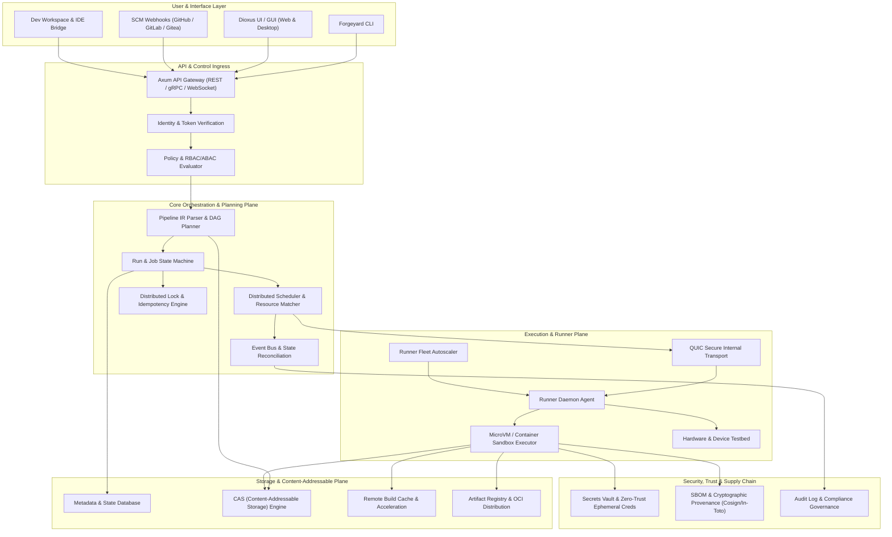

# Forgeyard System Architecture Wiki

Welcome to the official **Forgeyard Architecture Wiki**. This knowledge base contains the complete architectural specifications, execution models, protocol contracts, domain abstractions, and toolchain definitions for Forgeyard.

Forgeyard is a next-generation, high-performance, reproducible, and hermetic CI/CD and software delivery platform engineered as a modular Rust workspace.

---

## High-Level System Topology

The diagram below illustrates the architectural layers and inter-subsystem data flows across the Forgeyard platform:

---

## Architectural Taxonomy (82 Specifications)

The 82 system architecture specifications are organized into 10 cohesive architectural domains:

### 1. Core Foundations & Source Domain

*Foundational domain models, typed identities, invariants, VCS neutrality, and Change Proposals.*

| Specification | Document | Summary Scope |
| :--- | :--- | :--- |
| **Core Domain & Foundation** | [`01-forgeyard-core-domain-foundation`](sys-arch/01-forgeyard-core-domain-foundation.md) | Core domain primitives, typed identities, invariants, time, digests, errors, capabilities, configuration contracts, versioning,... |
| **Change Proposal, Review & Integration** | [`forgeyard-change-proposal-system-architecture`](sys-arch/forgeyard-change-proposal-system-architecture.md) | Forgeyard needs a first-class change-review system because source changes are the control point connecting: |
| **VCS-Neutral Source Control System &** | [`forgeyard-vcs-neutral-system-architecture`](sys-arch/forgeyard-vcs-neutral-system-architecture.md) | Forgeyard must support repositories without making Git's object model the internal definition of source control. |

---

### 2. Storage, CAS & Data Plane

*Metadata persistence, Content-Addressable Storage (CAS), remote caching, lifecycle policies, and schema evolution.*

| Specification | Document | Summary Scope |
| :--- | :--- | :--- |
| **Storage & Metadata** | [`02-forgeyard-storage-metadata`](sys-arch/02-forgeyard-storage-metadata.md) | Forgeyard needs a persistence architecture that works in two very different environments: |
| **CAS & Artifact Data Plane** | [`03-forgeyard-cas-artifact-data-plane`](sys-arch/03-forgeyard-cas-artifact-data-plane.md) | Forgeyard needs a single, coherent data plane for all large or immutable build-related bytes. |
| **Cache Architecture, Build Acceleration, Remote Cache & Cache Correctness** | [`38-forgeyard-cache-build-acceleration-remote-cache-correctness-system-architecture`](sys-arch/38-forgeyard-cache-build-acceleration-remote-cache-correctness-system-architecture.md) | Caching is one of the largest performance multipliers in CI/CD. |
| **Data Lifecycle, Retention, Archival, Deletion, Legal Hold & Privacy Governance** | [`46-forgeyard-data-lifecycle-retention-archival-deletion-privacy-governance-system-architecture`](sys-arch/46-forgeyard-data-lifecycle-retention-archival-deletion-privacy-governance-system-architecture.md) | Forgeyard can accumulate large volumes of data: |
| **Artifact Registry, Package Repository, OCI Distribution & Internal Software Distribution** | [`52-forgeyard-artifact-registry-package-repository-oci-internal-distribution-system-architecture`](sys-arch/52-forgeyard-artifact-registry-package-repository-oci-internal-distribution-system-architecture.md) | Forgeyard can already: |
| **Database Schema Migration, Online Backfill, Data Transformation & Zero-Downtime Change Orchestration** | [`63-forgeyard-database-schema-migration-online-backfill-data-transformation-zero-downtime-system-architecture`](sys-arch/63-forgeyard-database-schema-migration-online-backfill-data-transformation-zero-downtime-system-architecture.md) | Database changes are among the highest-risk effects in a production system. |

---

### 3. Pipeline Engine, IR, State Machine & Scheduling

*Intermediate Representation (IR), DAG evaluation, run/job state transitions, distributed scheduling, concurrency locks, and checkpointing.*

| Specification | Document | Summary Scope |
| :--- | :--- | :--- |
| **Pipeline IR, Parsing, Normalization & Planning** | [`04-forgeyard-pipeline-ir-parsing-planning`](sys-arch/04-forgeyard-pipeline-ir-parsing-planning.md) | Forgeyard needs one canonical way to represent CI/CD workflows independent of: |
| **Run / Job State Machine** | [`05-forgeyard-run-job-state-machine`](sys-arch/05-forgeyard-run-job-state-machine.md) | Forgeyard needs a precise execution-state model for: |
| **Scheduler** | [`06-forgeyard-scheduler-system-architecture`](sys-arch/06-forgeyard-scheduler-system-architecture.md) | Forgeyard needs a scheduler that can place work correctly across: |
| **Events, Event Delivery & Reconciliation** | [`10-forgeyard-events-reconciliation-system-architecture`](sys-arch/10-forgeyard-events-reconciliation-system-architecture.md) | Forgeyard is distributed and failure-prone by nature. |
| **Pipeline Triggers, Schedules, Manual Dispatch & Event-Driven Execution** | [`44-forgeyard-pipeline-triggers-schedules-manual-dispatch-event-driven-system-architecture`](sys-arch/44-forgeyard-pipeline-triggers-schedules-manual-dispatch-event-driven-system-architecture.md) | Forgeyard already knows how to: |
| **Workflow Concurrency, Distributed Locks, Idempotency Keys, Reservations & Exclusive Resource Coordination** | [`60-forgeyard-workflow-concurrency-distributed-locks-idempotency-reservations-exclusive-coordination-system-architecture`](sys-arch/60-forgeyard-workflow-concurrency-distributed-locks-idempotency-reservations-exclusive-coordination-system-architecture.md) | Forgeyard performs many operations that must not overlap arbitrarily: |
| **Job Checkpointing, Suspend/Resume, Preemption, Graceful Cancellation & Spot/Interruptible Runner Recovery** | [`69-forgeyard-job-checkpointing-suspend-resume-preemption-graceful-cancellation-interruptible-runner-recovery-system-architecture`](sys-arch/69-forgeyard-job-checkpointing-suspend-resume-preemption-graceful-cancellation-interruptible-runner-recovery-system-architecture.md) | Forgeyard jobs may be interrupted for many reasons: |

---

### 4. Runners, Sandboxing, Transport & Fleet Orchestration

*Runner daemon agents, sandbox execution environments (microVM/container/chroot), internal QUIC transport, device testbeds, autoscaling, and zero-trust tunneling.*

| Specification | Document | Summary Scope |
| :--- | :--- | :--- |
| **Runner / Agent** | [`07-forgeyard-runner-agent-system-architecture`](sys-arch/07-forgeyard-runner-agent-system-architecture.md) | Forgeyard runners execute the actual workload. |
| **Sandbox & Executor** | [`08-forgeyard-sandbox-executor-system-architecture`](sys-arch/08-forgeyard-sandbox-executor-system-architecture.md) | Forgeyard executes untrusted or semi-trusted user workloads. |
| **Transport, QUIC & Internal Protocol** | [`09-forgeyard-transport-quic-internal-protocol`](sys-arch/09-forgeyard-transport-quic-internal-protocol.md) | Forgeyard needs a reliable internal communication layer between: |
| **Device Lab** | [`20-forgeyard-device-lab-system-architecture`](sys-arch/20-forgeyard-device-lab-system-architecture.md) | Forgeyard needs a production-grade device lab for workflows that cannot be validated adequately using normal host processes alone. |
| **Runner Fleet Autoscaling, Capacity Provisioning & Infrastructure Provider** | [`43-forgeyard-runner-fleet-autoscaling-capacity-provisioning-infrastructure-system-architecture`](sys-arch/43-forgeyard-runner-fleet-autoscaling-capacity-provisioning-infrastructure-system-architecture.md) | Forgeyard can schedule jobs onto runners, but production deployments need to answer: |
| **Runner Image Factory, Golden Image, Patch Management & Fleet Baseline Attestation** | [`58-forgeyard-runner-image-factory-golden-image-patch-management-baseline-attestation-system-architecture`](sys-arch/58-forgeyard-runner-image-factory-golden-image-patch-management-baseline-attestation-system-architecture.md) | Forgeyard can schedule workloads onto many execution environments: |
| **Network Connectivity, Private Resource Access, Egress Control, Tunneling & Zero-Trust Service Connectivity** | [`59-forgeyard-network-connectivity-private-resource-access-egress-tunneling-zero-trust-system-architecture`](sys-arch/59-forgeyard-network-connectivity-private-resource-access-egress-tunneling-zero-trust-system-architecture.md) | Forgeyard workloads may need to reach: |

---

### 5. Security, Policy, Secrets & Supply Chain

*Fine-grained ABAC/RBAC authorization, secrets vaults, cryptographic provenance/SBOM signing, multi-tenancy quotas, audit compliance, and threat mitigation.*

| Specification | Document | Summary Scope |
| :--- | :--- | :--- |
| **Policy, Authorization & Identity** | [`11-forgeyard-policy-authorization-identity-system-architecture`](sys-arch/11-forgeyard-policy-authorization-identity-system-architecture.md) | Forgeyard needs one coherent security model for: |
| **Secrets, Trust & Credential Security** | [`12-forgeyard-secrets-trust-credential-security-system-architecture`](sys-arch/12-forgeyard-secrets-trust-credential-security-system-architecture.md) | Forgeyard must handle credentials and sensitive material required by CI/CD: |
| **Supply Chain, SBOM, Provenance & Signing** | [`13-forgeyard-supply-chain-sbom-provenance-signing-system-architecture`](sys-arch/13-forgeyard-supply-chain-sbom-provenance-signing-system-architecture.md) | Forgeyard must make builds verifiable. |
| **Multi-Tenancy, Quotas, Resource Governance & Fair-Use** | [`27-forgeyard-multi-tenancy-quotas-resource-governance-system-architecture`](sys-arch/27-forgeyard-multi-tenancy-quotas-resource-governance-system-architecture.md) | Forgeyard may serve: |
| **Audit, Compliance, Evidence Retention & Security Governance** | [`28-forgeyard-audit-compliance-security-governance-system-architecture`](sys-arch/28-forgeyard-audit-compliance-security-governance-system-architecture.md) | Forgeyard performs high-impact actions: |
| **Security Architecture, Threat Model, Hardening & Incident Response** | [`40-forgeyard-security-threat-model-hardening-incident-response-system-architecture`](sys-arch/40-forgeyard-security-threat-model-hardening-incident-response-system-architecture.md) | Forgeyard is unusually security-sensitive because it sits between: |

---

### 6. Packaging, Releases, Deployment & Delivery

*Hermetic functional packaging, reproducible distribution, deployment orchestration, automated release channels, progressive delivery, and artifact promotion.*

| Specification | Document | Summary Scope |
| :--- | :--- | :--- |
| **Packaging** | [`14-forgeyard-packaging-system-architecture`](sys-arch/14-forgeyard-packaging-system-architecture.md) | Forgeyard needs a packaging subsystem that converts already-built outputs into artifacts users and deployment systems can consume. |
| **Release** | [`15-forgeyard-release-system-architecture`](sys-arch/15-forgeyard-release-system-architecture.md) | Forgeyard needs a release subsystem that answers: |
| **Deployment** | [`16-forgeyard-deployment-system-architecture`](sys-arch/16-forgeyard-deployment-system-architecture.md) | Forgeyard needs a deployment subsystem that answers: |
| **Release Distribution, Update Delivery, Installer, Channel & Client Update** | [`41-forgeyard-release-distribution-update-delivery-installer-channel-system-architecture`](sys-arch/41-forgeyard-release-distribution-update-delivery-installer-channel-system-architecture.md) | Forgeyard can build and release itself, but production operation also needs a complete answer to: |
| **Environment Promotion, Progressive Delivery, Feature Rollout, Canary Analysis & Automated Rollback Governance** | [`62-forgeyard-environment-promotion-progressive-delivery-feature-rollout-canary-rollback-system-architecture`](sys-arch/62-forgeyard-environment-promotion-progressive-delivery-feature-rollout-canary-rollback-system-architecture.md) | Forgeyard already supports: |
| **Artifact Promotion Policy, Release Train, Environment Channel & Lifecycle Governance** | [`67-forgeyard-artifact-promotion-policy-release-train-environment-channel-lifecycle-governance-system-architecture`](sys-arch/67-forgeyard-artifact-promotion-policy-release-train-environment-channel-lifecycle-governance-system-architecture.md) | A production CI/CD platform often needs more than: |
| **Hermetic Build, Functional Packaging & Reproducible Distribution** | [`forgeyard-hermetic-functional-packaging-architecture`](sys-arch/forgeyard-hermetic-functional-packaging-architecture.md) | A CI/CD system is not reliable if a build succeeds because of invisible state on one machine. |

---

### 7. Observability, Diagnostics, Testing & Quality

*Telemetry & doctor diagnostics, operational search analytics, quality gates & flaky test intelligence, performance benchmarking, static analysis, failure bisecting, SLO error budgets, and incident postmortems.*

| Specification | Document | Summary Scope |
| :--- | :--- | :--- |
| **Observability, Health & Doctor** | [`17-forgeyard-observability-health-doctor-system-architecture`](sys-arch/17-forgeyard-observability-health-doctor-system-architecture.md) | Forgeyard is a distributed CI/CD platform with many moving parts: |
| **Search, Indexing, Query & Operational Analytics** | [`31-forgeyard-search-indexing-query-operational-analytics-system-architecture`](sys-arch/31-forgeyard-search-indexing-query-operational-analytics-system-architecture.md) | Forgeyard will eventually contain large volumes of: |
| **Test Results, Quality Gates, Coverage & Flaky-Test Intelligence** | [`32-forgeyard-test-results-quality-gates-coverage-flaky-intelligence-system-architecture`](sys-arch/32-forgeyard-test-results-quality-gates-coverage-flaky-intelligence-system-architecture.md) | CI/CD ultimately exists to answer questions such as: |
| **Benchmarking, Performance Regression, Load-Test & Capacity Intelligence** | [`33-forgeyard-benchmark-performance-regression-load-capacity-system-architecture`](sys-arch/33-forgeyard-benchmark-performance-regression-load-capacity-system-architecture.md) | CI/CD quality is not only: |
| **Static Analysis, Code Quality, Security Scanning & Findings Management** | [`37-forgeyard-static-analysis-code-quality-security-findings-system-architecture`](sys-arch/37-forgeyard-static-analysis-code-quality-security-findings-system-architecture.md) | Forgeyard already builds, tests, packages, signs, and releases software. |
| **Failure Diagnosis, Debugging, Reproduction, Bisect & Root-Cause Intelligence** | [`48-forgeyard-failure-diagnosis-debugging-reproduction-bisect-root-cause-system-architecture`](sys-arch/48-forgeyard-failure-diagnosis-debugging-reproduction-bisect-root-cause-system-architecture.md) | CI/CD failures are often expensive because the hard part is not detecting red status; it is determining: |
| **Reliability Engineering, SLO, Error Budget, Availability & Resilience Governance** | [`50-forgeyard-reliability-slo-error-budget-availability-resilience-governance-system-architecture`](sys-arch/50-forgeyard-reliability-slo-error-budget-availability-resilience-governance-system-architecture.md) | Forgeyard runs business-critical CI/CD workflows. |
| **Test Data, Fixtures, Ephemeral Databases, Service Virtualization & Integration-Test Environment** | [`56-forgeyard-test-data-fixtures-ephemeral-databases-service-virtualization-system-architecture`](sys-arch/56-forgeyard-test-data-fixtures-ephemeral-databases-service-virtualization-system-architecture.md) | Reliable tests need more than code and executors. |
| **Incident Management, On-Call, Escalation, Response Coordination & Postmortem** | [`61-forgeyard-incident-management-oncall-escalation-response-postmortem-system-architecture`](sys-arch/61-forgeyard-incident-management-oncall-escalation-response-postmortem-system-architecture.md) | Forgeyard already detects and reports many operational problems: |

---

### 8. API, UI, DevEx & Service Portal

*Axum HTTP/gRPC gateway, Dioxus Web/Desktop GUI, local CLI / workstation ergonomics, golden path workflow templates, developer service catalog, API/ABI compatibility, and cloud workspace orchestration.*

| Specification | Document | Summary Scope |
| :--- | :--- | :--- |
| **API / Axum** | [`18-forgeyard-api-axum-system-architecture`](sys-arch/18-forgeyard-api-axum-system-architecture.md) | Forgeyard needs a production-grade public API for: |
| **Dioxus UI / GUI** | [`19-forgeyard-dioxus-ui-gui-system-architecture`](sys-arch/19-forgeyard-dioxus-ui-gui-system-architecture.md) | Forgeyard needs a polished UI that makes a technically deep CI/CD system understandable without hiding critical system truth. |
| **Developer Experience, Local Dev Environment, CLI Workflows & Reproducible Workstation** | [`35-forgeyard-developer-experience-local-dev-cli-reproducible-workstation-system-architecture`](sys-arch/35-forgeyard-developer-experience-local-dev-cli-reproducible-workstation-system-architecture.md) | CI/CD systems often fail developers because the local workflow and CI workflow become two different systems. |
| **Workflow Templates, Reusable Pipelines, Organization Standards & Golden Paths** | [`42-forgeyard-workflow-templates-reusable-pipelines-golden-paths-system-architecture`](sys-arch/42-forgeyard-workflow-templates-reusable-pipelines-golden-paths-system-architecture.md) | As Forgeyard grows across many projects, teams will repeat patterns such as: |
| **Service Catalog, Component Ownership, Environment Inventory & Developer Portal** | [`49-forgeyard-service-catalog-component-ownership-environment-inventory-developer-portal-system-architecture`](sys-arch/49-forgeyard-service-catalog-component-ownership-environment-inventory-developer-portal-system-architecture.md) | Large organizations quickly accumulate: |
| **API/ABI/Schema/Protocol Compatibility, Contract Evolution & Breaking-Change Governance** | [`57-forgeyard-api-abi-schema-protocol-compatibility-contract-evolution-system-architecture`](sys-arch/57-forgeyard-api-abi-schema-protocol-compatibility-contract-evolution-system-architecture.md) | A mature CI/CD platform evolves continuously. |
| **Remote Development Environments, Cloud Workspaces, Codespaces-Style Sessions & Developer Workspace Orchestration** | [`64-forgeyard-remote-development-environments-cloud-workspaces-developer-workspace-orchestration-system-architecture`](sys-arch/64-forgeyard-remote-development-environments-cloud-workspaces-developer-workspace-orchestration-system-architecture.md) | Developers increasingly work in environments that are not their physical laptops: |

---

### 9. Distributed Coordination, Federation & Operations

*SCM provider integrations, Raft consensus high availability, Remote Build Execution (RBE) interop, WASM plugin extensions, disaster recovery, air-gapped self-hosting, human approval workflows, subscription licensing, monorepo graph analysis, dependency mirroring, configuration drift detection, merge queues, and AI-assisted CI optimization.*

| Specification | Document | Summary Scope |
| :--- | :--- | :--- |
| **SCM Provider Integrations** | [`21-forgeyard-scm-provider-integrations-system-architecture`](sys-arch/21-forgeyard-scm-provider-integrations-system-architecture.md) | Forgeyard must integrate cleanly with SCM hosting services such as: |
| **High Availability, Coordination & Raft** | [`22-forgeyard-ha-coordination-raft-system-architecture`](sys-arch/22-forgeyard-ha-coordination-raft-system-architecture.md) | Forgeyard distributed mode needs more than one daemon instance for production availability. |
| **Remote Build Execution (RBE) Interoperability** | [`23-forgeyard-rbe-interop-system-architecture`](sys-arch/23-forgeyard-rbe-interop-system-architecture.md) | Forgeyard should interoperate with build systems and clients that already speak Remote Execution API semantics. |
| **Plugin & Extension** | [`24-forgeyard-plugin-extension-system-architecture`](sys-arch/24-forgeyard-plugin-extension-system-architecture.md) | Forgeyard needs to evolve without turning its core workspace into an ever-growing monolith. |
| **Operations, Backup, Upgrade & Disaster Recovery** | [`25-forgeyard-operations-backup-upgrade-dr-system-architecture`](sys-arch/25-forgeyard-operations-backup-upgrade-dr-system-architecture.md) | A production CI/CD platform is not complete merely because it works when healthy. |
| **Self-Hosting, Bootstrap & Release-of-Forgeyard** | [`26-forgeyard-self-hosting-bootstrap-release-system-architecture`](sys-arch/26-forgeyard-self-hosting-bootstrap-release-system-architecture.md) | Forgeyard must be able to build and release itself. |
| **Notifications, Alerting & Human Workflow** | [`29-forgeyard-notifications-alerting-human-workflow-system-architecture`](sys-arch/29-forgeyard-notifications-alerting-human-workflow-system-architecture.md) | Forgeyard produces many events that require human attention. |
| **Entitlements, Licensing, Subscription & Commercial Access-Control** | [`30-forgeyard-entitlements-licensing-subscription-commercial-access-system-architecture`](sys-arch/30-forgeyard-entitlements-licensing-subscription-commercial-access-system-architecture.md) | Forgeyard can operate as: |
| **Monorepo Intelligence, Dependency Graph, Affected-Change & Incremental Execution** | [`34-forgeyard-monorepo-dependency-graph-affected-incremental-execution-system-architecture`](sys-arch/34-forgeyard-monorepo-dependency-graph-affected-incremental-execution-system-architecture.md) | Modern repositories often contain: |
| **Dependency, Package Registry, Artifact Mirror & Software-Source Governance** | [`36-forgeyard-dependency-package-registry-artifact-mirror-source-governance-system-architecture`](sys-arch/36-forgeyard-dependency-package-registry-artifact-mirror-source-governance-system-architecture.md) | Forgeyard builds software from source, but modern software rarely consists only of first-party code. |
| **Configuration, Feature Flags, Runtime Settings & Dynamic Configuration Governance** | [`39-forgeyard-configuration-feature-flags-runtime-settings-governance-system-architecture`](sys-arch/39-forgeyard-configuration-feature-flags-runtime-settings-governance-system-architecture.md) | Forgeyard contains many kinds of configuration: |
| **Cost Accounting, FinOps, Chargeback/Showback & Resource Economics** | [`45-forgeyard-cost-accounting-finops-chargeback-showback-resource-economics-system-architecture`](sys-arch/45-forgeyard-cost-accounting-finops-chargeback-showback-resource-economics-system-architecture.md) | Forgeyard can consume substantial resources: |
| **CI/CD Migration, Import, Compatibility & Legacy-System Interoperability** | [`47-forgeyard-cicd-migration-import-compatibility-legacy-interoperability-system-architecture`](sys-arch/47-forgeyard-cicd-migration-import-compatibility-legacy-interoperability-system-architecture.md) | A new CI/CD platform rarely starts in an empty organization. |
| **Multi-Region Federation, Edge Sites, Disconnected Operation & Cross-Site Replication** | [`51-forgeyard-multi-region-federation-edge-disconnected-cross-site-replication-system-architecture`](sys-arch/51-forgeyard-multi-region-federation-edge-disconnected-cross-site-replication-system-architecture.md) | Forgeyard may need to operate across multiple cloud regions, data centers, branch offices, factories, labs, developer edge site... |
| **Infrastructure-as-Code, Environment Provisioning, Preview Environments & Drift Reconciliation** | [`53-forgeyard-infrastructure-as-code-environment-provisioning-preview-drift-system-architecture`](sys-arch/53-forgeyard-infrastructure-as-code-environment-provisioning-preview-drift-system-architecture.md) | Forgeyard can build, package, release, and deploy software, but many real deployments also require infrastructure changes such as: |
| **Merge Queue, Speculative Integration, Batch Validation & Protected Target Submission** | [`54-forgeyard-merge-queue-speculative-integration-batch-validation-protected-target-system-architecture`](sys-arch/54-forgeyard-merge-queue-speculative-integration-batch-validation-protected-target-system-architecture.md) | Large repositories and busy protected branches often encounter a fundamental race: |
| **AI-Assisted CI Optimization, Engineering Copilot & Autonomous Recommendation Governance** | [`55-forgeyard-ai-assisted-ci-optimization-engineering-copilot-autonomous-recommendation-governance-system-architecture`](sys-arch/55-forgeyard-ai-assisted-ci-optimization-engineering-copilot-autonomous-recommendation-governance-system-architecture.md) | Forgeyard already produces large volumes of structured technical evidence: |
| **Build Graph Replay, Historical Reproducibility, Time-Travel CI & Evidence Reconstruction** | [`65-forgeyard-build-graph-replay-historical-reproducibility-time-travel-ci-evidence-reconstruction-system-architecture`](sys-arch/65-forgeyard-build-graph-replay-historical-reproducibility-time-travel-ci-evidence-reconstruction-system-architecture.md) | Over time, engineers need to answer questions such as: |
| **Change Risk Assessment, Preflight Simulation, Policy Preview & What-If Analysis** | [`66-forgeyard-change-risk-assessment-preflight-simulation-policy-preview-what-if-analysis-system-architecture`](sys-arch/66-forgeyard-change-risk-assessment-preflight-simulation-policy-preview-what-if-analysis-system-architecture.md) | Forgeyard already understands many change dimensions: |
| **Configuration Drift Detection, Desired-State Convergence, Runtime Reconciliation & Environment Consistency** | [`68-forgeyard-configuration-drift-desired-state-convergence-runtime-reconciliation-environment-consistency-system-architecture`](sys-arch/68-forgeyard-configuration-drift-desired-state-convergence-runtime-reconciliation-environment-consistency-system-architecture.md) | Forgeyard manages desired state across many different domains: |
| **Dependency Update Automation, Version Maintenance, Vulnerability Remediation & Upgrade Campaign** | [`70-forgeyard-dependency-update-automation-version-maintenance-vulnerability-remediation-upgrade-campaign-system-architecture`](sys-arch/70-forgeyard-dependency-update-automation-version-maintenance-vulnerability-remediation-upgrade-campaign-system-architecture.md) | Modern projects depend on continuously changing ecosystems: |

---

### 10. Ecosystems & Language Toolchains

*Targeted architecture specifications for hermetic multi-language compilation, dependency management, toolchain isolation, and test runners.*

| Specification | Document | Summary Scope |
| :--- | :--- | :--- |
| **Assembly & Native Object Toolchain** | [`forgeyard-assembly-native-architecture`](sys-arch/forgeyard-assembly-native-architecture.md) | Forgeyard needs explicit Assembly support because assembly often appears invisibly inside otherwise high-level projects: |
| **C/C++ CI/CD System &** | [`forgeyard-c-cpp-system-architecture`](sys-arch/forgeyard-c-cpp-system-architecture.md) | C and C++ deserve a dedicated Forgeyard architecture because a native build is defined by substantially more than source code. |
| **Dart + Flutter CI/CD System &** | [`forgeyard-dart-flutter-system-architecture`](sys-arch/forgeyard-dart-flutter-system-architecture.md) | Dart and Flutter deserve a dedicated Forgeyard architecture because Flutter applications span multiple fundamentally different ... |
| **Go CI/CD System &** | [`forgeyard-go-system-architecture`](sys-arch/forgeyard-go-system-architecture.md) | Go has a comparatively disciplined toolchain and module model, but a production-grade CI/CD platform still must control a subst... |
| **Java + Kotlin JVM CI/CD System &** | [`forgeyard-java-kotlin-jvm-system-architecture`](sys-arch/forgeyard-java-kotlin-jvm-system-architecture.md) | Java and Kotlin belong in one dedicated JVM ecosystem architecture because they share: |
| **JavaScript / TypeScript CI/CD System &** | [`forgeyard-javascript-typescript-system-architecture`](sys-arch/forgeyard-javascript-typescript-system-architecture.md) | JavaScript and TypeScript require a dedicated Forgeyard architecture because the ecosystem has unusually large and mutable depe... |
| **Python CI/CD System &** | [`forgeyard-python-system-architecture`](sys-arch/forgeyard-python-system-architecture.md) | Python looks simple at source level but production CI/CD can become highly mutable because Python projects often depend on: |
| **Rust CI/CD System &** | [`forgeyard-rust-system-architecture`](sys-arch/forgeyard-rust-system-architecture.md) | Rust is Forgeyard's own implementation language and therefore deserves the strongest first-class integration. |
| **Swift CI/CD System &** | [`forgeyard-swift-system-architecture`](sys-arch/forgeyard-swift-system-architecture.md) | Swift requires a dedicated Forgeyard architecture because Swift exists in two significantly different environments: |

---

## Global Design Principles

1. **Strict Type Safety & Strong Invariants:** All identities (runs, jobs, artifacts, runners, nodes) are strongly typed UUID/ULID primitives.
2. **Hermeticity & Reproducibility:** Every build and test step runs in content-addressed, hermetic sandboxes with explicit inputs and outputs.
3. **Transport Efficiency:** Control plane and runner nodes communicate via multiplexed QUIC streams with mutual TLS.
4. **VCS Neutrality:** Universal Git/Jujutsu/Mercurial/Pijul source abstraction layer decoupling Forgeyard from any single SCM provider.
5. **Supply Chain Integrity:** Built-in cryptographic provenance attestation, SBOM generation, and SLSA Level 3+ compliance by default.

---

*This Wiki is automatically synchronized from the [`sys-arch/`](https://github.com/irshadali5/forgeyard/tree/main/sys-arch) directory in the Forgeyard repository.*
