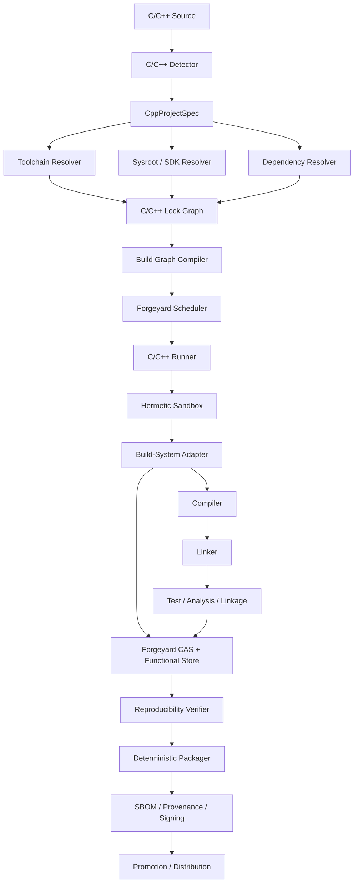

# Forgeyard C/C++ CI/CD System & Architecture

**Document type:** Dedicated language ecosystem System & Architecture  
**Project:** Forgeyard CI/CD  
**Subsystem:** C and C++ build, test, analysis, packaging, cross-compilation, reproducibility, distribution, and release integration  
**Implementation direction:** Rust-first Forgeyard core with native integration to mainstream C/C++ tooling  
**Status:** Target production architecture  

---

# 1. Purpose

C and C++ deserve a dedicated Forgeyard architecture because a native build is defined by substantially more than source code.

A build may depend on:

- compiler family and exact binaries;
- assembler, linker, archiver and binutils;
- C runtime;
- C++ standard library;
- sysroot;
- operating-system SDK;
- target ABI;
- target architecture and CPU features;
- system headers;
- implicit compiler include paths;
- implicit library search paths;
- pkg-config metadata;
- CMake/Meson/Make behavior;
- package-manager resolution;
- generated code;
- build scripts;
- environment variables;
- timestamps;
- absolute paths;
- linker behavior;
- debug information;
- PGO/LTO settings;
- sanitizer runtimes;
- mutable host state.

The Forgeyard C/C++ subsystem exists to eliminate these hidden variables as far as technically possible.

The central rule is:

> **A Forgeyard C/C++ build is identified by source + toolchain + ABI + sysroot + dependency closure + build-system configuration + target + policy.**

---

# 2. Goals

Forgeyard C/C++ MUST:

1. support C and C++ as first-class ecosystems;
2. support GCC, Clang/LLVM, MSVC, Clang-CL, MinGW, and custom toolchains;
3. support CMake, Meson, Ninja and Make;
4. support Conan and vcpkg without requiring either;
5. support vendored and Forgeyard-native immutable dependencies;
6. support Linux, Windows, macOS, Android NDK, WASM, and embedded/custom targets where practical;
7. support native and cross compilation;
8. provide explicit ABI and sysroot modeling;
9. prevent undeclared host header/library/tool leakage;
10. support hermetic builds;
11. support reproducible builds and independent rebuild verification;
12. support static analysis;
13. support sanitizers;
14. support fuzzing;
15. support coverage;
16. support LTO and PGO;
17. support split debug symbols;
18. validate runtime linkage before release;
19. support deterministic packaging;
20. use Forgeyard CAS and remote execution;
21. produce SBOM and provenance;
22. explain every rebuild/cache miss;
23. support local-first and distributed Forgeyard modes.

---

# 3. Non-goals

Forgeyard does not replace:

- GCC;
- LLVM;
- MSVC;
- CMake;
- Meson;
- Ninja;
- Make;
- Conan;
- vcpkg;
- vendor SDKs.

Forgeyard resolves, locks, fingerprints, isolates, orchestrates, caches, verifies, packages, and distributes them.

---

# 4. High-Level Architecture



---

# 5. Suggested Forgeyard Workspace

```text
crates/
├── forgeyard-cpp/
├── forgeyard-cpp-model/
├── forgeyard-cpp-detect/
├── forgeyard-cpp-toolchain/
├── forgeyard-cpp-abi/
├── forgeyard-cpp-sysroot/
├── forgeyard-cpp-deps/
├── forgeyard-cpp-cmake/
├── forgeyard-cpp-meson/
├── forgeyard-cpp-ninja/
├── forgeyard-cpp-make/
├── forgeyard-cpp-conan/
├── forgeyard-cpp-vcpkg/
├── forgeyard-cpp-analysis/
├── forgeyard-cpp-sanitizers/
├── forgeyard-cpp-test/
├── forgeyard-cpp-coverage/
├── forgeyard-cpp-linkage/
├── forgeyard-cpp-symbols/
├── forgeyard-cpp-cross/
└── forgeyard-cpp-package/
```

These are capability boundaries. They can later be merged physically without merging responsibilities.

---

# 6. Core Domain Model

```rust
pub struct CppProjectSpec {
    pub languages: LanguageSet,
    pub source: SourceRef,

    pub build_system: BuildSystemSpec,
    pub toolchain: ToolchainRequest,
    pub sysroot: SysrootRequest,
    pub dependencies: DependencyPolicy,

    pub build_platform: BuildPlatform,
    pub host_platform: HostPlatform,
    pub target_platform: TargetPlatform,

    pub abi: AbiSpec,
    pub profile: BuildProfile,
    pub features: FeatureSet,

    pub analysis: AnalysisPolicy,
    pub testing: TestPolicy,
    pub sanitizers: SanitizerPolicy,
    pub linkage: LinkagePolicy,
    pub reproducibility: ReproducibilityPolicy,
}
```

---

# 7. Strong Types

```rust
pub enum CppLanguage {
    C,
    Cxx,
    ObjectiveC,
    ObjectiveCxx,
}

pub enum CompilerFamily {
    Gcc,
    Clang,
    AppleClang,
    Msvc,
    ClangCl,
    MinGwGcc,
    Custom,
}

pub enum LinkerFamily {
    LdBfd,
    Gold,
    Lld,
    Mold,
    LinkExe,
    LldLink,
    WasmLd,
    Custom,
}
```

Never identify a toolchain using an arbitrary string such as `"gcc"` alone.

---

# 8. Project Detection

Forgeyard detects:

```text
CMakeLists.txt        -> CMake
meson.build           -> Meson
build.ninja           -> NinjaDirect
Makefile              -> Make
GNUmakefile           -> Make
conanfile.py/txt      -> Conan
vcpkg.json            -> vcpkg
```

Detection returns evidence and confidence.

If more than one build system exists, project configuration has final authority.

---

# 9. Detection Model

```rust
pub struct CppDetection {
    pub languages: BTreeSet<CppLanguage>,
    pub build_systems: Vec<DetectedBuildSystem>,
    pub dependency_managers: Vec<DetectedDependencyManager>,
    pub probable_targets: Vec<TargetHint>,
    pub confidence: DetectionConfidence,
}
```

---

# 10. Toolchain Identity

A C/C++ toolchain includes:

```text
C compiler
C++ compiler
assembler
linker
archiver
ranlib
nm
objcopy
strip
compiler runtime
C runtime
C++ standard library
sysroot
compiler resource directory
default target
```

Version output alone is insufficient.

---

# 11. Toolchain Model

```rust
pub struct CppToolchain {
    pub id: ToolchainId,

    pub c: CompilerBinary,
    pub cxx: CompilerBinary,

    pub assembler: ToolBinary,
    pub linker: ToolBinary,
    pub archiver: ToolBinary,
    pub ranlib: ToolBinary,
    pub nm: ToolBinary,
    pub objcopy: Option<ToolBinary>,
    pub strip: ToolBinary,

    pub target: TargetTriple,
    pub sysroot: SysrootId,

    pub c_runtime: RuntimeId,
    pub cxx_runtime: Option<RuntimeId>,
    pub resource_dir: Option<StoreObjectId>,
}
```

---

# 12. Toolchain Fingerprint

```text
ToolchainId =
H(
    compiler binaries,
    linker binary,
    assembler/binutils,
    compiler runtime,
    C runtime,
    C++ standard library,
    sysroot identity,
    target configuration
)
```

Changing the linker while keeping the same compiler version changes the toolchain identity.

---

# 13. GCC Integration

First-class GCC toolchain components:

```text
gcc
g++
cpp
as
ld.bfd / gold / optional mold
ar
ranlib
nm
objcopy
strip
libgcc
libstdc++
target libc
```

Forgeyard records the exact resolved binaries and runtime closure.

---

# 14. Clang/LLVM Integration

First-class LLVM components:

```text
clang
clang++
lld
llvm-ar
llvm-ranlib
llvm-nm
llvm-objcopy
llvm-strip
compiler-rt
libc++ or libstdc++
Clang resource directory
```

`clang++` does not imply `libc++`; the C++ runtime is explicit.

---

# 15. MSVC Integration

MSVC identity includes:

```text
cl.exe
link.exe or lld-link
lib.exe
rc.exe
MSVC toolset
Windows SDK
Universal CRT
MSVC STL
runtime mode
```

Forgeyard resolves the environment instead of depending on a manually opened Developer Command Prompt.

---

# 16. Clang-CL

Treat Clang-CL separately because:

```text
MSVC command-line compatibility
MSVC ABI
Windows SDK
MSVC STL
link.exe/lld-link
```

are materially different from Unix-style Clang.

---

# 17. MinGW

Model:

```text
MinGW headers
CRT
GCC/Clang
binutils/lld
target triple
runtime DLLs
```

Do not assume MinGW C++ ABI is interchangeable with MSVC.

---

# 18. Custom Toolchains

```ron
toolchain: Custom(
    c: Store(".../bin/vendor-cc"),
    cxx: Store(".../bin/vendor-cxx"),
    linker: Store(".../bin/vendor-ld"),
    target: "arm-none-eabi",
)
```

Custom tools must still be immutable/fingerprinted.

---

# 19. Sysroot Architecture

The sysroot contains target-visible platform material:

```text
system headers
C runtime headers
C runtime libraries
C++ runtime
startup objects
linker scripts
SDK libraries
platform headers
```

It is a first-class input.

---

# 20. Sysroot Modes

```rust
pub enum SysrootMode {
    Managed,
    PlatformProvided,
    AuditedHost,
}
```

## Managed

Stored by Forgeyard; strongest reproducibility.

## PlatformProvided

Needed for some Apple/Windows SDK cases; fingerprint explicitly.

## AuditedHost

Migration mode; warnings show host dependence.

---

# 21. ABI Model

```rust
pub struct AbiSpec {
    pub architecture: Architecture,
    pub object_format: ObjectFormat,
    pub calling_convention: CallingConvention,
    pub libc: Option<LibcKind>,
    pub cxx_abi: Option<CxxAbi>,
    pub exception_model: ExceptionModel,
    pub rtti: bool,
}
```

---

# 22. C++ ABI

Common categories:

```text
Itanium-style ABI
MSVC ABI
platform/vendor variants
```

Forgeyard treats ABI as part of compatibility identity.

---

# 23. Standard Library

Explicitly distinguish:

```text
libstdc++
libc++
MSVC STL
embedded/custom
```

The standard library fingerprint participates in derivation identity.

---

# 24. Runtime Mode

Windows CRT examples:

```text
/MD
/MDd
/MT
/MTd
```

Runtime mode is an explicit build attribute.

---

# 25. Build Profiles

```rust
pub enum BuildProfile {
    Debug,
    Release,
    RelWithDebInfo,
    MinSizeRel,
    Custom(ProfileName),
}
```

Profiles expand into toolchain-specific flags.

---

# 26. Compiler Flags

Separate:

```text
project flags
toolchain defaults
Forgeyard reproducibility flags
Forgeyard security/hardening flags
analysis-only flags
```

The effective final command is inspectable.

---

# 27. Compile Action

```rust
pub struct CompileAction {
    pub compiler: ToolchainId,
    pub source: SourceFileRef,
    pub language: CppLanguage,

    pub args: Vec<Arg>,
    pub includes: Vec<IncludePath>,
    pub defines: BTreeMap<MacroName, MacroValue>,

    pub target: TargetTriple,
    pub sysroot: SysrootId,
}
```

Each compile action can become a remote-cacheable unit where graph quality permits.

---

# 28. Compilation Database

Forgeyard should ingest/generate:

```text
compile_commands.json
```

for:

- clangd;
- clang-tidy;
- dependency analysis;
- build graph inspection;
- IDE integration.

---

# 29. Header Dependency Graph

Use authoritative build/compiler mechanisms:

```text
depfiles
CMake File API
Ninja dependency information
Meson introspection
MSVC include reporting
compiler dependency scanning
```

Do not rely primarily on regex-based `#include` scanning.

---

# 30. Build Graph

```text
source/generated source
      ↓
translation units
      ↓
object files
      ↓
static/shared libraries
      ↓
executables
      ↓
tests/packages
```

Header/code-generation edges feed the translation-unit graph.

---

# 31. CMake Adapter

Support:

```text
CMakePresets.json
CMakeUserPresets.json
toolchain files
CMake File API
CTest
CPack adapters
Ninja generator
Make generator
multi-config generators
```

---

# 32. CMake Flow

```text
resolved Forgeyard toolchain
       ↓
toolchain file / preset overlay
       ↓
cmake configure
       ↓
CMake File API
       ↓
target/build graph
       ↓
build
       ↓
CTest
```

---

# 33. CMake Toolchain File

Forgeyard may generate:

```cmake
set(CMAKE_C_COMPILER "/forgeyard/store/.../clang")
set(CMAKE_CXX_COMPILER "/forgeyard/store/.../clang++")
set(CMAKE_SYSROOT "/forgeyard/store/.../sysroot")
```

Toolchain data is generated from locked Forgeyard identity.

---

# 34. CMake Presets

Rules:

- committed `CMakePresets.json` can be used;
- developer-local presets are ignored in strict CI unless explicitly permitted;
- chosen preset participates in derivation identity;
- environment from a preset is filtered through Forgeyard policy.

---

# 35. CMake Build Directory Isolation

Never reuse one build tree across incompatible derivations.

Build tree key:

```text
source digest
toolchain ID
sysroot ID
preset
target
profile
features
```

---

# 36. CMake `try_compile`

All probes run inside the same hermetic toolchain/sysroot context.

Preserve CMake configure diagnostics for debugging.

---

# 37. CMake File API

Use for:

```text
targets
sources
compile groups
link information
target dependencies
artifacts
```

Prefer this over parsing human log text.

---

# 38. Meson Adapter

Support:

```text
native files
cross files
subprojects
wrap dependencies
Meson introspection
Ninja backend
Meson tests
```

---

# 39. Meson Cross File

Concept:

```ini
[binaries]
c = '/forgeyard/store/.../clang'
cpp = '/forgeyard/store/.../clang++'
ar = '/forgeyard/store/.../llvm-ar'
strip = '/forgeyard/store/.../llvm-strip'

[host_machine]
system = 'linux'
cpu_family = 'aarch64'
cpu = 'aarch64'
endian = 'little'
```

---

# 40. Meson Dependencies

Strict builds deny undeclared system fallback.

Possible policy:

```text
Forgeyard dependency closure first
approved platform SDK second
undeclared host lookup denied
```

---

# 41. Meson Wraps

Resolve/fetch wraps before build.

Network is denied during strict realization.

---

# 42. Ninja

Ninja is treated as build executor.

Forgeyard records:

```text
Ninja version
graph
depfiles
failures
timings
```

where available.

---

# 43. Make

Forgeyard injects:

```text
CC
CXX
AR
LD
RANLIB
NM
STRIP
PKG_CONFIG
```

rather than trusting host defaults.

Arbitrary Makefile behavior remains inside Forgeyard's sandbox.

---

# 44. Dependency Sources

Supported models:

```text
Forgeyard-native immutable dependency
vendored source
Conan
vcpkg
approved platform/system dependency
```

---

# 45. Forgeyard-Native Native Dependency

```text
locked source
   ↓
dependency derivation
   ↓
immutable library/header output
   ↓
consumer closure
```

This is the strongest Forgeyard-native model.

---

# 46. Vendored Dependencies

Vendored code participates directly in source-tree identity.

Still analyze:

```text
license
vulnerability
transitive usage
```

---

# 47. Conan Adapter

Forgeyard should record:

```text
Conan version
lockfile
profile
settings
options
package/recipe revisions
source identities
```

Do not make the mutable Conan local cache authoritative.

---

# 48. Conan Profiles

Relevant identity:

```text
compiler
compiler.version
compiler.libcxx
os
arch
build_type
options
settings
```

---

# 49. vcpkg Adapter

Support:

```text
manifest mode
vcpkg.json
configuration
triplets
overlay ports
overlay triplets
binary cache import/export
```

The vcpkg executable itself is pinned.

---

# 50. pkg-config Isolation

Forgeyard synthesizes:

```text
PKG_CONFIG_PATH
PKG_CONFIG_LIBDIR
PKG_CONFIG_SYSROOT_DIR
```

from the dependency closure.

Host package metadata must not silently enter strict builds.

---

# 51. Dependency Discovery

CMake `find_package`, Meson `dependency()`, pkg-config and custom probes may resolve only against:

```text
declared dependency closure
approved platform SDK
```

in strict mode.

---

# 52. Hermetic Filesystem

Visible:

```text
/source
/build
/forgeyard/store/<toolchain>
/forgeyard/store/<sysroot>
/forgeyard/store/<deps>
```

Hidden by default:

```text
/usr/local
developer home
host package caches
host SDKs
SSH agent
Docker socket
```

---

# 53. Synthesized Environment

Forgeyard controls:

```text
CC
CXX
AR
LD
RANLIB
NM
OBJCOPY
STRIP
CFLAGS
CXXFLAGS
LDFLAGS
PKG_CONFIG_*
LANG
LC_ALL
TZ
SOURCE_DATE_EPOCH
```

---

# 54. Stable Build Paths

Virtual paths:

```text
/source
/build
```

prevent physical runner paths from entering binaries.

---

# 55. Prefix Mapping

Where supported, apply path-remapping flags such as:

```text
-ffile-prefix-map=<physical>=/source
-fdebug-prefix-map=<physical>=/source
-fmacro-prefix-map=<physical>=/source
```

Feature-detect per compiler.

---

# 56. Date/Time Macros

Detect/flag:

```text
__DATE__
__TIME__
__TIMESTAMP__
```

Policy:

```text
development -> warn
strict reproducible release -> error unless explicitly allowed
```

---

# 57. `__FILE__`

Path remapping should prevent host-specific absolute source path leakage.

---

# 58. Deterministic Static Archives

`.a` creation must use deterministic archiver behavior.

Archiver capability is toolchain metadata.

---

# 59. Linker Determinism

Track and normalize:

```text
input order
build IDs
timestamps
LTO partitioning
random seeds
parallel-link behavior
```

where supported.

---

# 60. Debug Information

Potential nondeterministic inputs:

```text
build directories
source paths
compiler paths
timestamps
temporary filenames
```

Apply stable-path policies.

---

# 61. Split Debug Outputs

Logical outputs:

```text
runtime
debug
```

Examples:

```text
ELF debug files
PDB
dSYM
```

Each is independently content-addressed.

---

# 62. Symbol Distribution

Forgeyard can maintain a symbol service/store keyed by:

```text
artifact identity
build ID
debug identity
```

for post-release debugging.

---

# 63. Runtime Linkage Validation

Linux:

```text
ELF interpreter
DT_NEEDED
RPATH
RUNPATH
```

Windows:

```text
PE imports
delay imports
```

macOS:

```text
Mach-O dylib loads
rpaths
```

---

# 64. Runtime Closure Rule

Every runtime dependency must resolve to:

```text
declared Forgeyard runtime closure
or
explicitly approved platform ABI
```

Unknown host-local dependency blocks release.

---

# 65. RPATH Policy

Reject build-machine paths.

Allow controlled forms such as:

```text
$ORIGIN
@loader_path
@rpath
```

according to target.

---

# 66. Linkage Mode

```rust
pub enum Linkage {
    Static,
    Shared,
    Mixed,
}
```

Linkage choice is explicit.

---

# 67. PIC / PIE

Position independence policy is part of derivation identity.

---

# 68. Hardening Policy

Toolchain-specific translation may enable:

```text
stack protection
FORTIFY
PIE
RELRO
NX-related linker configuration
control-flow protection
```

Forgeyard should validate resulting binaries where possible.

---

# 69. Sanitizers

Supported when available:

```text
ASan
UBSan
TSan
MSan
LSan
HWASan
```

Sanitizer runtime identity is part of test derivation.

---

# 70. Sanitizer Matrix

Example:

```text
release
ASan+UBSan
TSan
```

Do not combine known-incompatible sanitizer modes.

---

# 71. Static Analysis

First-class candidates:

```text
clang-tidy
Clang Static Analyzer
GCC analyzer
cppcheck
include-what-you-use
```

Each analysis tool is locked.

---

# 72. clang-tidy

Use exact compilation database.

Run translation units in parallel.

Aggregate structured diagnostics and preserve raw tool output.

---

# 73. Analysis Baselines

Support:

```text
full strict gate
new findings only
existing baseline
```

to allow gradual adoption.

---

# 74. Warning Policy

Warnings are compiler-specific.

Do not blindly map GCC/Clang warning sets onto MSVC.

Normalized severity sits above compiler-native diagnostics.

---

# 75. Unit Testing

Integrations:

```text
CTest
GoogleTest discovery
Catch2 discovery
Meson test
custom test executable
```

---

# 76. Test Model

```rust
pub struct TestResult {
    pub suite: String,
    pub case: String,
    pub status: TestStatus,
    pub duration: Duration,
    pub stdout: StoreObjectId,
    pub stderr: StoreObjectId,
}
```

---

# 77. Integration Tests

Tests may use immutable service fixtures:

```text
binary digest X
database/service image digest Y
fixture digest Z
```

Live external APIs are classified as non-hermetic test actions.

---

# 78. Fuzzing

Adapters can support:

```text
libFuzzer
AFL++
Honggfuzz
custom fuzzers
```

Fuzzing is test evidence, not package-build identity.

---

# 79. Fuzz Corpus

Corpus is content-addressed.

Crash reproducers are immutable artifacts.

---

# 80. Coverage

Support:

```text
LLVM coverage
gcov/gcovr
platform-specific adapters
```

Coverage toolchain version participates in the test derivation.

---

# 81. Benchmarking

Benchmark jobs require dedicated runner capabilities.

Record:

```text
CPU
microarchitecture
RAM
kernel/OS
compiler
frequency/governor context
```

Avoid treating noisy generic CI hosts as stable benchmark machines.

---

# 82. Performance Regression

Use statistical thresholds across multiple samples.

Never fail releases on a single noisy result by default.

---

# 83. LTO

```rust
pub enum LtoMode {
    Off,
    Thin,
    Full,
}
```

Compiler/linker/plugin identity is part of derivation.

---

# 84. ThinLTO Cache

Mutable acceleration only.

Do not treat it as undeclared source of truth.

---

# 85. PGO

Model:

```text
instrumented derivation
  ↓
profile workload
  ↓
profile artifact digest
  ↓
optimized derivation
```

The profile itself becomes an immutable build input.

---

# 86. Generated Code

Examples:

```text
protobuf
FlatBuffers
Qt moc/uic/rcc
custom generators
```

Generator identity is a build input.

Generated output becomes explicit graph input.

---

# 87. Build-Time Tools

During cross compilation distinguish:

```text
tools that run on build host
libraries/binaries produced for target
```

---

# 88. Build / Host / Target

Use strong types.

Example:

```text
build  = x86_64-linux
host   = x86_64-linux
target = aarch64-linux
```

This becomes essential for compilers and cross toolchains.

---

# 89. Cross Toolchain

```rust
pub struct CrossToolchain {
    pub build: BuildPlatform,
    pub host: HostPlatform,
    pub target: TargetPlatform,
    pub toolchain: ToolchainId,
    pub sysroot: SysrootId,
    pub execution_wrapper: Option<ExecutionWrapper>,
}
```

---

# 90. CMake Cross Compilation

Forgeyard configures:

```text
CMAKE_TOOLCHAIN_FILE
CMAKE_SYSROOT
target system
find roots
compiler binaries
emulator/wrapper where necessary
```

---

# 91. Meson Cross Compilation

Forgeyard generates/uses Meson cross definition files containing compiler binaries and target-machine properties.

---

# 92. Cross-Target Test Execution

Options:

```text
native compatible runner
emulator
device runner
explicit skip
```

Never accidentally execute incompatible target binary on build host.

---

# 93. Android NDK

Model:

```text
NDK identity
Clang identity
Android API level
ABI
libc++ configuration
CMake/Meson version
```

ABIs become target identities.

---

# 94. Android Native Build Identity

```text
source
+
NDK
+
API level
+
ABI
+
compiler
+
STL/runtime
+
dependency closure
+
build-system configuration
```

---

# 95. Embedded Targets

Support via custom immutable toolchains/sysroots:

```text
arm-none-eabi
riscv*-unknown-elf
vendor-specific MCU targets
```

---

# 96. Linker Scripts

Linker script content is hashed as input.

Path alone is insufficient.

---

# 97. WASM

Support:

```text
WASI SDK
Clang
wasm-ld
Emscripten adapter if configured
```

---

# 98. Windows Builds

Prefer actual Windows runners for MSVC production artifacts.

Cross builds from Linux are separate derivations with separate compatibility expectations.

---

# 99. macOS Builds

Production Apple linkage/signing must run on appropriate macOS infrastructure.

Forgeyard orchestrates those runners rather than pretending Linux is equivalent.

---

# 100. Dependency Lock

```rust
pub struct CppDependencyLock {
    pub packages: BTreeMap<PackageId, LockedDependency>,
}
```

Each node records:

```text
version
source identity
source digest
target
build options
features
package output digest
license metadata
```

---

# 101. Diamond Dependency Handling

If:

```text
A -> X1
B -> X2
```

Forgeyard preserves both unless the build/dependency system explicitly resolves them to one compatible instance.

Do not silently collapse.

---

# 102. ABI Conflict Detection

Detect:

```text
libstdc++ vs libc++
MSVC CRT mismatch
debug/release CRT mismatch
incompatible architectures
incompatible compiler ABI
incompatible iterator/debug modes
```

---

# 103. ODR Risk

Forgeyard can warn about likely One Definition Rule risk from:

```text
duplicate incompatible library instances
inconsistent compile definitions
different ABI-affecting flags
```

It cannot prove all ODR safety.

---

# 104. Language Standards

Explicit configuration:

```text
C11
C17
C23
C++17
C++20
C++23
```

Compiler extensions are also tracked.

---

# 105. CPU Features

Portable releases should avoid implicit `-march=native`.

Use explicit feature profiles:

```text
x86-64 baseline
x86-64-v2
x86-64-v3
AVX2
armv8-a
NEON
SVE
```

---

# 106. Build Matrix

Possible axes:

```text
compiler
profile
target
sanitizer
stdlib
linkage
```

Example:

```text
GCC Release
Clang Release
Clang ASan+UBSan
MSVC Release
Android arm64
```

Policy chooses only useful combinations.

---

# 107. Compiler Diversity

Building/testing with both GCC and Clang gives portability/UB evidence.

It is not reproducibility evidence because different compilers are different derivations.

---

# 108. Reproducibility

For one derivation:

```text
Runner A -> Output X
Runner B -> Output Y
```

If:

```text
X == Y
```

status becomes reproduced.

---

# 109. Object-Level Reproducibility

Optional comparison:

```text
object files
archives
shared libraries
executables
package
```

helps locate nondeterminism.

---

# 110. Binary Diff Layers

```text
package
  ↓
file tree
  ↓
binary sections
  ↓
symbols
  ↓
object files
  ↓
translation unit
```

---

# 111. Binary Inspection

Use toolchain-native locked utilities:

```text
llvm-readobj
llvm-objdump
readelf
objdump
dumpbin
otool
```

---

# 112. Compilation Cache

Support:

```text
Forgeyard native action cache
sccache adapter
ccache adapter
```

Cache is an optimization; correctness rests on complete action identity.

---

# 113. Compile Cache Key

Include:

```text
compiler/toolchain digest
source digest
included header closure
arguments
defines
target
sysroot
language mode
relevant environment
```

---

# 114. Header Invalidation

Use depfiles/compiler scan data.

Header change invalidates all affected actions.

If dependency certainty is incomplete, rebuild a safe superset.

---

# 115. Remote Compilation

Where graph quality permits:

```text
CompileAction
  ↓
scheduler
  ↓
remote runner
  ↓
object CAS output
```

---

# 116. Remote Link

Possible when all object/library/toolchain inputs are immutable CAS/store objects.

---

# 117. Opaque Build Systems

For arbitrary Make workflows, Forgeyard may cache/execute at job level rather than pretending it has exact translation-unit graph knowledge.

Correctness before granularity.

---

# 118. CMake + Ninja Fine-Grained Path

```text
CMake File API
+
Ninja/depfiles
```

is a strong source for detailed build graph extraction.

---

# 119. Build Output Normalization

Prefer deterministic compiler/linker configuration.

Do not arbitrarily rewrite executable bytes after build unless transformation semantics are explicitly understood.

---

# 120. Security Pipeline

Recommended:

```text
dependency trust
license policy
vulnerability policy
static analysis
compile warnings
sanitizer tests
unit/integration tests
fuzzing
binary hardening inspection
runtime closure validation
SBOM
provenance
```

---

# 121. Binary Hardening Validation

Inspect output rather than assuming flags were honored.

Check where applicable:

```text
PIE
RELRO
NX
stack-protector indicators
control-flow features
```

---

# 122. SBOM

Combine:

```text
locked dependency graph
vendored libraries
runtime dynamic linkage
binary inspection
```

---

# 123. Provenance

Record:

```text
source digest
toolchain ID
sysroot ID
dependency lock ID
build-system ID
target
profile
effective policy
runner identity
output digest
```

---

# 124. Packaging

Package logical outputs:

```text
runtime binaries
shared libraries
runtime closure
debug symbols
development headers if requested
licenses
SBOM
provenance
```

---

# 125. Linux Packaging

Potential adapters:

```text
tar.zst
.deb
.rpm
OCI
AppImage adapter
```

---

# 126. Windows Packaging

Potential:

```text
zip
MSI
MSIX
portable bundle
```

DLL runtime closure validation is mandatory before release.

---

# 127. macOS Packaging

Potential:

```text
.app
pkg
dmg
```

Keep unsigned reproducible artifact separate from signing/notarization where necessary.

---

# 128. Android Packaging Handoff

C/C++ subsystem produces native libraries.

Android subsystem assembles/signs APK/AAB.

---

# 129. Native Library Publishing

Support:

```text
static library
shared library
headers
CMake package config
pkg-config metadata
Conan package
vcpkg-consumable artifacts
```

---

# 130. Consumer Verification

Published libraries should be tested from a clean consumer project.

Examples:

```text
CMake find_package consumer
pkg-config consumer
Conan consumer
vcpkg consumer
```

---

# 131. ABI Compatibility

Optional release gate can compare exported ABI between releases.

Detect:

```text
removed symbols
changed exported signatures
SONAME changes
layout-risk indicators
```

---

# 132. SONAME

Shared-library versioning must be explicit.

Forgeyard can validate consistency with release policy.

---

# 133. Clean Install Test

```text
disposable VM/rootfs
  ↓
install package
  ↓
run smoke tests
  ↓
verify runtime closure
  ↓
uninstall/rollback
```

---

# 134. "Works on My Machine" Prevention

Forgeyard explicitly detects/prevents:

```text
host compiler leakage
host header leakage
host library leakage
host pkg-config leakage
mutable dependency-manager state
absolute build paths
mutable SDKs
undeclared environment values
network fetches during build
unknown runtime libraries
```

---

# 135. Impurity Audit

```text
forgeyard cpp build --audit-impurity
```

Example diagnostic:

```text
Hermeticity violation

translation unit:
  src/main.cpp

attempted include:
  /usr/local/include/foo.hpp

suggestion:
  declare `foo` as a dependency
```

---

# 136. Runtime Violation Example

```text
Runtime closure violation

artifact:
  server

dependency:
  /usr/local/lib/libfoo.so

reason:
  outside declared runtime closure
```

---

# 137. Developer Environment

```text
forgeyard cpp dev
```

creates a project environment containing:

```text
compiler
linker
build system
dependency closure
debugger tools
analysis tools
```

matching CI identities where appropriate.

---

# 138. IDE Integration

Export:

```text
compile_commands.json
toolchain metadata
CMake presets
environment metadata
```

for:

```text
clangd
CLion
VS Code
Zed
Neovim
```

IDE state is never authoritative over CI.

---

# 139. Diagnostic Model

```rust
pub struct Diagnostic {
    pub severity: Severity,
    pub tool: ToolIdentity,
    pub file: Option<VirtualPath>,
    pub line: Option<u32>,
    pub column: Option<u32>,
    pub code: Option<String>,
    pub message: String,
}
```

Preserve raw output too.

---

# 140. Failure Classification

```text
DetectionFailure
ConfigurationFailure
ToolchainFailure
DependencyResolutionFailure
CompileFailure
LinkFailure
TestFailure
SanitizerFailure
AnalysisFailure
RuntimeClosureFailure
PackagingFailure
ReproducibilityFailure
```

---

# 141. CMake Diagnostics

Preserve:

```text
configure output
configure log
preset
toolchain file
cache summary
```

---

# 142. Meson Diagnostics

Preserve:

```text
meson-log.txt
native/cross files
options
introspection data
```

---

# 143. Build Reproduction

```text
forgeyard cpp reproduce-job <job-id>
```

reconstructs:

```text
source
toolchain
sysroot
dependency closure
build-system config
sandbox
environment
```

not merely a shell command.

---

# 144. Example C++ Configuration

```ron
cpp: (
    build_system: CMake(
        preset: "release",
        generator: Ninja,
    ),

    toolchain: Clang(
        version: Locked("clang"),
        linker: Lld,
        cxx_stdlib: LibCxx,
    ),

    target: "x86_64-unknown-linux-gnu",

    dependencies: Locked,

    reproducibility: (
        hermetic: true,
        network: Denied,
    ),
)
```

---

# 145. Standard CMake Flow

```text
detect
  ↓
resolve toolchain/sysroot/dependencies
  ↓
create controlled toolchain overlay
  ↓
configure
  ↓
query File API
  ↓
compile
  ↓
link
  ↓
CTest
  ↓
linkage validation
  ↓
package
```

---

# 146. Standard Meson Flow

```text
detect
  ↓
resolve toolchain/sysroot/dependencies
  ↓
create native/cross file
  ↓
meson setup
  ↓
introspection
  ↓
Ninja
  ↓
meson test
  ↓
package
```

---

# 147. Standard Make Flow

```text
detect
  ↓
inject controlled tools/env
  ↓
hermetic sandbox
  ↓
make
  ↓
collect outputs
  ↓
runtime validation
```

---

# 148. C++ Modules

Model module artifacts:

```text
BMI
PCM
module dependency graph
compiler identity
target
flags
```

Module artifacts are highly toolchain-sensitive.

---

# 149. Precompiled Headers

PCH cache key includes:

```text
compiler
target
flags
headers
language mode
```

Treat PCH as derived cache artifact, not portable release artifact.

---

# 150. Unity Builds

Generated unity source composition is an input.

Changing translation-unit grouping changes derivation/action identity.

---

# 151. Header-Only Libraries

Header digest, compile definitions and include semantics participate in consuming translation-unit keys.

---

# 152. Qt

Optional Qt capability:

```text
Qt SDK identity
moc
uic
rcc
plugins
runtime deployment closure
```

---

# 153. OpenMP

Track compiler runtime:

```text
libgomp
libomp
MSVC OpenMP runtime
```

as runtime dependency.

---

# 154. SIMD Builds

Explicit feature variants:

```text
baseline
AVX2
AVX-512
NEON
SVE
```

Never let runner CPU automatically define release output.

---

# 155. Toolchain Capability Registry

Cache per ToolchainId:

```text
C/C++ standards
sanitizers
LTO modes
prefix-map support
target triples
linker features
coverage support
```

---

# 156. Toolchain Trust

```rust
pub enum ToolchainTrust {
    Unverified,
    DigestVerified,
    VendorSigned,
    OrganizationApproved,
    Revoked,
}
```

---

# 157. Reproducibility Gate

Recommended release minimum:

```text
same DerivationId
+
different physical runner
+
same OutputDigest
```

---

# 158. Static Analysis Gate

Example:

```text
new high-severity findings == 0
```

---

# 159. Sanitizer Gate

Example release/PR policy:

```text
ASan + UBSan on Linux x86_64
```

when supported.

---

# 160. Nightly Matrix

Good nightly work:

```text
GCC/Clang matrix
TSan
extended fuzzing
full coverage
ABI checks
dependency vulnerability refresh
reproducibility sampling
```

---

# 161. Release Pipeline

```text
clean source
  ↓
lock verification
  ↓
toolchain/sysroot verification
  ↓
dependency fetch
  ↓
network-off hermetic configure
  ↓
compile/link
  ↓
tests
  ↓
analysis/sanitizer evidence
  ↓
runtime closure validation
  ↓
independent reproduction
  ↓
deterministic package
  ↓
SBOM/provenance
  ↓
sign
  ↓
promote same bytes
```

---

# 162. Artifact Types

```rust
pub enum CppArtifactKind {
    Object,
    StaticLibrary,
    SharedLibrary,
    Executable,
    DebugSymbols,
    TestReport,
    CoverageData,
    AnalysisReport,
    Package,
    Sbom,
    Provenance,
}
```

---

# 163. Retention

Different retention classes:

```text
object files -> cache
release binary -> release retention
debug symbols -> symbol retention
SBOM/provenance -> compliance retention
```

---

# 164. Metrics

```text
forgeyard_cpp_compile_seconds
forgeyard_cpp_link_seconds
forgeyard_cpp_cache_hit_ratio
forgeyard_cpp_translation_units_total
forgeyard_cpp_warnings_total
forgeyard_cpp_analysis_findings_total
forgeyard_cpp_sanitizer_failures_total
forgeyard_cpp_linkage_violations_total
forgeyard_cpp_reproduction_mismatches_total
```

---

# 165. Tracing

```text
detect
resolve toolchain
resolve sysroot
resolve dependencies
configure
compile
link
test
analyze
validate linkage
package
reproduce
```

---

# 166. Audit Events

```text
HostHeaderAccessDenied
HostLibraryAccessDenied
ToolchainChanged
UntrustedToolchainUsed
UntrustedDependencyUsed
RuntimeClosureViolation
ReproducibilityMismatch
AbiCompatibilityFailure
```

---

# 167. Runner Capabilities

```rust
pub struct CppRunnerCapabilities {
    pub platforms: Vec<TargetTriple>,
    pub toolchains: Vec<ToolchainId>,
    pub sandbox: SandboxCapabilities,
    pub cpu_features: CpuFeatureSet,
    pub memory: ByteSize,
    pub device_targets: Vec<DeviceTarget>,
}
```

---

# 168. Runner Prewarming

Prefetch likely:

```text
toolchains
sysroots
dependency closures
```

based on queue/predictive cache.

---

# 169. Scheduler Locality

Prefer compatible runner that already has large required closure.

Hard platform/trust constraints always take precedence.

---

# 170. Failure Recovery

Runner failure:

```text
unfinished actions discarded
committed CAS objects retained
job/actions rescheduled
```

---

# 171. Cancellation

Kill:

```text
build tool
compiler processes
linker
tests
analysis children
```

as one sandbox/cgroup/job unit.

---

# 172. Separate Timeouts

```text
configure
compile
link
test
analysis
package
```

No single global timeout.

---

# 173. Adaptive Parallelism

Do not blindly use `-j$(nproc)`.

Compute concurrency from:

```text
available RAM
CPU
historical TU memory
link memory
system pressure
```

---

# 174. Linker Scheduling

Large link actions can have special memory estimates.

Avoid concurrent giant links that OOM the runner.

---

# 175. Build Timing History

Store:

```text
translation-unit duration
link duration
memory estimates
cache performance
```

for scheduler optimization.

---

# 176. Safe Invalidation

If include/dependency graph is uncertain:

```text
rebuild extra actions
```

rather than risk stale output.

---

# 177. Build Adapter Trait

```rust
#[async_trait]
pub trait CppBuildAdapter {
    async fn configure(
        &self,
        ctx: ConfigureContext,
    ) -> Result<ConfiguredBuild>;

    async fn graph(
        &self,
        build: &ConfiguredBuild,
    ) -> Result<CppBuildGraph>;

    async fn build(
        &self,
        build: &ConfiguredBuild,
        targets: &[TargetId],
    ) -> Result<BuildResult>;

    async fn tests(
        &self,
        build: &ConfiguredBuild,
    ) -> Result<TestPlan>;
}
```

---

# 178. Toolchain Resolver Trait

```rust
#[async_trait]
pub trait CppToolchainResolver {
    async fn resolve(
        &self,
        request: &ToolchainRequest,
        platform: &PlatformContract,
    ) -> Result<ResolvedCppToolchain>;
}
```

---

# 179. Dependency Resolver Trait

```rust
#[async_trait]
pub trait CppDependencyResolver {
    async fn resolve(
        &self,
        project: &CppProjectSpec,
        policy: &LockPolicy,
    ) -> Result<CppDependencyClosure>;
}
```

---

# 180. Linkage Validator Trait

```rust
pub trait LinkageValidator {
    fn inspect(
        &self,
        binary: &StoreObject,
        runtime: &RuntimeClosure,
    ) -> Result<LinkageReport>;
}
```

---

# 181. C/C++ Lock Example

```ron
cpp: (
    toolchain: (
        compiler_family: Clang,
        compiler_digest: "blake3:...",
        linker: Lld,
        linker_digest: "blake3:...",
        cxx_stdlib: LibCxx,
        sysroot: "blake3:...",
    ),

    dependencies: {
        "openssl": (
            version: "3.5.0",
            source_digest: "sha256:...",
            package_digest: "blake3:...",
        ),
    },
)
```

---

# 182. No Silent Toolchain Upgrade

Manifest may request a channel/range during explicit resolution.

CI uses resolved lock.

Toolchain update requires:

```text
forgeyard cpp toolchain update
```

and produces a reviewable lock change.

---

# 183. Dependency Update

```text
forgeyard cpp deps update openssl
```

Show:

```text
version
source digest
reverse dependencies
license/security changes
rebuild impact
```

---

# 184. Explain Build

```text
forgeyard cpp explain <job>
```

shows:

```text
compiler
linker
stdlib
sysroot
target
ABI
build system
preset/profile
dependency closure
effective flags
sandbox
cache state
```

---

# 185. Explain Rebuild

Possible output:

```text
Rebuild reason:
  sysroot digest changed

Impact:
  all translation units
```

or:

```text
Header changed:
  include/foo.hpp

Impact:
  17 / 420 translation units
```

---

# 186. Dioxus UI

Dedicated panels:

```text
Toolchain
ABI
Sysroot
Dependency graph
Build graph
Compile diagnostics
Link diagnostics
Sanitizers
Static analysis
Coverage
Runtime closure
Symbols
Reproducibility
Package contents
```

---

# 187. C/C++ CLI

```text
forgeyard cpp detect
forgeyard cpp configure
forgeyard cpp build
forgeyard cpp test
forgeyard cpp analyze
forgeyard cpp sanitize
forgeyard cpp coverage
forgeyard cpp deps
forgeyard cpp toolchain
forgeyard cpp linkage
forgeyard cpp abi
forgeyard cpp symbols
forgeyard cpp reproduce
forgeyard cpp package
forgeyard cpp explain
forgeyard cpp explain-rebuild
```

---

# 188. Strict Release Defaults

```text
locked source
locked toolchain
explicit sysroot
locked dependency graph
network denied during build
fresh build tree
stable virtual paths
prefix remapping
runtime closure validation
independent reproduction
deterministic package
```

---

# 189. Development Defaults

May permit:

```text
incremental object cache
debugger integration
impurity audit instead of hard deny
reduced test matrix
```

Forgeyard clearly labels reduced hermeticity.

---

# 190. Error-Prone Conditions to Prevent

```text
CC/CXX differs from lock
unexpected /usr/local include
unexpected /usr/local library
host pkg-config leak
different stdlib than expected
MSVC runtime mismatch
mutable Conan/vcpkg result
network download during realization
target mismatch
unknown runtime DLL/SO/dylib
embedded physical build paths
dirty source release
temporary path in package metadata
```

---

# 191. Reference CMake Release Job

```ron
(
    id: "linux-release",

    cpp: (
        build_system: CMake(
            preset: "release",
            generator: Ninja,
        ),

        toolchain: Locked("clang-linux-x86_64"),

        target: "x86_64-unknown-linux-gnu",

        reproducibility: (
            hermetic: true,
            network: Denied,
            independent_rebuilds: 1,
        ),
    ),

    stages: [
        Configure,
        Build,
        Test,
        Analyze,
        LinkageCheck,
        Package,
    ],
)
```

---

# 192. Cross Compile Example

```ron
(
    id: "linux-arm64",

    cpp: (
        build_system: CMake(
            preset: "release-arm64",
        ),

        toolchain: Locked("clang-aarch64-linux"),

        build_platform: "x86_64-linux",
        target_platform: "aarch64-linux",

        tests: (
            execution: RemoteTarget("arm64-runner-pool"),
        ),
    ),
)
```

---

# 193. MSVC Example

```ron
(
    id: "windows-msvc",

    cpp: (
        toolchain: Locked("msvc-v143-winsdk"),
        build_system: CMake(
            preset: "windows-release",
        ),
        target: "x86_64-pc-windows-msvc",
        runtime: Dynamic,
    ),
)
```

---

# 194. Example Matrix

```text
Linux GCC Release
Linux Clang Release
Linux Clang ASan+UBSan
Linux Clang TSan
Windows MSVC Release
Windows Clang-CL Release
macOS AppleClang Release
Android arm64-v8a
```

---

# 195. Implementation Phase 1 — Domain Foundation

Implement:

```text
CppProjectSpec
toolchain model
target/platform model
ABI model
build-system detection
strong IDs
```

Exit:

Forgeyard can inspect and describe CMake/Meson projects without building them.

---

# 196. Phase 2 — Linux GCC/Clang

Implement:

```text
toolchain fingerprint
sysroot identity
libstdc++/libc++
binutils/lld
target
```

Exit:

two clean machines resolve the same locked toolchain.

---

# 197. Phase 3 — CMake + Ninja

Implement:

```text
presets
toolchain file
File API
compile database
CTest
```

Exit:

reference CMake project runs fully through Forgeyard.

---

# 198. Phase 4 — Hermetic Native Dependencies

Implement:

```text
pkg-config isolation
vendored dependencies
Conan
vcpkg
network-separated fetch
```

Exit:

host package installations do not affect strict build.

---

# 199. Phase 5 — Reproducibility

Implement:

```text
stable paths
prefix maps
deterministic archive/link policies
output hashing
independent rebuild
binary diff
```

---

# 200. Phase 6 — Analysis/Sanitizers

Implement:

```text
clang-tidy
Clang analyzer
ASan
UBSan
TSan
coverage
```

---

# 201. Phase 7 — Linkage/Packaging

Implement:

```text
ELF linkage
runtime closure
debug symbols
deterministic Linux packages
```

---

# 202. Phase 8 — Windows

Implement:

```text
MSVC toolchain locking
Windows SDK identity
CRT modes
PDB
runtime DLL closure
MSI/ZIP
```

---

# 203. Phase 9 — macOS

Implement:

```text
AppleClang
Xcode/SDK contract
Mach-O linkage
dSYM
codesigning handoff
```

---

# 204. Phase 10 — Android NDK

Implement:

```text
NDK identity
API/ABI matrix
CMake/Meson cross builds
native library handoff
```

---

# 205. Phase 11 — Fine-Grained Remote Build

Implement where safe:

```text
translation-unit action cache
remote compilation
remote link
dependency scanning
closure-aware scheduling
```

---

# 206. Phase 12 — ABI Intelligence

Implement:

```text
ABI compatibility reports
symbol evolution
SONAME policy
clean consumer compatibility tests
```

---

# 207. Acceptance Tests

1. Remove host compiler: locked build still succeeds.
2. Change `/usr/local/include`: strict output unaffected.
3. Change host pkg-config DB: strict resolution unaffected.
4. Change physical build directory: output still matches.
5. Change timezone: output still matches.
6. Change linker version: derivation changes.
7. Change libstdc++/libc++: derivation changes.
8. Change CMake preset: derivation changes.
9. Change header: affected compile actions invalidate.
10. Link undeclared shared library: release fails.
11. Change mutable upstream Conan/vcpkg content: locked build unchanged or digest verification fails.
12. Give cross job incompatible runner: scheduler rejects it.
13. Produce build path in RPATH: linkage/package validation fails.
14. Reproducer creates different binary: artifact quarantined.
15. Promote staging release: production receives identical digest.

---

# 208. Production Readiness Gates

Do not call C/C++ support production-ready until:

```text
toolchain identity is stable
sysroot identity is explicit
CMake integration is tested
Meson integration is tested
host-state isolation works
dependency locks are reliable
runtime linkage validation works
compile cache invalidation is correct
reproducibility verifier catches nondeterminism
Windows/Linux toolchain semantics stay separate
cross-target binaries cannot execute accidentally
debug symbol handling works
clean-machine package tests pass
```

---

# 209. Architectural Invariants

1. Compiler path alone is never a toolchain identity.
2. Sysroot is explicit or explicitly platform-provided.
3. C++ standard library is explicit.
4. ABI and target are explicit.
5. Build-system config participates in derivation identity.
6. Strict builds do not discover undeclared host packages.
7. Dependency managers resolve before strict build.
8. Runtime linkage is closure-validated.
9. Debug symbols are separate outputs where practical.
10. Stable virtual paths are used for release builds.
11. Cache identity includes toolchain/sysroot/header closure.
12. Cross-compiled tests never run on incompatible hosts by accident.
13. Reproducibility compares actual bytes/content.
14. Analysis/sanitizer jobs are separate derivations.
15. Promotion never rebuilds the artifact.
16. P2P/CAS transports may optimize transfer but cannot redefine identity.
17. Host SDK changes cannot silently reuse an old cache key.
18. Toolchain trust and toolchain identity are separate concepts.
19. Reproducibility and compiler diversity are separate concepts.
20. Correctness takes priority over maximum cache granularity.

---

# 210. Final Architecture

```text
                      C/C++ Project
                           │
                           ▼
                  Forgeyard C/C++ Detector
                           │
                           ▼
                     CppProjectSpec
                           │
       ┌───────────────────┼───────────────────┐
       ▼                   ▼                   ▼
 Toolchain Resolver   Sysroot Resolver   Dependency Resolver
       │                   │                   │
       └───────────────────┼───────────────────┘
                           ▼
                   Immutable C/C++ Lock
                           │
                           ▼
                     Derivation Graph
                           │
                           ▼
                    Forgeyard Scheduler
                           │
                           ▼
                     Hermetic Runner
                           │
             ┌─────────────┼─────────────┐
             ▼             ▼             ▼
         CMake/Meson    Compiler       Linker
             │             │             │
             └─────────────┼─────────────┘
                           ▼
             Tests / Sanitizers / Analysis
                           │
                           ▼
                 Runtime Closure Validator
                           │
                           ▼
                  Content-Addressed Output
                           │
                           ▼
                  Independent Reproducer
                           │
                           ▼
                  Deterministic Packaging
                           │
                           ▼
                 SBOM / Provenance / Sign
                           │
                           ▼
                  Forgeyard Distribution
```

---

# 211. Final Architectural Position

For C/C++, the real build definition is:

```text
Source
+
Compiler
+
Assembler/binutils
+
Linker
+
C runtime
+
C++ standard library
+
Sysroot/SDK
+
ABI
+
Target
+
Build-system configuration
+
Dependency closure
+
Compiler/linker flags
+
Controlled environment
+
Hermetic sandbox
=
Derivation
```

A release is trustworthy only after:

```text
Derivation
  ↓
actual content digest
  ↓
tests / sanitizers / analysis
  ↓
runtime linkage validation
  ↓
independent reproduction
  ↓
deterministic package
  ↓
SBOM + provenance
  ↓
signature
  ↓
promotion of identical bytes
```

This is the level at which Forgeyard should support C and C++ if its goal is to make native CI/CD reproducible, debuggable, performant, cross-platform, and resistant to the mutable-state and "works on my machine" failures common in traditional native build systems.

---

# Appendix A — Recommended Default Release Policy

```ron
(
    cpp_release_policy: (
        source: (
            dirty_tree: Denied,
        ),

        toolchain: (
            locked: Required,
            sysroot_identity: Required,
        ),

        dependencies: (
            locked: Required,
            host_discovery: Denied,
            build_network: Denied,
        ),

        compilation: (
            stable_paths: Required,
        ),

        linkage: (
            undeclared_runtime_dependency: Denied,
        ),

        reproducibility: (
            independent_rebuilds: 1,
            distinct_host: true,
            comparison: BitForBit,
        ),

        release: (
            sbom: Required,
            provenance: Required,
            signing: Required,
            rebuild_on_promotion: Denied,
        ),
    ),
)
```

---

# Appendix B — Toolchain Lock Example

```ron
(
    id: "clang-linux-x86_64",

    compiler: (
        family: Clang,
        c: "blake3:...",
        cxx: "blake3:...",
        resource_dir: "blake3:...",
    ),

    linker: (
        family: Lld,
        digest: "blake3:...",
    ),

    tools: (
        ar: "blake3:...",
        ranlib: "blake3:...",
        nm: "blake3:...",
        objcopy: "blake3:...",
        strip: "blake3:...",
    ),

    runtime: (
        libc: "blake3:...",
        cxx_stdlib: "blake3:...",
    ),

    sysroot: "blake3:...",

    target: "x86_64-unknown-linux-gnu",
)
```

---

# Appendix C — First-Class Tooling Matrix

| Area | First-class | Additional |
|---|---|---|
| Compiler | GCC, Clang, MSVC | Clang-CL, MinGW, custom |
| Linker | ld.bfd, lld, link.exe | gold, mold, lld-link, wasm-ld |
| Build system | CMake, Meson | Ninja direct, Make |
| Dependency | Forgeyard native, vendored | Conan, vcpkg |
| Testing | CTest, Meson test | GoogleTest/Catch2 discovery |
| Analysis | clang-tidy, Clang analyzer | GCC analyzer, cppcheck |
| Sanitizers | ASan, UBSan, TSan | MSan/LSan/HWASan when supported |
| Coverage | LLVM coverage, gcov | platform adapters |
| Platforms | Linux, Windows | macOS, Android, WASM, embedded |

---

# Appendix D — Upstream Integration Principles

Forgeyard should follow upstream mechanisms rather than invent incompatible substitutes:

- CMake presets are intended to make configure/build settings shareable, including CI-oriented workflows.
- CMake toolchain files are the supported early configuration point for compilers, toolchain utilities, sysroots, and cross-compilation.
- Meson provides explicit cross-compilation definition files for tool binaries and target-machine properties.
- GCC provides prefix-map options specifically useful for location-independent reproducible builds.

Forgeyard wraps these mechanisms with stronger locking, toolchain identity, sandboxing, dependency closure, CAS, and reproducibility verification.
