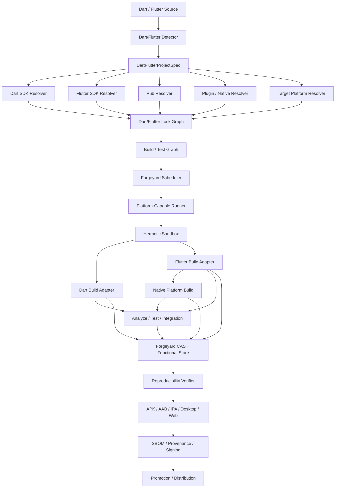

# Forgeyard Dart + Flutter CI/CD System & Architecture

**Document type:** Dedicated language ecosystem System & Architecture  
**Project:** Forgeyard CI/CD  
**Subsystem:** First-class Dart and Flutter build, test, analysis, packaging, code generation, multi-platform distribution, reproducibility, signing, and release integration  
**Implementation direction:** Rust-first Forgeyard core with native integration to the Dart SDK, Flutter SDK, pub, Android/iOS/macOS/Windows/Linux toolchains, browser/web targets, and native plugin toolchains  
**Status:** Target production architecture  
**Relationship to Forgeyard:** This document defines the dedicated Dart/Flutter subsystem that integrates with Forgeyard's pipeline IR, hermetic build system, scheduler, runners, CAS, functional store, provenance, packaging, distribution, and deployment architecture.

---

# 1. Purpose

Dart and Flutter deserve a dedicated Forgeyard architecture because Flutter applications span multiple fundamentally different target environments:

- Dart VM;
- Dart AOT;
- Android;
- iOS;
- macOS;
- Windows;
- Linux;
- Web;
- WASM-capable web targets where supported;
- plugins containing Java/Kotlin;
- plugins containing Swift/Objective-C;
- plugins containing C/C++;
- Dart FFI libraries;
- platform SDKs;
- browser/runtime constraints.

A Flutter build can depend on:

- Dart SDK version;
- Flutter SDK version;
- Flutter engine artifacts;
- Flutter channel/revision;
- `pubspec.yaml`;
- `pubspec.lock`;
- package registry state;
- path/git dependencies;
- Flutter plugins;
- platform plugin implementations;
- code generators;
- `build_runner`;
- Android Gradle Plugin;
- Gradle distribution;
- JDK;
- Android SDK;
- Android NDK;
- Xcode;
- Apple SDK;
- Swift toolchain;
- CocoaPods or Swift Package Manager where applicable;
- Windows Visual Studio/MSVC;
- Linux native libraries;
- browser/web compiler behavior;
- assets;
- fonts;
- icons;
- flavors;
- `--dart-define`;
- environment variables;
- signing credentials;
- native plugin dependency graphs;
- build caches;
- generated plugin registrants;
- build host OS.

Forgeyard therefore needs a subsystem whose central rule is:

> **A Dart/Flutter build is defined by source + Dart/Flutter SDK identity + locked pub dependency graph + target-platform toolchain + plugin/native closure + build configuration + assets + controlled environment.**

---

# 2. Architectural Objectives

Forgeyard Dart/Flutter MUST:

1. support pure Dart projects;
2. support Flutter projects;
3. support Dart packages;
4. support Flutter packages;
5. support Flutter plugins;
6. support federated plugins;
7. support Dart CLI/server applications;
8. support Android Flutter apps;
9. support iOS Flutter apps;
10. support macOS Flutter apps;
11. support Windows Flutter apps;
12. support Linux Flutter apps;
13. support Flutter Web;
14. support Dart AOT/native compilation where applicable;
15. support `pubspec.yaml`;
16. support `pubspec.lock`;
17. support pub workspaces;
18. support package resolution and private package sources;
19. support offline builds after fetch;
20. support `build_runner`;
21. support build hooks/code assets where modern Dart tooling uses them;
22. support code generation;
23. support analyzer/lints;
24. support `dart test`;
25. support `flutter test`;
26. support widget tests;
27. support integration tests;
28. support golden tests;
29. support coverage;
30. support flavors;
31. support `--dart-define`;
32. support assets/fonts;
33. support native plugins and FFI;
34. integrate with Forgeyard C/C++;
35. integrate with Forgeyard Java/Kotlin;
36. integrate with Forgeyard Swift/Apple toolchains;
37. support Android APK/AAB;
38. support iOS IPA/app archive workflow;
39. support desktop installers/packages;
40. support deterministic packaging where platform allows;
41. separate signing/notarization from reproducible unsigned builds where necessary;
42. generate SBOM/provenance;
43. support remote execution;
44. support Forgeyard device lab;
45. prevent mutable-host SDK leakage;
46. remain local-first.

---

# 3. Non-Goals

Forgeyard does not replace:

- Dart SDK;
- Flutter SDK;
- pub;
- Gradle;
- Android SDK/NDK;
- Xcode;
- Swift toolchain;
- Visual Studio/MSVC;
- platform package managers;
- Flutter tooling;
- `build_runner`.

Forgeyard locks, isolates, orchestrates, verifies, caches, packages, signs, and distributes their results.

---

# 4. High-Level Architecture



---

# 5. Suggested Forgeyard Workspace

```text
crates/
├── forgeyard-dart/
├── forgeyard-dart-model/
├── forgeyard-dart-detect/
├── forgeyard-dart-sdk/
├── forgeyard-dart-pub/
├── forgeyard-dart-lock/
├── forgeyard-dart-workspace/
├── forgeyard-dart-build/
├── forgeyard-dart-codegen/
├── forgeyard-dart-analysis/
├── forgeyard-dart-test/
├── forgeyard-dart-package/
│
├── forgeyard-flutter/
├── forgeyard-flutter-sdk/
├── forgeyard-flutter-build/
├── forgeyard-flutter-assets/
├── forgeyard-flutter-plugins/
├── forgeyard-flutter-android/
├── forgeyard-flutter-ios/
├── forgeyard-flutter-macos/
├── forgeyard-flutter-windows/
├── forgeyard-flutter-linux/
├── forgeyard-flutter-web/
├── forgeyard-flutter-test/
├── forgeyard-flutter-device-test/
├── forgeyard-flutter-package/
└── forgeyard-flutter-provenance/
```

These are architectural capability boundaries, not a permanent crate-count requirement.

---

# 6. Core Domain Model

```rust
pub struct DartFlutterProjectSpec {
    pub source: SourceRef,

    pub kind: DartFlutterProjectKind,

    pub dart_sdk: DartSdkRequest,
    pub flutter_sdk: Option<FlutterSdkRequest>,

    pub pub_workspace: PubWorkspaceSpec,
    pub dependencies: PubDependencyPolicy,

    pub target: DartFlutterTarget,
    pub build: DartFlutterBuildPolicy,

    pub codegen: CodegenPolicy,
    pub plugins: PluginPolicy,

    pub testing: DartFlutterTestPolicy,
    pub analysis: DartAnalysisPolicy,

    pub reproducibility: ReproducibilityPolicy,
}
```

---

# 7. Project Types

```rust
pub enum DartFlutterProjectKind {
    DartPackage,
    DartApplication,
    FlutterPackage,
    FlutterPlugin,
    FlutterApplication,
}
```

---

# 8. Targets

```rust
pub enum DartFlutterTarget {
    DartVm,
    DartNative,
    Android(AndroidTarget),
    Ios(IosTarget),
    Macos(MacosTarget),
    Windows(WindowsTarget),
    Linux(LinuxTarget),
    Web(WebTarget),
}
```

---

# 9. Strong IDs

```rust
pub struct DartSdkId(Digest);
pub struct FlutterSdkId(Digest);
pub struct PubLockGraphId(Digest);
pub struct FlutterPluginGraphId(Digest);
pub struct FlutterEngineId(Digest);
pub struct AndroidSdkId(Digest);
pub struct AndroidNdkId(Digest);
pub struct AppleSdkId(Digest);
```

---

# 10. Project Detection

Detect:

```text
pubspec.yaml
pubspec.lock
analysis_options.yaml
dart_test.yaml
build.yaml
lib/
bin/
test/
integration_test/
android/
ios/
macos/
windows/
linux/
web/
```

Forgeyard determines whether the project is:

```text
pure Dart
Flutter app
Flutter package
Flutter plugin
federated plugin
multi-package workspace
```

---

# 11. `pubspec.yaml`

`pubspec.yaml` is a primary semantic input.

Forgeyard records:

```text
name
version
environment
dependencies
dev_dependencies
dependency_overrides
flutter fields
assets
fonts
plugin metadata
executables
workspace metadata where applicable
```

The exact file digest remains part of source identity.

---

# 12. `pubspec.lock`

For application projects, strict CI should treat committed lock state as authoritative.

Forgeyard uses:

```text
pubspec.lock
+
package content identities
+
Dart/Flutter SDK identity
=
PubLockGraphId
```

---

# 13. Lockfile Enforcement

Strict release mode should use the ecosystem's lock enforcement semantics.

If resolved package versions/content no longer match the lock, the build fails rather than silently upgrading.

---

# 14. Pub Workspaces

Forgeyard supports pub workspaces.

Model:

```text
workspace root
  ↓
member packages
  ↓
shared resolution
  ↓
package dependency graph
```

A workspace graph is an explicit source/build input.

---

# 15. Workspace Model

```rust
pub struct PubWorkspace {
    pub root: VirtualPath,
    pub members: Vec<PubWorkspaceMember>,
    pub lock_graph: PubLockGraphId,
}
```

---

# 16. Dependency Sources

Support:

```text
pub.dev-compatible hosted source
private hosted source
Git
path dependency
SDK dependency
workspace dependency
```

All mutable sources resolve to immutable identities.

---

# 17. Hosted Package Fetch

Architecture:

```text
resolve
  ↓
fetch package archive
  ↓
verify lock/content hash
  ↓
store immutably
  ↓
materialize pub cache
  ↓
build offline
```

---

# 18. Private Pub Repositories

Credentials are fetch-stage secrets.

They never become normal build environment variables.

---

# 19. Git Dependencies

Resolve:

```text
repository
requested ref
commit
tree digest
```

Release builds never follow a mutable branch implicitly.

---

# 20. Path Dependencies

A path dependency must resolve inside:

```text
source snapshot
or
explicit immutable Forgeyard source object
```

Do not use arbitrary machine-local directories.

---

# 21. `dependency_overrides`

Overrides are high-impact inputs.

Forgeyard shows them prominently in dependency graph and release policy can restrict them.

---

# 22. Dependency Graph UI Risk Labels

Mark:

```text
Hosted
Git
Path
Override
Plugin
Native
Private
```

for every package.

---

# 23. Dart SDK Identity

A Dart SDK identity includes:

```text
dart executable
VM/runtime
compiler/runtime tools
standard libraries
SDK libraries/resources
platform
architecture
```

Version string alone is not sufficient.

---

# 24. Dart SDK Model

```rust
pub struct DartSdk {
    pub id: DartSdkId,
    pub version: DartVersion,
    pub platform: HostPlatform,
    pub trust: ToolchainTrust,
}
```

---

# 25. Flutter SDK Identity

Flutter SDK identity includes:

```text
Flutter framework checkout/distribution
embedded Dart SDK
Flutter tool
engine artifacts/revision
platform build templates
platform tooling metadata
```

Logical:

```text
FlutterSdkId = H(Flutter SDK closure)
```

---

# 26. Flutter Channel

Do not identify builds by:

```text
stable
beta
master
```

alone.

A channel is a mutable selector.

Resolution phase turns it into an immutable:

```text
version
revision
engine identity
content digest
```

---

# 27. Flutter SDK Lock

Example:

```ron
flutter_sdk: (
    version: "resolved-version",
    revision: "git-or-release-id",
    digest: "blake3:...",
    dart_sdk: "blake3:...",
    engine: "blake3:...",
)
```

---

# 28. SDK Auto-Download

Strict build must not allow Flutter tooling to silently fetch missing SDK artifacts from the network.

Fetch them before realization.

---

# 29. Toolchain Trust

```rust
pub enum ToolchainTrust {
    Unverified,
    DigestVerified,
    VendorVerified,
    OrganizationApproved,
    Revoked,
}
```

Identity and trust remain separate.

---

# 30. Pub Cache

The ordinary pub cache is mutable acceleration.

Forgeyard architecture:

```text
immutable package objects
  ↓
controlled PUB_CACHE materialization
```

Do not use arbitrary developer pub cache as source of truth.

---

# 31. `PUB_CACHE`

Forgeyard sets an isolated controlled path.

---

# 32. HOME Isolation

Use synthetic HOME.

Do not expose:

```text
developer pub credentials
global Dart config
Flutter user state
machine-specific caches
```

unless explicitly supplied.

---

# 33. Environment Synthesis

Forgeyard controls:

```text
PATH
HOME
PUB_CACHE
FLUTTER_ROOT
DART_* environment as relevant
CI
TZ
LANG
TMPDIR
```

and all platform-specific toolchain variables.

---

# 34. Flutter Tool State

Flutter tool caches are acceleration/materialization only.

They must be keyed by Flutter SDK/platform identity.

---

# 35. Hermetic Build

Strict build sees:

```text
source
locked Dart SDK
locked Flutter SDK
locked pub package closure
declared target SDK/toolchain
controlled caches
declared native plugins
```

It does not see arbitrary:

```text
host Flutter install
host Android SDK
host Xcode selection
host Visual Studio
host system libraries
developer pub cache
```

unless explicitly platform-provided and fingerprinted.

---

# 36. Dart Build Architecture

Pure Dart projects may build:

```text
VM application
AOT/native executable
other SDK-supported compilation targets
```

Target/compiler mode is explicit.

---

# 37. Modern Dart Build Hooks

If a project/dependency uses Dart build hooks/code assets, those hooks are executable build-time dependencies.

Forgeyard executes them in sandbox with declared inputs.

---

# 38. Hook Policy

Build hook network access:

```text
denied by default
```

after fetch.

Native/code assets produced by hooks are content-addressed outputs.

---

# 39. Code Generation

Common:

```text
build_runner
json_serializable
freezed
source_gen
protobuf
drift generators
Riverpod generator
custom builders
```

All generator package versions/configs are locked.

---

# 40. `build_runner`

`build_runner` is a first-class code-generation adapter.

Forgeyard records:

```text
build_runner version
builder graph
build.yaml
generator packages
builder options
source inputs
```

---

# 41. Generated Code Policy

Two modes:

```text
GeneratedInBuild
CommittedAndVerified
```

---

# 42. Committed Generated Code Verification

```text
clean source copy
  ↓
run generators
  ↓
compare
  ↓
fail if generated output differs
```

---

# 43. `.dart_tool`

`.dart_tool` is generated/mutable state.

Never treat arbitrary checked/local `.dart_tool` content as authoritative unless a specific artifact is explicitly modeled.

---

# 44. Analyzer

First-class analysis:

```text
dart analyze
flutter analyze
```

with locked SDK.

---

# 45. `analysis_options.yaml`

The config and any included lint package/config participate in analysis identity.

---

# 46. Lints

Support:

```text
Dart lints
Flutter lints
custom analyzer plugins
```

as locked dependencies/configuration.

---

# 47. Formatting

Verification:

```text
dart format
```

CI reports differences rather than silently rewriting source.

---

# 48. Dart Tests

Support:

```text
dart test
```

for pure Dart packages/apps.

---

# 49. Flutter Tests

Support:

```text
flutter test
```

for:

```text
unit
widget
golden
```

test classes.

---

# 50. Test Model

```rust
pub struct DartFlutterTestPlan {
    pub units: Vec<TestUnit>,
    pub target: TestTarget,
    pub shards: u32,
    pub coverage: CoveragePolicy,
    pub timeout: Duration,
}
```

---

# 51. Widget Tests

Run under a locked Flutter engine/test environment.

---

# 52. Golden Tests

Golden tests are environment-sensitive.

Forgeyard must explicitly record:

```text
Flutter SDK/engine
font configuration
platform rendering conditions
test target
golden policy
```

---

# 53. Golden Runner Class

Use stable runners for golden tests.

Avoid mixing arbitrary host font/rendering state.

---

# 54. Integration Tests

Integration tests can target:

```text
Android emulator/device
iOS simulator/device
desktop application
web browser
```

---

# 55. Device Lab Integration

Forgeyard schedules integration tests against device capabilities.

```rust
pub struct FlutterDeviceCapability {
    pub platform: DevicePlatform,
    pub os_version: OsVersion,
    pub architecture: Architecture,
    pub device_kind: DeviceKind,
}
```

---

# 56. Android Integration Testing

Possible targets:

```text
emulator
physical device
```

with explicit:

```text
API level
ABI
device profile
```

---

# 57. iOS Integration Testing

Requires macOS runner and simulator/device infrastructure.

---

# 58. Web Integration Testing

Use locked browser toolchains where applicable.

---

# 59. Coverage

Support Dart/Flutter coverage outputs.

Coverage is verification evidence, not artifact identity.

---

# 60. Test Sharding

Shard by:

```text
test file
package
device
platform
historical duration
```

without violating framework semantics.

---

# 61. Flaky Test Recording

Retries remain visible.

Do not erase first failure.

---

# 62. Flutter Build Modes

Model:

```rust
pub enum FlutterBuildMode {
    Debug,
    Profile,
    Release,
}
```

Build mode is explicit derivation input.

---

# 63. Release Builds

Production artifacts must use explicit release configuration.

Debug/profile artifacts are not interchangeable with release artifacts.

---

# 64. Flavors

Flutter flavors can affect:

```text
application ID/bundle ID
app name
icons
API configuration
feature flags
logging
resources
platform configuration
```

Therefore flavor is a first-class derivation input.

---

# 65. Flavor Model

```rust
pub struct FlutterFlavor {
    pub name: FlavorName,
    pub platform_config: StoreObjectId,
    pub build_defines: BTreeMap<String, BuildValue>,
}
```

---

# 66. `--dart-define`

Every define affecting compiled output is an explicit input.

Never inherit arbitrary environment variables and translate them implicitly.

---

# 67. Secret Rule

Do not put secrets into:

```text
--dart-define
frontend/web bundle variables
Flutter assets
generated source
```

unless the project explicitly accepts that they become extractable artifact data.

Release policy should deny secret-classified values.

---

# 68. Assets

`pubspec.yaml` assets are explicit source inputs.

Forgeyard validates:

```text
declared paths exist
case-sensitive path correctness
duplicate/conflicting assets
generated assets
```

---

# 69. Fonts

Font files and font declarations become part of artifact identity.

Golden/rendering tests may also depend on them.

---

# 70. Icon/Splash Generators

If using packages that generate launcher icons/splash screens:

```text
generator version
source images
config
target platforms
```

are explicit build inputs.

---

# 71. Flutter Plugin Architecture

A Flutter plugin may contain:

```text
Dart interface
Android implementation
iOS implementation
macOS implementation
Windows implementation
Linux implementation
Web implementation
```

Forgeyard models the platform implementation graph.

---

# 72. Federated Plugins

Model:

```text
app-facing package
platform interface
platform implementation packages
```

Do not flatten into a single package identity.

---

# 73. Plugin Graph

```rust
pub struct FlutterPluginGraph {
    pub plugins: Vec<ResolvedFlutterPlugin>,
    pub target: DartFlutterTarget,
}
```

Target selects relevant platform implementations.

---

# 74. Android Plugin Code

May contain:

```text
Kotlin
Java
C/C++
Gradle
Android resources
```

Delegate to Forgeyard Java/Kotlin and C/C++ subsystems.

---

# 75. iOS/macOS Plugin Code

May contain:

```text
Swift
Objective-C
C/C++
Swift Package Manager metadata
CocoaPods compatibility metadata
```

Delegate to Apple/Swift/C++ subsystem.

---

# 76. Windows Plugin Code

May contain:

```text
C++
CMake
Win32
WinRT
```

Delegate to Forgeyard C/C++ Windows subsystem.

---

# 77. Linux Plugin Code

May contain:

```text
C/C++
CMake
pkg-config/system libraries
```

Use Forgeyard C/C++ dependency closure.

---

# 78. Web Plugin Code

Web implementations remain Dart/web compilation inputs.

---

# 79. FFI

Dart/Flutter FFI introduces native binaries.

Model:

```rust
pub struct DartFfiSpec {
    pub native_toolchain: NativeToolchainId,
    pub target: NativeTarget,
    pub libraries: Vec<NativeDependency>,
}
```

---

# 80. FFI Rule

Native FFI libraries are never "just files."

Their:

```text
toolchain
ABI
architecture
runtime dependencies
```

are explicit.

---

# 81. Android Target Architecture

Android build identity includes:

```text
FlutterSdkId
DartSdkId
Android SDK
Android platform/API level
Gradle
Android Gradle Plugin
JDK
NDK if native code
ABI set
flavor
build mode
pub/plugin graph
```

---

# 82. Android SDK

Model as explicit SDK/platform closure.

Do not use whatever `ANDROID_HOME` happens to contain.

---

# 83. Android JDK

JDK identity comes from Forgeyard JVM subsystem.

---

# 84. Gradle

Android Flutter builds integrate with Forgeyard JVM Gradle architecture.

The Gradle distribution/plugin graph is locked.

---

# 85. Android Gradle Plugin

AGP version is a build input.

---

# 86. Android NDK

If plugins/FFI use native code:

```text
NDK version
Clang toolchain
ABI
API level
native libs
```

are explicit.

---

# 87. Android ABI Matrix

Potential:

```text
arm64-v8a
armeabi-v7a
x86_64
```

according to project/platform support.

---

# 88. APK

APK is a package output.

Unsigned/release-signing stages should be separable.

---

# 89. AAB

Android App Bundle is a primary release package option.

Forgeyard treats bundle bytes as immutable before signing/publishing transitions as allowed by tooling.

---

# 90. Android Signing

Signing credentials are late-bound secrets.

They do not enter source/build derivation identity.

Signed artifact has its own digest/provenance relationship to unsigned/package input.

---

# 91. Android Keystore

Use Forgeyard secret provider.

Never put keystore/passwords in source or CAS.

---

# 92. Play Store Publishing

Publishing is separate from build.

```text
verified AAB/APK
  ↓
approval
  ↓
Play publishing adapter
```

Never rebuild on publish.

---

# 93. iOS Target Architecture

iOS build identity includes:

```text
Flutter SDK
Dart SDK
Xcode
Apple SDK
Swift toolchain
deployment target
architecture
Flutter plugin graph
native dependency manager state
flavor
build mode
```

---

# 94. iOS Runner

Production iOS build requires appropriate macOS infrastructure.

Forgeyard must not claim Linux can substitute for final iOS/Xcode build/signing.

---

# 95. Xcode Identity

Explicit platform contract:

```text
Xcode version
build version
Apple SDK version
Swift compiler
tool paths
```

---

# 96. Swift Package Manager

Model SwiftPM package resolution as native plugin dependency input.

At current Flutter versions, SwiftPM integration is increasingly central for Apple-platform plugin dependencies, while compatibility with older CocoaPods-based projects may still be necessary.

---

# 97. CocoaPods Compatibility

Forgeyard may support:

```text
Podfile
Podfile.lock
CocoaPods tool identity
spec/source closure
```

for projects that still require it.

---

# 98. Apple Dependency Rule

SwiftPM/CocoaPods dependency fetching happens before strict native build where practical.

---

# 99. iOS Signing

Late-bound:

```text
certificate
private key
provisioning profile
team identity
```

Signing material is secret, not derivation content.

---

# 100. IPA

IPA is a release packaging artifact.

Signing/export configuration has its own controlled state.

---

# 101. App Store Publishing

Separate:

```text
verified signed IPA/archive
  ↓
approval
  ↓
App Store Connect adapter
```

---

# 102. macOS Target

Shares much of iOS Apple toolchain architecture.

Additionally:

```text
macOS deployment target
entitlements
sandbox
notarization
DMG/PKG/app packaging
```

---

# 103. macOS Signing

Separate unsigned reproducible core where practical from:

```text
codesign
notarization
stapling
```

---

# 104. Windows Target

Windows Flutter build identity includes:

```text
Flutter SDK
Dart SDK
Visual Studio/MSVC toolchain
Windows SDK
CMake/Ninja where Flutter tooling uses them
plugin native closure
architecture
```

---

# 105. Windows Runner

Use actual Windows runner for production Windows Flutter artifacts.

---

# 106. Windows Native Plugins

Delegate native build/linkage to Forgeyard C/C++ Windows subsystem.

---

# 107. Windows Packaging

Potential:

```text
ZIP
MSIX
MSI adapter
installer
Microsoft Store package
```

Packaging is separate from app compilation.

---

# 108. Linux Target

Linux Flutter identity includes:

```text
Flutter SDK
Dart SDK
C/C++ toolchain
CMake/Ninja
system/native libraries
pkg-config closure
target distro compatibility policy
```

---

# 109. Linux Native Dependencies

Strict builds deny arbitrary `/usr/local`/host package leakage.

Use Forgeyard C/C++ sysroot/native closure.

---

# 110. Linux Packaging

Potential:

```text
tar.zst
deb
rpm
AppImage adapter
Flatpak adapter
```

---

# 111. Web Target

Flutter Web output is a static directory/bundle.

Identity includes:

```text
Flutter SDK
Dart web compiler/toolchain
renderer/backend configuration
web build mode
defines
assets
service worker/PWA config
```

---

# 112. Web Reproducibility

Canonicalize output tree metadata.

Do not rewrite semantic JS/WASM/CSS arbitrarily.

Compare actual bundle content.

---

# 113. Browser Target Policy

Where browser compatibility target/config affects emitted output, record it as derivation input.

---

# 114. Service Worker / PWA

If generated:

```text
service worker
manifest
icons
cache manifest
```

are package outputs.

---

# 115. Web Deployment

Publish identical static artifact to:

```text
object storage
CDN origin
static host
OCI
Forgeyard release site
```

without rebuilding per environment when possible.

---

# 116. Build Once, Promote Many

```text
source
  ↓
artifact X
  ↓
test X
  ↓
reproduce X
  ↓
sign/package X
  ↓
stage
  ↓
production
```

No recompilation during promotion.

---

# 117. Reproducibility Model

For one target derivation:

```text
Runner A -> Output X
Runner B -> Output Y
```

Require:

```text
X == Y
```

according to target-specific comparison policy.

---

# 118. Target-Specific Comparison

Examples:

```text
Dart binary -> bit-for-bit where achievable
Flutter web -> canonical tree/bit-for-bit files
APK/AAB -> unsigned/package-stage comparison
iOS/macOS -> unsigned pre-signing comparison where signing adds mutable metadata
Windows/Linux app -> content-tree/binary comparison
```

---

# 119. Reproduction Mismatch

Quarantine release.

Inspect:

```text
Dart AOT output
Flutter assets
generated plugin registrant
native libraries
Android package metadata
Apple bundle metadata
web bundle
generated code
timestamps
paths
```

---

# 120. Build Cache Layers

```text
pub cache
Flutter SDK cache
Dart compiler cache
Gradle cache
Android SDK cache
Xcode derived state
CMake/Ninja cache
generated-code cache
Forgeyard action cache
Forgeyard CAS
```

Each has distinct semantics.

---

# 121. Cache Principle

All ecosystem caches are acceleration.

Forgeyard lock/store identities remain correctness source.

---

# 122. Generated Plugin Registrants

Generated plugin registration files are derived outputs.

Their input is the locked plugin graph + target.

---

# 123. Platform Project Files

Directories:

```text
android/
ios/
macos/
windows/
linux/
web/
```

are source/config inputs.

Flutter-generated defaults should not be regenerated silently during release unless explicitly modeled.

---

# 124. Project Migration

If Flutter tooling proposes project-file migration:

```text
fail with actionable diff
```

rather than silently modifying release source.

---

# 125. `flutter pub get`

Resolution occurs under Forgeyard-controlled pub environment.

Strict build should use already-fetched lock-matching packages.

---

# 126. Pub Lock Consistency

Application release requires:

```text
pubspec.yaml compatible with pubspec.lock
lock content hashes valid
package closure available
```

---

# 127. Package Projects vs Application Projects

Dart package libraries may intentionally not commit lockfiles according to ecosystem conventions.

Forgeyard distinguishes:

```text
library resolution validation
application deployment lock
```

The outer Forgeyard test/release environment can still pin a concrete dependency graph for CI evidence.

---

# 128. Package Publishing

For Dart/Flutter packages:

```text
source package
metadata validation
dependency constraints
analysis/tests
provenance
```

Publishing occurs as separate effect after approval.

---

# 129. `dart pub publish`

Forgeyard publishing adapter sends exact validated package source state.

No rebuild/mutation during publish.

---

# 130. Flutter Plugin Publishing

Validate platform declarations and implementation package relationships.

---

# 131. Plugin Compatibility Matrix

Potential CI:

```text
Android
iOS
macOS
Windows
Linux
Web
```

only for platforms claimed by plugin.

---

# 132. Native Plugin ABI

Platform plugin binary outputs must be compatible with target ABI/runtime.

Forgeyard records native toolchain identities.

---

# 133. Static Analysis

First-class:

```text
dart analyze
flutter analyze
custom analyzer plugins
```

---

# 134. Analyzer Baseline

Support:

```text
strict full analysis
new findings only
baseline
```

---

# 135. Lint Policy

Project config defines lint set.

Forgeyard records analyzer SDK and lint package versions.

---

# 136. Test Result Model

```rust
pub struct DartFlutterTestResult {
    pub suite: String,
    pub case: String,
    pub platform: TestPlatform,
    pub status: TestStatus,
    pub duration: Duration,
    pub logs: StoreObjectId,
    pub artifacts: Vec<StoreObjectId>,
}
```

---

# 137. Golden Diff Artifacts

Store:

```text
expected
actual
diff image
metadata
```

for failed golden tests.

---

# 138. Device Test Artifacts

Store:

```text
screenshots
video
logs
crash report
device metadata
```

---

# 139. Performance Tests

Flutter performance tests should use dedicated device/runner classes.

Record:

```text
device
OS
Flutter engine
build mode
refresh-rate/environment metadata
```

---

# 140. App Size

Track:

```text
APK/AAB/IPA/app bundle size
native library size
Dart snapshot size
asset size
```

as release evidence.

---

# 141. Size Regression Gate

Compare against stored baseline with thresholds.

---

# 142. Tree-Shaking / Icon Tree-Shaking

Compiler/tool configuration affecting tree shaking is explicit.

---

# 143. Obfuscation

If enabled:

```text
obfuscation mode
split-debug-info path/output
symbol mapping
```

becomes explicit configuration.

---

# 144. Symbol Artifacts

For Flutter release builds where symbol/debug outputs exist:

```text
Dart symbols
Android native symbols
iOS dSYM
Windows symbols
Linux debug files
```

store as separate protected artifacts.

---

# 145. Crash Symbolication

Forgeyard symbol service indexes artifacts by release/build identity.

---

# 146. Scheduler Capabilities

```rust
pub struct DartFlutterRunnerCapabilities {
    pub dart_sdks: Vec<DartSdkId>,
    pub flutter_sdks: Vec<FlutterSdkId>,
    pub android_sdks: Vec<AndroidSdkId>,
    pub android_ndks: Vec<AndroidNdkId>,
    pub apple_sdks: Vec<AppleSdkId>,
    pub windows_toolchains: Vec<CppToolchainId>,
    pub linux_toolchains: Vec<CppToolchainId>,
    pub devices: Vec<DeviceCapability>,
    pub sandbox: SandboxCapabilities,
}
```

---

# 147. Hard Placement Constraints

Filter by:

```text
Flutter SDK
target OS
Android SDK/API/NDK
Xcode/Apple SDK
Windows toolchain
Linux sysroot
browser/device requirement
signing trust tier
memory
```

---

# 148. Scheduler Scoring

Then score:

```text
Flutter SDK locality
pub closure locality
Gradle cache warmth
native SDK locality
device availability
queue delay
resource headroom
```

---

# 149. Runner Prewarming

Prefetch:

```text
Flutter SDK
Dart SDK
pub package closure
Android SDK/NDK
Gradle/JDK
platform dependencies
browser toolchain
```

according to pool role.

---

# 150. Platform Runner Pools

Recommended:

```text
linux-flutter
windows-flutter
macos-flutter
android-device
ios-simulator
ios-device
web-browser
```

---

# 151. macOS Scarcity

Apple builds are expensive/scarce.

Scheduler should prioritize:

```text
source/platform-independent checks first
Apple-only build/test later
```

to avoid wasting macOS capacity on commits already failing analysis/unit tests.

---

# 152. Android Parallelism

Coordinate:

```text
Gradle workers
Dart/Flutter compile parallelism
Forgeyard job count
emulator/device capacity
```

---

# 153. Adaptive Resources

Do not oversubscribe large Flutter Android/iOS builds.

Use historical memory/CPU data.

---

# 154. Remote Execution

Good boundaries:

```text
analysis
unit/widget tests
code generation
platform build jobs
web build
device test shards
```

---

# 155. Codegen Remote Cache

Codegen results can be cached if:

```text
builder identity
source inputs
config
SDK
dependency graph
```

are fully captured.

---

# 156. Platform Build Remote Cache

Cache at whole build/package action or safe sub-boundaries.

Do not attempt to reimplement Flutter's internal engine compilation cache semantics.

---

# 157. Forgeyard Dart Adapter Trait

```rust
#[async_trait]
pub trait DartEcosystemAdapter {
    async fn detect(&self, source: &SourceTree) -> Result<DartDetection>;
    async fn resolve(&self, project: &DartFlutterProjectSpec) -> Result<ResolvedDartProject>;
    async fn build_plan(&self, project: &ResolvedDartProject) -> Result<DartBuildPlan>;
    async fn test_plan(&self, project: &ResolvedDartProject) -> Result<DartFlutterTestPlan>;
}
```

---

# 158. Flutter Platform Adapter Trait

```rust
#[async_trait]
pub trait FlutterPlatformAdapter {
    fn target(&self) -> DartFlutterTarget;

    async fn requirements(
        &self,
        project: &ResolvedFlutterProject,
    ) -> Result<PlatformRequirements>;

    async fn build(
        &self,
        ctx: FlutterBuildContext,
    ) -> Result<FlutterPlatformBuild>;
}
```

---

# 159. Pub Resolver Trait

```rust
#[async_trait]
pub trait PubResolver {
    async fn resolve(
        &self,
        project: &PubWorkspaceSpec,
        policy: &PubDependencyPolicy,
    ) -> Result<LockedPubGraph>;
}
```

---

# 160. Plugin Resolver Trait

```rust
#[async_trait]
pub trait FlutterPluginResolver {
    async fn resolve(
        &self,
        graph: &LockedPubGraph,
        target: &DartFlutterTarget,
    ) -> Result<FlutterPluginGraph>;
}
```

---

# 161. Build Plan

```rust
pub struct FlutterBuildPlan {
    pub sdk: FlutterSdkId,
    pub target: DartFlutterTarget,
    pub mode: FlutterBuildMode,
    pub flavor: Option<FlutterFlavor>,
    pub dart_defines: BTreeMap<String, BuildValue>,
    pub plugin_graph: FlutterPluginGraphId,
    pub asset_graph: AssetGraphId,
}
```

---

# 162. CLI

Recommended:

```text
forgeyard dart detect
forgeyard dart lock
forgeyard dart fetch
forgeyard dart build
forgeyard dart test
forgeyard dart analyze
forgeyard dart format-check
forgeyard dart codegen
forgeyard dart reproduce
forgeyard dart package
forgeyard dart explain

forgeyard flutter detect
forgeyard flutter lock
forgeyard flutter fetch
forgeyard flutter analyze
forgeyard flutter test
forgeyard flutter integration-test
forgeyard flutter build
forgeyard flutter build android
forgeyard flutter build ios
forgeyard flutter build macos
forgeyard flutter build windows
forgeyard flutter build linux
forgeyard flutter build web
forgeyard flutter plugins
forgeyard flutter assets
forgeyard flutter reproduce
forgeyard flutter package
forgeyard flutter publish
forgeyard flutter explain
forgeyard flutter explain-rebuild
```

---

# 163. Explain Build

Show:

```text
Flutter SDK
Dart SDK
pub lock graph
target
mode
flavor
dart-defines
plugins
native SDK/toolchain
assets
codegen
cache state
sandbox
```

---

# 164. Explain Rebuild

Examples:

```text
Flutter SDK revision changed
pubspec.lock changed
plugin graph changed
Android SDK changed
NDK changed
Xcode changed
flavor changed
dart-define changed
asset changed
build_runner generator changed
```

---

# 165. Dioxus UI

Dedicated panels:

```text
Dart SDK
Flutter SDK
Pub dependency graph
Workspace
Plugin graph
Code generation
Assets/fonts
Targets
Android
Apple
Windows
Linux
Web
Tests
Devices
Coverage
Reproducibility
Signing
Publishing
```

---

# 166. Flutter SDK UI

Display:

```text
Flutter version
revision
channel selector origin
Dart SDK
engine identity
digest
trust
```

---

# 167. Dependency UI

Display:

```text
package
version
source
content hash
direct/transitive
override
plugin/native status
```

---

# 168. Plugin UI

Show per plugin:

```text
Dart package
Android implementation
iOS implementation
macOS implementation
Windows implementation
Linux implementation
Web implementation
native dependencies
```

---

# 169. Android UI

Show:

```text
SDK
API level
JDK
Gradle
AGP
NDK
ABIs
flavor
signing status
APK/AAB digest
```

---

# 170. Apple UI

Show:

```text
Xcode
Apple SDK
Swift toolchain
deployment target
SwiftPM/CocoaPods resolution
signing profile status
IPA/app digest
```

---

# 171. Device Lab UI

Show:

```text
device
platform
OS version
availability
assigned test
logs/screenshots
```

---

# 172. Failure Classification

```rust
pub enum DartFlutterFailure {
    DetectionFailure,
    DartSdkFailure,
    FlutterSdkFailure,
    PubResolutionFailure,
    PubVerificationFailure,
    CodegenFailure,
    AnalysisFailure,
    TestFailure,
    GoldenFailure,
    PluginFailure,
    NativeBuildFailure,
    AndroidBuildFailure,
    AppleBuildFailure,
    WindowsBuildFailure,
    LinuxBuildFailure,
    WebBuildFailure,
    SigningFailure,
    PackagingFailure,
    DeviceTestFailure,
    ReproducibilityFailure,
    PublishingFailure,
}
```

---

# 173. Example Dependency Failure

```text
Pub dependency unavailable offline

package:
  example_package 1.2.3

lock:
  expected content hash ...

suggestion:
  forgeyard dart fetch
```

---

# 174. SDK Drift Failure

```text
Flutter SDK mismatch

locked:
  FlutterSdkId A

runner:
  FlutterSdkId B

action:
  build refused
```

---

# 175. Plugin Native Leakage

```text
Native plugin hermeticity violation

plugin:
  example_plugin

attempted library:
  /usr/local/lib/libfoo.so

reason:
  outside declared native closure
```

---

# 176. Development Environment

```text
forgeyard flutter dev
```

provides:

```text
Flutter/Dart SDK
pub packages
platform tools where local platform supports them
analysis/test tools
```

matching CI identities as closely as possible.

---

# 177. IDE Integration

Expose:

```text
Flutter SDK path
Dart SDK path
package config
analysis options
device metadata
```

for editors/IDEs.

IDE state is not authoritative.

---

# 178. Local Mode

Standalone Forgeyard can:

```text
resolve pub deps
run analyze/test
build local-platform targets
build Android if SDK installed/managed
build web
package
```

using local CAS/store.

---

# 179. Distributed Mode

```text
daemon
  ↓
target build
  ↓
platform runner
  ↓
Flutter SDK + pub closure + platform SDK
  ↓
build/test
  ↓
CAS
```

---

# 180. Enterprise Mode

Adds:

```text
approved Flutter/Dart SDK mirror
private pub mirror
Android SDK/NDK mirror
Apple runner pool
device farm
signed locks
OIDC/RBAC
independent reproducers
multi-region CAS
air-gap support
```

---

# 181. Air-Gapped Build

Bundle:

```text
source
Flutter SDK
Dart SDK
pub package closure
codegen tools
Android/JVM/NDK inputs if needed
platform-native plugin closure
lock graph
```

Apple builds additionally require controlled Apple runner/toolchain infrastructure.

---

# 182. SBOM

Combine:

```text
pub dependency graph
Flutter plugins
Android JVM dependencies
native C/C++ dependencies
Apple native dependencies
runtime packaged libraries
```

---

# 183. Provenance

Record:

```text
source digest
FlutterSdkId
DartSdkId
pub lock graph
plugin graph
codegen graph
target
build mode
flavor
dart-defines
asset graph
platform SDK/toolchain
native closure
output digest
runner
sandbox policy
signing relationship
```

---

# 184. Release Manifest

```rust
pub struct FlutterReleaseManifest {
    pub version: Version,
    pub artifacts: BTreeMap<DartFlutterTarget, PackageDigest>,
    pub symbols: BTreeMap<DartFlutterTarget, Vec<StoreObjectId>>,
    pub sbom: Digest,
    pub provenance: Digest,
}
```

---

# 185. Signing Model

Never conflate:

```text
build identity
```

with:

```text
signature identity
```

Use:

```text
UnsignedArtifactDigest
  ↓
SigningOperation
  ↓
SignedArtifactDigest
```

---

# 186. Android Release Pipeline

```text
clean source
  ↓
locked Flutter/Dart SDK
  ↓
locked pub/plugin graph
  ↓
locked JDK/Gradle/AGP/Android SDK
  ↓
locked NDK/native closure if needed
  ↓
offline hermetic build
  ↓
tests
  ↓
unsigned/release package
  ↓
reproduction
  ↓
sign
  ↓
AAB/APK
  ↓
SBOM/provenance
  ↓
publish/promote
```

---

# 187. iOS Release Pipeline

```text
clean source
  ↓
locked Flutter/Dart SDK
  ↓
locked pub/plugin graph
  ↓
macOS runner
  ↓
locked Xcode/Apple SDK/Swift contract
  ↓
SwiftPM/CocoaPods resolution
  ↓
offline/controlled native build
  ↓
tests
  ↓
unsigned/pre-signing app artifact
  ↓
reproduction where feasible
  ↓
codesign/export
  ↓
IPA
  ↓
provenance
  ↓
publish
```

---

# 188. Desktop Release Pipeline

```text
target platform runner
  ↓
locked Flutter SDK
  ↓
locked native toolchain
  ↓
build
  ↓
runtime closure validation
  ↓
reproduce
  ↓
deterministic package
  ↓
sign where required
  ↓
publish
```

---

# 189. Web Release Pipeline

```text
clean source
  ↓
locked Flutter SDK
  ↓
locked pub graph
  ↓
codegen
  ↓
web release build
  ↓
canonical output tree
  ↓
browser tests
  ↓
reproduce
  ↓
static package
  ↓
CDN/static-host promotion
```

---

# 190. Production Defaults

Recommended:

```text
locked Flutter SDK
locked Dart SDK
committed/enforced app lockfile
locked pub package contents
offline build after fetch
isolated PUB_CACHE/HOME
explicit target
explicit release mode
explicit flavor
explicit dart-defines
secret dart-defines denied
plugin graph locked
native toolchains locked
fresh release build
independent reproduction
late signing
```

---

# 191. Development Defaults

May allow:

```text
warm Flutter/pub caches
hot reload
dirty source snapshot
local devices
debug/profile mode
incremental codegen
```

with visible non-release status.

---

# 192. Error-Prone Behaviors to Prevent

Forgeyard should detect/reject:

```text
Flutter channel drift
Dart SDK drift
ambient Flutter installation
ambient pub cache dependency
unlocked package update
path dependency outside source snapshot
network dependency fetch during release build
build_runner generator drift
uncommitted generated code drift
secret in dart-define
Android SDK drift
Gradle/AGP drift
NDK drift
Xcode drift
SwiftPM/CocoaPods drift
Windows SDK/MSVC drift
Linux host library leakage
plugin native library leakage
signing credentials in source
rebuild during promotion/publishing
```

---

# 193. Reference PR Pipeline

```text
detect
  ↓
lock verification
  ↓
format check
  ↓
analyze
  ↓
codegen verification
  ↓
unit/widget tests
  ↓
primary target build
```

---

# 194. Reference Nightly

```text
full test matrix
Android integration tests
iOS simulator tests
desktop tests
web browser tests
golden tests on stable runners
coverage
dependency vulnerability refresh
reproducibility sampling
```

---

# 195. Reference Release

```text
clean source
  ↓
SDK/lock verification
  ↓
offline dependency closure
  ↓
codegen
  ↓
analysis/tests
  ↓
target-native build
  ↓
native runtime validation
  ↓
reproduction
  ↓
package
  ↓
SBOM/provenance
  ↓
sign/notarize
  ↓
publish/promote exact artifact
```

---

# 196. Implementation Phase 1 — Domain + Detection

Implement:

```text
DartFlutterProjectSpec
pubspec detection
target detection
Flutter/Dart SDK model
plugin detection
workspace model
```

Exit:

Forgeyard can accurately describe Dart and Flutter projects.

---

# 197. Phase 2 — SDK Locking

Implement:

```text
DartSdkId
FlutterSdkId
Flutter engine identity
SDK import/store
channel -> immutable resolution
```

---

# 198. Phase 3 — Pub Resolution

Implement:

```text
pubspec
pubspec.lock
hosted/Git/path deps
pub workspaces
private repos
offline package cache
```

Exit:

Dart project builds/tests without network after fetch.

---

# 199. Phase 4 — Analysis/Test/Codegen

Implement:

```text
dart analyze
flutter analyze
dart test
flutter test
build_runner
generated-code verification
coverage
```

---

# 200. Phase 5 — Flutter Web

Implement:

```text
web release build
asset graph
output-tree hashing
browser tests
static packaging
```

---

# 201. Phase 6 — Android

Integrate:

```text
JDK
Gradle
AGP
Android SDK
NDK
ABI matrix
APK/AAB
signing handoff
```

---

# 202. Phase 7 — Linux

Integrate C/C++ native plugin/runtime closure and packaging.

---

# 203. Phase 8 — Windows

Integrate:

```text
MSVC
Windows SDK
CMake/native plugins
desktop packaging
```

---

# 204. Phase 9 — Apple

Implement:

```text
macOS runner
Xcode/Apple SDK
Swift toolchain
SwiftPM
CocoaPods compatibility
iOS/macOS build
signing/notarization handoff
```

---

# 205. Phase 10 — Device Lab

Implement:

```text
Android devices/emulators
iOS simulators/devices
test scheduling
artifacts/logs
```

---

# 206. Phase 11 — Reproducibility

Implement:

```text
target-specific comparison
independent rebuild
unsigned-vs-signed artifact model
mismatch quarantine
```

---

# 207. Phase 12 — Enterprise Distribution

Implement:

```text
SDK mirrors
private pub mirror
device pools
signed lock approval
multi-region CAS
air-gap support
store publishing
```

---

# 208. Acceptance Tests

1. Remove host Dart/Flutter installs: locked SDK build succeeds.
2. Change ambient `PUB_CACHE`: strict build unchanged.
3. Disable network after fetch: strict build/test succeeds.
4. Change `pubspec.lock`: dependency graph changes.
5. Change package bytes behind mutable source: digest verification fails.
6. Change Flutter channel pointer without changing lock: build remains on locked SDK.
7. Change Flutter SDK revision: derivation changes.
8. Change `--dart-define`: derivation changes.
9. Change flavor: derivation changes.
10. Change asset/font: derivation changes.
11. `build_runner` output stale: codegen verification fails.
12. Native plugin uses undeclared host library: strict build fails.
13. Android SDK/AGP/JDK changes: Android derivation changes.
14. NDK changes: native Android derivation changes.
15. Xcode/Apple SDK changes: Apple derivation changes.
16. Windows MSVC changes: Windows derivation changes.
17. Web output from independent runner matches canonical tree.
18. Unsigned Android package reproduction mismatch quarantines release.
19. Signing credentials never appear in CAS/provenance plaintext.
20. Promotion publishes exact previously verified artifact digest.

---

# 209. Production Readiness Gates

Do not call Dart/Flutter support production-ready until:

```text
Dart SDK identity is stable
Flutter SDK/engine identity is stable
pub lock enforcement works
pub workspaces work
offline builds work
private hosted packages work securely
build_runner/codegen is isolated
Flutter plugins resolve per platform correctly
Android Gradle/JDK/SDK/NDK integration is locked
Apple Xcode/Swift/dependency integration is controlled
Windows/Linux native plugin linkage works
device tests are reliable
reproducibility verifier handles target-specific packaging
signing is separated from build identity
publishing never rebuilds artifacts
```

---

# 210. Architectural Invariants

1. Flutter channel name alone is never SDK identity.
2. Dart/Flutter SDKs are immutable locked inputs.
3. Application `pubspec.lock` is enforced in production CI.
4. Package bytes are content-verified.
5. Strict builds do not fetch dependencies from network.
6. Host `PUB_CACHE` is not dependency truth.
7. Path dependencies never escape declared source/store boundaries.
8. `dependency_overrides` are explicit and visible.
9. `build_runner` and generators are executable locked inputs.
10. Generated code is either generated in build or committed-and-verified.
11. Flavor is a derivation input.
12. `--dart-define` values affecting bytes are derivation inputs.
13. Secrets are denied from client artifact configuration by default.
14. Flutter plugin graph is target-specific.
15. Native plugins introduce their native toolchain identities.
16. Android builds explicitly identify JDK/Gradle/AGP/SDK/NDK.
17. Apple builds explicitly identify Xcode/SDK/Swift/dependency graph.
18. Windows/Linux native dependencies are closure-validated.
19. Signing credentials are never build inputs.
20. Reproducibility compares actual output.
21. Unsigned and signed artifact identities are distinct.
22. Publishing/promotion never rebuilds.
23. Ecosystem caches are acceleration only.
24. Platform-native build tools remain semantic authorities.
25. Correctness takes priority over pretending every Flutter target can build on every host.

---

# 211. Final Target Architecture

```text
                        Dart / Flutter Project
                                  │
                                  ▼
                     Forgeyard Dart/Flutter Detector
                                  │
                                  ▼
                       DartFlutterProjectSpec
                                  │
          ┌───────────────────────┼───────────────────────┐
          ▼                       ▼                       ▼
     Dart SDK Resolver      Flutter SDK Resolver      Pub Resolver
          │                       │                       │
          └───────────────┬───────┴───────────┬───────────┘
                          ▼                   ▼
                    Plugin Resolver     Platform Resolver
                          │                   │
                          └─────────┬─────────┘
                                    ▼
                          Immutable Target Lock
                                    │
                                    ▼
                            Build / Test Graph
                                    │
                                    ▼
                            Forgeyard Scheduler
                                    │
                                    ▼
                         Platform-Capable Runner
                                    │
                      ┌─────────────┼─────────────┐
                      ▼             ▼             ▼
                    Dart        Flutter Build    Native Build
                      │             │             │
                      └─────────────┼─────────────┘
                                    ▼
                           Analyze / Test / Device
                                    │
                                    ▼
                         Content-Addressed Artifact
                                    │
                                    ▼
                          Independent Reproducer
                                    │
                                    ▼
                           Target-Specific Package
                                    │
                                    ▼
                        SBOM / Provenance / Signing
                                    │
                                    ▼
                          Forgeyard Distribution
```

---

# 212. Final Architectural Position

For pure Dart:

```text
Source snapshot
+
Dart SDK
+
pubspec.yaml
+
locked package graph
+
target/compiler mode
+
code generation
+
controlled environment
+
hermetic sandbox
=
Dart derivation
```

For Flutter:

```text
Dart derivation
+
Flutter SDK
+
Flutter engine
+
target platform
+
plugin graph
+
assets/fonts
+
flavor
+
dart-defines
+
platform SDK/toolchain
=
Flutter derivation
```

For native plugins/FFI:

```text
Flutter derivation
+
C/C++ / Java/Kotlin / Swift native toolchain
+
platform SDK/sysroot
+
native dependency closure
=
native Flutter derivation
```

A trustworthy release requires:

```text
Derivation
  ↓
offline hermetic dependency realization
  ↓
codegen / analyze / tests
  ↓
platform-native build
  ↓
native runtime validation
  ↓
actual artifact digest
  ↓
independent reproduction
  ↓
target-specific packaging
  ↓
late signing/notarization
  ↓
SBOM + provenance
  ↓
promotion/publishing of identical artifact
```

This gives Forgeyard a Dart/Flutter subsystem that supports Flutter as a true multi-platform native ecosystem rather than treating it as a single `flutter build` command, and prevents Flutter SDK drift, mutable pub state, hidden platform SDKs, code-generation drift, native-plugin leakage, and platform-signing state from becoming invisible CI inputs.

---

# Appendix A — Recommended Dart/Flutter Release Policy

```ron
(
    flutter_release_policy: (
        source: (
            dirty_tree: Denied,
        ),

        sdk: (
            dart_locked: Required,
            flutter_locked: RequiredWhenFlutter,
            channel_only_reference: Denied,
        ),

        dependencies: (
            lock_enforced: RequiredForApplications,
            content_hash_verified: Required,
            build_network: Denied,
            path_outside_source: Denied,
        ),

        codegen: (
            generators_locked: Required,
            committed_generated_files: VerifyIfPresent,
        ),

        build: (
            mode: Release,
            target: Explicit,
            flavor: ExplicitWhenUsed,
            dart_defines: Explicit,
            secret_dart_defines: Denied,
        ),

        plugins: (
            platform_graph_locked: Required,
            native_toolchains_locked: RequiredWhenPresent,
        ),

        signing: (
            late_bound: Required,
            credentials_in_source: Denied,
        ),

        reproducibility: (
            independent_rebuilds: 1,
            compare_unsigned_core_where_required: true,
        ),

        release: (
            sbom: Required,
            provenance: Required,
            rebuild_on_promotion: Denied,
        ),
    ),
)
```

---

# Appendix B — Example Flutter Configuration

```ron
flutter: (
    sdk: Locked("flutter-stable-resolved"),

    dependencies: (
        lockfile: "pubspec.lock",
        enforce: true,
        network_during_build: Denied,
    ),

    target: Android(
        sdk: Locked("android-sdk"),
        ndk: OptionalLocked("android-ndk"),
        abi: ["arm64-v8a"],
    ),

    mode: Release,

    flavor: Some("production"),

    dart_defines: {
        "PUBLIC_API_ORIGIN": PublicBuildInput("https://api.example.invalid"),
    },

    testing: (
        unit: Required,
        widget: Required,
        integration: RequiredOnReleaseCandidate,
    ),

    reproducibility: (
        independent_rebuilds: 1,
    ),
)
```

---

# Appendix C — Example Flutter Web Configuration

```ron
flutter: (
    sdk: Locked("flutter-web"),

    target: Web(
        mode: Release,
    ),

    dependencies: (
        lockfile: "pubspec.lock",
        enforce: true,
    ),

    codegen: (
        mode: VerifyCommitted,
    ),

    reproducibility: (
        comparison: CanonicalTree,
        independent_rebuilds: 1,
    ),
)
```

---

# Appendix D — First-Class Tooling Matrix

| Area | First-class |
|---|---|
| Language | Dart |
| Framework | Flutter |
| Dependency manager | pub |
| Dependency state | `pubspec.yaml`, `pubspec.lock`, pub workspaces |
| Code generation | `build_runner`, build hooks/code assets |
| Analysis | `dart analyze`, `flutter analyze` |
| Formatting | `dart format` verification |
| Testing | `dart test`, `flutter test`, widget/golden/integration |
| Android | Gradle, JDK, AGP, Android SDK/NDK, APK/AAB |
| iOS/macOS | Xcode, Apple SDK, Swift, SwiftPM, CocoaPods compatibility |
| Windows | MSVC, Windows SDK, native plugins |
| Linux | C/C++, CMake/pkg-config/native closure |
| Web | Flutter Web static bundle |
| Native plugin/FFI | Forgeyard C/C++, JVM, Swift/Apple subsystems |
| Distribution | Play/App Store adapters, desktop packages, web/CDN |
| Reproducibility | hermetic target build + independent output verification |

---

# Appendix E — Upstream Integration Principles

Forgeyard should preserve Dart and Flutter upstream semantics instead of inventing incompatible replacements:

- Dart's package tooling uses `pubspec.lock` to preserve resolved versions, and production package retrieval can enforce the lockfile and content hashes.
- Dart pub workspaces provide one shared resolution across workspace members, so Forgeyard models that shared graph rather than independently resolving every package.
- `build_runner` is a general-purpose code-generation system, so its builders and outputs are treated as executable derivation inputs.
- Flutter build modes are distinct debug/profile/release modes and must remain explicit.
- Flutter plugins can contain platform implementations across Android, iOS, macOS, Windows, Linux, and web; Forgeyard therefore resolves a target-specific plugin/native graph.
- Dart FFI/native code introduces explicit native toolchain/ABI dependencies.
- Flutter Android flavors and Apple flavors/settings can materially change application bytes and identity, so flavors are build inputs rather than deployment labels.

