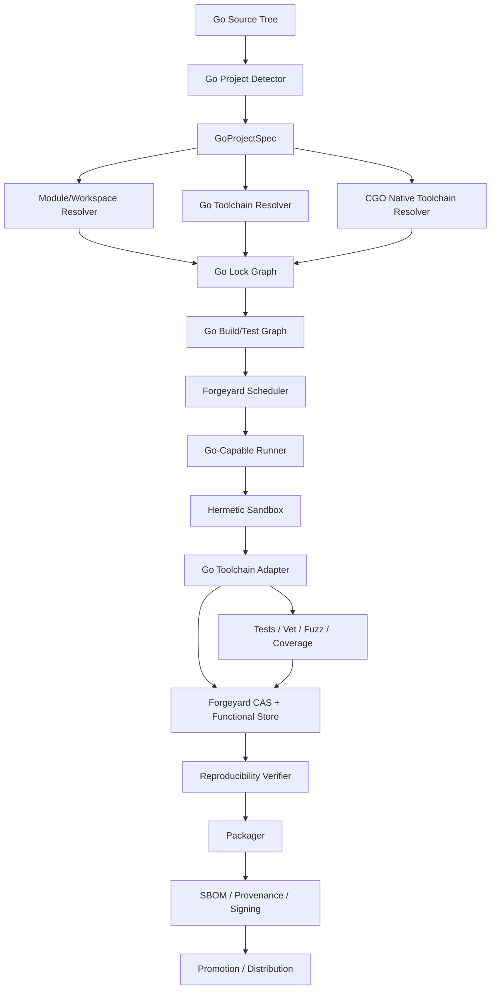

# Forgeyard Go CI/CD System & Architecture

**Document type:** Dedicated language ecosystem System & Architecture  
**Project:** Forgeyard CI/CD  
**Subsystem:** First-class Go build, test, analysis, packaging, reproducibility, module resolution, cross-compilation, distribution, and release integration  
**Implementation direction:** Rust-first Forgeyard core with native integration to the Go toolchain  
**Status:** Target production architecture  
**Relationship to Forgeyard:** This document defines the dedicated Go subsystem that integrates with Forgeyard's pipeline IR, hermetic build system, scheduler, runners, CAS, functional store, provenance, packaging, distribution, and deployment architecture.

---

# 1. Purpose

Go has a comparatively disciplined toolchain and module model, but a production-grade CI/CD platform still must control a substantial number of variables.

A Go build can depend on:

- Go toolchain version;
- `go.mod`;
- `go.sum`;
- module graph selection;
- `GOTOOLCHAIN`;
- `GOPROXY`;
- `GONOSUMDB`;
- `GOPRIVATE`;
- `GONOPROXY`;
- module replacements;
- local filesystem replacements;
- vendored modules;
- Git source state;
- build tags;
- `GOOS`;
- `GOARCH`;
- `GOAMD64`, `GOARM`, and architecture feature settings;
- CGO;
- C compiler/toolchain identity;
- native libraries;
- environment variables;
- build cache state;
- module cache state;
- generated code;
- embed inputs;
- linker flags;
- VCS metadata;
- timestamps or external generation steps;
- host SDKs when CGO is enabled.

Therefore Forgeyard should not treat Go as merely:

```text
go test ./...
go build ./...
```

Instead:

> **A Forgeyard Go build is the realization of a locked Go module/workspace graph under an explicitly identified Go toolchain, target, build policy, module-source policy, and—when CGO is enabled—native toolchain and runtime closure.**

---

# 2. Architectural Objectives

Forgeyard Go MUST:

1. support ordinary Go modules;
2. support multi-module repositories;
3. support `go.work`;
4. support `go.mod`;
5. support `go.sum`;
6. support vendored mode;
7. support private modules;
8. support module proxies and direct VCS fetches through Forgeyard's fetch/lock stage;
9. support fully offline builds after input realization;
10. support `GOTOOLCHAIN` explicitly rather than implicitly;
11. support pure-Go builds;
12. support CGO builds with native dependency modeling;
13. support cross-compilation;
14. support Linux, Windows, macOS, Android-related Go targets where practical, WASM, and other supported Go targets;
15. support reproducible release binaries;
16. support Go build cache integration;
17. support test caching safely;
18. support race detection;
19. support fuzzing;
20. support benchmarks;
21. support coverage;
22. support static analysis and `go vet`;
23. support `staticcheck` and other optional analyzers;
24. support generated-code verification;
25. support deterministic packaging;
26. generate SBOM and provenance;
27. support Forgeyard remote execution;
28. explain cache misses and rebuilds;
29. prevent accidental host/module-cache leakage;
30. remain local-first.

---

# 3. Non-Goals

Forgeyard does not replace:

- the Go compiler;
- the Go command;
- `go mod`;
- `go work`;
- module proxies;
- Git;
- native C toolchains used by CGO.

Forgeyard controls and integrates them into a reproducible CI/CD model.

---

# 4. High-Level Architecture



---

# 5. Suggested Forgeyard Workspace

```text
crates/
├── forgeyard-go/
├── forgeyard-go-model/
├── forgeyard-go-detect/
├── forgeyard-go-toolchain/
├── forgeyard-go-modules/
├── forgeyard-go-workspace/
├── forgeyard-go-fetch/
├── forgeyard-go-cgo/
├── forgeyard-go-build/
├── forgeyard-go-test/
├── forgeyard-go-analysis/
├── forgeyard-go-fuzz/
├── forgeyard-go-coverage/
├── forgeyard-go-bench/
├── forgeyard-go-cross/
├── forgeyard-go-cache/
├── forgeyard-go-package/
└── forgeyard-go-provenance/
```

Again, these are architectural boundaries, not a requirement to permanently keep every capability in a separate crate.

---

# 6. Go Domain Model

```rust
pub struct GoProjectSpec {
    pub source: SourceRef,

    pub workspace: GoWorkspaceSpec,
    pub toolchain: GoToolchainRequest,
    pub modules: GoModulePolicy,

    pub build_platform: BuildPlatform,
    pub target_platform: TargetPlatform,

    pub cgo: CgoPolicy,
    pub build: GoBuildPolicy,
    pub testing: GoTestPolicy,
    pub analysis: GoAnalysisPolicy,
    pub reproducibility: ReproducibilityPolicy,
}
```

---

# 7. Strong Types

```rust
pub struct GoVersion(String);
pub struct GoModulePath(String);
pub struct GoModuleVersion(String);
pub struct GoToolchainId(Digest);
pub struct GoModuleGraphId(Digest);
pub struct GoWorkspaceId(Digest);

pub enum GoTargetOs {
    Linux,
    Windows,
    Darwin,
    FreeBsd,
    Android,
    Js,
    Wasip1,
    Other(String),
}

pub enum GoTargetArch {
    Amd64,
    Arm64,
    Arm,
    Wasm,
    Riscv64,
    Other(String),
}
```

---

# 8. Project Detection

Forgeyard detects:

```text
go.mod
go.sum
go.work
go.work.sum
vendor/modules.txt
*.go
```

and determines:

```text
single module
multi-module repository
workspace-driven repository
vendored project
command/application
library/module
mixed Go + native project
```

---

# 9. Detection Result

```rust
pub struct GoDetection {
    pub modules: Vec<DetectedGoModule>,
    pub workspace: Option<DetectedGoWorkspace>,
    pub has_vendor: bool,
    pub uses_cgo: DetectionState,
    pub commands: Vec<GoCommandTarget>,
    pub packages: Vec<GoPackagePath>,
}
```

---

# 10. Workspace Architecture

Go repositories can be:

```text
single go.mod
multiple independent go.mod files
go.work aggregation
nested tooling modules
```

Forgeyard must preserve these semantics rather than flattening them.

---

# 11. `go.work`

`go.work` is an explicit workspace input.

Forgeyard records:

```text
go.work digest
go.work.sum digest if present
used module directories
replace/use relationships
```

Developer-local workspace files must not silently alter CI if they are not part of the locked source snapshot.

---

# 12. Go Module Identity

Each module is represented as:

```rust
pub struct LockedGoModule {
    pub path: GoModulePath,
    pub version: GoModuleVersion,
    pub source: ModuleSource,
    pub content_digest: Digest,
    pub go_mod_digest: Digest,
}
```

---

# 13. Module Graph

The module graph is a first-class immutable input.

Conceptually:

```text
root go.mod
   ↓
module graph selection
   ↓
resolved module versions
   ↓
content identities
   ↓
GoModuleGraphId
```

---

# 14. `go.mod`

Forgeyard records:

```text
module path
go directive
toolchain directive
require
replace
exclude
retract metadata where relevant to resolution
```

The exact file digest also participates in project identity.

---

# 15. `go.sum`

`go.sum` is part of source identity and module verification evidence.

Forgeyard must not silently regenerate or mutate it in strict release mode.

---

# 16. `go mod tidy`

`go mod tidy` is a source-maintenance operation, not an implicit release-build step.

CI policy:

```text
go.mod/go.sum dirty after tidy?
    ↓
FAIL
```

optional verification job:

```text
go mod tidy
git/source diff
```

---

# 17. Go Lock Strategy

Go already provides useful module integrity mechanisms, but Forgeyard adds an outer immutable lock.

Recommended:

```text
forgeyard.lock
  ├── Go toolchain identity
  ├── module graph identity
  ├── module source content identities
  ├── workspace identity
  └── optional CGO dependency closure
```

This avoids relying solely on a mutable local module cache.

---

# 18. Forgeyard Go Lock Example

```ron
go: (
    toolchain: (
        version: "go1.xx.x",
        digest: "blake3:...",
    ),

    workspace: (
        go_work: "blake3:...",
    ),

    modules: {
        "example.com/lib": (
            version: "v1.2.3",
            go_mod: "sha256:...",
            source: "sha256:...",
        ),
    },
)
```

---

# 19. Toolchain Identity

A Go toolchain includes more than `go version`.

Forgeyard fingerprints:

```text
go command
compiler
assembler
linker
standard library/tool distribution
target-independent tool binaries
toolchain manifest/source identity
```

Logical identity:

```text
GoToolchainId = H(resolved toolchain closure)
```

---

# 20. `GOTOOLCHAIN`

Forgeyard controls `GOTOOLCHAIN`.

Do not allow release builds to silently download/switch toolchains because a toolchain directive asks for a newer version.

Resolution phase may resolve the requested toolchain.

Build phase receives an immutable locked toolchain.

---

# 21. Toolchain Modes

```rust
pub enum GoToolchainMode {
    LockedManaged,
    PlatformProvided,
    AuditedHost,
}
```

Preferred:

```text
LockedManaged
```

---

# 22. Toolchain Bootstrap

Forgeyard records the provenance/trust of imported Go toolchains.

Toolchain trust and toolchain identity remain separate.

---

# 23. Toolchain Trust

```rust
pub enum GoToolchainTrust {
    Unverified,
    DigestVerified,
    VendorVerified,
    OrganizationApproved,
    Revoked,
}
```

---

# 24. Module Fetch Architecture

Strict architecture:

```text
resolve
   ↓
fetch module/source closure
   ↓
verify
   ↓
store immutably
   ↓
build offline
```

The mutable network is removed from realization.

---

# 25. `GOPROXY`

Forgeyard treats `GOPROXY` as a resolver/fetch policy, not an uncontrolled build-time environment variable.

Possible enterprise policy:

```text
Forgeyard internal mirror
  ↓ fallback
approved public proxy
  ↓
direct disabled
```

---

# 26. Direct VCS Fetch

If direct VCS is allowed, Forgeyard fetcher resolves and stores immutable source objects before strict build.

The build sandbox itself should not need Git network access.

---

# 27. Checksum Database Policy

Forgeyard should make checksum verification policy explicit.

Configuration may control:

```text
public checksum verification
private-module exceptions
organization mirror verification
```

Do not make private-module exception variables accidental runner state.

---

# 28. Private Modules

Forgeyard models private-module policy centrally.

Private credentials are used only in fetch/resolution.

The resulting source object is immutable.

Credentials do not become derivation identity.

---

# 29. `GOPRIVATE`, `GONOPROXY`, `GONOSUMDB`

These must be synthesized from project/organization policy.

They should not be silently inherited from the runner.

---

# 30. Replace Directives

`replace` can point to:

```text
another module/version
local directory
```

Forgeyard handles both explicitly.

Local replacements are resolved into source-tree/store identities.

A path such as:

```text
../local-lib
```

must not mean "whatever happens to exist on runner filesystem."

---

# 31. Local Replace

Resolution:

```text
relative replacement path
   ↓
source snapshot
   ↓
content digest
   ↓
locked module input
```

---

# 32. Vendored Mode

Forgeyard supports:

```text
vendor/
vendor/modules.txt
-mod=vendor
```

Vendored content becomes source identity.

Strict CI verifies vendor state matches module metadata.

---

# 33. Vendor Verification

Optional pipeline:

```text
copy source
  ↓
go mod vendor
  ↓
compare generated vendor tree
  ↓
fail if source-controlled vendor differs
```

---

# 34. Module Cache

The ordinary Go module cache is mutable acceleration.

Forgeyard must not treat it as authoritative.

Architecture:

```text
Forgeyard immutable module store
   ↓
materialized controlled GOMODCACHE
```

---

# 35. Build Cache

The Go build cache can be used as acceleration.

Forgeyard controls:

```text
GOCACHE
```

and scopes it by:

```text
GoToolchainId
target
relevant build environment
```

---

# 36. Cache Correctness

Do not blindly share host `~/.cache/go-build`.

Use:

```text
Forgeyard-managed cache namespace
```

with explicit lifecycle.

Cache corruption/failure must fall back to rebuild.

---

# 37. Build Cache vs Functional Store

```text
Go build cache:
  mutable disposable acceleration

Forgeyard functional store:
  immutable toolchains/modules/release outputs

Forgeyard action cache:
  validated build/test result mappings
```

Keep these separate.

---

# 38. Hermetic Build Environment

Strict Go build sees:

```text
source snapshot
Go toolchain
module closure
controlled GOCACHE
controlled GOMODCACHE
controlled temp dir
declared CGO toolchain if needed
```

It does not see:

```text
developer GOPATH
developer module cache
host Go installation
host Git config
host credentials
random C compiler
```

---

# 39. Environment Synthesis

Forgeyard controls:

```text
GOROOT
GOTOOLCHAIN
GOMODCACHE
GOCACHE
GOPATH
GOPROXY
GOPRIVATE
GONOSUMDB
GONOPROXY
GOOS
GOARCH
CGO_ENABLED
GOFLAGS
GOWORK
TMPDIR
HOME
TZ
LANG
```

and CGO variables when applicable.

---

# 40. `GOPATH`

Forgeyard should use an isolated synthetic GOPATH.

Modern module builds should not depend on developer GOPATH state.

---

# 41. `GOWORK`

Forgeyard sets:

```text
GOWORK=<locked workspace>
```

or:

```text
GOWORK=off
```

depending on project model.

Never inherit arbitrary ambient `go.work` resolution.

---

# 42. Build Tags

Build tags are explicit derivation inputs.

Model:

```rust
pub struct GoBuildTags(BTreeSet<String>);
```

Order is canonicalized.

---

# 43. `GOFLAGS`

Do not inherit host `GOFLAGS`.

Forgeyard generates allowed flags from build policy.

---

# 44. Target Model

```rust
pub struct GoTarget {
    pub os: GoTargetOs,
    pub arch: GoTargetArch,
    pub variant: GoArchVariant,
}
```

Examples of variants:

```text
GOAMD64
GOARM
GO386
GOMIPS
GOWASM
```

when relevant.

---

# 45. Pure-Go Cross Compilation

When:

```text
CGO_ENABLED=0
```

Go cross-compilation is comparatively straightforward.

Derivation still includes:

```text
GOOS
GOARCH
variant
toolchain
tags
flags
source/module closure
```

---

# 46. CGO

CGO changes the architecture substantially.

A CGO build is:

```text
Go derivation
+
native C/C++ toolchain
+
native sysroot
+
native runtime/library closure
```

Therefore Forgeyard Go MUST integrate with the Forgeyard C/C++ subsystem.

---

# 47. CGO Model

```rust
pub struct CgoSpec {
    pub enabled: bool,
    pub c_toolchain: Option<CppToolchainId>,
    pub sysroot: Option<SysrootId>,
    pub native_dependencies: Vec<StoreRef>,
}
```

---

# 48. CGO Environment

Forgeyard may synthesize:

```text
CC
CXX
CGO_CFLAGS
CGO_CPPFLAGS
CGO_CXXFLAGS
CGO_LDFLAGS
PKG_CONFIG
```

from the locked native closure.

---

# 49. CGO Host Leakage Prevention

Strict CGO builds must not silently use:

```text
/usr/include
/usr/local/lib
host pkg-config
default system compiler
```

unless explicitly classified as platform-provided.

---

# 50. CGO Cross Compilation

Requires target C toolchain/sysroot.

Scheduler must choose runner with:

```text
Go toolchain
+
target native toolchain
+
target sysroot
```

---

# 51. CGO Runtime Closure

After build, native linkage validation is delegated to Forgeyard C/C++ linkage validator.

This is essential for:

```text
ELF
PE
Mach-O
```

CGO outputs.

---

# 52. Build Modes

Forgeyard models Go build modes explicitly where used:

```text
default executable
archive
shared
plugin
PIE
C archive
C shared
```

rather than burying them in arbitrary flags.

---

# 53. Command Targets

Detect application commands under:

```text
package main
cmd/<name>
```

but project config is authoritative.

---

# 54. Library Modules

Libraries may produce:

```text
module verification
tests
documentation metadata
source package
```

rather than a binary artifact.

---

# 55. Build Action Model

```rust
pub struct GoBuildAction {
    pub toolchain: GoToolchainId,
    pub module_graph: GoModuleGraphId,
    pub package: GoPackagePath,
    pub target: GoTarget,
    pub tags: GoBuildTags,
    pub cgo: CgoSpec,
    pub flags: Vec<GoBuildFlag>,
}
```

---

# 56. Build Graph

Conceptually:

```text
module graph
   ↓
packages
   ↓
package compilation
   ↓
internal archives
   ↓
link
   ↓
executables/tests
```

Forgeyard does not need to reimplement the Go build scheduler.

It can use the Go tool as the authoritative build engine while extracting structured metadata.

---

# 57. `go list`

Forgeyard uses Go tooling to inspect project/package graph.

Relevant data can include:

```text
packages
imports
deps
module information
test variants
files
CGO usage
```

Normalize into Forgeyard's model.

---

# 58. Go Tool as Semantic Authority

Important rule:

> Forgeyard should not duplicate Go's module/package-selection semantics in Rust.

Use the locked Go toolchain to compute Go-semantic results.

Forgeyard wraps them with isolation, identity, persistence, policy, and distribution.

---

# 59. `go list -deps`

Useful for dependency/package graph extraction.

Results are cached by derivation inputs.

---

# 60. Generated Files

Generated source is handled explicitly.

Patterns include:

```text
go generate
protobuf generation
stringer
mock generation
custom tools
```

Generated files should be either:

```text
checked into source
or
generated in a dedicated derivation
```

---

# 61. `go generate`

Never run `go generate` implicitly as part of normal build.

It can execute arbitrary commands.

Provide a dedicated Forgeyard generation stage.

---

# 62. Generated-Code Verification

Recommended CI:

```text
run generators in controlled environment
  ↓
compare generated tree with committed source
  ↓
fail if different
```

---

# 63. Generator Tool Identity

Generators are locked Forgeyard tool inputs.

Examples:

```text
protoc
protoc-gen-go
stringer
mockgen
custom binaries
```

---

# 64. `embed`

Files consumed by `//go:embed` are source inputs.

Source snapshot hashing naturally captures them.

---

# 65. Reproducible Build Metadata

Potential sources of differences include:

```text
VCS metadata
build paths
CGO/native linker metadata
external generated code
linker flags
```

Forgeyard release policy controls them.

---

# 66. VCS Build Information

Forgeyard should explicitly decide whether VCS metadata is embedded.

If embedded, its values must come from immutable source metadata.

Do not depend on an arbitrary local Git worktree state.

---

# 67. Dirty Source

Release default:

```text
dirty source = denied
```

Local development may allow dirty snapshots, whose content digest becomes identity.

---

# 68. Build IDs and Reproducibility

Forgeyard compares actual output content.

Do not assume Go's internal build caching/build IDs alone prove release reproducibility.

---

# 69. Linker Flags

`-ldflags` are canonical derivation inputs.

Common version injection:

```text
-X package.Version=...
```

must use deterministic values.

Avoid embedding wall-clock build timestamps in reproducible binaries.

---

# 70. Version Metadata

Recommended:

```text
version = release version
commit = immutable source commit
dirty = false
```

If build date is required for display, prefer release metadata outside executable or a stable source-derived value.

---

# 71. Pure Build Network Policy

Release build default:

```text
network = denied
```

after module/toolchain inputs are fetched.

---

# 72. Tests

Forgeyard supports:

```text
go test
package tests
integration tests
example tests
race tests
fuzz tests
benchmarks
coverage
```

as distinct policies/actions.

---

# 73. Standard Unit Test Job

```text
go test ./...
```

runs in a controlled environment.

Test cache behavior is explicit.

---

# 74. Test Cache

Go can cache successful test results under appropriate conditions.

Forgeyard may allow this for developer/PR speed.

For high-assurance release validation:

```text
force test execution
```

should be available.

---

# 75. Fresh Test Mode

Policy:

```text
go test -count=1
```

or equivalent project-defined execution where a non-cached run is required.

Forgeyard records whether cached or fresh execution was used.

---

# 76. Test Sharding

Large repositories can shard by package graph.

Example:

```text
package set A -> runner 1
package set B -> runner 2
package set C -> runner 3
```

Sharding must preserve package/test semantics.

---

# 77. Test Planner

```rust
pub struct GoTestPlan {
    pub packages: Vec<GoPackageTestUnit>,
    pub race: bool,
    pub count: u32,
    pub tags: GoBuildTags,
    pub timeout: Duration,
}
```

---

# 78. Race Detector

Race testing is a distinct derivation/test environment.

Requires supported target/toolchain.

It may imply CGO/native runtime dependencies depending on platform/toolchain behavior.

---

# 79. Race Gate

Recommended:

```text
PR/nightly on supported primary platform
```

rather than every target.

---

# 80. Fuzzing

Go-native fuzzing support should be first-class.

Forgeyard models:

```text
fuzz target
seed corpus
time budget
parallelism
failure artifacts
```

---

# 81. Fuzz Corpus

Corpus is content-addressed.

Interesting/crashing inputs become immutable artifacts.

---

# 82. Fuzz Workflow

```text
build fuzz target
  ↓
seed corpus
  ↓
fuzz for policy budget
  ↓
crash?
   ├── no -> evidence
   └── yes -> store reproducer + fail
```

---

# 83. Fuzzing Is Not Reproducible Build Output

Fuzzing is verification evidence.

Random exploration must not affect release artifact identity.

---

# 84. Coverage

Support:

```text
package coverage
repository coverage aggregation
coverage profiles
HTML/report artifacts
```

Coverage output is test evidence.

---

# 85. Coverage Paths

Normalize source paths for multi-runner aggregation.

---

# 86. Benchmarks

Use:

```text
go test -bench=...
```

on benchmark-capable runners.

Record environment.

---

# 87. Benchmark Environment

Record:

```text
CPU model
architecture
RAM
OS/kernel
Go toolchain
GOMAXPROCS
runner load class
```

---

# 88. Benchmark Baseline

Compare against:

```text
previous release
main branch baseline
explicit stored benchmark artifact
```

with statistical tolerance.

---

# 89. `go vet`

`go vet` should be a first-class analysis stage.

Run with locked Go toolchain.

---

# 90. Staticcheck

Optional first-class third-party analyzer.

Its binary/version is a locked tool input.

Do not bundle its semantics into Forgeyard core.

---

# 91. Additional Analyzers

Plugin-like analysis support:

```text
gosec
staticcheck
custom go/analysis tools
```

Organization policy determines which are required.

---

# 92. Analyzer Model

```rust
pub struct GoAnalyzerSpec {
    pub tool: LockedToolRef,
    pub packages: PackageSelector,
    pub severity_policy: AnalysisSeverityPolicy,
}
```

---

# 93. Analysis Baseline

Support:

```text
full strict
new findings only
baseline suppression
```

for large existing codebases.

---

# 94. Formatting

Verification stage:

```text
gofmt check
```

and optionally project-specific formatting tools.

CI should not silently rewrite source.

---

# 95. Formatting Gate

Compare formatted output or inspect formatting state.

Failure produces patch/diff artifact.

---

# 96. `go mod tidy` Gate

Dedicated integrity check:

```text
copy source
  ↓
go mod tidy
  ↓
compare go.mod/go.sum
```

Failure means dependency metadata is stale.

---

# 97. `go work sync` / Workspace Integrity

Where applicable, verify workspace/module state explicitly.

Do not mutate source during release realization.

---

# 98. Vulnerability Analysis

Forgeyard can integrate Go ecosystem vulnerability analysis tools as locked analyzers.

Results attach to the locked module graph and release provenance.

---

# 99. SBOM

SBOM sources:

```text
locked module graph
package graph
CGO/native runtime closure
binary metadata
```

This is especially important for CGO because Go module metadata alone does not describe native dependencies.

---

# 100. License Analysis

Use module graph/source metadata.

CGO/native libraries delegate license relationship information to Forgeyard's native dependency subsystem.

---

# 101. Cross Compilation

Pure-Go target identity:

```text
GOOS
GOARCH
architecture variant
build tags
toolchain
```

CGO target adds native toolchain/sysroot.

---

# 102. Windows Target

For pure Go:

```text
GOOS=windows
GOARCH=...
```

can often be produced from non-Windows hosts.

But Windows-specific tests/package integration should still run on Windows where required.

---

# 103. Linux Target

Pure-Go Linux builds can be highly portable when CGO is disabled.

If CGO is enabled, libc/sysroot/runtime become explicit.

---

# 104. macOS Target

Cross-compiling to Darwin may face platform/linking constraints.

Forgeyard must not assume that a Linux host can replace a macOS runner for production macOS artifacts, especially with CGO or platform frameworks.

---

# 105. Android

Go may target Android-related environments, especially in specialized workflows.

Any Android/NDK-native dependencies must integrate with Forgeyard's Android/C++ platform layers.

---

# 106. WASM

Support Go WASM targets as explicit target configurations.

Packaging may produce:

```text
.wasm
JS/runtime support files where needed
web bundle
```

Target/runtime semantics are captured in package manifest.

---

# 107. Static Linking

Do not assume `CGO_ENABLED=0` means every application requirement is satisfied.

Record actual runtime expectations.

For CGO static linking, native linker/libc policy becomes explicit.

---

# 108. Dynamic Native Dependencies

CGO output receives runtime linkage validation.

Unknown `.so`, `.dylib`, or `.dll` dependencies fail strict release validation.

---

# 109. Multi-Module Repositories

Forgeyard builds module graph per module and workspace.

Possible policies:

```text
build all modules
build changed modules + reverse dependencies
explicit module set
```

---

# 110. Change Impact Analysis

Safe optimization:

```text
changed package
  ↓
reverse import graph
  ↓
affected package/test set
```

If certainty is incomplete, run a safe superset.

---

# 111. Internal Package Graph

Use Go tool output rather than reimplementing import resolution.

Store normalized graph in CAS/metadata.

---

# 112. Remote Execution

Forgeyard can remote-execute:

```text
module/package build jobs
test shards
analysis shards
fuzz workers
```

Fine-grained internal compiler actions should generally remain the Go tool's responsibility unless there is a compelling compatible mechanism.

---

# 113. Why Not Reimplement Go's Build Cache?

Go's toolchain already understands package compilation details.

Forgeyard should wrap its cache and add distributed object/action caching at appropriate boundaries rather than recreate the Go compiler's build engine.

---

# 114. Remote Cache Strategy

Layers:

```text
Go local build cache
Forgeyard runner-local cache
Forgeyard action/result cache
Forgeyard CAS/store
```

Each has different semantics.

---

# 115. Cache Namespace

At minimum isolate by:

```text
GoToolchainId
target
CGO configuration
native toolchain identity
relevant environment
```

---

# 116. Scheduler Capabilities

Runner advertises:

```rust
pub struct GoRunnerCapabilities {
    pub go_toolchains: Vec<GoToolchainId>,
    pub targets: Vec<GoTarget>,
    pub cgo_toolchains: Vec<CppToolchainId>,
    pub sandbox: SandboxCapabilities,
    pub memory: ByteSize,
}
```

---

# 117. Scheduler Hard Constraints

Filter by:

```text
required Go toolchain
target execution requirements
CGO native toolchain
sysroot
OS-specific test requirement
trust tier
memory
```

---

# 118. Scheduler Scoring

Then score:

```text
module closure locality
Go toolchain locality
build cache warmth
queue delay
CPU/memory headroom
CAS locality
```

---

# 119. Runner Prewarming

Prefetch:

```text
Go toolchains
module/source closure
common native CGO toolchains
```

based on queue prediction.

---

# 120. Hermetic Runner Layout

Example:

```text
/source
/work
/store/go-toolchain
/store/modules
/store/native
/cache/go-build
/tmp
```

Read-only inputs, controlled writable build/cache locations.

---

# 121. HOME Isolation

Use synthetic HOME.

Do not expose developer/user configuration.

---

# 122. Git Configuration Isolation

Build itself should not need VCS network.

If VCS metadata is needed, Forgeyard supplies immutable source metadata.

Do not expose host `.gitconfig` as uncontrolled build input.

---

# 123. Certificates / Network

Strict build network is disabled.

Resolution/fetch has a separate controlled network policy.

---

# 124. Private Fetch Credentials

Secret broker supplies credentials only to resolver/fetcher.

They never enter package output or normal build environment.

---

# 125. Module Mirror

Enterprise architecture:

```text
Upstream modules
   ↓
Forgeyard fetcher
   ↓
verification
   ↓
organization immutable module mirror
   ↓
runners
```

---

# 126. Air-Gapped Build

```text
forgeyard go fetch --all
forgeyard bundle inputs
```

Bundle contains:

```text
source
Go toolchain
module closure
CGO closure if used
workspace/lock graph
```

Disconnected runner builds offline.

---

# 127. Reproducibility Verification

Primary release:

```text
Derivation D
  ↓
Runner A -> Output X
```

Reproducer:

```text
same D
  ↓
Runner B -> Output Y
```

Require:

```text
X == Y
```

for bit-reproducible release policy.

---

# 128. Reproducer Diversity

Potential requirements:

```text
different physical host
different runner pool
different region
same target/toolchain identity
```

---

# 129. Reproducibility Mismatch

Quarantine release.

Diagnostics inspect:

```text
binary content
embedded strings
VCS metadata
CGO linkage
native linker output
generated code
package wrapper
```

---

# 130. Pure-Go vs CGO Reproducibility

Forgeyard reports them separately because CGO introduces more toolchain/platform inputs.

Example:

```text
Pure Go reproducibility: verified
CGO reproducibility: verified with native toolchain X
```

---

# 131. Packaging

Potential outputs:

```text
raw executable
tar.zst
zip
.deb
.rpm
MSI/MSIX wrapper
OCI image
WASM bundle
Forgeyard native bundle
```

Packaging is deterministic and separate from compilation.

---

# 132. Versioned Binary Name

Human names:

```text
myapp
myapp.exe
```

are metadata.

Artifact identity remains cryptographic digest.

---

# 133. Split Artifacts

For releases:

```text
binary
symbols/native debug data if applicable
SBOM
provenance
checksums
signature
```

---

# 134. Go Library Distribution

For reusable modules, Forgeyard can package:

```text
source/module release metadata
module graph evidence
SBOM
provenance
```

but should not invent an alternative to standard Go module consumption unless explicitly desired.

---

# 135. OCI Images

Use immutable base-image digests.

Prefer one compiled artifact promoted across environments.

Do not rebuild binary per container/environment.

---

# 136. Build Once, Promote Many

```text
source
  ↓
artifact digest X
  ↓
test X
  ↓
reproduce X
  ↓
package X
  ↓
stage X
  ↓
production X
```

No recompilation between environments.

---

# 137. Runtime Configuration

Keep:

```text
binary
```

separate from:

```text
runtime config
secrets
endpoints
deployment environment
```

---

# 138. Provenance

Record:

```text
source digest
go.mod digest
go.sum digest
go.work digest
module graph ID
GoToolchainId
GOOS
GOARCH
architecture variant
build tags
CGO status
native toolchain/sysroot if used
linker flags
output digest
runner identity
sandbox policy
```

---

# 139. Release Manifest

```rust
pub struct GoReleaseManifest {
    pub version: Version,
    pub artifacts: BTreeMap<GoTarget, PackageDigest>,
    pub sboms: BTreeMap<GoTarget, Digest>,
    pub provenance: BTreeMap<GoTarget, Digest>,
}
```

---

# 140. CLI

Recommended:

```text
forgeyard go detect
forgeyard go lock
forgeyard go fetch
forgeyard go graph
forgeyard go build
forgeyard go test
forgeyard go race
forgeyard go fuzz
forgeyard go bench
forgeyard go coverage
forgeyard go vet
forgeyard go analyze
forgeyard go tidy-check
forgeyard go vendor-check
forgeyard go reproduce
forgeyard go package
forgeyard go explain
forgeyard go explain-rebuild
forgeyard go toolchain
forgeyard go modules
```

---

# 141. `forgeyard go detect`

Shows:

```text
workspace
modules
commands
packages
CGO usage
vendor state
Go directive
toolchain directive
```

---

# 142. `forgeyard go graph`

Visualizes:

```text
workspace
  ↓
modules
  ↓
packages
  ↓
imports
  ↓
commands/tests
```

---

# 143. `forgeyard go explain`

Shows:

```text
Go toolchain
module graph
workspace
target
tags
CGO
native toolchain
module proxy policy
cache mode
sandbox policy
```

---

# 144. Explain Rebuild

Examples:

```text
Rebuild required:
  Go toolchain changed

old:
  Toolchain A

new:
  Toolchain B
```

or:

```text
Module graph changed:
  example.com/foo v1.2.0 -> v1.3.0
```

---

# 145. Dioxus UI

Dedicated views:

```text
Go toolchain
Workspace
Module graph
Package graph
Build targets
CGO dependencies
Tests
Race
Fuzz
Coverage
Analysis
Reproducibility
Release targets
```

---

# 146. Toolchain UI

Display:

```text
Go version
toolchain digest
toolchain trust
GOROOT identity
supported targets
cache state
```

---

# 147. Module Graph UI

Show:

```text
module path
version
source
content digest
direct/transitive
private/public
replacement state
```

---

# 148. CGO UI

Show:

```text
CGO enabled
native compiler
sysroot
native libraries
runtime linkage
```

---

# 149. Test UI

Display:

```text
package
test
status
duration
cached/fresh
race mode
coverage
```

---

# 150. Fuzz UI

Show:

```text
target
duration
executions where available
corpus
crashes
reproducer input
```

---

# 151. Reproducibility UI

Show:

```text
primary artifact digest
reproducer artifact digest
match
runner identities
pure Go / CGO mode
```

---

# 152. Failure Classification

```rust
pub enum GoFailure {
    DetectionFailure,
    WorkspaceFailure,
    ModuleResolutionFailure,
    ModuleVerificationFailure,
    ToolchainFailure,
    BuildFailure,
    TestFailure,
    RaceFailure,
    FuzzFailure,
    AnalysisFailure,
    CgoFailure,
    RuntimeClosureFailure,
    PackagingFailure,
    ReproducibilityFailure,
}
```

---

# 153. Diagnostics

Normalize compiler/test/tool diagnostics while preserving raw output.

```rust
pub struct GoDiagnostic {
    pub severity: Severity,
    pub tool: ToolIdentity,
    pub package: Option<GoPackagePath>,
    pub file: Option<VirtualPath>,
    pub line: Option<u32>,
    pub message: String,
}
```

---

# 154. Module Resolution Failure

Example:

```text
Go module resolution failed

module:
  example.com/private/lib

reason:
  locked source unavailable

build network:
  disabled

suggestion:
  forgeyard go fetch
```

---

# 155. CGO Violation

Example:

```text
CGO hermeticity violation

attempted library:
  /usr/local/lib/libfoo.so

reason:
  outside declared native closure
```

---

# 156. Cache Failure

Cache corruption should produce:

```text
invalidate affected cache namespace
rebuild
```

not incorrect artifact reuse.

---

# 157. Build/Test Timeouts

Separate:

```text
module resolution
fetch
build
unit test
race test
fuzz
benchmark
analysis
package
```

---

# 158. Cancellation

Terminate:

```text
go command
child compiler/linker processes
test binaries
fuzz targets
```

within one Forgeyard execution boundary.

---

# 159. Resource Scheduling

Go builds parallelize internally.

Forgeyard should not multiply concurrency blindly across:

```text
many jobs
x
high Go internal parallelism
```

Adaptive governor controls job concurrency.

---

# 160. GOMAXPROCS

For tests/benchmarks or project policy, Forgeyard may explicitly set `GOMAXPROCS`.

If output behavior can depend on it, include it in relevant action identity.

---

# 161. Memory Pressure

Large link steps, tests, or fuzzing may have different resource profiles.

Use historical metrics to place jobs.

---

# 162. Change-Based CI

Possible optimization:

```text
changed packages
  ↓
reverse import graph
  ↓
affected tests/builds
```

Always preserve a safe fallback to broader testing.

---

# 163. Module-Level Change Analysis

If `go.mod` or `go.sum` changes:

```text
module graph invalidation
```

may affect broad project scope.

---

# 164. Toolchain Change

Go toolchain update invalidates:

```text
build cache namespace
reproducibility baseline
release derivation
```

---

# 165. CGO Native Toolchain Change

Invalidates CGO build derivations even if Go toolchain is unchanged.

---

# 166. Remote Test Sharding

Package sets can be scheduled across runners.

Aggregate results into one run.

---

# 167. Fuzz Worker Pool

Nightly fuzzing can scale horizontally:

```text
target
  ├── worker A
  ├── worker B
  └── worker C
```

corpus findings merge through CAS with deduplication.

---

# 168. Benchmark Runner Pool

Benchmark pool must be isolated from ordinary noisy runners.

---

# 169. Security Pipeline

Recommended Go security flow:

```text
module trust
  ↓
module integrity
  ↓
tidy/vendor verification
  ↓
go vet
  ↓
static analysis
  ↓
tests
  ↓
race
  ↓
fuzz
  ↓
vulnerability analysis
  ↓
SBOM
  ↓
provenance
```

---

# 170. Dependency Trust

Each module source can be:

```text
Unverified
ChecksumVerified
SourceVerified
OrganizationApproved
Revoked
```

Identity and trust remain separate.

---

# 171. Revocation

If a module/toolchain becomes compromised:

```text
mark identity revoked
  ↓
find reverse derivations
  ↓
resolve replacement
  ↓
rebuild affected releases
```

Historical records remain intact.

---

# 172. Multi-Tenant Private Modules

Authorization controls access to private module objects.

Physical deduplication must not create unauthorized visibility.

---

# 173. Air-Gapped Enterprise Mode

Enterprise can maintain:

```text
approved Go toolchain mirror
approved module mirror
approved native CGO closure
```

and deny direct public network access entirely.

---

# 174. Forgeyard Go Adapter Trait

```rust
#[async_trait]
pub trait GoEcosystemAdapter {
    async fn detect(
        &self,
        source: &SourceTree,
    ) -> Result<GoDetection>;

    async fn resolve(
        &self,
        project: &GoProjectSpec,
        policy: &ResolutionPolicy,
    ) -> Result<ResolvedGoProject>;

    async fn build_plan(
        &self,
        project: &ResolvedGoProject,
    ) -> Result<GoBuildPlan>;

    async fn test_plan(
        &self,
        project: &ResolvedGoProject,
    ) -> Result<GoTestPlan>;
}
```

---

# 175. Module Resolver Trait

```rust
#[async_trait]
pub trait GoModuleResolver {
    async fn resolve(
        &self,
        workspace: &GoWorkspaceSpec,
        policy: &GoModulePolicy,
    ) -> Result<LockedGoModuleGraph>;
}
```

---

# 176. Toolchain Resolver Trait

```rust
#[async_trait]
pub trait GoToolchainResolver {
    async fn resolve(
        &self,
        request: &GoToolchainRequest,
    ) -> Result<ResolvedGoToolchain>;
}
```

---

# 177. CGO Resolver Trait

```rust
#[async_trait]
pub trait GoCgoResolver {
    async fn resolve(
        &self,
        spec: &CgoPolicy,
        target: &GoTarget,
    ) -> Result<Option<ResolvedCgoEnvironment>>;
}
```

---

# 178. Build Plan

```rust
pub struct GoBuildPlan {
    pub commands: Vec<GoCommandTarget>,
    pub packages: Vec<GoPackagePath>,
    pub target: GoTarget,
    pub tags: GoBuildTags,
    pub cgo: CgoSpec,
    pub output_contracts: Vec<OutputSpec>,
}
```

---

# 179. Test Plan

```rust
pub struct GoTestPlan {
    pub units: Vec<GoTestUnit>,
    pub race: bool,
    pub coverage: CoveragePolicy,
    pub cache: TestCachePolicy,
    pub timeout: Duration,
}
```

---

# 180. Native Forgeyard Protocol Additions

Possible messages:

```text
GoToolchainNeeded
GoModuleClosureNeeded
GoBuildPlan
GoTestShard
GoFuzzTask
GoCoverageResult
GoModuleGraphResult
GoCgoClosureNeeded
```

Only add protocol-specific messages where generic Forgeyard task messages are insufficient.

---

# 181. API Additions

Potential endpoints:

```text
/api/v1/go/projects/:id
/api/v1/go/modules
/api/v1/go/toolchains
/api/v1/go/tests
/api/v1/go/fuzz
/api/v1/go/coverage
/api/v1/go/reproducibility
```

Most public orchestration should still use generic Forgeyard pipeline APIs.

---

# 182. Local Mode

Standalone Forgeyard:

```text
Go detector
module resolver
toolchain store
local sandbox
Go build cache
local CAS
tests
package
```

No remote infrastructure required.

---

# 183. Distributed Mode

```text
daemon
  ↓
Go job plan
  ↓
remote runner
  ↓
Go toolchain + module closure
  ↓
build/test
  ↓
CAS results
```

---

# 184. Enterprise Mode

Adds:

```text
private module mirror
approved toolchain mirror
OIDC/RBAC
signed lock policy
independent reproducers
multi-region CAS
air-gap support
```

Build semantics remain identical.

---

# 185. Example Forgeyard Go Configuration

```ron
go: (
    workspace: Auto,

    toolchain: Locked("go-stable"),

    modules: (
        mode: Locked,
        network_during_build: Denied,
    ),

    target: (
        os: Linux,
        arch: Amd64,
    ),

    cgo: Disabled,

    build: (
        tags: [],
    ),

    testing: (
        unit: Required,
        race: RequiredOnPrimaryPlatform,
    ),

    reproducibility: (
        independent_rebuilds: 1,
        comparison: BitForBit,
    ),
)
```

---

# 186. CGO Configuration Example

```ron
go: (
    toolchain: Locked("go-stable"),

    target: (
        os: Linux,
        arch: Amd64,
    ),

    cgo: (
        enabled: true,
        c_toolchain: Locked("clang-linux-x86_64"),
        sysroot: Locked("glibc-linux-x86_64"),
        native_dependencies: [
            Locked("sqlite"),
        ],
    ),
)
```

---

# 187. Multi-Target Release Example

```text
linux-amd64
linux-arm64
windows-amd64
darwin-amd64
darwin-arm64
wasm
```

Each target is its own derivation/artifact.

---

# 188. Pure-Go Release Matrix

A pure-Go CLI can often use a small matrix:

```text
linux-amd64
linux-arm64
windows-amd64
darwin-arm64
```

but Forgeyard should not assume that all projects are pure Go.

---

# 189. CGO Release Matrix

CGO matrix requires platform/native toolchain awareness.

Example:

```text
linux-glibc-amd64
linux-musl-amd64
windows-amd64
darwin-arm64
```

These are materially different artifacts.

---

# 190. libc Distinction

For CGO:

```text
glibc
musl
other platform libc
```

must be explicit.

Do not label both merely `linux-amd64`.

---

# 191. Runtime Verification

For CGO:

```text
binary
  ↓
native linkage validator
  ↓
runtime closure
```

For pure Go:

```text
binary
  ↓
basic format/target validation
```

---

# 192. Packaging Policy

Release package should contain:

```text
binary
license files
README/changelog if configured
SBOM
provenance
checksums
```

Signing follows verification.

---

# 193. Reproducible Archives

Archive writers normalize:

```text
entry order
timestamps
UID/GID
permissions
compression parameters
```

---

# 194. Debugging Metadata

If separate native debug artifacts exist because of CGO/platform packaging, store them separately.

---

# 195. Version Injection Policy

Recommended deterministic values:

```text
Version
Commit
TreeState
```

Avoid:

```text
CurrentBuildTime
RunnerHostname
RandomBuildId
```

inside release binary.

---

# 196. Source Revision

Source commit is supplied by Forgeyard provenance/source snapshot.

Do not require the build to discover it from an ambient Git repository.

---

# 197. Dirty Tree Metadata

Local snapshot can be dirty.

Release default denies it.

If allowed, dirty tree content digest becomes identity.

---

# 198. `go env` Snapshot

Forgeyard records a normalized relevant subset of Go environment for diagnostics.

Do not blindly treat every `go env` value as build identity.

---

# 199. Environment Diff Diagnostics

If a build changes because of environment, UI/CLI should show:

```text
GOAMD64 v1 -> v3
CGO_ENABLED 0 -> 1
build tags changed
GOWORK changed
```

---

# 200. Why Rebuild?

Examples:

```text
Go toolchain digest changed
go.mod changed
go.sum changed
module content changed
target changed
build tags changed
CGO native closure changed
generated source changed
```

---

# 201. Production Defaults

Recommended:

```text
locked Go toolchain
locked source
locked module graph
network denied during build
isolated GOMODCACHE
isolated GOCACHE
isolated GOPATH
explicit GOWORK
explicit GOOS/GOARCH
CGO disabled unless required
CGO native closure locked when enabled
fresh release build
independent reproduction
```

---

# 202. Development Defaults

Can allow:

```text
warm mutable Go build cache
faster test caching
dirty source snapshots
less strict reproducibility
```

while visibly marking the mode.

---

# 203. Error-Prone Behaviors to Prevent

Forgeyard should detect/reject:

```text
ambient GOTOOLCHAIN switching
ambient GOPATH dependency
ambient GOWORK
ambient GOFLAGS
host module-cache dependence
network module fetch during release build
unlocked private module source
local replace pointing outside source snapshot
CGO using random host compiler
CGO using random host headers/libs
target ambiguity
stale vendor directory
stale go.mod/go.sum
wall-clock version injection
runner hostname/path injection
```

---

# 204. Reference PR Pipeline

```text
detect
  ↓
lock check
  ↓
tidy check
  ↓
build
  ↓
go vet
  ↓
static analysis
  ↓
unit tests
  ↓
race test on primary platform
```

---

# 205. Reference Nightly Pipeline

```text
module integrity
  ↓
full target matrix
  ↓
race
  ↓
fuzz
  ↓
coverage
  ↓
benchmarks
  ↓
vulnerability analysis
  ↓
reproducibility sampling
```

---

# 206. Reference Release Pipeline

```text
clean source
  ↓
locked Go toolchain
  ↓
locked module closure
  ↓
offline/hermetic build
  ↓
tests
  ↓
analysis/race evidence
  ↓
CGO runtime closure verification if needed
  ↓
independent reproduction
  ↓
deterministic package
  ↓
SBOM
  ↓
provenance
  ↓
signature
  ↓
promote identical artifact
```

---

# 207. Implementation Phase 1 — Domain and Detection

Implement:

```text
GoProjectSpec
module/workspace detection
toolchain model
target model
CGO detection
```

Exit:

Forgeyard accurately describes common Go repositories.

---

# 208. Phase 2 — Toolchain Locking

Implement:

```text
Go toolchain import
ToolchainId
GOTOOLCHAIN control
target capability registry
```

Exit:

same locked toolchain resolves identically on clean runners.

---

# 209. Phase 3 — Module Graph and Fetch

Implement:

```text
go.mod/go.sum
go.work
module graph capture
module fetch
private-module policy
immutable module store
```

Exit:

project builds offline after fetch.

---

# 210. Phase 4 — Hermetic Build

Implement:

```text
isolated GOROOT/GOPATH/GOMODCACHE/GOCACHE
network deny
HOME isolation
GOFLAGS/GOWORK control
```

Exit:

host Go/module cache changes do not alter strict build.

---

# 211. Phase 5 — Tests and Analysis

Implement:

```text
go test
fresh test mode
test sharding
go vet
staticcheck adapter
format/tidy checks
```

---

# 212. Phase 6 — Race/Fuzz/Coverage

Implement:

```text
race detector
fuzz planner
corpus storage
coverage aggregation
benchmark runner class
```

---

# 213. Phase 7 — CGO

Integrate Forgeyard C/C++ subsystem:

```text
native toolchain
sysroot
pkg-config/native deps
runtime linkage validation
```

---

# 214. Phase 8 — Reproducibility

Implement:

```text
deterministic metadata policy
content comparison
independent rebuild
mismatch quarantine
```

---

# 215. Phase 9 — Packaging/Distribution

Implement:

```text
multi-target archives
Linux packages
Windows package wrappers
OCI
release manifest
promotion
```

---

# 216. Phase 10 — Distributed Optimization

Implement:

```text
module/toolchain locality scheduling
test sharding
remote build jobs
distributed fuzz workers
CAS-aware prewarming
```

---

# 217. Acceptance Tests

1. Remove host Go installation: locked build still succeeds.
2. Change developer GOPATH: strict build unchanged.
3. Change host module cache: strict build unchanged.
4. Change ambient `GOWORK`: strict build unchanged.
5. Change ambient `GOFLAGS`: strict build unchanged.
6. Disable network after fetch: release build still succeeds.
7. Change module content under mutable upstream: digest verification fails.
8. Change Go toolchain: derivation changes.
9. Change `GOAMD64`: derivation changes.
10. Change build tags: derivation changes.
11. Local `replace` outside snapshot: strict build rejects or snapshots explicitly.
12. Stale `go.mod`/`go.sum`: tidy-check fails.
13. Stale vendor directory: vendor-check fails.
14. CGO uses `/usr/local/lib`: strict build rejects.
15. CGO compiler changes: derivation changes.
16. Independent clean runner: release digest matches.
17. Reproducer mismatch: artifact quarantined.
18. Promotion to production: exact staging digest preserved.

---

# 218. Production Readiness Gates

Do not call Forgeyard Go support production-ready until:

```text
toolchain locking is stable
module graph locking is stable
go.work semantics are correct
private-module fetching works securely
offline builds work
host module/cache leakage is prevented
GOTOOLCHAIN is controlled
GOWORK/GOFLAGS are controlled
CGO integrates correctly with C/C++ toolchain identity
cross-target semantics are tested
test-cache behavior is explicit
race/fuzz/coverage integrations work
reproducibility verifier catches mismatches
packages install/run on clean target machines
```

---

# 219. Architectural Invariants

1. `go version` string alone is not toolchain identity.
2. `GOTOOLCHAIN` cannot silently change release toolchains.
3. Strict builds do not fetch modules from the network.
4. `go.mod`, `go.sum`, and `go.work` state is explicit.
5. Local `replace` directives resolve to immutable source identities.
6. Host `GOPATH`, `GOMODCACHE`, `GOCACHE`, `GOWORK`, and `GOFLAGS` are not trusted inputs.
7. Module resolution/fetch occurs before hermetic realization.
8. Build cache is acceleration, not source of truth.
9. CGO always introduces native toolchain/sysroot identity.
10. CGO runtime linkage is validated.
11. Pure-Go and CGO artifacts are not treated as equivalent.
12. Build tags and architecture variants are derivation inputs.
13. Generated code is explicit.
14. `go generate` is never an implicit build step.
15. Test cache mode is explicit.
16. Reproducibility compares actual content.
17. Promotion never rebuilds a release artifact.
18. Private fetch credentials never enter artifact identity.
19. Forgeyard uses the Go toolchain for Go semantic decisions rather than reimplementing them.
20. Correctness is preferred over overly aggressive change-based test reduction.

---

# 220. Final Target Architecture

```text
                       Go Project
                           │
                           ▼
                  Forgeyard Go Detector
                           │
                           ▼
                     GoProjectSpec
                           │
          ┌────────────────┼────────────────┐
          ▼                ▼                ▼
   Toolchain Resolver  Module Resolver    CGO Resolver
          │                │                │
          └────────────────┼────────────────┘
                           ▼
                    Immutable Go Lock
                           │
                           ▼
                 Package / Module Graph
                           │
                           ▼
                    Forgeyard Scheduler
                           │
                           ▼
                     Hermetic Runner
                           │
                           ▼
                      Go Toolchain
                           │
             ┌─────────────┼─────────────┐
             ▼             ▼             ▼
           Build          Test       Vet/Analysis
             │             │             │
             └─────────────┼─────────────┘
                           ▼
                CGO Linkage Validation
                     when applicable
                           │
                           ▼
                  Content-Addressed Output
                           │
                           ▼
                  Independent Reproducer
                           │
                           ▼
                  Deterministic Packaging
                           │
                           ▼
                 SBOM / Provenance / Sign
                           │
                           ▼
                  Forgeyard Distribution
```

---

# 221. Final Architectural Position

For a pure-Go project, the dependable build identity is approximately:

```text
Source snapshot
+
Go toolchain
+
go.mod
+
go.sum
+
go.work state
+
resolved module graph
+
GOOS
+
GOARCH
+
architecture variant
+
build tags
+
linker/build flags
+
controlled environment
+
hermetic sandbox
=
Go derivation
```

For CGO:

```text
Go derivation
+
C/C++ toolchain
+
native sysroot
+
native dependency closure
+
native linker/runtime configuration
=
CGO derivation
```

And a trustworthy release requires:

```text
Derivation
  ↓
actual output digest
  ↓
tests / race / analysis
  ↓
CGO runtime closure validation when required
  ↓
independent reproduction
  ↓
deterministic package
  ↓
SBOM + provenance
  ↓
signature
  ↓
promotion of identical bytes
```

This lets Forgeyard use Go's strong native tooling without falling back into mutable runner state, ambient module caches, uncontrolled toolchain switching, or hidden CGO dependencies.

---

# Appendix A — Recommended Go Release Policy

```ron
(
    go_release_policy: (
        source: (
            dirty_tree: Denied,
        ),

        toolchain: (
            locked: Required,
            ambient_gotoolchain_switching: Denied,
        ),

        modules: (
            go_mod_consistent: Required,
            go_sum_consistent: Required,
            workspace_explicit: Required,
            build_network: Denied,
        ),

        environment: (
            ambient_gopath: Denied,
            ambient_gowork: Denied,
            ambient_goflags: Denied,
        ),

        cgo: (
            native_toolchain_locked: RequiredWhenEnabled,
            runtime_closure_validation: RequiredWhenEnabled,
        ),

        reproducibility: (
            independent_rebuilds: 1,
            distinct_host: true,
            comparison: BitForBit,
        ),

        release: (
            sbom: Required,
            provenance: Required,
            signing: Required,
            rebuild_on_promotion: Denied,
        ),
    ),
)
```

---

# Appendix B — Example Go Toolchain Lock

```ron
(
    id: "go-linux-amd64",

    version: "go1.xx.x",
    toolchain_digest: "blake3:...",

    targets: [
        "linux/amd64",
        "linux/arm64",
        "windows/amd64",
    ],

    trust: VendorVerified,
)
```

---

# Appendix C — Example Module Lock

```ron
(
    modules: {
        "example.com/lib": (
            version: "v1.2.3",
            go_mod_digest: "sha256:...",
            source_digest: "sha256:...",
            source: Proxy("approved"),
        ),

        "example.com/private/core": (
            version: "v0.9.0",
            go_mod_digest: "sha256:...",
            source_digest: "blake3:...",
            source: OrganizationMirror,
        ),
    },
)
```

---

# Appendix D — First-Class Go Tooling Matrix

| Area | First-class |
|---|---|
| Project model | `go.mod`, `go.sum`, `go.work`, vendor |
| Build | `go build`, package/command targets |
| Test | `go test`, fresh/cached modes |
| Race | Go race detector |
| Fuzz | Go native fuzzing |
| Coverage | Go coverage profiles |
| Analysis | `go vet`, staticcheck adapter |
| Formatting | `gofmt` verification |
| Dependency hygiene | tidy/vendor verification |
| Cross | GOOS/GOARCH + architecture variants |
| Native integration | CGO via Forgeyard C/C++ subsystem |
| Distribution | archives, OS packages, OCI, Forgeyard bundles |
| Reproducibility | hermetic offline realization + independent rebuild |
