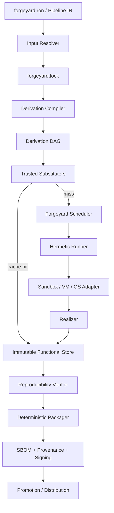

# Forgeyard Hermetic Build, Functional Packaging & Reproducible Distribution Architecture

**Document type:** System & Architecture  
**Project:** Forgeyard CI/CD  
**Subsystem:** Hermetic builds, functional package management, immutable package store, derivations, lock graphs, reproducible packaging, binary substitution, promotion, and distribution  
**Implementation direction:** Rust-first  
**Status:** Target architecture  
**Scope note:** This is a new subsystem document. It does not assume that `next.md`, or any other single Forgeyard architecture document, is the complete Forgeyard architecture.

---

# 1. Purpose

A CI/CD system is not reliable if a build succeeds because of invisible state on one machine.

The familiar symptom is:

> "It works on my machine."

The architectural causes are usually:

- mutable operating-system state;
- undeclared tools and SDKs;
- globally installed libraries;
- stale local caches;
- moving Git branches and tags;
- unpinned package repositories;
- changing download URLs;
- implicit environment variables;
- filesystem ordering;
- locale and timezone differences;
- timestamps;
- randomness;
- absolute build paths;
- UID/GID differences;
- hidden `/usr`, `/opt`, `$HOME`, registry, SDK, or PATH dependencies;
- arbitrary network access during builds;
- mutable CI runner images.

Forgeyard should therefore include a native **hermetic functional build and package subsystem**.

It should adopt the strongest architectural ideas demonstrated by Nix-style functional package management:

- package/build results are values rather than mutable installations;
- builds are represented by derivations;
- dependencies form explicit closures;
- store objects are immutable;
- identities are cryptographic;
- external inputs are locked;
- already built objects can be substituted from trusted caches;
- garbage collection follows reachability rather than "delete old directories".

Forgeyard should **not simply wrap Nix**. These ideas should be integrated directly with Forgeyard's:

- Pipeline IR;
- scheduler;
- runners;
- sandbox;
- CAS;
- toolchain manager;
- packaging;
- provenance;
- signing;
- release approvals;
- distribution;
- deployment;
- remote execution.

---

# 2. Central Architectural Rule

The ideal build is modeled as:

```text
output = f(all_declared_inputs)
```

not:

```text
output =
    f(
        declared_inputs,
        unknown_host_state,
        current_internet_state,
        current_wall_clock,
        random_machine_state
    )
```

A Forgeyard derivation is conceptually:

```text
D = H(
    schema_version,
    builder,
    arguments,
    source_inputs,
    build_inputs,
    runtime_inputs,
    toolchains,
    declared_environment,
    build_platform,
    host_platform,
    target_platform,
    sandbox_policy,
    network_policy,
    output_contract
)
```

`D` identifies **build intent and its declared input graph**.

After realization:

```text
O = H(canonical_output_tree)
```

`O` identifies **the actual result**.

Forgeyard MUST preserve both identities.

This distinction is critical:

```text
same derivation identity
    does not by itself prove
same output bytes
```

A builder can still embed time, randomness, pathnames, filesystem order, or other nondeterministic information.

Therefore Forgeyard's model is:

```text
locked inputs
    +
canonical derivation
    +
hermetic execution
    +
content-addressed realized output
    +
independent reproduction
    +
provenance
```

---

# 3. Goals

Forgeyard MUST make the following possible.

## 3.1 Rebuild anywhere

Given:

- project manifest;
- lock graph;
- source objects;
- dependency objects;
- toolchains;
- compatible platform;

another clean runner should be able to realize the same derivation.

## 3.2 No hidden runner state

A strict build may see only declared inputs and explicitly permitted platform interfaces.

## 3.3 Immutable package identity

Updating a package creates a new object. Existing objects never change.

## 3.4 Explicit dependency closures

Forgeyard knows which objects are required to:

- build;
- test;
- run;
- package;
- deploy.

## 3.5 Locked mutable sources

The production build cannot resolve `main`, `latest`, unbounded semver ranges, or mutable URLs during realization.

## 3.6 Measurable reproducibility

Forgeyard can answer:

```text
Was this artifact independently rebuilt?
How many times?
On which runners?
Did all output digests match?
If not, which files differed?
```

## 3.7 Efficient reuse

Functional purity must coexist with:

- local SSD stores;
- shared CAS;
- remote substitution;
- P2P transfer;
- closure-aware scheduling;
- deterministic action caching.

## 3.8 Build once, promote many

A release artifact is built once, verified, then promoted by digest.

---

# 4. Non-Goals

This subsystem is not intended to:

- implement the Nix language;
- require NixOS;
- replace Cargo/npm/Maven/Gradle/etc.;
- force every development build to be completely pure;
- pretend every ecosystem already produces deterministic bytes;
- require Linux-specific mechanisms on Windows/macOS;
- make OCI containers the only execution substrate.

Forgeyard creates a common reproducibility model across ecosystems.

---

# 5. Terminology

## Derivation

Canonical description of a build and all declared build inputs.

## Realization

One execution of a derivation.

## Store object

Immutable content in Forgeyard's functional store.

## Closure

Transitive set of store objects required by another object.

## Lock graph

Fully resolved immutable input graph.

## Substitution

Reusing a trusted existing realization instead of building it locally.

## Hermetic build

Build whose accessible inputs are restricted to declared inputs and controlled platform services.

## Deterministic build

Equivalent execution is expected to produce equivalent output.

## Reproducible build

Independent realizations have been compared and matched according to policy.

## Promotion

Changing release/channel/deployment references to an existing immutable artifact without rebuilding it.

---

# 6. Reproducibility Levels

```rust
pub enum ReproducibilityLevel {
    Impure,
    Declared,
    Hermetic,
    DeterministicExpected,
    Reproduced,
    MultiPartyReproduced,
}
```

Suggested meaning:

| Level | Meaning |
|---|---|
| `Impure` | Host/network state may affect output |
| `Declared` | Inputs declared, isolation incomplete |
| `Hermetic` | Undeclared filesystem/network state blocked |
| `DeterministicExpected` | Hermetic + deterministic-output policy |
| `Reproduced` | Independent realization matched |
| `MultiPartyReproduced` | Multiple independent realizations matched |

Release policy may require:

```text
local development       -> Declared
pull request CI         -> Hermetic
release candidate       -> DeterministicExpected
production release      -> Reproduced
high-assurance release  -> MultiPartyReproduced
```

---

# 7. New Logical Subsystem

Recommended capability name:

```text
Forgeyard Reproducible Build System (FRBS)
```

Suggested crates:

```text
forgeyard-derivation
forgeyard-lock
forgeyard-functional-store
forgeyard-hermetic
forgeyard-realizer
forgeyard-substituter
forgeyard-reproducibility
forgeyard-package
forgeyard-distribution
forgeyard-environment
forgeyard-platform
```

The exact crate count is not architectural truth; capability boundaries are.

---

# 8. High-Level Architecture



---

# 9. Relationship to Existing Forgeyard

The broader Forgeyard architecture already contains concepts such as:

```text
pipeline compiler
scheduler
runner
sandbox
CAS
toolchains
packaging
artifacts
policy
signing
provenance
deployment
```

This subsystem strengthens their contracts.

Old conceptual behavior:

```text
run commands on a compatible runner
```

Target:

```text
realize a declared derivation inside a controlled environment
```

Forgeyard may continue supporting imperative jobs, but their reproducibility status is explicit.

---

# 10. Derivation Domain Model

```rust
pub struct Derivation {
    pub schema: DerivationSchemaVersion,

    pub name: PackageName,
    pub version: PackageVersion,

    pub builder: BuilderRef,
    pub arguments: Vec<Argument>,

    pub source_inputs: Vec<SourceInput>,
    pub build_inputs: Vec<StoreRef>,
    pub runtime_inputs: Vec<StoreRef>,
    pub toolchains: Vec<ToolchainRef>,

    pub environment: BTreeMap<EnvName, EnvValue>,

    pub build_platform: BuildPlatform,
    pub host_platform: HostPlatform,
    pub target_platform: TargetPlatform,

    pub sandbox: SandboxPolicy,
    pub network: NetworkPolicy,

    pub outputs: Vec<OutputSpec>,
    pub normalization: NormalizationPolicy,
    pub reproducibility: ReproducibilityPolicy,
}
```

Hash-sensitive structures use canonical ordering.

---

# 11. Canonical Derivation Encoding

Never hash arbitrary in-memory Rust representations.

Use:

```text
Domain Derivation
      ↓
CanonicalDerivationV1
      ↓
deterministic binary encoding
      ↓
digest
```

The canonical form defines:

- schema version;
- field ordering;
- map ordering;
- string normalization;
- integer representation;
- optional-field behavior.

RON can remain the human-facing representation.

Postcard can be used internally if the Forgeyard canonical schema guarantees stable encoding.

---

# 12. Strong Identity Types

Use distinct newtypes:

```rust
pub struct DerivationId(Digest);
pub struct RealizationId(Uuid);
pub struct StoreObjectId(Digest);
pub struct LockGraphId(Digest);
pub struct SourceDigest(Digest);
pub struct OutputDigest(Digest);
pub struct PackageDigest(Digest);
pub struct ReleaseDigest(Digest);
```

Do not interchange them merely because they all contain hashes.

---

# 13. Hash Algorithms

Recommended:

```text
BLAKE3 -> native Forgeyard internal identity
SHA-256 -> ecosystem/interoperability identity
```

Digest includes algorithm:

```text
blake3:...
sha256:...
```

Forgeyard should support hash migration rather than assuming one algorithm forever.

---

# 14. Input Address vs Output Content Address

Forgeyard keeps:

```text
DerivationId -> build intent and declared inputs
OutputDigest -> actual bytes/tree
```

Why both?

## Input identity alone is insufficient

A build may embed current time:

```text
same D
run A -> O1
run B -> O2
O1 != O2
```

Forgeyard must expose the mismatch.

## Output identity alone is insufficient

`O` does not explain:

- source;
- toolchain;
- command;
- dependency graph;
- policy.

Derivation + provenance explain how the output arose.

---

# 15. Realization Mapping

```text
DerivationId
    │
    ├── Realization A -> OutputDigest X
    └── Realization B -> OutputDigest Y
```

If:

```text
X == Y
```

reproducibility is confirmed for those attempts.

If:

```text
X != Y
```

the result is quarantined according to policy.

Forgeyard MUST NOT silently overwrite the first mapping.

---

# 16. Functional Store

Logical namespace:

```text
/forgeyard/store/<algorithm>-<digest>-<human-name>
```

The physical path may differ by platform.

Store identity is logical and portable.

Store objects are immutable.

---

# 17. Store Invariants

After commit:

```text
object bytes: immutable
object references: immutable
content digest: immutable
semantic object identity: immutable
```

Mutable metadata may include:

```text
trust status
pin/root state
replication status
last-access metrics
promotion references
```

Trust state can change without changing object bytes.

---

# 18. Store Object Kinds

```rust
pub enum StoreObjectKind {
    SourceTree,
    Toolchain,
    BuildDependency,
    RuntimeDependency,
    BuildOutput,
    RuntimeClosure,
    DebugSymbols,
    TestFixture,
    Package,
    Sbom,
    Provenance,
    LockGraph,
    Derivation,
    ReproductionDiff,
}
```

The existing Forgeyard CAS stores bytes.

The functional store adds semantic metadata, relationships, roots, and generations.

---

# 19. Store Architecture

```text
                 Functional Store API
                         │
         ┌───────────────┼───────────────┐
         ▼               ▼               ▼
   metadata DB       local CAS       remote CAS
         │               │               │
         │               ├── SSD         ├── S3
         │               ├── site cache  ├── GCS
         │               └── iroh peer   └── Azure/MinIO
         │
         └──── object-reference graph
```

Do not create a second unrelated blob system.

---

# 20. Dependency Closures

For root object `A`:

```text
closure(A) =
    A
    ∪ direct_dependencies(A)
    ∪ transitive_dependencies(A)
```

CLI:

```text
forgeyard store closure <object>
forgeyard store graph <object>
forgeyard store why-depends <a> <b>
```

Closures support:

- deployment;
- air-gap export;
- GC;
- SBOM;
- vulnerability analysis;
- license analysis;
- runtime verification.

---

# 21. Build Inputs vs Runtime Inputs

Keep them separate.

Example:

```text
build inputs:
  rustc
  cargo
  pkg-config
  cmake

runtime inputs:
  libc
  openssl
```

This avoids shipping compilers and headers into production.

---

# 22. Multiple Outputs

A derivation can produce:

```text
out
dev
debug
docs
tests
```

Each output is independently content-addressed.

This avoids bloating runtime closures with headers/debug symbols.

---

# 23. Garbage Collection

GC is reachability-based.

Roots include:

```text
active pipeline runs
release manifests
deployment generations
user pins
development profiles
retention policies
compliance holds
```

Algorithm:

```text
roots
  ↓
mark transitive closures
  ↓
unreachable objects
  ↓
grace period
  ↓
sweep
```

Never delete an object just because it is "old".

---

# 24. Generations

Mutable environments point to immutable generations.

Example:

```text
production
  generation 41 -> release digest A

production
  generation 42 -> release digest B
```

Rollback:

```text
active generation 42 -> generation 41
```

No dependency re-resolution is required.

---

# 25. Project Manifest and Lock

Recommended:

```text
forgeyard.ron   -> human-authored intent
forgeyard.lock  -> machine-maintained immutable resolution
```

The lock graph is authoritative for CI/release realization.

---

# 26. Manifest vs Lock

Manifest may say:

```ron
rust: (
    channel: "stable",
),

source: Git(
    url: "https://example.invalid/project.git",
    rev: Branch("main"),
),
```

Resolver produces immutable lock data:

```text
rust stable
  -> rust 1.90.0
  -> manifest/content digests

branch main
  -> commit 4c920...
  -> tree digest blake3:...
```

Production builds never silently re-resolve `main`.

---

# 27. Lock Graph Model

```rust
pub struct LockGraph {
    pub schema: LockSchemaVersion,
    pub root: LockNodeId,
    pub nodes: BTreeMap<LockNodeId, LockedInput>,
}
```

Each locked input records:

```text
source kind
original request
resolved immutable identity
content digest
dependency edges
fetch metadata
signature/trust metadata
```

---

# 28. Supported Locked Inputs

Resolvers may support:

```text
Git
HTTP/HTTPS
OCI
Crates.io
npm
PyPI
Maven
NuGet
Go modules
Rust toolchains
Android SDK/NDK
JDKs
C/C++ toolchains
custom Forgeyard registry
local vendored sources
```

---

# 29. Git Locking

Unsafe production input:

```text
branch = main
tag = latest
```

Resolved lock:

```text
repository identity
commit SHA
tree/content digest
requested ref metadata
```

Forgeyard records both requested and resolved values for review.

---

# 30. HTTP Locking

Production HTTP inputs need:

```text
URL
expected digest
optional expected size
optional upstream signature
```

Mutable URL bytes changing later cause digest verification failure.

---

# 31. Ecosystem Lockfiles

Forgeyard complements rather than replaces:

```text
Cargo.lock
package-lock.json
pnpm-lock.yaml
yarn.lock
uv.lock
poetry.lock
go.sum
Gradle dependency locking
```

Forgeyard records the ecosystem lockfile digest and fetch closure.

---

# 32. Lock Workflow

```text
forgeyard lock
forgeyard lock update
forgeyard lock update <input>
forgeyard lock diff
```

CI/release default:

```text
forgeyard build --locked
```

Manifest-lock mismatch:

```text
FAIL
```

not silent rewrite.

---

# 33. Semantic Lock Diff

PR review should show:

```text
openssl 3.4.1 -> 3.5.0
source digest changed
2 transitive packages added
license changed
new vulnerability status
```

rather than only machine-generated textual noise.

---

# 34. Signed Lock Graphs

Enterprise policy may require an approved signed lock graph before production realization.

This turns dependency resolution into a reviewable supply-chain event.

---

# 35. Source Snapshots

A build receives an immutable source tree.

```text
working tree
  ↓
include/exclude rules
  ↓
canonical source tree
  ↓
digest
  ↓
SourceTree store object
```

The builder does not need access to developer Git internals.

---

# 36. Dirty Trees

Local development may allow dirty source.

Identity includes:

```text
base commit
dirty tree content digest
```

Release policy can deny dirty trees.

---

# 37. Two-Phase Network Model

Critical architecture:

```text
RESOLVE/FETCH
   network may be allowed
        ↓
immutable store objects
        ↓
REALIZE/BUILD
   network denied
```

This removes the mutable internet from strict build inputs.

---

# 38. Three-Phase Release Model

High-assurance release:

```text
resolve
  ↓
fetch and verify entire closure
  ↓
build completely offline
```

This is one of the strongest practical controls against hidden mutable dependencies.

---

# 39. Fixed-Output Fetches

Fetcher model:

```text
URL/source
+
expected content digest
      ↓
fetch
      ↓
hash
      ↓
match?
  ├── no -> reject
  └── yes -> immutable store object
```

Remote server changes cannot silently affect build output.

---

# 40. Hermetic Build Environment

A strict builder can see:

```text
declared source inputs
declared build dependencies
declared toolchains
controlled writable build directory
declared environment variables
explicit platform interfaces
```

It cannot see by default:

```text
host /usr
host /opt
host home
host package caches
SSH agent
Docker socket
host credentials
random host executables
```

---

# 41. Linux Sandbox Architecture

Preferred layers:

```text
namespaces
bubblewrap or equivalent
mount namespace
user namespace
PID namespace
network namespace
cgroup v2
seccomp
capability dropping
read-only store mounts
tmpfs/scratch build root
```

Optional eBPF improves enforcement/diagnostics.

eBPF is not required for core correctness.

---

# 42. Windows Hermeticity

Use Windows-native controls:

```text
Job Objects
restricted tokens
ACL-isolated workspace
controlled environment
explicit toolchain paths
firewall/network rules
AppContainer where suitable
VM runners for stronger isolation
```

Do not emulate Linux namespace assumptions.

---

# 43. macOS Hermeticity

Use:

```text
ephemeral workspaces
explicit Xcode/SDK identity
controlled environment
sandbox capabilities where practical
network policy
dedicated runner identities
```

Platform SDKs that cannot live in Forgeyard store become explicit platform-contract inputs.

---

# 44. VM-Based High-Assurance Builder

```text
derivation
  ↓
ephemeral VM image by identity
  ↓
Forgeyard agent
  ↓
read-only input closure
  ↓
build
  ↓
export outputs
  ↓
destroy VM
```

Suitable for high-trust release pools.

---

# 45. Deterministic Environment Synthesis

Forgeyard creates the build environment instead of inheriting it.

Example default:

```text
LANG=C.UTF-8
LC_ALL=C.UTF-8
TZ=UTC
HOME=/build/home
PATH=<declared store binaries only>
SOURCE_DATE_EPOCH=<stable value>
```

Host environment variables are scrubbed unless explicitly allowed.

---

# 46. Time

Wall-clock time is an impurity.

Use a stable build epoch when possible.

Example:

```text
SOURCE_DATE_EPOCH = source commit timestamp
```

or policy-defined epoch.

If real current time is genuinely required, declare impurity and reduce reproducibility status.

---

# 47. Randomness

Build randomness should be:

```text
disabled
or
seeded deterministically
or
explicitly declared
```

Possible deterministic seed:

```text
FORGEYARD_BUILD_SEED = H(DerivationId)
```

Do not generate release signing keys during reproducible build realization.

---

# 48. Locale and Timezone

Use controlled values:

```text
LANG=C.UTF-8
LC_ALL=C.UTF-8
TZ=UTC
```

unless the derivation declares alternatives.

---

# 49. Filesystem Ordering

Canonical store tree entries are sorted.

Builders should not rely on OS directory-enumeration order.

Reproducers can vary physical filesystems to detect hidden assumptions.

---

# 50. UID/GID and Modes

Package output should not inherit arbitrary host ownership.

Canonical package policy may use:

```text
uid = 0
gid = 0
```

or package-format-specific values.

Normalize file modes where semantics permit.

---

# 51. Timestamps

Canonical package writers normalize:

```text
mtime
archive timestamps
ZIP timestamps
tar headers
metadata fields
```

according to reproducibility policy.

---

# 52. Absolute Build Paths

Use stable virtual paths:

```text
/build/source
/build/work
```

and compiler remapping where available.

Rust example:

```text
--remap-path-prefix
```

C/C++ examples:

```text
-ffile-prefix-map
-fdebug-prefix-map
```

---

# 53. Toolchains as Immutable Inputs

Toolchains are store objects or explicit platform contracts.

Rust toolchain may include:

```text
rustc
cargo
rust-std targets
rustfmt
clippy
```

A builder must not accidentally use arbitrary host `cargo`.

---

# 54. Toolchain Bootstrapping

Every system eventually has a bootstrap trust root.

Forgeyard records:

```text
bootstrap source
digest
signature if available
provenance if available
```

Do not claim infinite purity.

Expose the trusted bootstrap boundary.

---

# 55. Platform Contract

Some inputs are platform services rather than store objects.

```rust
pub struct PlatformContract {
    pub os: Os,
    pub arch: Architecture,
    pub kernel_abi: Option<AbiConstraint>,
    pub cpu_features: CpuFeatureSet,
    pub system_sdk: Option<SdkIdentity>,
}
```

Scheduler must satisfy the contract.

---

# 56. Build / Host / Target Platforms

Use distinct types:

```rust
pub struct BuildPlatform(...);
pub struct HostPlatform(...);
pub struct TargetPlatform(...);
```

Example cross compile:

```text
build  = x86_64-linux
host   = x86_64-linux
target = aarch64-linux
```

---

# 57. Multi-Platform Derivations

Same package recipe produces different platform derivations:

```text
app-x86_64-linux
app-aarch64-linux
app-x86_64-windows
app-aarch64-darwin
```

Their output digests are expected to differ.

---

# 58. Universal Release Index

A release groups immutable platform artifacts:

```text
Forgeyard 1.0.0
├── linux-x86_64  -> digest A
├── linux-aarch64 -> digest B
├── windows-x86_64 -> digest C
└── macos-aarch64 -> digest D
```

The release index itself is immutable and signed.

---

# 59. Realizer

```rust
#[async_trait]
pub trait Realizer {
    async fn realize(
        &self,
        derivation: &ResolvedDerivation,
        context: RealizationContext,
    ) -> Result<Realization>;
}
```

Responsibilities:

1. validate schema;
2. verify lock graph;
3. verify/substitute inputs;
4. prepare sandbox;
5. synthesize environment;
6. execute builder;
7. validate output contract;
8. normalize outputs;
9. hash outputs;
10. atomically commit store objects;
11. emit provenance.

---

# 60. Build Phases

Generic model:

```text
fetch
unpack
patch
configure
build
check
install
fixup
package
```

Not every ecosystem uses all phases.

Structured phases improve policy and diagnostics.

---

# 61. Output Contract

Example:

```ron
outputs: [
    (
        name: "server",
        kind: Executable,
        path: "bin/server",
    ),
    (
        name: "assets",
        kind: Directory,
        path: "share/assets",
    ),
]
```

Undeclared outputs may be ignored, warned, or rejected according to policy.

---

# 62. Canonical Output Tree

Canonical entry representation includes:

```text
normalized path name
entry type
content digest
normalized executable bit
symlink target
```

It excludes irrelevant host metadata such as inode numbers.

---

# 63. Atomic Store Commit

```text
temporary output
  ↓
validate
  ↓
normalize
  ↓
hash
  ↓
fsync where needed
  ↓
atomic commit
```

Failed builds never leave partial data that looks valid.

---

# 64. Read-Only Inputs

Store inputs are mounted/read as immutable.

Possible optimizations:

```text
read-only bind mounts
reflinks
hard links where safe
overlay
CAS-backed filesystem
```

Builder never receives write permission to input objects.

---

# 65. Writable Workspace

Each realization receives a separate writable build area.

Outputs are imported into the store only after successful validation.

---

# 66. Reproducibility Verification

```text
Derivation D
  ├── Runner A -> Output X
  └── Runner B -> Output Y
```

If:

```text
X == Y
```

the derivation is reproduced.

If:

```text
X != Y
```

Forgeyard records mismatch and quarantines according to policy.

---

# 67. Reproducer Diversity

Policy may require:

```text
different runner IDs
different physical hosts
different runner pools
different regions
```

For high assurance, independent build infrastructure is preferable.

---

# 68. Reproducibility Policy

```rust
pub struct ReproducibilityPolicy {
    pub required_rebuilds: u8,
    pub require_distinct_hosts: bool,
    pub require_distinct_pools: bool,
    pub comparison: ComparisonMode,
}

pub enum ComparisonMode {
    BitForBit,
    NormalizedTree,
    Semantic,
}
```

Prefer bit-for-bit for release binaries when achievable.

---

# 69. Mismatch Diagnostics

Pipeline:

```text
output digest mismatch
  ↓
tree diff
  ↓
changed file list
  ↓
metadata diff
  ↓
binary/package classifier
```

Likely causes:

```text
timestamp
absolute path
archive order
random UUID
locale
toolchain nondeterminism
filesystem ordering
network-derived input
signature data
```

---

# 70. Reproduction Quarantine

Mismatch:

```text
artifact state = Quarantined
```

Default restrictions:

```text
no stable promotion
no production deployment
no "reproducible" attestation
```

until resolved or explicitly waived by policy.

---

# 71. Signed Outputs and Reproducibility

Split:

```text
reproducible unsigned artifact
    ↓
reproduction verified
    ↓
signing/notarization step
    ↓
distribution artifact
```

Signature timestamps or external notarization should not contaminate reproducibility of the core build.

---

# 72. Build Provenance

```rust
pub struct BuildProvenance {
    pub derivation_id: DerivationId,
    pub output_digests: Vec<OutputDigest>,
    pub runner_identity: RunnerIdentity,
    pub platform_identity: PlatformIdentity,
    pub lock_graph_digest: LockGraphId,
    pub source_digest: SourceDigest,
    pub toolchain_digests: Vec<Digest>,
    pub sandbox_policy_digest: Digest,
}
```

Timing can be included as provenance metadata without being a build input.

---

# 73. Binary Substitution

Before build:

```text
Derivation D
  ↓
query trusted substituters
  ├── found
  │    ↓
  │  fetch realization
  │    ↓
  │  verify signatures/digests
  │    ↓
  │  use
  │
  └── miss
       ↓
      build
```

This prevents purity from forcing a rebuild of every dependency on every machine.

---

# 74. Substituter Interface

```rust
#[async_trait]
pub trait Substituter {
    async fn find(
        &self,
        derivation: &DerivationId,
    ) -> Result<Vec<RemoteRealization>>;

    async fn fetch_object(
        &self,
        digest: &Digest,
    ) -> Result<ObjectReader>;
}
```

Transports:

```text
HTTP
S3/object store
Forgeyard QUIC
Iroh peer distribution
```

---

# 75. Cache Trust

Remote mapping:

```text
D -> O
```

must be authenticated.

Accept based on policy such as:

```text
trusted signed realization metadata
verified content-addressed output
trusted provenance
local reproduction
```

Never trust a cache solely because it is reachable.

---

# 76. Cache Poisoning Resistance

Every downloaded object is hashed before commit.

Substitution metadata is signed or otherwise authenticated.

A malicious mirror cannot silently change an object under the same digest.

---

# 77. Store vs Cache

Keep distinct:

```text
functional store:
  immutable objects and closure relationships

action/build cache:
  derivation/action key -> realizations

local mutable accelerator:
  disposable compiler/intermediate cache
```

A cache may be evicted.

A pinned release store object may not disappear merely because of cache pressure.

---

# 78. Scheduler Integration

Scheduler filters by hard constraints:

```text
build platform
target support
sandbox capability
trust tier
memory/CPU/disk
required SDK
reproducer separation policy
```

Then scores:

```text
input closure locality
toolchain locality
queue delay
resource headroom
cache affinity
network cost
```

---

# 79. Closure-Aware Scheduling

Example:

```text
Runner A already has 28 GiB of required 30 GiB closure
Runner B has 1 GiB
```

Prefer A if all hard constraints match.

This can make functional builds highly efficient.

---

# 80. Realization Lease

Lease includes:

```text
DerivationId
lock graph identity
expected input closure
sandbox policy
network policy
platform contract
```

Runner validates before acceptance.

---

# 81. Preflight

Before expensive realization:

```text
verify platform
verify sandbox capability
verify disk capacity
verify object availability
verify network policy
verify output capacity
```

Only then accept execution lease.

---

# 82. Concurrent Realization

Multiple machines may realize same derivation.

Correctness must tolerate this.

The store deduplicates identical outputs by digest.

Scheduler may single-flight ordinary builds while intentionally scheduling additional reproducer runs.

---

# 83. Developer Environment

Use the same lock/derivation model locally:

```text
forgeyard dev
```

Flow:

```text
forgeyard.ron
+
forgeyard.lock
   ↓
DevEnvironment derivation
   ↓
toolchain/dependency substitution
   ↓
controlled shell
```

This narrows developer-vs-CI drift.

---

# 84. Dev Shell Modes

```text
forgeyard dev
forgeyard dev --pure
```

Pure mode scrubs host environment except declared allowlist.

Convenient non-pure mode remains visibly classified as less reproducible.

---

# 85. Minimal Runner Philosophy

Do not depend on giant mutable CI images such as:

```text
ubuntu-runner-with-everything-installed
```

Prefer:

```text
minimal Forgeyard runner
+
sandbox runtime
+
content-addressed toolchains
+
project closure
```

This dramatically reduces runner-image drift.

---

# 86. Incremental Compilation

Mutable incremental caches are useful locally but risky as release inputs.

Policy:

```text
development -> incremental allowed
release -> clean realization by default
```

Any mutable acceleration cache is disposable and not part of trusted output identity unless explicitly modeled.

---

# 87. Cargo Integration

Rust derivation inputs include:

```text
source tree
Cargo.toml
Cargo.lock
Rust toolchain
target triple
native library closure
declared environment
build.rs behavior
```

Use:

```text
cargo build --locked
```

Strict build runs with registry/git sources already fetched.

---

# 88. Cargo Build Scripts

`build.rs` is arbitrary code.

It runs in the hermetic sandbox.

Attempts to:

```text
read unexpected /usr paths
download packages
invoke random host tools
```

are blocked or reported.

---

# 89. C/C++ Integration

Explicitly model:

```text
compiler
linker
sysroot
headers
libraries
cmake/meson/ninja
pkg-config metadata
target flags
```

Do not depend on `/usr/include` unless platform policy explicitly says so.

---

# 90. Java/Gradle Integration

Lock:

```text
JDK
Gradle wrapper
plugins
Maven/Gradle dependencies
repository source identities
```

Prefetch then build offline where ecosystem permits.

---

# 91. Node Integration

Require an ecosystem lockfile for production.

Prefetch packages.

Run build with network denied.

---

# 92. Python Integration

Lock:

```text
interpreter
wheels/sdists
native build dependencies
compiler inputs
```

Do not resolve arbitrary dependency ranges during realization.

---

# 93. Android Integration

Lock or explicitly identify:

```text
JDK
Gradle
Android SDK platform
build-tools
NDK
CMake if used
dependency closure
```

The Android SDK must not be merely "whatever exists on the runner".

---

# 94. Apple Integration

Explicitly identify:

```text
Xcode version
SDK build version
deployment target
architecture
```

Where licensing/technical constraints prevent packaging Xcode into Forgeyard store, treat it as a trusted platform input and record it in provenance.

---

# 95. Windows Integration

Explicit:

```text
MSVC toolset
Windows SDK
linker
runtime
PowerShell version where relevant
```

Do not use arbitrary installed Visual Studio state.

---

# 96. Runtime Linkage Verification

After build, inspect native binaries.

Linux:

```text
ELF interpreter
DT_NEEDED
RPATH/RUNPATH
```

Windows:

```text
PE imports
```

macOS:

```text
Mach-O load commands
```

Every dependency must belong to runtime closure or approved platform ABI.

---

# 97. Clean-Machine Verification

Command:

```text
forgeyard package verify-clean
```

Runs package in environment containing only:

```text
declared runtime closure
+
platform contract
```

This directly tests the "works outside the builder" guarantee.

---

# 98. Deterministic Packaging

Packaging is another derivation.

Input:

```text
immutable realized output
```

Output:

```text
immutable package digest
```

Package writer must use canonical ordering/metadata.

---

# 99. Supported Package Formats

Adapters may produce:

```text
tar.zst
zip
.deb
.rpm
APK
AAB
MSI
MSIX
OCI image
WASM bundle
static-site bundle
Forgeyard native bundle
```

Each adapter documents reproducibility limitations.

---

# 100. Deterministic TAR

Canonical policy:

```text
sorted paths
normalized UID/GID
normalized uname/gname
fixed mtime
stable PAX fields
normalized modes
deterministic compressor settings
```

---

# 101. Deterministic ZIP

Normalize:

```text
entry ordering
timestamps
permissions
extra fields
compression parameters
```

---

# 102. OCI Images

Release derivations must not depend on mutable base tags.

Bad:

```text
ubuntu:latest
```

Acceptable:

```text
base image digest = sha256:...
```

Better where feasible:

```text
construct root filesystem directly from immutable runtime closure
```

---

# 103. Forgeyard Native Bundle

Potential extension:

```text
.fypkg
```

Contains or references:

```text
package manifest
root object digest
runtime closure
SBOM
provenance
signatures
```

Modes:

```text
thin -> references remote immutable objects
fat  -> embeds full closure for offline transfer
```

---

# 104. Package Manifest

```rust
pub struct PackageManifest {
    pub name: PackageName,
    pub version: PackageVersion,
    pub target: TargetPlatform,
    pub root: StoreRef,
    pub runtime_closure: Vec<StoreRef>,
    pub sbom: Option<StoreRef>,
    pub provenance: StoreRef,
}
```

Manifest itself is immutable and content-addressed.

---

# 105. Build Once, Promote Many

Hard invariant:

```text
BUILD ONCE
VERIFY
PROMOTE SAME BYTES
```

Never:

```text
build dev
rebuild staging
rebuild production
```

Instead:

```text
build digest X
test X
reproduce X
approve X
stage X
deploy X
```

---

# 106. Distribution Channels

Channels are mutable references to immutable release manifests.

Example:

```text
nightly
beta
stable
production
```

```text
stable -> ReleaseDigest A
```

Promotion changes reference to B.

A and B remain unchanged.

---

# 107. Environment Promotion

```text
artifact X
  ├── development
  ├── test
  ├── staging
  └── production
```

All use identical software bytes.

Runtime config/secrets are injected separately.

---

# 108. Runtime Configuration Separation

Package:

```text
immutable software
```

Deployment supplies:

```text
environment configuration
secrets
service endpoints
deployment policy
```

Do not rebuild binaries merely to change production configuration.

---

# 109. Promotion State Machine

```text
Built
  ↓
Tested
  ↓
ReproducibilityVerified
  ↓
SecurityApproved
  ↓
Signed
  ↓
Published
  ↓
Promoted
```

All transitions reference immutable artifact/release digests.

---

# 110. Rollback

Rollback changes generation/reference:

```text
production -> release B
```

to:

```text
production -> release A
```

No dependency solving or rebuild in the rollback critical path.

---

# 111. Distribution Architecture

```text
Origin immutable store
   ├── region mirror A
   ├── region mirror B
   ├── site CAS
   └── iroh peer cache
```

All transports deliver bytes identified by digest.

Trust derives from digest/signature/provenance, not mirror hostname alone.

---

# 112. Iroh P2P Role

Iroh is a transfer accelerator.

```text
need digest X
  ↓
discover peer with X
  ↓
fetch
  ↓
verify X
```

It is not the source of truth for package identity.

---

# 113. Air-Gapped Build

```text
forgeyard bundle inputs
```

creates a closure containing:

```text
lock graph
source objects
toolchains
dependencies
derivation objects
signatures
```

Disconnected builder:

```text
forgeyard build --offline
```

---

# 114. Air-Gapped Distribution

Export release:

```text
release manifest
runtime closure
SBOM
provenance
signatures
```

into a portable Forgeyard bundle.

Offline importer verifies before activation.

---

# 115. Source Mirrors

Resolver can mirror immutable upstream inputs into organization storage.

Release policy may require:

```text
production builds fetch only from approved internal mirrors
```

The lock still uses content identity.

---

# 116. Input Trust

```rust
pub enum InputTrust {
    Unverified,
    DigestVerified,
    SignatureVerified,
    OrganizationApproved,
    Revoked,
}
```

Immutability does not imply safety.

A malicious package can be perfectly immutable.

Trust and identity remain separate.

---

# 117. Dependency Policy

Before realization:

```text
lock graph
  ↓
source trust
  ↓
license policy
  ↓
vulnerability policy
  ↓
derivation
```

Policy evidence is attached to provenance.

---

# 118. SBOM From the Resolved Closure

Prefer generating SBOM from known locked dependency metadata and closure.

Binary analysis can supplement it.

This gives Forgeyard strong knowledge of:

```text
name
version
source
digest
dependency relationship
```

---

# 119. Historical Rebuildability

A historical release is rebuildable if Forgeyard preserves:

```text
manifest
lock graph
source closure
toolchain closure
derivation graph
platform contract
```

Upstream registries can disappear without destroying build identity.

---

# 120. Long-Term Archive

For important releases preserve:

```text
source closure
toolchain closure
derivations
lock graph
release objects
SBOM
provenance
signatures
```

Cold object storage can retain these.

---

# 121. Persistence Model

Suggested metadata tables:

```text
derivations
derivation_inputs
realizations
realization_outputs
reproduction_attempts
reproduction_diffs
store_objects
store_references
store_roots
lock_graphs
profiles
generations
promotions
substituter_records
```

Large bytes remain in CAS.

---

# 122. Store Roots and Profiles

Profiles are mutable references over immutable objects.

Example:

```text
profile: developer
generation: 17
closure: digest X
```

Updating tools creates generation 18.

Rollback restores 17.

---

# 123. Impurity Auditing

Command:

```text
forgeyard build --audit-impurity
```

Diagnostic mode observes:

```text
unexpected filesystem access
unexpected process lookup
unexpected network access
host environment leakage
```

On Linux, possible mechanisms include sandbox-denial logs and optional eBPF/fanotify/ptrace-style diagnostics.

---

# 124. Purity Migration

Projects can migrate gradually:

```text
Audit
  ↓
Warn
  ↓
Enforce filesystem isolation
  ↓
Enforce network isolation
  ↓
Reproduce release outputs
```

This makes the architecture practical for existing codebases.

---

# 125. Example Hermeticity Violation

```text
Hermeticity violation

process:
  cmake

attempted path:
  /usr/bin/pkg-config

reason:
  undeclared executable

suggestion:
  declare pkg-config as a build input
```

---

# 126. Example Network Violation

```text
Hermeticity violation

process:
  cargo

attempted:
  crates.io:443

likely cause:
  source closure was not prefetched

suggestion:
  forgeyard fetch --all
```

---

# 127. Controlled Impurity

Some builds need exceptions.

```rust
pub enum Impurity {
    Network(NetworkAllowance),
    Clock(ClockAllowance),
    HostPath(ApprovedHostPath),
    Hardware(DeviceRequirement),
}
```

Controlled impurity is better than hidden impurity.

Release policy can reject it.

---

# 128. Secrets

Default:

```text
secrets in reproducible build = denied
```

Prefer:

```text
reproducible build
  ↓
verified output
  ↓
signing step with secret
```

If a secret genuinely affects output, reproducibility semantics must state that explicitly.

---

# 129. Private Dependencies

Fetcher may use credentials.

Credential is not build identity.

Fetched source digest is.

Private source object becomes an authenticated immutable store object.

---

# 130. Multi-Tenant Store

Authorization remains tenant-scoped even if physical storage internally deduplicates identical content.

Do not expose cross-tenant existence information if policy considers that a side channel.

---

# 131. Store Corruption Repair

If local digest verification fails:

```text
mark local copy corrupt
  ↓
fetch trusted replica
  ↓
verify digest
  ↓
replace physical copy
```

Logical object identity is unchanged.

---

# 132. Replication Policy

Object state may be:

```text
local-only
site-replicated
region-replicated
durable-object-store
archived
```

Release gate can require minimum durability before promotion.

---

# 133. Reproducibility vs Availability

These are separate dimensions.

A reproducible artifact with zero durable replicas is still operationally unsafe.

Policy can require:

```text
reproduction_count >= 1
and
durable_replica_count >= 2
```

---

# 134. Rebuild Campaigns

If toolchain digest X is compromised:

```text
reverse dependency query
  ↓
all derivations using X
  ↓
resolve replacement Y
  ↓
create new derivations
  ↓
rebuild
```

No need to inspect which machines happened to have toolchain X installed.

---

# 135. Revocation

Immutable objects are never silently replaced.

Instead:

```text
digest X -> Revoked
```

Policy blocks future trusted use.

Historical builds remain auditable.

---

# 136. Runtime Dependency Verification

Package validator ensures all runtime references are either:

```text
in declared closure
or
approved platform ABI
```

A package that builds but depends on random machine libraries fails validation before release.

---

# 137. Integration Tests With Services

If tests require a database:

```text
PostgreSQL package/image digest
schema fixture digest
seed digest
```

Service is ephemeral; inputs are immutable.

Live third-party API tests are classified non-hermetic and attached as evidence rather than affecting package identity.

---

# 138. Device Testing

Separate:

```text
build derivation
```

from:

```text
device test action
```

A physical Android/iOS device is not part of a reproducible binary derivation.

Its test result is release evidence.

---

# 139. Hardware-Specific Builds

If compilation uses:

```text
-march=native
```

CPU feature set becomes a declared platform input.

Prefer explicit target features for portable release builds.

---

# 140. Reproducibility Stress Testing

Optional verifier can vary:

```text
physical host
filesystem
wall-clock time
host timezone
host environment
physical build directory
```

while keeping declared derivation inputs identical.

Differences expose hidden impurity.

---

# 141. File-System Diversity

Example:

```text
ext4
xfs
btrfs
```

If output changes, project depends on undeclared filesystem behavior.

This is useful for high-assurance release verification.

---

# 142. Deterministic Compression

Package derivation fixes:

```text
algorithm
compression level
dictionary
thread behavior where relevant
metadata
```

Parallel compression must be tested for deterministic output.

---

# 143. Release Manifest

```rust
pub struct ReleaseManifest {
    pub version: Version,
    pub artifacts: BTreeMap<TargetPlatform, PackageDigest>,
    pub sboms: BTreeMap<TargetPlatform, Digest>,
    pub provenance: BTreeMap<TargetPlatform, Digest>,
}
```

Sign the manifest digest.

---

# 144. Stable Download URLs

Human URL:

```text
/releases/1.0.0/linux-x86_64
```

resolves to immutable digest object.

Also expose digest-addressed retrieval for verification.

---

# 145. Update System

Client updater:

```text
fetch signed channel/release metadata
  ↓
verify signature
  ↓
select platform artifact
  ↓
verify digest
  ↓
download
  ↓
atomic install/switch
```

Never trust filename/version string alone.

---

# 146. Native Forgeyard CLI

Recommended commands:

```text
forgeyard lock
forgeyard lock update
forgeyard lock diff
forgeyard fetch
forgeyard derive
forgeyard realize
forgeyard build
forgeyard build --locked
forgeyard build --offline
forgeyard build --audit-impurity
forgeyard reproduce
forgeyard diff
forgeyard dev
forgeyard store closure
forgeyard store graph
forgeyard store why-depends
forgeyard store verify
forgeyard store gc
forgeyard substitute
forgeyard package
forgeyard package verify-clean
forgeyard promote
forgeyard rollback
forgeyard bundle inputs
forgeyard bundle release
```

---

# 147. `forgeyard derive`

Displays build identity without executing.

Example:

```text
Derivation: blake3:...
Source: blake3:...
Lock: blake3:...
Toolchains:
  rustc -> blake3:...
Build platform: x86_64-linux
Target: x86_64-linux
Network: denied
Hermeticity: strict
```

---

# 148. `forgeyard explain rebuild`

Shows why identity changed.

Example:

```text
Previous derivation:
  blake3:A

Current:
  blake3:B

Reason:
  Cargo.lock digest changed

Old:
  sha256:X

New:
  sha256:Y
```

---

# 149. Dioxus UI

New views:

```text
Derivation detail
Lock graph
Input closure
Store browser
Reproducibility status
Reproducer comparison
Hermeticity violations
Package closure
Promotion history
Distribution mirrors
```

---

# 150. Reproducibility UI

Show:

```text
Derivation ID
Source digest
Lock digest
Input count / bytes
Toolchains
Build platform
Sandbox policy
Network policy
Primary output digest
Independent rebuilds
Match/mismatch
SBOM
Provenance
Signature
Promotion state
```

---

# 151. "Why Rebuild?" UI

When cache miss occurs, explain exactly which derivation inputs changed.

This prevents functional package management from becoming opaque.

---

# 152. Policy Extensions

New policy controls:

```text
require_lock_file
require_clean_source
deny_build_network
require_hermetic
require_content_addressed_output
require_reproducibility_count
require_distinct_rebuilder
require_signed_substituter
require_sbom
require_provenance
deny_untrusted_input
deny_revoked_input
deny_promotion_rebuild
```

---

# 153. Failure Types

```rust
pub enum FunctionalBuildError {
    LockMismatch,
    MissingInput,
    DigestMismatch,
    UntrustedInput,
    HermeticityViolation,
    PlatformMismatch,
    BuildFailure,
    OutputContractViolation,
    ReproductionMismatch,
    SubstitutionTrustFailure,
    StoreCorruption,
}
```

---

# 154. Idempotency

Natural identities make operations idempotent:

```text
resolve(manifest_digest)
fetch(object_digest)
realize(derivation_id)
package(package_derivation_id)
promote(release_digest, channel)
```

Retries do not create semantically different outputs.

---

# 155. Crash Safety

Temporary realization is never considered valid until atomic commit.

After agent restart:

```text
reconcile lease
scan temporary workspace
verify committed objects
remove abandoned temporary data after grace period
```

---

# 156. Cancellation

Cancellation:

```text
stop builder process tree
discard uncommitted temporary output
retain already committed immutable inputs
```

No partial store object is published.

---

# 157. Backpressure

Bound:

```text
fetch concurrency
CAS transfers
decompression
store commit concurrency
build logs
reproduction queue
```

Functional store does not justify unbounded I/O.

---

# 158. Performance Strategy

Optimize in this order:

```text
avoid work
substitute
reuse closure
schedule for locality
deduplicate
reflink/mount
parallelize dependency DAG
compress transport
then optimize kernel I/O
```

Do not weaken hermeticity merely for benchmark speed.

---

# 159. Multi-Level Store

```text
L0 metadata cache
L1 runner SSD
L2 site/LAN CAS
L3 regional object storage
L4 archival storage
```

All expose the same immutable logical identities.

---

# 160. Predictive Prefetch

Existing Forgeyard predictive caching can prefetch likely closures.

Incorrect prediction may waste bandwidth but cannot alter build correctness.

---

# 161. Metrics

Suggested:

```text
forgeyard_derivation_realizations_total
forgeyard_substitution_hits_total
forgeyard_substitution_misses_total
forgeyard_store_bytes
forgeyard_store_gc_bytes_total
forgeyard_reproduction_matches_total
forgeyard_reproduction_mismatches_total
forgeyard_hermeticity_violations_total
forgeyard_lock_updates_total
forgeyard_input_fetch_bytes_total
forgeyard_package_promotions_total
```

---

# 162. Tracing

Trace lifecycle:

```text
resolve
fetch
verify
compile derivation
query substituter
materialize closure
create sandbox
build
normalize
hash
commit
reproduce
package
sign
promote
```

---

# 163. Audit Events

Examples:

```text
LockUpdated
LockApproved
UntrustedInputAllowed
ImpurityAllowed
ReproductionMismatch
SubstituterTrustChanged
StoreRootRemoved
GarbageCollectionRun
ReleasePromoted
ReleaseRolledBack
```

---

# 164. Reproduction Mismatch Is Security-Relevant

A mismatch may indicate:

- accidental nondeterminism;
- hidden host input;
- compromised runner;
- malicious cache;
- compromised compiler/toolchain.

Production release mismatches should create high-severity audit/security events.

---

# 165. Workspace Architecture

```text
crates/
├── forgeyard-derivation/
│   └── src/
│       ├── canonical.rs
│       ├── digest.rs
│       ├── graph.rs
│       ├── model.rs
│       └── validate.rs
│
├── forgeyard-lock/
│   └── src/
│       ├── graph.rs
│       ├── diff.rs
│       ├── git.rs
│       ├── http.rs
│       ├── cargo.rs
│       └── toolchain.rs
│
├── forgeyard-functional-store/
│   └── src/
│       ├── object.rs
│       ├── closure.rs
│       ├── root.rs
│       ├── generation.rs
│       ├── gc.rs
│       └── verify.rs
│
├── forgeyard-hermetic/
│   └── src/
│       ├── environment.rs
│       ├── network.rs
│       ├── linux.rs
│       ├── windows.rs
│       ├── macos.rs
│       └── impurity.rs
│
├── forgeyard-realizer/
│   └── src/
│       ├── phases.rs
│       ├── substitute.rs
│       ├── materialize.rs
│       ├── output.rs
│       └── commit.rs
│
├── forgeyard-reproducibility/
│   └── src/
│       ├── compare.rs
│       ├── scheduler.rs
│       ├── diagnostics.rs
│       └── attestation.rs
│
├── forgeyard-package/
│   └── src/
│       ├── manifest.rs
│       ├── tar.rs
│       ├── zip.rs
│       ├── deb.rs
│       ├── oci.rs
│       └── native_bundle.rs
│
└── forgeyard-distribution/
    └── src/
        ├── release.rs
        ├── channel.rs
        ├── promotion.rs
        ├── mirror.rs
        ├── update.rs
        └── airgap.rs
```

---

# 166. Dependency Direction

```text
model/digest
   ↓
lock
   ↓
derivation
   ↓
functional-store
   ↓
hermetic
   ↓
realizer
   ↓
reproducibility
   ↓
package
   ↓
distribution
```

Cross-cutting integrations:

```text
forgeyard-cas
forgeyard-scheduler
forgeyard-runner
forgeyard-policy
forgeyard-signing
forgeyard-provenance
forgeyard-telemetry
```

---

# 167. Key Traits

## Input resolver

```rust
#[async_trait]
pub trait InputResolver {
    type Request;
    type Locked;

    async fn resolve(
        &self,
        request: &Self::Request,
        policy: &ResolutionPolicy,
    ) -> Result<Self::Locked, ResolveError>;
}
```

## Functional store

```rust
#[async_trait]
pub trait FunctionalStore {
    async fn has(&self, digest: &Digest) -> Result<bool>;
    async fn open(&self, digest: &Digest) -> Result<ObjectReader>;
    async fn closure(&self, root: &StoreObjectId) -> Result<Closure>;
    async fn add_root(&self, root: RootRef) -> Result<()>;
}
```

## Realizer

```rust
#[async_trait]
pub trait Realizer {
    async fn realize(
        &self,
        derivation: &ResolvedDerivation,
        context: &RealizationContext,
    ) -> Result<Realization>;
}
```

## Substituter

```rust
#[async_trait]
pub trait Substituter {
    async fn find(
        &self,
        derivation: &DerivationId,
    ) -> Result<Vec<RemoteRealization>>;

    async fn fetch(
        &self,
        digest: &Digest,
    ) -> Result<ObjectReader>;
}
```

---

# 168. Native Protocol Additions

QUIC/Postcard messages may include:

```text
QueryRealization
RealizationAvailable
RealizationMissing
RealizeDerivation
InputClosureManifest
StoreObjectNeeded
StoreObjectAvailable
RealizationStarted
RealizationCompleted
ReproductionRequest
ReproductionResult
HermeticityViolation
```

Bulk content remains streamed through CAS/data-plane protocols.

---

# 169. API Additions

Potential endpoints:

```text
/api/v1/locks
/api/v1/derivations
/api/v1/realizations
/api/v1/store
/api/v1/reproducibility
/api/v1/substituters
/api/v1/packages
/api/v1/releases
/api/v1/promotions
```

---

# 170. Standalone Deployment

```text
Forgeyard local
  ├── resolver
  ├── lock graph
  ├── derivation compiler
  ├── local scheduler
  ├── hermetic realizer
  ├── local immutable store
  ├── package builder
  └── local distribution/export
```

No remote server required.

This preserves Forgeyard's local-first model.

---

# 171. Distributed Deployment

```text
                       Forgeyard daemon
               ┌──────────────────────────┐
               │ Derivation / Lock /      │
               │ Scheduler / Policy       │
               └────────────┬─────────────┘
                            │
                  QUIC + Postcard
                            │
         ┌──────────────────┼──────────────────┐
         ▼                  ▼                  ▼
   Hermetic Runner A   Hermetic Runner B   Rebuilder Pool
         │                  │                  │
         └────────┬─────────┴─────────┬────────┘
                  ▼                   ▼
              Site CAS           Durable CAS
```

---

# 172. Enterprise Additions

```text
PostgreSQL/Neon metadata
OIDC/RBAC
multi-region CAS
signed substituters
independent rebuilder pools
release policy
retention/compliance
transparency log integration
air-gapped mirrors
```

The build semantics do not change.

---

# 173. Nix Interoperability

Forgeyard can optionally support:

```text
Nix input resolver
Nix store import/export
Nix derivation adapter
Nix-based Linux toolchain provider
```

But native Forgeyard derivations remain independent.

---

# 174. Why Forgeyard Should Not Simply Require Nix

Forgeyard targets:

```text
Linux
Windows
macOS
Android
possibly iOS build orchestration
WASM/web
distributed runner fleets
native Dioxus UI
Forgeyard provenance/release policy
```

Nix interoperability is valuable, but mandatory Nix installation would unnecessarily bind Forgeyard's entire execution architecture to one package manager/runtime.

---

# 175. Lessons Adopted From Functional Package Management

Forgeyard should adopt:

```text
immutable package values
derivations
dependency closures
locked inputs
cryptographic store identity
substitution
generation switching
reachability GC
```

Forgeyard extends these with:

```text
independent output hashing
reproducibility verification
cross-platform execution
runner scheduling
release promotion
CI policy
supply-chain attestations
```

---

# 176. Implementation Phase 1 — Identity Foundation

Implement:

```text
Digest types
CanonicalDerivationV1
StoreObjectV1
OutputTreeV1
LockGraphV1
```

Exit criterion:

```text
same canonical logical object hashes identically across supported implementations
```

---

# 177. Phase 2 — Immutable Local Store

Implement:

```text
CAS-backed object commit
closure graph
roots
generations
verification
GC
```

Exit:

corrupt bytes are detected and live roots survive GC.

---

# 178. Phase 3 — Locking and Fetching

Start with:

```text
Git
HTTP
Cargo/Rust toolchain
```

Exit:

a Rust project can build offline after `forgeyard fetch`.

---

# 179. Phase 4 — Linux Hermetic Realizer

Implement:

```text
read-only inputs
clean environment
network denial
namespace sandbox
stable build root
output canonicalization
```

Exit:

removing host-installed compilers/libraries does not affect the reference build.

---

# 180. Phase 5 — Substitution

Implement:

```text
realization index
signed cache metadata
remote CAS transfer
trust policy
```

Exit:

fresh runner can obtain full dependency closure without rebuilding it.

---

# 181. Phase 6 — Reproducibility Verification

Implement:

```text
independent rebuild scheduling
content comparison
tree diff
quarantine
attestation
```

Exit:

intentionally timestamp-dependent sample build is detected as non-reproducible.

---

# 182. Phase 7 — Deterministic Packaging

Implement:

```text
tar.zst
zip
Linux package adapter
package manifest
release manifest
```

Exit:

two independent packaging runs match for reference projects.

---

# 183. Phase 8 — Promotion and Distribution

Implement:

```text
channels
signed release metadata
mirror distribution
build-once-promote
rollback generations
```

Exit:

same digest moves from test to staging to production.

---

# 184. Phase 9 — Windows

Implement:

```text
Windows toolchain locking
controlled environment
sandbox/isolation adapter
runtime closure validation
```

---

# 185. Phase 10 — Android

Implement:

```text
JDK lock
Gradle lock
SDK/NDK identity
deterministic unsigned package pipeline
separate signing
```

---

# 186. Phase 11 — macOS / Apple

Implement:

```text
Xcode/SDK platform identity
dedicated macOS runners
controlled workspace
reproducible unsigned core where possible
separate signing/notarization
```

---

# 187. Phase 12 — Independent Enterprise Rebuilders

Implement:

```text
separate rebuilder pools
cross-region verification
required reproduction count
transparency integration
```

---

# 188. Acceptance Tests

## Host compiler test

Remove host compiler.

Build still succeeds.

## PATH test

Randomize host PATH.

Output unchanged.

## Timezone test

Runner A UTC, Runner B IST.

Output unchanged.

## Wall-clock test

Build on another day.

Output unchanged.

## Offline test

Build succeeds after fetch with network disabled.

## Mutable URL test

Remote bytes change.

Digest verification fails.

## Clean-machine test

Same derivation succeeds on two clean machines.

## Timestamp injection test

Reproducer detects mismatch.

## Cache poisoning test

Forged realization/object rejected.

## Promotion test

Production receives exact staging digest.

---

# 189. Production Readiness Gates

Do not call this subsystem production-ready until:

```text
canonical hash test vectors exist
lock schema has compatibility policy
offline builds work
network denial is enforced
host-state leakage tests pass
substitution trust works
store corruption detection works
GC cannot remove live releases
independent reproduction works
deterministic package tests pass
rollback works through immutable generations
```

---

# 190. Architectural Invariants

1. Production realization never resolves mutable dependency versions.
2. Committed store objects are immutable.
3. Builders cannot modify input store objects.
4. Strict builds cannot see undeclared host filesystem state.
5. Strict builds cannot access network unless policy explicitly permits it.
6. Every realized output is content-hashed.
7. Forgeyard never hides multiple different outputs for the same derivation.
8. Promotion never rebuilds an artifact.
9. Secrets do not affect reproducible build outputs by default.
10. Remote substitutions are verified before trust.
11. Runtime dependencies are closure-validated.
12. Lock graph used by a release is preserved by digest.
13. CI runner image is not the project dependency environment.
14. P2P improves transport but never defines artifact identity.
15. Kubernetes/containers are execution adapters, not reproducibility semantics.

---

# 191. Recommended Release Policy

```ron
(
    release: (
        locked_inputs: Required,
        dirty_source: Denied,
        build_network: Denied,
        hermeticity: Required,

        reproducibility: (
            rebuilds: 1,
            distinct_host: true,
            comparison: BitForBit,
        ),

        runtime_closure_validation: Required,
        sbom: Required,
        provenance: Required,
        signing: Required,
        promotion_rebuild: Denied,
    ),
)
```

---

# 192. Example Package Derivation

```ron
(
    name: "forgeyard",
    version: "1.0.0",

    source: Locked("project-source"),

    toolchains: [
        Locked("rust-toolchain"),
    ],

    build_inputs: [
        Locked("openssl"),
    ],

    builder: Cargo(
        args: [
            "build",
            "--release",
            "--locked",
        ],
    ),

    environment: {
        "TZ": "UTC",
        "LANG": "C.UTF-8",
    },

    sandbox: Hermetic,
    network: Denied,

    outputs: [
        Executable("target/release/forgeyard"),
    ],
)
```

---

# 193. Example `forgeyard.lock` Concept

```ron
(
    schema: 1,

    nodes: {
        "rust": (
            kind: RustToolchain,
            requested: "stable",
            resolved_version: "1.90.0",
            manifest_digest: "sha256:...",
        ),

        "project-source": (
            kind: Git,
            repository: "https://example.invalid/forgeyard.git",
            requested: "main",
            revision: "0123456789abcdef...",
            tree_digest: "blake3:...",
        ),
    },
)
```

The production schema should be frozen only after canonical serialization and compatibility rules are tested.

---

# 194. End-to-End Build and Release Flow

```text
Developer changes source
      ↓
forgeyard lock --check
      ↓
source snapshot
      ↓
immutable lock graph
      ↓
derivation graph
      ↓
input trust/policy
      ↓
substituter lookup
      ↓
fetch missing immutable inputs
      ↓
runner selected
      ↓
read-only closure materialized
      ↓
deterministic environment synthesized
      ↓
network isolated
      ↓
builder executes
      ↓
output contract validated
      ↓
output normalized
      ↓
content digest calculated
      ↓
atomic store commit
      ↓
tests against immutable output
      ↓
independent reproduction
      ├── mismatch -> quarantine + diagnostics
      └── match
             ↓
deterministic package derivation
             ↓
runtime closure validation
             ↓
SBOM + provenance
             ↓
signing
             ↓
release manifest
             ↓
promotion by digest
             ↓
regional/P2P/object-store distribution
             ↓
deployment of exact artifact
```

---

# 195. The "Works on My Machine" Guarantee

Forgeyard should not claim that identical source text alone guarantees identical output.

Instead it should provide a much stronger statement:

> A release was built from a cryptographically identified source and locked dependency closure, with explicitly identified toolchains and platform requirements, inside a controlled build environment with undeclared host state and network access blocked; the resulting output was content-addressed and independently reproduced before the exact same bytes were promoted for distribution.

That is a defensible CI/CD architecture.

---

# 196. Source-Inspired Design Notes

The subsystem deliberately adopts several documented Nix ideas as inspiration:

- Nix treats packages in a purely functional style rather than as mutable global installations.
- Nix derivations represent build dependency information.
- Store objects are identified through cryptographic addressing schemes.
- Existing realizations can be substituted rather than rebuilt.
- Flake lock files pin external inputs for repeatable evaluation.

Forgeyard extends these ideas with:

- explicit derivation-vs-realization separation;
- content hashing of actual outputs;
- independent reproducibility verification;
- cross-platform platform contracts;
- CI runner scheduling;
- deterministic packaging;
- build-once/promote-many distribution;
- native Forgeyard provenance and release policy.

---

# 197. Final Architectural Position

The catastrophic mutable-state problem is not solved merely by:

```text
Docker
a fixed compiler image
a lockfile
a cache
```

Each helps, but each solves only part of the problem.

The complete Forgeyard chain should be:

```text
Declarative intent
      ↓
Immutable locked inputs
      ↓
Canonical derivation
      ↓
Hermetic realization
      ↓
Content-addressed output
      ↓
Independent reproduction
      ↓
Deterministic package
      ↓
Runtime closure validation
      ↓
SBOM + provenance
      ↓
Signature
      ↓
Promotion of identical bytes
      ↓
Digest-addressed distribution
```

The important question is no longer:

> "Which machine built this successfully?"

It becomes:

> "Which exact immutable derivation produced this exact content, from which locked closure and toolchains, under which enforced execution policy, and did an independent builder reproduce it?"

That is the architecture Forgeyard needs if reproducibility and elimination of "works on my machine" failures are foundational product requirements rather than optional CI conveniences.

---

# References

The following primary Nix documentation informed the design principles in this document:

1. Nix Reference Manual — introduction to the purely functional package-management model.
2. Nix Reference Manual — derivations and build-time dependency representation.
3. Nix Reference Manual — store/content-addressing behavior.
4. Nix Reference Manual — flake locking and pinned input resolution.
5. Nix Reference Manual glossary — derivations, store objects, references, and binary caches.

Forgeyard's proposed design is its own architecture and is not intended to claim wire, language, or store-format compatibility with Nix unless an explicit interoperability adapter is implemented.
