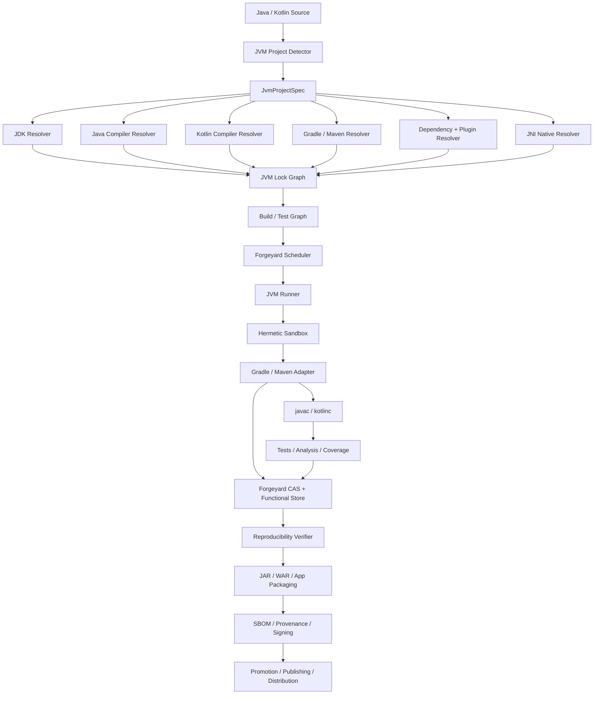

# Forgeyard Java + Kotlin JVM CI/CD System & Architecture

**Document type:** Dedicated language ecosystem System & Architecture  
**Project:** Forgeyard CI/CD  
**Subsystem:** First-class Java and Kotlin JVM build, test, analysis, packaging, reproducibility, dependency resolution, publishing, distribution, and release integration  
**Implementation direction:** Rust-first Forgeyard core with native integration to the JVM ecosystem  
**Status:** Target production architecture  
**Relationship to Forgeyard:** This document defines the dedicated Java/Kotlin JVM subsystem that integrates with Forgeyard's pipeline IR, hermetic build system, scheduler, runners, CAS, functional store, provenance, packaging, distribution, and deployment architecture.

---

# 1. Purpose

Java and Kotlin belong in one dedicated JVM ecosystem architecture because they share:

- JDK/JVM runtime;
- JVM bytecode;
- JAR/WAR packaging;
- Maven repositories;
- Gradle/Maven dependency resolution;
- test infrastructure;
- annotation processing;
- JVM target compatibility;
- module/classpath semantics.

However, Forgeyard MUST preserve language-specific differences such as:

- `javac` behavior;
- Kotlin compiler identity;
- Kotlin JVM target;
- Kotlin compiler plugins;
- KAPT;
- KSP;
- mixed Java/Kotlin compilation ordering;
- Kotlin metadata;
- Kotlin stdlib selection;
- Kotlin/JVM plugin versions.

The central rule is:

> **A Forgeyard Java/Kotlin build is defined by source + JDK + compiler frontends + JVM target + dependency graph + build tool + plugins/processors + configuration + controlled environment.**

---

# 2. Architectural Objectives

Forgeyard JVM MUST:

1. support Java as a first-class language;
2. support Kotlin/JVM as a first-class language;
3. support mixed Java/Kotlin projects;
4. support JDK toolchains explicitly;
5. support Maven;
6. support Gradle;
7. support Gradle Wrapper;
8. support Maven Wrapper;
9. support Gradle dependency locking;
10. support Maven dependency-resolution locking through Forgeyard's outer lock;
11. support Maven Central and private repositories;
12. support plugin repositories;
13. support offline builds after fetch;
14. support JAR, WAR, ZIP/TAR application bundles;
15. support reproducible JARs;
16. support multi-module Maven builds;
17. support Gradle multi-project builds;
18. support annotation processors;
19. support KAPT;
20. support KSP;
21. support Kotlin compiler plugins;
22. support Java annotation processors;
23. support JUnit;
24. support TestNG;
25. support Kotest;
26. support static analysis;
27. support SpotBugs/Checkstyle/PMD adapters;
28. support Detekt/Ktlint adapters;
29. support code coverage;
30. support JaCoCo;
31. support JNI/native libraries through Forgeyard C/C++;
32. support JVM test matrices;
33. support JPMS/module-path projects;
34. support toolchains and bytecode compatibility;
35. support deterministic publishing;
36. support SBOM/provenance;
37. support remote execution and cache;
38. explain rebuilds/cache misses;
39. remain local-first.

---

# 3. Non-Goals

Forgeyard does not replace:

- the JDK;
- `javac`;
- the Kotlin compiler;
- Gradle;
- Maven;
- JUnit;
- KSP;
- KAPT;
- JVM package repositories.

Forgeyard locks, isolates, orchestrates, verifies, caches, packages, and distributes their results.

---

# 4. High-Level Architecture



---

# 5. Suggested Forgeyard Workspace

```text
crates/
├── forgeyard-jvm/
├── forgeyard-jvm-model/
├── forgeyard-jvm-detect/
├── forgeyard-jvm-jdk/
├── forgeyard-jvm-java/
├── forgeyard-jvm-kotlin/
├── forgeyard-jvm-gradle/
├── forgeyard-jvm-maven/
├── forgeyard-jvm-lock/
├── forgeyard-jvm-deps/
├── forgeyard-jvm-plugins/
├── forgeyard-jvm-annotation-processing/
├── forgeyard-jvm-kapt/
├── forgeyard-jvm-ksp/
├── forgeyard-jvm-test/
├── forgeyard-jvm-analysis/
├── forgeyard-jvm-coverage/
├── forgeyard-jvm-jni/
├── forgeyard-jvm-package/
├── forgeyard-jvm-publish/
└── forgeyard-jvm-provenance/
```

---

# 6. Core Domain Model

```rust
pub struct JvmProjectSpec {
    pub source: SourceRef,

    pub languages: JvmLanguageSet,
    pub jdk: JdkRequest,
    pub java: Option<JavaCompilerSpec>,
    pub kotlin: Option<KotlinCompilerSpec>,

    pub build_tool: JvmBuildToolSpec,
    pub dependencies: JvmDependencyPolicy,
    pub plugins: JvmPluginPolicy,

    pub target: JvmTargetSpec,
    pub native: JniPolicy,

    pub testing: JvmTestPolicy,
    pub analysis: JvmAnalysisPolicy,
    pub reproducibility: ReproducibilityPolicy,
}
```

---

# 7. Strong Types

```rust
pub enum JvmLanguage {
    Java,
    Kotlin,
}

pub enum JvmBuildTool {
    Gradle,
    Maven,
}

pub struct JdkId(Digest);
pub struct JavaCompilerId(Digest);
pub struct KotlinCompilerId(Digest);
pub struct JvmDependencyGraphId(Digest);
pub struct JvmTargetVersion(u16);
```

---

# 8. Project Detection

Detect:

```text
pom.xml
mvnw
.mvn/
build.gradle
build.gradle.kts
settings.gradle
settings.gradle.kts
gradlew
gradle/wrapper/
gradle.lockfile
libs.versions.toml
src/main/java
src/main/kotlin
src/test/java
src/test/kotlin
module-info.java
```

Explicit Forgeyard configuration remains authoritative.

---

# 9. Detection Result

```rust
pub struct JvmDetection {
    pub languages: BTreeSet<JvmLanguage>,
    pub build_tool: Option<DetectedJvmBuildTool>,
    pub modules: Vec<JvmModule>,
    pub kotlin: bool,
    pub java_modules: bool,
    pub native_jni_risk: DetectionState,
}
```

---

# 10. JDK Identity

A JDK is more than:

```text
java -version
```

Identity includes:

```text
java
javac
jar
jlink
jmod
jdeps
javadoc
standard modules
runtime image
vendor/build identity
platform
architecture
```

Logical:

```text
JdkId = H(JDK closure)
```

---

# 11. JDK Vendor

Forgeyard may support:

```text
OpenJDK builds
Temurin
Microsoft Build of OpenJDK
Oracle JDK where licensing permits
Amazon Corretto
other approved JDKs
```

Vendor distribution identity is explicit.

---

# 12. JDK Trust

```rust
pub enum JdkTrust {
    Unverified,
    DigestVerified,
    VendorVerified,
    OrganizationApproved,
    Revoked,
}
```

---

# 13. JDK Modes

```rust
pub enum JdkMode {
    LockedManaged,
    PlatformProvided,
    AuditedHost,
}
```

Preferred:

```text
LockedManaged
```

---

# 14. Java Compiler Identity

Typically `javac` comes from the JDK.

Still represent:

```text
JDK ID
javac binary
compiler flags
release/source/target policy
annotation processors
```

---

# 15. Java Target Compatibility

Prefer explicit compatibility model:

```rust
pub struct JavaCompileTarget {
    pub release: Option<JvmTargetVersion>,
    pub source: Option<JvmTargetVersion>,
    pub target: Option<JvmTargetVersion>,
}
```

Forgeyard should prefer the JDK's supported release-target mechanism when appropriate because it constrains compilation against the public API of the selected Java release rather than merely changing emitted bytecode.

---

# 16. `--release`

When configured:

```text
javac --release N
```

becomes part of derivation identity.

This prevents accidental compilation against newer JDK APIs while targeting older bytecode.

---

# 17. Kotlin Compiler Identity

Kotlin/JVM must separately identify:

```text
Kotlin compiler version
Kotlin Gradle plugin / Maven plugin
compiler implementation/distribution
stdlib version
compiler plugins
jvmTarget
languageVersion
apiVersion
free compiler args/options
```

---

# 18. Kotlin Compiler Model

```rust
pub struct KotlinCompilerSpec {
    pub compiler: KotlinCompilerId,
    pub jvm_target: JvmTargetVersion,
    pub language_version: Option<KotlinLanguageVersion>,
    pub api_version: Option<KotlinApiVersion>,
    pub plugins: Vec<KotlinCompilerPlugin>,
    pub options: KotlinCompilerOptions,
}
```

---

# 19. Kotlin JVM Target

`jvmTarget` is explicit.

It affects generated bytecode compatibility and stdlib/plugin behavior.

Do not infer it from the host JDK.

---

# 20. Mixed Java + Kotlin

Mixed compilation requires a coordinated graph.

Typical conceptual order:

```text
source/config
  ↓
generated sources/processors
  ↓
Kotlin/Java compilation tasks
  ↓
classes
  ↓
resources
  ↓
JAR
```

Exact task ordering remains build-tool/plugin controlled.

Forgeyard should not reimplement Gradle/Maven compiler task semantics.

---

# 21. Kotlin Standard Library

The Kotlin stdlib version is explicit dependency input.

Do not assume compiler and stdlib are always the same version unless build tooling guarantees it.

---

# 22. Kotlin Compiler Plugins

Examples:

```text
serialization
all-open
no-arg
SAM-with-receiver
Compose compiler where applicable
custom compiler plugins
```

Each plugin binary/version/configuration is part of derivation identity.

---

# 23. KAPT

KAPT executes annotation processors through Kotlin tooling.

Treat as arbitrary build-time code.

Inputs:

```text
Kotlin compiler
KAPT implementation/plugin
processor classpath
processor options
source
```

Generated source becomes explicit build output/input.

---

# 24. KSP

KSP is separate from KAPT.

Identity includes:

```text
KSP version
Kotlin version compatibility
processor artifacts
processor options
source
```

Generated files are explicit outputs.

---

# 25. Java Annotation Processing

`javac` can run annotation processors.

Processor artifacts and options are locked build inputs.

Processors execute inside the hermetic sandbox.

---

# 26. Generated Source

Generated code should be:

```text
generated deterministically during build
or
committed and verified
```

Generators/processors must not access hidden host/network state.

---

# 27. Gradle

Gradle is first-class.

Identity includes:

```text
Gradle distribution
Gradle Wrapper metadata
settings scripts
build scripts
init policy
plugins
version catalogs
dependency locks
toolchain configuration
```

---

# 28. Gradle Wrapper

Preferred build entrypoint:

```text
./gradlew
```

but Forgeyard verifies the wrapper distribution identity rather than trusting the wrapper download dynamically.

---

# 29. Gradle Distribution

Resolution:

```text
wrapper properties
  ↓
distribution URL/version
  ↓
fetch stage
  ↓
digest verification
  ↓
Forgeyard store object
```

Strict build uses the stored distribution offline.

---

# 30. Gradle Dependency Locking

Forgeyard supports Gradle dependency locking and records lock state as part of build inputs.

However:

> Gradle's lock is not the complete Forgeyard lock.

Forgeyard additionally locks:

```text
repository/source identities
plugin artifacts
Gradle distribution
JDK
Kotlin plugin/compiler
native tools
```

---

# 31. Gradle Version Catalogs

Track:

```text
gradle/libs.versions.toml
```

and any additional catalogs.

Catalog changes participate in dependency/build identity.

---

# 32. Gradle Plugins

Plugin artifacts are dependencies too.

Resolve/fetch them before strict build.

Do not allow uncontrolled plugin portal/network access during realization.

---

# 33. Gradle Repositories

Policy controls:

```text
Maven Central
Gradle Plugin Portal
Google repository
private Maven repositories
organization mirrors
```

Repository order and content filters can affect resolution and must be controlled.

---

# 34. Gradle Init Scripts

Host/global init scripts are dangerous ambient state.

Strict mode ignores:

```text
~/.gradle/init.gradle
~/.gradle/init.d/*
```

unless explicitly supplied as Forgeyard inputs.

---

# 35. Gradle User Home

Use isolated:

```text
GRADLE_USER_HOME
```

Do not inherit arbitrary user Gradle state.

---

# 36. Gradle Caches

Gradle caches are acceleration only.

Forgeyard can prewarm them but dependency/artifact identity comes from immutable lock/store state.

---

# 37. Gradle Configuration Cache

Treat as mutable acceleration keyed by:

```text
Gradle version
JDK
build scripts
plugins
environment/config inputs
```

Never as source of truth.

---

# 38. Gradle Build Cache

Can integrate with:

```text
local Gradle cache
Forgeyard remote action/cache backend
```

but cache-hit correctness must remain governed by Gradle task inputs plus Forgeyard environment identity.

---

# 39. Gradle Daemon

In strict CI:

```text
ephemeral daemon
or
controlled daemon namespace
```

Do not share unbounded daemon state across unrelated derivations.

---

# 40. Maven

Maven is first-class.

Identity includes:

```text
Maven distribution
Maven Wrapper
pom.xml hierarchy
settings policy
plugins
dependencies
repositories
profiles
properties
JDK
```

---

# 41. Maven Wrapper

Resolve wrapper distribution in fetch phase.

Strict build does not download Maven from network.

---

# 42. Maven Local Repository

Use isolated:

```text
maven.repo.local
```

backed/prewarmed by Forgeyard immutable artifact store.

Do not use arbitrary `~/.m2/repository` as dependency truth.

---

# 43. Maven Settings

User/global `settings.xml` can alter repositories, mirrors, profiles, credentials.

Strict mode uses synthesized/approved settings.

Project-provided settings become explicit inputs.

---

# 44. Maven Plugins

Build plugins are executable dependency inputs.

They must be resolved/fetched/locked like ordinary dependencies.

---

# 45. Maven Profiles

Active profiles can radically change build behavior.

Forgeyard records:

```text
explicit profiles
profile activation inputs
properties
platform/JDK activation
```

Avoid ambient profile activation surprises.

---

# 46. Maven Reproducibility

Forgeyard should configure Maven projects toward reproducible archive output and then independently rebuild/compare actual artifacts.

The Forgeyard verifier is the final authority for whether a release was actually reproduced.

---

# 47. Dependency Resolver Architecture

```text
build definition
  ↓
Maven/Gradle semantic resolution
  ↓
resolved dependency graph
  ↓
immutable artifact digests
  ↓
JvmDependencyGraphId
```

---

# 48. Semantic Authority

Important rule:

> Forgeyard must not reimplement Maven or Gradle dependency semantics in Rust.

Use the locked build tool/JDK to compute ecosystem semantics.

Forgeyard persists, locks, verifies, and policies the result.

---

# 49. Maven Coordinates

Model:

```text
group
artifact
version
classifier
extension/type
repository source
content digest
```

---

# 50. Gradle Component Identity

Preserve relevant:

```text
module
version
variant
attributes
capabilities
artifact digest
```

Gradle variant-aware resolution must not be flattened into Maven-only coordinates.

---

# 51. Dynamic Versions

Production policy should reject unresolved:

```text
latest.release
latest.integration
1.+
dynamic ranges without locked result
SNAPSHOT without immutable repository identity
```

unless resolved into an immutable outer Forgeyard lock.

---

# 52. SNAPSHOT Dependencies

SNAPSHOT repositories are mutable by convention.

Forgeyard must resolve artifact bytes into immutable digests.

Release policy should generally deny uncontrolled SNAPSHOT dependencies.

---

# 53. Dependency Fetch

```text
resolve
  ↓
fetch dependency/plugin artifacts
  ↓
verify
  ↓
store immutably
  ↓
build offline
```

---

# 54. Repository Credentials

Credentials are fetch-stage secrets.

Never place them in build output or provenance plaintext.

---

# 55. Private Maven Repositories

Supported through controlled resolver.

Repository identity is explicit.

---

# 56. Dependency Verification

Where Gradle/Maven support checksums/signatures/verification metadata, integrate them.

Forgeyard additionally hashes all artifacts in its store.

---

# 57. Dependency Confusion

Flag:

```text
unexpected repository
group ownership/source change
private/public collision
artifact source change
plugin source change
```

---

# 58. Lock Diff

Example:

```text
org.example:lib 2.1 -> 2.2
3 transitive artifacts changed
1 Gradle plugin changed
Kotlin stdlib changed
new annotation processor introduced
```

---

# 59. Hermetic JVM Build

Visible:

```text
/source
/build
locked JDK
locked Gradle/Maven
locked dependency/plugin repository materialization
controlled caches
native toolchains when required
```

Hidden:

```text
developer ~/.gradle
developer ~/.m2
system Maven/Gradle
ambient JAVA_HOME
random JDK
host credentials
```

---

# 60. Environment Synthesis

Forgeyard controls:

```text
JAVA_HOME
PATH
GRADLE_USER_HOME
MAVEN_OPTS
JAVA_TOOL_OPTIONS
JDK_JAVA_OPTIONS
JDK_JAVAC_OPTIONS
HOME
TMPDIR
TZ
LANG
```

plus project-approved build variables.

---

# 61. `JAVA_TOOL_OPTIONS`

Do not inherit host value in strict mode.

It can silently inject JVM arguments.

---

# 62. `JDK_JAVA_OPTIONS`

Do not inherit ambient value.

---

# 63. `JDK_JAVAC_OPTIONS`

Do not inherit ambient value.

It can alter compiler invocation.

---

# 64. Locale / Timezone

Default:

```text
LANG=C.UTF-8
TZ=UTC
```

where compatible with project behavior.

---

# 65. File Encoding

Explicitly control source/resource encoding where build tool supports it.

Do not depend on host default charset.

---

# 66. Java Bytecode Target

A Java release artifact must clearly record:

```text
compiler JDK
release/source/target policy
classfile version
runtime minimum
```

---

# 67. Classfile Validation

Forgeyard can inspect classfile major versions to verify output matches declared target.

---

# 68. Kotlin Bytecode Validation

Inspect generated classfile versions and Kotlin metadata where practical.

---

# 69. JPMS

For modular projects support:

```text
module-info.java
module path
jmod
jlink
jdeps
```

---

# 70. Classpath vs Module Path

These are distinct dependency/runtime models.

Forgeyard records which one each build uses.

---

# 71. Automatic Modules

Warn when unstable automatic module naming could affect JPMS deployments.

---

# 72. `jlink`

A jlink runtime image is a separate package derivation.

Inputs:

```text
JDK
module graph
jlink options
application modules
```

Output is immutable runtime image.

---

# 73. `jdeps`

Use for:

```text
runtime module analysis
JDK module dependency inspection
jlink planning
```

---

# 74. JAR Packaging

JAR is ZIP-based.

Deterministic JAR policy must normalize:

```text
entry order
timestamps
manifest generation
file modes/metadata where relevant
```

---

# 75. Manifest

`META-INF/MANIFEST.MF` content/order/line formatting must be deterministic.

---

# 76. Reproducible JAR Verification

Forgeyard never assumes build-tool configuration succeeded.

It rebuilds and compares actual artifacts.

---

# 77. Sources JAR

Treat as separate output.

---

# 78. Javadoc JAR

Treat as separate output.

Javadoc generation can contain timestamps/version-sensitive output; reproducibility policy applies separately.

---

# 79. WAR

WAR is another deterministic archive derivation.

Runtime/container requirements are explicit.

---

# 80. Fat / Uber JAR

Examples:

```text
Shadow JAR
Maven Shade
framework executable JAR
```

Plugin version/config becomes part of derivation identity.

---

# 81. Service Files

When combining JARs, deterministic handling of:

```text
META-INF/services/*
```

is required.

---

# 82. Signed JARs

Signing should occur after reproducible unsigned artifact verification when possible.

Signature timestamp behavior may make signed bytes intentionally different from unsigned reproducible core.

---

# 83. Java Resources

Resource processing is explicit.

Filtering properties/environment values that affect resource bytes are derivation inputs.

---

# 84. Build-Time Version Injection

Avoid wall-clock timestamp injection.

Recommended:

```text
version
source commit
release channel
```

from immutable release metadata.

---

# 85. Annotation Processors

Examples:

```text
Lombok
Dagger
MapStruct
AutoValue
custom processors
```

All are executable build dependencies.

---

# 86. Annotation Processor Isolation

Processor classpath is explicit.

Do not allow processors to pull arbitrary network dependencies at compile time.

---

# 87. Generated Source Verification

Optionally:

```text
generate
  ↓
compare committed outputs
```

for projects that check generated code into source.

---

# 88. Kotlin Serialization

Kotlin serialization compiler plugin version/config is explicit.

---

# 89. Compose Compiler

If used in JVM desktop/Android contexts, compiler plugin version and Kotlin compatibility are explicit.

Do not treat it as an ordinary runtime library only.

---

# 90. Testing

First-class:

```text
JUnit 5
JUnit 4
TestNG
Kotest
Gradle test tasks
Maven Surefire/Failsafe
```

---

# 91. Test Plan

```rust
pub struct JvmTestPlan {
    pub engines: Vec<JvmTestEngine>,
    pub modules: Vec<JvmModule>,
    pub shards: u32,
    pub coverage: CoveragePolicy,
    pub timeout: Duration,
}
```

---

# 92. Unit vs Integration Tests

Separate:

```text
unit
integration
functional
end-to-end
```

to support different infrastructure and retry policies.

---

# 93. Test Sharding

Shard by:

```text
module
class
package
historical duration
```

according to framework semantics.

---

# 94. Test JVM Identity

Tests run under an explicit JDK/runtime.

Testing on multiple runtime JDKs can verify compatibility independently from compilation JDK.

---

# 95. Compile JDK vs Runtime JDK

Example:

```text
compile with JDK 21 --release 17
test on JDK 17
test additionally on JDK 21
```

These are distinct test environments.

---

# 96. JUnit

JUnit engine/version is dependency input.

Forgeyard normalizes XML/structured results into generic test model.

---

# 97. Kotest

Treat as Kotlin-specific test framework adapter layered on generic JVM testing.

---

# 98. Test Reports

Preserve:

```text
suite
class
test
status
duration
stdout/stderr
failure
```

---

# 99. Flaky Tests

Retries are recorded.

Do not erase the initial failure when retry passes.

---

# 100. Coverage

First-class:

```text
JaCoCo
```

and compatible adapters.

Coverage data is evidence, not artifact identity.

---

# 101. JaCoCo Identity

Record:

```text
agent/tool version
JDK
test task
source/class mapping
```

---

# 102. Coverage Aggregation

Normalize module/source paths.

Merge only compatible execution data.

---

# 103. Java Static Analysis

Adapters:

```text
SpotBugs
Checkstyle
PMD
Error Prone
custom analyzers
```

---

# 104. Kotlin Analysis

Adapters:

```text
Detekt
ktlint
Kotlin compiler warnings
custom analyzers
```

---

# 105. Error Prone

If used, compiler/plugin/JDK compatibility is explicit.

---

# 106. Analysis Baseline

Support:

```text
full strict
new issues only
baseline suppression
```

---

# 107. Formatting

Verification adapters:

```text
Spotless
google-java-format
ktlint
ktfmt
```

CI should report diffs rather than silently mutate source.

---

# 108. API Compatibility

Optional library release gate:

```text
binary API diff
source API diff
Kotlin API metadata diff
```

through dedicated adapters.

---

# 109. Binary Compatibility

For Java/Kotlin libraries, ABI/API compatibility is distinct from reproducible build equality.

Forgeyard should represent both separately.

---

# 110. JNI

JNI introduces native dependencies.

A JNI build becomes:

```text
JVM derivation
+
C/C++ toolchain
+
native sysroot
+
native runtime closure
```

---

# 111. JNI Integration

Delegate native compilation/linkage to Forgeyard C/C++ subsystem.

---

# 112. JNI Runtime Validation

Validate:

```text
.so
.dll
.dylib
```

runtime closure before package/release.

---

# 113. JNI Platform Matrix

Native artifacts require:

```text
OS
architecture
libc where relevant
JDK/JNI headers
native toolchain
```

---

# 114. Gradle Native Tasks

If Gradle invokes native compilers, Forgeyard still requires explicit native toolchain identity.

Gradle being hermetic does not automatically make native compilation hermetic.

---

# 115. Maven Native Plugins

Same rule.

---

# 116. Build Cache Layers

```text
Gradle cache
Maven local repository
Kotlin incremental cache
javac/Kotlin outputs
Forgeyard action cache
Forgeyard CAS
```

Different semantics, separate trust.

---

# 117. Kotlin Incremental Compilation

Mutable acceleration.

Key by:

```text
Kotlin compiler
JDK
source graph
classpath
plugins
options
```

Release can force clean compilation for reproducibility verification.

---

# 118. Gradle Incremental Compilation

Treat as optimization.

A clean release reproduction remains the strongest check.

---

# 119. Maven Incremental Behavior

Do not rely on stale target directories.

Release builds use clean isolated build directories.

---

# 120. Hermetic Build Directory

Each derivation receives fresh:

```text
/build
```

No accidental reuse of old `target/` or `build/` state.

---

# 121. Dependency Cache Materialization

Forgeyard can populate:

```text
Gradle cache/repository
Maven local repository
```

from immutable store objects.

---

# 122. Offline Mode

Strict release uses build-tool offline behavior where practical after Forgeyard fetch completes.

If the build tries to reach the network:

```text
sandbox violation
```

---

# 123. Repository Mirrors

Enterprise:

```text
Maven Central
Gradle Plugin Portal
Google/private repos
   ↓
Forgeyard resolver/mirror
   ↓
immutable organization artifact store
```

---

# 124. Air-Gapped Build

Bundle:

```text
JDK
Gradle/Maven distribution
dependencies
plugins
Kotlin compiler/plugin artifacts
annotation processors
JNI/native toolchains
source
lock graph
```

then build/test offline.

---

# 125. Multi-Module Maven

Model Maven reactor graph.

```text
parent
  ↓
modules
  ↓
inter-module dependencies
  ↓
build/test/package
```

---

# 126. Gradle Multi-Project

Model:

```text
settings graph
included builds
subprojects
composite builds
task graph
```

without flattening semantics.

---

# 127. Composite Builds

Included builds are source inputs and separate graph nodes.

---

# 128. Gradle Task Graph

Forgeyard can consume task graph metadata for:

```text
scheduling
cache explanation
affected-task computation
```

but Gradle remains semantic authority.

---

# 129. Maven Lifecycle

Map common phases:

```text
validate
compile
test
package
verify
install
deploy
```

into Forgeyard stages where appropriate.

---

# 130. Publish vs Build

Maven/Gradle publishing is a separate controlled effect.

Never rebuild artifacts during publishing.

---

# 131. Maven Publishing

Flow:

```text
verified JAR/POM/module metadata
  ↓
approval
  ↓
publish exact artifacts
```

---

# 132. Gradle Publishing

Same principle for `maven-publish` and related workflows.

---

# 133. POM Validation

Validate:

```text
groupId
artifactId
version
dependencies
licenses
SCM metadata
repository metadata
```

---

# 134. Gradle Module Metadata

If published, treat it as immutable release metadata.

---

# 135. SNAPSHOT Publishing

Keep development snapshots separate from immutable releases.

Production release channels should prefer immutable versions.

---

# 136. Reproducibility

Same derivation:

```text
Runner A -> JAR X
Runner B -> JAR Y
```

require actual content equality according to policy.

---

# 137. Common JVM Nondeterminism

Potential sources:

```text
ZIP entry timestamps
unordered archive entries
manifest timestamps
generated metadata
Javadoc timestamps
build host paths
annotation processors
KAPT/KSP generated order
native JNI linker output
environment-dependent resource filtering
```

---

# 138. Reproducer

Independent runner uses:

```text
same JDK
same Gradle/Maven
same dependency/plugin closure
same compiler/plugin versions
same target
same controlled environment
```

---

# 139. Reproduction Mismatch

Quarantine release.

Inspect:

```text
JAR entry metadata
class files
manifests
generated sources
resource files
Kotlin metadata
native libraries
```

---

# 140. Class-Level Diff

Forgeyard can compare:

```text
archive
entry list
classfile hashes
resources
metadata
```

to localize mismatch.

---

# 141. Bytecode Inspection

Use JDK tooling/adapters to inspect:

```text
classfile version
module descriptor
constant pool metadata where useful
```

---

# 142. Build Once, Promote Many

```text
source
  ↓
artifact X
  ↓
test X
  ↓
reproduce X
  ↓
publish/stage X
  ↓
production X
```

---

# 143. Application Packaging

Potential:

```text
JAR
fat JAR
WAR
distribution ZIP/TAR
jlink image
OCI image
native launcher bundle
Forgeyard bundle
```

---

# 144. Runtime Closure

For ordinary JVM apps:

```text
application JARs
dependency JARs
JRE/JDK requirement
configuration
```

For jlink:

```text
custom runtime image
+
application
```

---

# 145. OCI

Use immutable base-image digests.

Prefer copying prebuilt verified JAR/distribution into image rather than rebuilding in environment-specific Docker stages.

---

# 146. Runtime Configuration

Separate:

```text
application binaries
```

from:

```text
runtime properties
secrets
endpoints
JVM runtime options
```

---

# 147. Build-Time Properties

Properties that affect generated bytes are explicit derivation inputs.

---

# 148. Secrets

Secrets should not be used by compilation/package steps by default.

Repository credentials are fetch/publish secrets only.

---

# 149. SBOM

Generate from:

```text
resolved dependency graph
plugin/build dependency graph where appropriate
runtime closure
JNI/native closure
```

---

# 150. Provenance

Record:

```text
source digest
JDK ID
javac target/release
Kotlin compiler ID
Kotlin jvmTarget
Gradle/Maven ID
dependency graph
plugin graph
annotation processors/KSP/KAPT
JNI toolchain if present
output digest
runner
sandbox policy
```

---

# 151. Scheduler Capabilities

```rust
pub struct JvmRunnerCapabilities {
    pub jdks: Vec<JdkId>,
    pub gradle: Vec<GradleId>,
    pub maven: Vec<MavenId>,
    pub platforms: Vec<JvmPlatform>,
    pub native_toolchains: Vec<CppToolchainId>,
    pub sandbox: SandboxCapabilities,
}
```

---

# 152. Scheduler Hard Constraints

Filter by:

```text
JDK
OS/arch
JNI requirement
test runtime JDK
native toolchain
trust tier
memory
```

---

# 153. Scheduler Scoring

Score:

```text
dependency cache locality
JDK locality
Gradle/Maven locality
Kotlin compiler locality
queue delay
resource headroom
```

---

# 154. Runner Prewarming

Prefetch:

```text
JDKs
Gradle distributions
Maven distributions
common dependencies/plugins
Kotlin compiler/plugin closure
```

---

# 155. JVM Memory Scheduling

Gradle/Maven/Kotlin compilers can consume substantial memory.

Scheduler accounts for:

```text
daemon heap
compiler workers
test JVM forks
parallel modules
```

---

# 156. Adaptive Parallelism

Do not combine:

```text
many Forgeyard jobs
+
Gradle parallelism
+
test forks
+
Kotlin workers
```

without resource coordination.

---

# 157. Test Runtime Pools

Specialized pools may advertise:

```text
JDK 17
JDK 21
JDK 25
```

or other supported runtimes.

---

# 158. Change Impact

Use:

```text
Gradle/Maven module graph
source-set/package changes
reverse module dependencies
```

to reduce work.

Fallback to safe superset if uncertain.

---

# 159. Remote Execution

Good boundaries:

```text
module build
Gradle task groups
Maven module stages
test shards
analysis shards
```

Do not reimplement javac/kotlinc internals to chase artificial fine-grained remote compilation.

---

# 160. Gradle Build Cache Integration

Forgeyard may expose a trusted remote build cache backend.

Cache isolation must include project/tenant/trust policy.

---

# 161. Maven Cache Strategy

Maven's local repository is mainly dependency materialization.

Forgeyard's own action/CAS layers provide distributed artifact reuse.

---

# 162. Dioxus UI

Dedicated JVM panels:

```text
JDK
Java target
Kotlin compiler
Kotlin JVM target
Gradle/Maven
Dependency graph
Plugin graph
Annotation processing
KAPT/KSP
Tests
Coverage
Analysis
JPMS
JNI
Reproducibility
Publishing
```

---

# 163. JDK UI

Display:

```text
vendor
version
digest
platform
trust
supported release targets
```

---

# 164. Kotlin UI

Display:

```text
compiler
Kotlin plugin
jvmTarget
languageVersion
apiVersion
compiler plugins
KSP/KAPT
```

---

# 165. Dependency UI

Show:

```text
coordinates
version
variant where relevant
repository source
digest
direct/transitive
scope/configuration
```

---

# 166. Plugin UI

Build plugins deserve separate visibility from runtime dependencies.

---

# 167. Test UI

Display:

```text
module
engine
class/test
status
duration
runtime JDK
coverage
```

---

# 168. Reproducibility UI

Display:

```text
primary digest
reproducer digest
JDK
Gradle/Maven
Java target
Kotlin target
plugin/processor graph
```

---

# 169. CLI

Recommended:

```text
forgeyard jvm detect
forgeyard jvm lock
forgeyard jvm fetch
forgeyard jvm graph
forgeyard jvm build
forgeyard jvm test
forgeyard jvm coverage
forgeyard jvm analyze
forgeyard jvm reproduce
forgeyard jvm package
forgeyard jvm publish
forgeyard jvm explain
forgeyard jvm explain-rebuild

forgeyard java compile
forgeyard java target

forgeyard kotlin compile
forgeyard kotlin plugins
forgeyard kotlin ksp
forgeyard kotlin kapt
```

---

# 170. `forgeyard jvm explain`

Shows:

```text
JDK
Java compiler target
Kotlin compiler target
Gradle/Maven
dependencies
plugins
processors
source sets/modules
native/JNI closure
cache state
```

---

# 171. Explain Rebuild

Examples:

```text
JDK changed
Gradle changed
Maven plugin changed
dependency lock changed
Kotlin jvmTarget changed
KSP processor changed
annotation processor changed
resource filtering property changed
```

---

# 172. Failure Classification

```rust
pub enum JvmFailure {
    DetectionFailure,
    JdkFailure,
    DependencyResolutionFailure,
    PluginResolutionFailure,
    GradleFailure,
    MavenFailure,
    JavaCompileFailure,
    KotlinCompileFailure,
    AnnotationProcessingFailure,
    KaptFailure,
    KspFailure,
    TestFailure,
    AnalysisFailure,
    JniFailure,
    PackagingFailure,
    PublishingFailure,
    ReproducibilityFailure,
}
```

---

# 173. Diagnostics

```rust
pub struct JvmDiagnostic {
    pub severity: Severity,
    pub tool: ToolIdentity,
    pub module: Option<JvmModuleId>,
    pub file: Option<VirtualPath>,
    pub line: Option<u32>,
    pub column: Option<u32>,
    pub message: String,
}
```

---

# 174. Dependency Failure Example

```text
JVM dependency unavailable offline

artifact:
  org.example:lib:2.3.1

repository:
  approved-mirror

suggestion:
  forgeyard jvm fetch
```

---

# 175. Ambient JVM Option Violation

```text
Hermeticity violation

variable:
  JDK_JAVAC_OPTIONS

source:
  host environment

policy:
  ambient compiler options denied
```

---

# 176. JNI Violation

```text
JNI runtime closure violation

library:
  /usr/local/lib/libfoo.so

reason:
  outside declared native closure
```

---

# 177. Development Environment

```text
forgeyard jvm dev
```

provides:

```text
JDK
Gradle/Maven
Kotlin compiler/plugin
dependency closure
test/analysis tools
```

matching CI identities.

---

# 178. IDE Integration

Export:

```text
JDK path
Gradle/Maven metadata
Kotlin compiler metadata
project/module graph
```

for IntelliJ IDEA, VS Code, Zed and other tooling.

IDE state is not authoritative.

---

# 179. Local Mode

Standalone Forgeyard handles:

```text
JDK resolution
dependency fetch
Gradle/Maven
compile
test
package
```

with local CAS/store.

---

# 180. Distributed Mode

```text
daemon
  ↓
JVM build/test task
  ↓
remote runner
  ↓
JDK + build tool + dependency closure
  ↓
build/test
  ↓
CAS results
```

---

# 181. Enterprise Mode

Adds:

```text
approved Maven mirror
approved Gradle plugin mirror
JDK mirror
OIDC/RBAC
signed locks
independent reproducers
multi-region CAS
air-gap support
```

---

# 182. Production Defaults

Recommended:

```text
locked JDK
locked Gradle/Maven distribution
locked dependencies
locked build plugins
offline build after fetch
isolated HOME
isolated Gradle/Maven caches
ambient JAVA_TOOL_OPTIONS denied
ambient JDK_JAVA_OPTIONS denied
ambient JDK_JAVAC_OPTIONS denied
explicit Java release target
explicit Kotlin jvmTarget
annotation processors locked
KSP/KAPT locked
clean release build
independent reproduction
```

---

# 183. Development Defaults

May allow:

```text
warm Gradle daemon
incremental Kotlin compilation
local build caches
dirty source
reduced test matrix
```

while clearly reporting lower reproducibility.

---

# 184. Error-Prone Behaviors to Prevent

Forgeyard should detect/reject:

```text
wrong JDK
host JAVA_HOME leakage
ambient JVM/compiler options
Gradle global init scripts
Maven user settings leakage
unlocked plugin versions
dynamic dependency versions
mutable SNAPSHOT dependency
network dependency fetch during release build
JDK API usage newer than declared target
Kotlin jvmTarget mismatch
Java/Kotlin target mismatch
unlocked KSP/KAPT processor
JNI using host libraries
nondeterministic JAR timestamps
rebuild during publishing
```

---

# 185. Java/Kotlin Target Consistency

Mixed projects should validate:

```text
Java target/release
Kotlin jvmTarget
runtime minimum
```

for compatibility.

Forgeyard should flag inconsistent target levels before release.

---

# 186. Reference Gradle PR Pipeline

```text
detect
  ↓
dependency/lock verification
  ↓
compile Java/Kotlin
  ↓
format/lint
  ↓
unit tests
  ↓
static analysis
  ↓
package
```

---

# 187. Reference Maven PR Pipeline

```text
detect
  ↓
dependency/plugin verification
  ↓
mvn verify equivalent
  ↓
analysis
  ↓
package validation
```

---

# 188. Reference Kotlin Pipeline

```text
lock verification
  ↓
Kotlin compiler/plugin verification
  ↓
KSP/KAPT generation
  ↓
compile
  ↓
Detekt/ktlint
  ↓
tests
```

---

# 189. Reference Nightly

```text
multi-JDK runtime tests
full module tests
coverage
static analysis
dependency vulnerability refresh
API compatibility
reproducibility sampling
```

---

# 190. Reference Release

```text
clean source
  ↓
locked JDK
  ↓
locked Gradle/Maven
  ↓
locked dependency/plugin closure
  ↓
offline hermetic build
  ↓
compile target validation
  ↓
tests/analysis/coverage evidence
  ↓
JNI runtime validation if present
  ↓
independent reproduction
  ↓
deterministic JAR/WAR/distribution
  ↓
SBOM/provenance
  ↓
sign
  ↓
publish/promote identical artifact
```

---

# 191. Implementation Phase 1 — Domain + Detection

Implement:

```text
JvmProjectSpec
Java/Kotlin detection
Gradle/Maven detection
module graph
JDK model
target model
```

Exit:

Forgeyard can accurately describe ordinary JVM projects.

---

# 192. Phase 2 — JDK Locking

Implement:

```text
JDK import/store
JdkId
trust model
release-target capability
```

---

# 193. Phase 3 — Gradle

Implement:

```text
wrapper verification
distribution store
isolated user home
dependency locks
plugin resolution
offline mode
task graph
```

---

# 194. Phase 4 — Maven

Implement:

```text
wrapper
distribution
isolated local repo
settings policy
dependencies/plugins
offline mode
reactor graph
```

---

# 195. Phase 5 — Java Compilation

Implement:

```text
javac identity
--release/source/target policy
annotation processors
classfile validation
```

---

# 196. Phase 6 — Kotlin

Implement:

```text
Kotlin compiler ID
jvmTarget
compiler options
compiler plugins
KAPT
KSP
mixed compilation validation
```

---

# 197. Phase 7 — Testing + Analysis

Implement:

```text
JUnit
TestNG
Kotest
JaCoCo
SpotBugs
Checkstyle
PMD
Detekt
ktlint
```

---

# 198. Phase 8 — Reproducibility

Implement:

```text
deterministic JAR/WAR policies
clean rebuild
independent reproduction
artifact diff
quarantine
```

---

# 199. Phase 9 — JNI

Integrate Forgeyard C/C++ subsystem:

```text
native toolchain
JNI headers
sysroot
native deps
runtime linkage
```

---

# 200. Phase 10 — Packaging/Publishing

Implement:

```text
JAR/WAR
sources/Javadoc JAR
fat JAR
jlink image
OCI
Maven/Gradle publishing
release manifests
```

---

# 201. Phase 11 — Distributed Optimization

Implement:

```text
dependency locality
task/module scheduling
test sharding
remote Gradle cache integration
runner prewarming
```

---

# 202. Phase 12 — Enterprise Supply Chain

Implement:

```text
approved repository mirrors
signed lock approvals
plugin trust
SNAPSHOT policy
air-gap artifact mirror
multi-region CAS
```

---

# 203. Acceptance Tests

1. Remove host JDK: locked JDK build still succeeds.
2. Change `JAVA_HOME`: strict build unchanged.
3. Change `JAVA_TOOL_OPTIONS`: strict build unchanged.
4. Change `JDK_JAVAC_OPTIONS`: strict build unchanged.
5. Change host `~/.gradle`: strict build unchanged.
6. Change host `~/.m2`: strict build unchanged.
7. Disable network after fetch: Gradle/Maven build still succeeds.
8. Change JDK: derivation changes.
9. Change Gradle/Maven version: derivation changes.
10. Change dependency lock: dependency graph changes.
11. Change plugin version: derivation changes.
12. Change Java `--release`: derivation changes.
13. Change Kotlin `jvmTarget`: derivation changes.
14. Change KSP/KAPT processor: generated-code derivation changes.
15. JNI links `/usr/local/lib`: strict release fails.
16. JAR build on independent runner matches.
17. Reproducer mismatch quarantines artifact.
18. Publishing sends exact verified JAR/POM bytes.
19. Java/Kotlin target mismatch is detected.
20. Ambient Gradle init script cannot affect strict build.

---

# 204. Production Readiness Gates

Do not call JVM support production-ready until:

```text
JDK identity is stable
Gradle wrapper/distribution locking works
Maven wrapper/distribution locking works
offline builds work
dependency/plugin mirrors work
ambient Gradle/Maven/JVM state is isolated
Java release target validation works
Kotlin jvmTarget/compiler plugin identity works
KAPT/KSP are isolated
annotation processors are locked
reproducible JAR verification works
JNI integrates with C/C++
publishing never rebuilds artifacts
```

---

# 205. Architectural Invariants

1. JDK version string alone is not JDK identity.
2. Gradle/Maven distribution is explicit.
3. Dependencies and build plugins are both locked inputs.
4. Strict release does not resolve from live repositories during build.
5. Host Gradle/Maven user configuration is denied.
6. Ambient JVM/compiler option variables are denied.
7. Java bytecode target is explicit.
8. Kotlin `jvmTarget` is explicit.
9. Java/Kotlin target compatibility is validated.
10. Kotlin compiler/plugin versions are explicit.
11. KAPT/KSP processors are executable locked dependencies.
12. Annotation processors are executable locked dependencies.
13. JAR/WAR content is content-addressed.
14. Reproducibility compares actual artifacts.
15. JNI introduces native toolchain/runtime closure.
16. Gradle/Maven caches are acceleration only.
17. Build-tool ecosystem semantics remain authoritative.
18. Publishing never rebuilds artifacts.
19. Repository credentials are fetch/publish secrets only.
20. Correctness takes priority over aggressive incremental reuse.

---

# 206. Final Target Architecture

```text
                       Java / Kotlin Project
                                │
                                ▼
                     Forgeyard JVM Detector
                                │
                                ▼
                         JvmProjectSpec
                                │
        ┌───────────────────────┼────────────────────────┐
        ▼                       ▼                        ▼
     JDK Resolver       Gradle/Maven Resolver     Dependency/Plugin
                                                        Resolver
        │                       │                        │
        ├──────────────┐        │        ┌───────────────┤
        ▼              ▼        │        ▼               ▼
   Java Compiler   Kotlin Compiler   Processors       JNI Native
        │              │                              Resolver
        └──────────────┴───────────────┬────────────────┘
                                       ▼
                              Immutable JVM Lock
                                       │
                                       ▼
                                Build/Test Graph
                                       │
                                       ▼
                                Forgeyard Scheduler
                                       │
                                       ▼
                                 Hermetic Runner
                                       │
                          ┌────────────┼────────────┐
                          ▼            ▼            ▼
                       javac        kotlinc      Tests/Analysis
                          │            │            │
                          └────────────┼────────────┘
                                       ▼
                             JAR/WAR/App Artifacts
                                       │
                                       ▼
                             JNI Closure Validation
                                 when applicable
                                       │
                                       ▼
                              Independent Reproducer
                                       │
                                       ▼
                           SBOM / Provenance / Signing
                                       │
                                       ▼
                           Publishing / Distribution
```

---

# 207. Final Architectural Position

For Java:

```text
Source snapshot
+
JDK
+
javac
+
Java release/source/target policy
+
Gradle/Maven
+
dependency graph
+
plugin graph
+
annotation processors
+
build configuration
+
controlled environment
+
hermetic sandbox
=
Java derivation
```

For Kotlin/JVM:

```text
Java/JVM base
+
Kotlin compiler
+
Kotlin stdlib
+
jvmTarget
+
language/api version
+
compiler plugins
+
KAPT/KSP
=
Kotlin JVM derivation
```

For JNI:

```text
JVM derivation
+
C/C++ toolchain
+
native sysroot
+
native dependency/runtime closure
=
JNI-enabled JVM derivation
```

A trustworthy JVM release requires:

```text
Derivation
  ↓
offline hermetic Gradle/Maven build
  ↓
Java/Kotlin target validation
  ↓
tests / analysis / coverage
  ↓
JNI runtime validation when present
  ↓
actual JAR/WAR/package digest
  ↓
independent reproduction
  ↓
SBOM + provenance
  ↓
signature
  ↓
publication/promotion of identical artifacts
```

This gives Forgeyard one coherent JVM subsystem while avoiding the architectural mistake of treating Java and Kotlin as identical compilers or of treating Gradle/Maven caches, user configuration, plugin repositories, and local JDK state as trustworthy build inputs.

---

# Appendix A — Recommended JVM Release Policy

```ron
(
    jvm_release_policy: (
        source: (
            dirty_tree: Denied,
        ),

        jdk: (
            locked: Required,
        ),

        build_tool: (
            distribution_locked: Required,
        ),

        dependencies: (
            locked: Required,
            plugins_locked: Required,
            build_network: Denied,
            snapshots: DeniedUnlessExplicitlyPinned,
        ),

        environment: (
            ambient_java_home: Denied,
            ambient_java_tool_options: Denied,
            ambient_jdk_java_options: Denied,
            ambient_jdk_javac_options: Denied,
            user_gradle_config: Denied,
            user_maven_config: Denied,
        ),

        compilation: (
            java_target: Explicit,
            kotlin_jvm_target: ExplicitWhenKotlinPresent,
            java_kotlin_target_compatibility: Required,
        ),

        processors: (
            annotation_processors_locked: Required,
            kapt_locked: RequiredWhenPresent,
            ksp_locked: RequiredWhenPresent,
        ),

        native: (
            jni_toolchain_locked: RequiredWhenPresent,
            runtime_closure_validation: RequiredWhenPresent,
        ),

        reproducibility: (
            independent_rebuilds: 1,
            distinct_host: true,
            comparison: BitForBit,
        ),

        release: (
            sbom: Required,
            provenance: Required,
            signing: Required,
            rebuild_on_publish: Denied,
        ),
    ),
)
```

---

# Appendix B — Example Gradle Kotlin/JVM Configuration

```ron
jvm: (
    languages: [Java, Kotlin],

    jdk: Locked("jdk"),

    build_tool: Gradle(
        wrapper: Required,
        dependency_locking: Required,
    ),

    java: (
        release: 17,
    ),

    kotlin: (
        compiler: Locked("kotlin"),
        jvm_target: 17,
        plugins: [
            Locked("kotlin-serialization"),
        ],
    ),

    dependencies: (
        network_during_build: Denied,
    ),

    reproducibility: (
        independent_rebuilds: 1,
    ),
)
```

---

# Appendix C — Example Maven Java Configuration

```ron
jvm: (
    languages: [Java],

    jdk: Locked("jdk"),

    build_tool: Maven(
        wrapper: Required,
    ),

    java: (
        release: 17,
    ),

    dependencies: (
        repository_policy: ApprovedMirrorsOnly,
        network_during_build: Denied,
    ),
)
```

---

# Appendix D — First-Class JVM Tooling Matrix

| Area | First-class |
|---|---|
| Languages | Java, Kotlin/JVM |
| JDK | Locked managed JDK distributions |
| Build | Gradle, Maven |
| Wrappers | Gradle Wrapper, Maven Wrapper |
| Dependency control | Gradle locks + Forgeyard outer lock, Maven + Forgeyard outer lock |
| Java compile | `javac`, explicit release target |
| Kotlin compile | Kotlin compiler, `jvmTarget`, compiler plugins |
| Code generation | Java annotation processors, KAPT, KSP |
| Testing | JUnit, TestNG, Kotest |
| Coverage | JaCoCo |
| Java analysis | SpotBugs, Checkstyle, PMD, Error Prone adapters |
| Kotlin analysis | Detekt, ktlint |
| Modules | JPMS, `jlink`, `jdeps` |
| Native | JNI via Forgeyard C/C++ |
| Packaging | JAR, WAR, fat JAR, runtime image, OCI |
| Publishing | Maven-compatible repositories |
| Reproducibility | offline hermetic build + independent artifact rebuild |

---

# Appendix E — Upstream Integration Principles

Forgeyard should preserve upstream JVM tooling semantics rather than creating incompatible substitutes:

- Gradle dependency locking records resolved dependency versions in lock state so later builds can reuse those versions; Forgeyard treats that as one input to a broader immutable dependency and plugin graph.
- Maven documents reproducible builds as independently recreating identical artifacts from the same source, environment, and build instructions; Forgeyard extends this by actually scheduling independent rebuilds and comparing content.
- `javac --release` compiles against the documented public API of a selected Java release, making it a stronger compatibility control than merely choosing an emitted class-file target.
- Kotlin's Gradle compiler configuration exposes JVM target and other compiler options explicitly; Forgeyard captures the effective compiler configuration as derivation identity.

