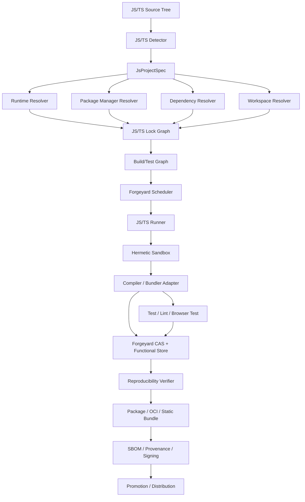

# Forgeyard JavaScript / TypeScript CI/CD System & Architecture

**Document type:** Dedicated language ecosystem System & Architecture  
**Project:** Forgeyard CI/CD  
**Subsystem:** First-class JavaScript and TypeScript build, test, analysis, packaging, monorepo, frontend, backend, reproducibility, distribution, and release integration  
**Implementation direction:** Rust-first Forgeyard core with native integration to Node.js/Bun and mainstream JS/TS tooling  
**Status:** Target production architecture  
**Relationship to Forgeyard:** This document defines the dedicated JavaScript/TypeScript subsystem that integrates with Forgeyard's pipeline IR, hermetic build system, scheduler, runners, CAS, functional store, provenance, packaging, distribution, and deployment architecture.

---

# 1. Purpose

JavaScript and TypeScript require a dedicated Forgeyard architecture because the ecosystem has unusually large and mutable dependency graphs, multiple package managers, multiple runtimes, multiple module systems, and many build tools.

A JS/TS build can depend on:

- Node.js or Bun version;
- npm, pnpm, Yarn, or Bun package-manager version;
- `package.json`;
- lockfile contents;
- workspace/monorepo topology;
- npm registry state;
- private registries;
- transitive package tarballs;
- lifecycle scripts;
- native addons;
- Node-API/ABI;
- TypeScript compiler version;
- `tsconfig.json`;
- package `exports`;
- ESM/CJS semantics;
- bundler version;
- Babel/SWC/esbuild configuration;
- browserslist data;
- PostCSS/Tailwind/Sass tooling;
- environment variables;
- generated source;
- filesystem paths;
- timestamps;
- build-time network access;
- dev/prod dependency selection;
- optional dependencies;
- platform-specific dependency resolution;
- browser/runtime target;
- SSR framework behavior;
- mutable `node_modules`;
- package-manager global caches.

Forgeyard therefore needs a subsystem whose central rule is:

> **A JavaScript/TypeScript build is defined by source + runtime + package manager + lock graph + workspace graph + compiler/transpiler/bundler configuration + platform target + controlled environment.**

---

# 2. Architectural Objectives

Forgeyard JS/TS MUST:

1. support JavaScript and TypeScript as first-class ecosystems;
2. support Node.js as the primary runtime;
3. support Bun as an additional first-class runtime;
4. support npm;
5. support pnpm;
6. support Yarn;
7. support Bun package management;
8. support package-lock, pnpm-lock, Yarn locks, and Bun lockfiles;
9. support workspaces and monorepos;
10. support TypeScript compilation;
11. support ESM and CommonJS;
12. support frontend, backend, CLI, library, SSR, and static-site builds;
13. support Vite, Rollup, esbuild, SWC, Webpack, and configurable tools;
14. support Jest, Vitest, Node test runner, Playwright/Cypress adapters;
15. support linting and formatting;
16. support native addons through Forgeyard C/C++ integration;
17. support deterministic dependency installation;
18. support fully offline builds after resolution/fetch;
19. prevent arbitrary lifecycle-script impurity;
20. support build cache and remote cache safely;
21. support reproducible frontend/server bundles;
22. support SBOM/provenance;
23. support deterministic packaging and OCI;
24. explain dependency/build graph changes;
25. support local-first and enterprise distributed modes.

---

# 3. Non-Goals

Forgeyard does not replace:

- Node.js;
- Bun;
- npm;
- pnpm;
- Yarn;
- TypeScript;
- Vite;
- Rollup;
- Webpack;
- esbuild;
- SWC;
- framework build tools.

Forgeyard resolves, locks, isolates, verifies, caches, packages, and orchestrates them.

---

# 4. High-Level Architecture



---

# 5. Suggested Forgeyard Workspace

```text
crates/
├── forgeyard-js/
├── forgeyard-js-model/
├── forgeyard-js-detect/
├── forgeyard-js-runtime/
├── forgeyard-js-node/
├── forgeyard-js-bun/
├── forgeyard-js-package-manager/
├── forgeyard-js-lock/
├── forgeyard-js-workspace/
├── forgeyard-js-install/
├── forgeyard-js-typescript/
├── forgeyard-js-bundler/
├── forgeyard-js-vite/
├── forgeyard-js-rollup/
├── forgeyard-js-esbuild/
├── forgeyard-js-webpack/
├── forgeyard-js-swc/
├── forgeyard-js-test/
├── forgeyard-js-browser-test/
├── forgeyard-js-analysis/
├── forgeyard-js-native-addon/
├── forgeyard-js-cache/
├── forgeyard-js-package/
└── forgeyard-js-provenance/
```

---

# 6. Core Domain Model

```rust
pub struct JsProjectSpec {
    pub source: SourceRef,

    pub runtime: JsRuntimeRequest,
    pub package_manager: PackageManagerRequest,
    pub workspace: JsWorkspaceSpec,
    pub dependencies: JsDependencyPolicy,

    pub module_system: ModuleSystemPolicy,
    pub typescript: Option<TypeScriptSpec>,

    pub build_target: JsBuildTarget,
    pub build: JsBuildPolicy,
    pub testing: JsTestPolicy,
    pub analysis: JsAnalysisPolicy,
    pub reproducibility: ReproducibilityPolicy,
}
```

---

# 7. Strong Types

```rust
pub enum JsRuntimeKind {
    Node,
    Bun,
}

pub enum JsPackageManagerKind {
    Npm,
    Pnpm,
    Yarn,
    Bun,
}

pub enum JsModuleSystem {
    Esm,
    CommonJs,
    Mixed,
}

pub enum JsBuildKind {
    Backend,
    Frontend,
    Library,
    Cli,
    Ssr,
    StaticSite,
    Worker,
}
```

---

# 8. Project Detection

Detect:

```text
package.json
package-lock.json
pnpm-lock.yaml
yarn.lock
bun.lock / bun.lockb
tsconfig.json
jsconfig.json
vite.config.*
rollup.config.*
webpack.config.*
next.config.*
nuxt.config.*
svelte.config.*
astro.config.*
turbo.json
nx.json
lerna.json
```

Detection is advisory; explicit Forgeyard config wins.

---

# 9. Detection Result

```rust
pub struct JsDetection {
    pub runtime_hints: Vec<JsRuntimeKind>,
    pub package_managers: Vec<DetectedPackageManager>,
    pub workspaces: Vec<DetectedWorkspace>,
    pub typescript: bool,
    pub bundlers: Vec<DetectedBundler>,
    pub frameworks: Vec<DetectedFramework>,
    pub native_addon_risk: DetectionState,
}
```

---

# 10. Runtime Identity

Node/Bun version strings are not sufficient identity.

Runtime identity should include:

```text
runtime binary
bundled libraries/runtime resources
platform
architecture
runtime distribution identity
```

Logical:

```text
JsRuntimeId = H(runtime closure)
```

---

# 11. Node.js Integration

First-class Node support:

```text
node
npm if bundled
corepack if used
Node ABI / Node-API metadata
platform/architecture
```

Node installation should be Forgeyard-managed or explicitly platform-provided.

---

# 12. Bun Integration

First-class Bun support:

```text
bun runtime
bun package manager
bundler/test features where used
platform/architecture
```

Bun identity is locked separately from Node.

---

# 13. Runtime Modes

```rust
pub enum JsRuntimeMode {
    LockedManaged,
    PlatformProvided,
    AuditedHost,
}
```

Preferred for CI:

```text
LockedManaged
```

---

# 14. Runtime Trust

```rust
pub enum JsRuntimeTrust {
    Unverified,
    DigestVerified,
    VendorVerified,
    OrganizationApproved,
    Revoked,
}
```

---

# 15. Package Manager Identity

Package manager version participates in derivation identity.

Examples:

```text
npm
pnpm
Yarn
Bun
```

Do not assume package manager behavior is stable across versions.

---

# 16. Corepack

If Corepack is used:

```text
Corepack version
selected package-manager version
activation metadata
```

must be controlled.

Strict CI must not silently download a newer package manager during build.

---

# 17. `packageManager` Field

If `package.json` declares:

```text
"packageManager": "pnpm@..."
```

Forgeyard resolves and locks it.

Release build uses the locked package manager.

---

# 18. Dependency Lock Strategy

Forgeyard treats ecosystem lockfiles as primary dependency resolution inputs and adds an outer Forgeyard identity layer.

```text
package.json
+
ecosystem lockfile
+
package manager identity
+
registry/source policy
+
fetched package content identities
=
JsDependencyGraphId
```

---

# 19. Lockfiles

Supported:

```text
package-lock.json
pnpm-lock.yaml
yarn.lock
Bun lockfile
```

Strict release requires exactly one authoritative package-manager mode per workspace unless explicitly configured otherwise.

---

# 20. Mixed Lockfile Detection

If repository contains:

```text
package-lock.json
pnpm-lock.yaml
yarn.lock
```

Forgeyard should warn/error rather than guess.

Explicit project config decides.

---

# 21. `package.json`

Forgeyard records relevant semantics:

```text
dependencies
devDependencies
peerDependencies
optionalDependencies
engines
packageManager
workspaces
scripts
type
exports
imports
main/module/browser fields
```

---

# 22. Outer Forgeyard Lock

Example:

```ron
javascript: (
    runtime: (
        kind: Node,
        version: "locked",
        digest: "blake3:...",
    ),

    package_manager: (
        kind: Pnpm,
        version: "locked",
        digest: "blake3:...",
    ),

    dependency_graph: "blake3:...",
)
```

---

# 23. Registry Fetch Architecture

Strict model:

```text
resolve
  ↓
fetch package tarballs/metadata
  ↓
verify integrity
  ↓
store immutably
  ↓
install/build offline
```

The build does not depend on live npm registry state.

---

# 24. Registry Policy

Configure:

```text
approved public registries
private registries
organization mirrors
direct Git dependencies
HTTP tarballs
```

Production can require internal mirrors only.

---

# 25. Private Registries

Credentials belong only to fetch/resolution.

Package content is stored immutably.

Credentials never enter artifact identity or package bundle.

---

# 26. Package Integrity

Where lockfile provides integrity metadata, verify it.

Forgeyard additionally hashes fetched package content into its own immutable store.

---

# 27. Git Dependencies

Resolve:

```text
repository
requested ref
commit
content digest
```

Production build never tracks moving branch state.

---

# 28. Local Dependencies

Examples:

```text
file:
workspace:
link:
```

resolve to immutable source/workspace identities.

Do not depend on arbitrary runner filesystem content.

---

# 29. Workspaces

Support:

```text
npm workspaces
pnpm workspaces
Yarn workspaces
Bun workspaces
```

and monorepo tools layered above them.

---

# 30. Workspace Graph

```text
workspace packages
   ↓
internal dependency edges
   ↓
external dependency closure
   ↓
build/test targets
```

Forgeyard should preserve package-manager workspace semantics.

---

# 31. Monorepo Detection

Optional integrations:

```text
Turborepo
Nx
Lerna
Rush
```

These are optimizers/orchestrators, not the source of dependency truth.

Forgeyard may consume their graph metadata but retains its own pipeline semantics.

---

# 32. Workspace Package Identity

Each workspace package:

```rust
pub struct JsWorkspacePackage {
    pub name: PackageName,
    pub path: VirtualPath,
    pub package_json_digest: Digest,
    pub source_digest: Digest,
}
```

---

# 33. Dependency Installation

Install phase is explicit.

Strict release:

```text
lock verified
package closure fetched
network denied
deterministic install
```

---

# 34. npm Install Mode

Prefer lock-preserving commands such as:

```text
npm ci
```

for CI rather than mutable resolution.

---

# 35. pnpm Install Mode

Use frozen-lockfile/offline equivalents according to supported pnpm behavior.

Forgeyard controls store path.

---

# 36. Yarn Install Mode

Use immutable/frozen lock behavior according to Yarn generation/version.

Forgeyard must distinguish Yarn Classic from modern Yarn.

---

# 37. Bun Install Mode

Use locked/frozen dependency behavior supported by the resolved Bun version.

---

# 38. `node_modules`

`node_modules` is a realization artifact, not a source-of-truth dependency database.

Forgeyard may:

```text
materialize it
cache it
discard it
```

but dependency identity comes from lock graph + package contents + manager/runtime semantics.

---

# 39. pnpm Store

pnpm's store is mutable acceleration.

Forgeyard can map package blobs into a Forgeyard-controlled cache/store while preserving pnpm semantics.

---

# 40. Yarn PnP

For Plug'n'Play projects:

```text
.pnp.*
Yarn version
cache artifacts
```

are explicit build inputs.

Forgeyard must not force `node_modules` mode.

---

# 41. Zero-Install Repositories

If repository commits Yarn cache or similar artifacts, they are source inputs.

Forgeyard still verifies consistency with lock/package-manager policy.

---

# 42. Lifecycle Scripts

High-risk:

```text
preinstall
install
postinstall
prepare
prepack
postpack
```

They can execute arbitrary code.

Forgeyard must execute them only inside hermetic sandbox and according to policy.

---

# 43. Lifecycle Script Policy

```rust
pub enum LifecycleScriptPolicy {
    Allow,
    AllowListed,
    Deny,
    Audit,
}
```

Enterprise/release default can use allowlist or audit-enforce migration.

---

# 44. Native Addons

Packages using:

```text
node-gyp
node-pre-gyp
cmake-js
N-API native code
Rust native extensions
```

need explicit native toolchains.

Forgeyard integrates with C/C++ and Rust subsystems as needed.

---

# 45. Node-API / ABI

Native addon identity must include:

```text
Node runtime ABI / Node-API target
platform
architecture
native compiler toolchain
native dependencies
```

Do not reuse binary addons across incompatible runtime ABI blindly.

---

# 46. node-gyp

Forgeyard supplies:

```text
Python if required by toolchain
C/C++ compiler
make/ninja/MSBuild as needed
Node headers
SDK/sysroot
```

all explicitly.

---

# 47. Native Addon Runtime Validation

Shared-library dependencies of `.node` binaries are validated through Forgeyard C/C++ linkage subsystem.

---

# 48. TypeScript

TypeScript is first-class.

Toolchain identity includes:

```text
typescript package/compiler version
tsconfig
extends chain
plugins
transformers where used
```

---

# 49. TypeScript Project Model

```rust
pub struct TypeScriptSpec {
    pub compiler: LockedToolRef,
    pub tsconfig: StoreObjectId,
    pub project_references: Vec<TsProjectRef>,
    pub incremental: TsIncrementalPolicy,
}
```

---

# 50. `tsconfig.json`

Forgeyard resolves:

```text
extends
references
compilerOptions
include/exclude/files
paths
baseUrl
module/moduleResolution
target
jsx
declaration
source maps
```

All effective config must be inspectable.

---

# 51. tsconfig Extends

External/package-based `extends` are locked dependencies.

Local paths resolve inside source snapshot.

---

# 52. Project References

TypeScript project references form a build graph.

Forgeyard can use them for:

```text
incremental build planning
cache keys
affected package analysis
```

---

# 53. TypeScript Incremental Cache

`.tsbuildinfo` is mutable acceleration.

Key it by:

```text
TypeScript compiler identity
tsconfig identity
source graph
target
```

Never trust arbitrary developer `.tsbuildinfo`.

---

# 54. JavaScript Module Systems

Forgeyard explicitly models:

```text
ESM
CommonJS
Mixed
```

because runtime/build behavior differs.

---

# 55. `type` Field

`package.json` `"type"` affects module interpretation.

It participates in package/build identity.

---

# 56. `exports` / `imports`

Package export maps are source semantics and part of library package validation.

---

# 57. Bundler Architecture

Forgeyard uses bundler adapters rather than one generic "frontend" command.

Supported first-class candidates:

```text
Vite
Rollup
esbuild
Webpack
SWC
```

---

# 58. Bundler Trait

```rust
#[async_trait]
pub trait JsBundlerAdapter {
    async fn detect(&self, source: &SourceTree) -> Result<Detection>;
    async fn resolve_config(&self, project: &JsProjectSpec) -> Result<ResolvedBundlerConfig>;
    async fn build(&self, ctx: BundlerContext) -> Result<BundleResult>;
}
```

---

# 59. Vite

Forgeyard tracks:

```text
Vite version
config file
plugins
mode
environment variables
target
Rollup configuration underneath
```

---

# 60. Rollup

Track:

```text
Rollup version
plugins
input graph
output format
treeshaking options
chunk naming
sourcemap policy
```

---

# 61. esbuild

Track:

```text
esbuild version/binary
platform
target
format
external packages
defines
minification
sourcemap policy
```

esbuild may use native binary packages, so platform identity matters.

---

# 62. Webpack

Track:

```text
Webpack version
config
loaders
plugins
mode
target
optimization
chunk/content hashing behavior
```

---

# 63. SWC

Track:

```text
SWC core/native binary identity
config
target
module mode
minification
plugins
```

Native binary identity matters.

---

# 64. Babel

Optional adapter can lock:

```text
@babel/core
presets
plugins
config chain
targets
```

---

# 65. Browserslist

Frontend target resolution can depend on Browserslist configuration and database.

Forgeyard should make:

```text
browserslist config
caniuse data/dependency versions
```

part of the locked dependency graph.

---

# 66. CSS / HTML Integration

HTML/CSS are handled in this JS/TS subsystem because modern frontend builds commonly depend on JS toolchains.

Support:

```text
plain HTML/CSS
PostCSS
Tailwind
Sass/SCSS
Less
CSS Modules
CSS-in-JS build tooling
```

---

# 67. PostCSS

Track:

```text
postcss version
config
plugins
plugin versions
```

---

# 68. Tailwind

Track:

```text
Tailwind version
config
content/source scanning inputs
plugins
```

Generated CSS is content-addressed output.

---

# 69. Sass

If using native/Dart Sass packages, lock implementation and platform-specific binary/package identity.

---

# 70. Frontend Environment Variables

Frameworks often bake env values into static assets.

Therefore distinguish:

```text
build-time public environment
runtime server environment
secrets
```

Build-time environment affecting bytes is part of derivation identity.

---

# 71. Secret Rule

Do not bake secrets into frontend bundles.

Forgeyard policy should reject known secret references in client-build environment.

---

# 72. Public Build Variables

Example:

```text
PUBLIC_API_ORIGIN
VITE_PUBLIC_*
NEXT_PUBLIC_*
```

if they affect artifact bytes, they are explicit build inputs.

---

# 73. Runtime Config Separation

Prefer:

```text
one immutable frontend/server artifact
+
runtime/environment config
```

where framework permits.

Avoid rebuilding per deployment environment unnecessarily.

---

# 74. SSR

SSR applications have two artifact classes:

```text
server runtime artifact
client/static artifact
```

Forgeyard should model them separately.

---

# 75. Static Site

Static-site build output is an immutable directory tree.

Canonicalize:

```text
paths
metadata
archive packaging
```

and hash tree content.

---

# 76. Source Maps

Source maps are separate or bundled outputs according to policy.

They may contain source paths/content.

Apply path normalization and security policy.

---

# 77. Minification

Minifier version/config is build identity.

Do not assume minified output stability across versions.

---

# 78. Chunk Naming

Use content-derived stable chunk naming where supported.

Avoid random or timestamp-derived filenames in reproducible release mode.

---

# 79. Asset Fingerprinting

Content-hashed asset filenames are naturally compatible with Forgeyard CAS.

---

# 80. Testing

First-class:

```text
Node test runner
Vitest
Jest
Playwright
Cypress adapter
framework-specific test runners
```

---

# 81. Unit Test Model

```rust
pub struct JsTestPlan {
    pub runner: JsTestRunner,
    pub projects: Vec<TestProject>,
    pub shards: u32,
    pub coverage: CoveragePolicy,
    pub timeout: Duration,
}
```

---

# 82. Node Test Runner

Use locked Node runtime.

Test flags/config are explicit.

---

# 83. Vitest

Track:

```text
Vitest version
Vite version
config
environment (node/jsdom/happy-dom/etc.)
```

---

# 84. Jest

Track:

```text
Jest version
transformers
test environment
config
coverage provider
```

---

# 85. Browser Testing

Playwright/Cypress require browser binaries/runtime packages.

These are toolchain inputs.

---

# 86. Browser Toolchain

Model:

```text
Chromium
Firefox
WebKit where supported
browser revision
OS dependencies
headless/display environment
```

---

# 87. Playwright

Browser downloads happen in resolver/fetch stage, not strict test realization.

Use immutable browser objects.

---

# 88. Cypress

Treat Cypress binary/runtime identity as locked tool input.

---

# 89. Browser Test Sharding

Tests can shard across:

```text
files
projects
browsers
```

according to framework semantics.

---

# 90. Test Cache

Framework caches are acceleration only.

Release validation can force fresh test execution.

---

# 91. Linting

First-class candidates:

```text
ESLint
Biome
oxlint
framework linters
```

Tool versions/configs are locked.

---

# 92. Formatting

Support verification:

```text
Prettier
Biome
dprint adapter
```

CI should report diffs, not silently rewrite source.

---

# 93. Type Checking

TypeScript type-check job is separate from bundling where appropriate.

```text
tsc --noEmit
```

or project-specific equivalent.

---

# 94. Static Analysis

Potential:

```text
ESLint
Biome
TypeScript compiler diagnostics
security-focused analyzers
dependency-policy scanners
```

---

# 95. Dependency Security

Lock graph is scanned for:

```text
known vulnerabilities
license policy
deprecated packages
untrusted registry/source
unexpected lifecycle scripts
```

---

# 96. Typosquatting / Dependency Confusion

Forgeyard should flag:

```text
new package
unexpected registry
private/public name collision
source change
publisher/source change where metadata exists
```

Lock diff becomes a security review artifact.

---

# 97. Lock Diff

Example:

```text
react 19.x -> 20.x
12 transitive packages changed
1 new lifecycle script
1 package source changed
2 licenses changed
```

Better than raw lockfile review alone.

---

# 98. Install Script Audit

Forgeyard records packages containing lifecycle scripts.

Policy can deny scripts for selected scopes.

---

# 99. Hermetic Install

Strict install sees:

```text
locked package manager
lockfile
package source objects
workspace source
controlled cache/store
```

No public network.

---

# 100. HOME Isolation

Synthetic HOME prevents:

```text
.npmrc
.yarnrc
.pnpm config
user certificates
global packages
```

from silently affecting build.

---

# 101. Package Manager Config

Forgeyard synthesizes approved registry/cache behavior.

Project-local config files are explicit source inputs.

User-global config is ignored in strict mode.

---

# 102. `.npmrc`

Project `.npmrc` can affect resolution/install.

Parse and policy-check it.

Secrets/tokens are not allowed as committed plaintext inputs.

---

# 103. Environment Isolation

Forgeyard controls:

```text
PATH
HOME
NODE_ENV
CI
npm_config_*
PNPM_*
YARN_*
BUN_*
TZ
LANG
TMPDIR
```

plus project build variables.

---

# 104. Global Packages

Strict builds do not use globally installed npm packages.

All executables come from:

```text
locked package manager/runtime
workspace dependencies
explicit Forgeyard tool inputs
```

---

# 105. `npx`

Uncontrolled `npx` may fetch packages.

Strict policy:

```text
npx may execute only already-locked/local tools
```

No implicit network install.

---

# 106. Package Binary Resolution

Resolve executables from controlled dependency graph.

Do not fall back to arbitrary host PATH.

---

# 107. Generated Code

Examples:

```text
GraphQL codegen
OpenAPI generators
protobuf
ORM clients
route generation
framework codegen
```

Generators are locked tools.

---

# 108. Codegen Stage

```text
locked generator
  ↓
source/schema inputs
  ↓
generated tree
  ↓
compare or consume
```

---

# 109. Generated-Code Verification

If generated source is committed:

```text
regenerate
  ↓
diff
  ↓
fail if stale
```

---

# 110. Native Tool Extensions

Some JS tooling uses native binaries:

```text
esbuild
SWC
sharp
sqlite bindings
canvas
bcrypt variants
```

Platform-specific package/native binary identity must be locked.

---

# 111. Optional Dependencies

Platform-specific optional dependency selection participates in derivation identity.

---

# 112. Platform Model

```rust
pub struct JsPlatform {
    pub os: JsOs,
    pub arch: JsArch,
    pub libc: Option<LibcKind>,
}
```

For Linux native dependencies, glibc/musl may matter.

---

# 113. Frontend Target

Frontend target includes:

```text
browser target policy
module format
bundler
minification
CSS pipeline
```

---

# 114. Backend Target

Backend target includes:

```text
Node/Bun runtime
platform
architecture
module mode
native addon closure
```

---

# 115. Edge/Worker Target

Treat runtimes such as worker/edge environments as explicit platform contracts where supported.

Do not assume Node API compatibility.

---

# 116. Cross-Building

Pure frontend bundles can build on many runner platforms.

Backend packages with native addons require target-compatible/native-cross toolchains.

---

# 117. Reproducibility

Same derivation:

```text
Runner A -> output X
Runner B -> output Y
```

Compare:

```text
bundle tree
server output
static assets
archives
```

---

# 118. Common Nondeterminism Sources

```text
timestamps
random chunk IDs
absolute paths
unordered object traversal
build machine paths
generated UUIDs
native addon linker metadata
framework build IDs
environment-derived values
```

Forgeyard adapters should identify known framework-specific sources where possible.

---

# 119. Output Tree Canonicalization

For static/build directory:

```text
sort paths
normalize metadata
hash file contents
```

Do not rewrite semantic JS/CSS content arbitrarily.

---

# 120. Source Map Reproducibility

Normalize source roots/paths.

Physical runner path must not leak.

---

# 121. Framework Build IDs

If framework supports configurable build ID, derive it deterministically from release/source identity.

Do not use wall-clock/random IDs.

---

# 122. Reproducer

Release policy can require a separate runner.

Mismatch quarantines artifact.

---

# 123. Build Cache

Possible layers:

```text
bundler cache
TypeScript incremental cache
framework cache
package-manager cache
Forgeyard action cache
Forgeyard CAS
```

Each has distinct validity rules.

---

# 124. Cache Namespace

Include:

```text
runtime ID
package-manager ID
lock graph ID
platform
tool versions
config digests
environment affecting bytes
```

---

# 125. Framework Cache

Examples:

```text
.next/cache
.vite cache
webpack cache
turbo cache
Nx cache
```

Treat as disposable acceleration.

---

# 126. Remote Cache

Forgeyard may import/export framework cache artifacts but validates action identity.

Third-party remote cache is optional.

---

# 127. Monorepo Change Analysis

Use workspace graph:

```text
changed package
  ↓
reverse workspace dependencies
  ↓
affected build/test set
```

Fallback to safe superset if uncertainty exists.

---

# 128. Turborepo Integration

Forgeyard may consume:

```text
task graph
package graph
cache hints
```

but Forgeyard scheduler remains authoritative for distributed execution.

---

# 129. Nx Integration

Same principle:

```text
consume graph metadata
do not make Nx database authoritative over Forgeyard artifact identity
```

---

# 130. Remote Execution

Good candidates:

```text
workspace build tasks
test shards
browser test shards
lint/type-check shards
static frontend builds
```

---

# 131. Scheduler Capabilities

```rust
pub struct JsRunnerCapabilities {
    pub runtimes: Vec<JsRuntimeId>,
    pub package_managers: Vec<PackageManagerId>,
    pub platforms: Vec<JsPlatform>,
    pub browsers: Vec<BrowserToolchainId>,
    pub native_toolchains: Vec<CppToolchainId>,
    pub sandbox: SandboxCapabilities,
}
```

---

# 132. Scheduler Hard Constraints

Filter:

```text
runtime
platform
browser requirement
native addon toolchain
OS-specific framework requirement
trust tier
memory
```

---

# 133. Scheduler Scoring

Score:

```text
dependency closure locality
runtime locality
browser locality
cache warmth
queue delay
resource headroom
```

---

# 134. Runner Prewarming

Prefetch:

```text
Node/Bun runtime
package manager
common dependency blobs
browser binaries
native addon toolchains
```

---

# 135. Browser Runner Pool

Browser tests can use specialized pools with:

```text
display/headless support
browser set
GPU where required
mobile emulation capabilities
```

---

# 136. Frontend Build Resource Class

Large Webpack/Next builds can be RAM-heavy.

Scheduler uses historical memory data rather than only CPU count.

---

# 137. Adaptive Parallelism

Avoid oversubscribing:

```text
many workspace builds
+
bundler worker pools
+
test worker pools
```

Forgeyard resource governor coordinates global concurrency.

---

# 138. Test Sharding

Shard by:

```text
test file
workspace package
browser
project
```

according to runner semantics.

---

# 139. Browser Artifact Capture

On failures store:

```text
screenshots
video
trace
console logs
network logs
```

as CAS artifacts.

---

# 140. Frontend Performance Tests

Optional:

```text
bundle size
Lighthouse adapter
asset size budgets
route payload budgets
```

Use dedicated evidence, not package identity.

---

# 141. Bundle Size Gate

Track:

```text
total JS
initial route JS
CSS
largest chunks
```

against baseline.

---

# 142. Tree-Shaking Validation

Optional diagnostics can compare:

```text
unexpected package inclusion
bundle graph growth
```

---

# 143. Dependency Graph UI

Show:

```text
workspace packages
external packages
version
source
integrity
native/lifecycle flags
```

---

# 144. Build Graph UI

Show:

```text
workspace tasks
TypeScript projects
bundles
SSR/client split
tests
browser matrix
```

---

# 145. Runtime UI

Display:

```text
Node/Bun version
runtime digest
platform
trust
ABI
```

---

# 146. Package Manager UI

Display:

```text
manager
version
lockfile
frozen mode
cache state
registry policy
```

---

# 147. TypeScript UI

Display:

```text
tsc version
tsconfig chain
project references
type-check status
incremental cache status
```

---

# 148. Native Addon UI

Display:

```text
addon package
Node-API/ABI
C/C++ toolchain
runtime linkage
platform artifact
```

---

# 149. Reproducibility UI

Display:

```text
primary digest
reproducer digest
bundle tree match
runtime
package manager
lock graph
environment inputs
```

---

# 150. CLI

Recommended:

```text
forgeyard js detect
forgeyard js lock
forgeyard js fetch
forgeyard js install
forgeyard js graph
forgeyard js build
forgeyard js typecheck
forgeyard js test
forgeyard js browser-test
forgeyard js lint
forgeyard js format-check
forgeyard js analyze
forgeyard js reproduce
forgeyard js package
forgeyard js explain
forgeyard js explain-rebuild
forgeyard js runtime
forgeyard js deps
forgeyard js workspace
```

---

# 151. `forgeyard js explain`

Shows:

```text
runtime
package manager
lockfile
workspace graph
TypeScript compiler
bundler
build target
native addons
build env
cache state
```

---

# 152. Explain Rebuild

Examples:

```text
pnpm-lock.yaml changed
TypeScript version changed
Vite config changed
PUBLIC_API_ORIGIN changed
Node runtime changed
native addon toolchain changed
```

---

# 153. Failure Classification

```rust
pub enum JsFailure {
    DetectionFailure,
    RuntimeFailure,
    PackageManagerFailure,
    LockFailure,
    DependencyFetchFailure,
    InstallFailure,
    LifecycleScriptFailure,
    TypeCheckFailure,
    BuildFailure,
    TestFailure,
    BrowserTestFailure,
    AnalysisFailure,
    NativeAddonFailure,
    PackagingFailure,
    ReproducibilityFailure,
}
```

---

# 154. Diagnostics

```rust
pub struct JsDiagnostic {
    pub severity: Severity,
    pub tool: ToolIdentity,
    pub package: Option<PackageName>,
    pub file: Option<VirtualPath>,
    pub line: Option<u32>,
    pub column: Option<u32>,
    pub message: String,
}
```

Preserve raw logs too.

---

# 155. Install Failure Example

```text
Dependency installation failed

package:
  example-native-addon

reason:
  postinstall attempted network access

policy:
  build/install network denied
```

---

# 156. Lifecycle Script Violation

```text
Lifecycle script denied

package:
  suspicious-package

script:
  postinstall

policy:
  AllowListed
```

---

# 157. Native Addon Violation

```text
Native addon hermeticity violation

attempted library:
  /usr/local/lib/libfoo.so

reason:
  outside declared native closure
```

---

# 158. Development Environment

```text
forgeyard js dev
```

provides:

```text
runtime
package manager
workspace dependencies
TypeScript
bundler
test/lint tools
```

matching CI identities.

---

# 159. IDE Integration

Export:

```text
Node/Bun runtime path
TypeScript SDK
workspace metadata
tsconfig
package-manager metadata
```

for editors/IDEs.

---

# 160. Local Mode

Standalone Forgeyard can:

```text
resolve/fetch packages
materialize dependencies
build
test
bundle
package
```

with local CAS/store.

---

# 161. Distributed Mode

```text
daemon
  ↓
workspace task
  ↓
remote JS/TS runner
  ↓
runtime + dependency closure
  ↓
build/test
  ↓
CAS outputs
```

---

# 162. Enterprise Mode

Adds:

```text
private registry mirror
approved package mirror
signed lock policy
OIDC/RBAC
browser farms
independent reproducers
multi-region CAS
air-gap support
```

---

# 163. Air-Gapped Build

Bundle:

```text
source
runtime
package manager
package tarball closure
workspace lock graph
native addon toolchains
browser toolchains if tests require them
```

Strict build/test can then run offline.

---

# 164. SBOM

SBOM includes:

```text
workspace packages
external packages
versions
sources
integrity hashes
native addon dependencies
runtime package
```

---

# 165. Provenance

Record:

```text
source digest
package.json digest
lockfile digest
runtime ID
package-manager ID
workspace graph
TypeScript ID
bundler ID
build target
build-time public env
native addon closure
output digest
runner
sandbox policy
```

---

# 166. Packaging

Potential outputs:

```text
static site bundle
server directory
single-file/compiled runtime output where tooling supports it
npm package tarball
zip/tar.zst
OCI image
Forgeyard native bundle
```

---

# 167. npm Library Package

For publishable libraries:

```text
package.json
compiled JS
declaration files
source maps if configured
license/readme
```

Validate package contents before publishing.

---

# 168. Package Export Validation

Validate:

```text
main
module
types
exports
imports
files
bin
```

point to actual package contents.

---

# 169. npm Pack Verification

Create package artifact deterministically.

Inspect package manifest/tree before publication.

---

# 170. Registry Publishing

Publishing is separate from build.

```text
immutable package tarball
  ↓
policy/approval
  ↓
registry publish
```

Do not rebuild during publish.

---

# 171. Frontend Distribution

Static output can publish to:

```text
object storage
CDN origin
static hosting
OCI
Forgeyard release site
```

same digest promoted across environments where configuration model permits.

---

# 172. Backend Distribution

Package:

```text
server output
runtime closure or runtime requirement
production dependencies where needed
SBOM
provenance
```

---

# 173. Dependency Pruning

For Node server deployments, determine production runtime dependency closure.

Do not blindly copy full dev `node_modules`.

---

# 174. Standalone Output

Frameworks that produce self-contained server output can use that as preferred deployment closure, if validated.

---

# 175. OCI

Base images referenced by digest.

Do not rebuild application binary/bundle inside environment-specific OCI stages.

Prefer:

```text
build immutable app artifact
  ↓
assemble deterministic image
```

---

# 176. Build Once, Promote Many

```text
source
  ↓
artifact X
  ↓
test X
  ↓
reproduce X
  ↓
stage X
  ↓
production X
```

---

# 177. Release Manifest

```rust
pub struct JsReleaseManifest {
    pub version: Version,
    pub artifacts: BTreeMap<JsReleaseTarget, PackageDigest>,
    pub sbom: Digest,
    pub provenance: Digest,
}
```

---

# 178. Production Defaults

Recommended:

```text
locked runtime
locked package manager
single authoritative lockfile
frozen dependency install
offline build after fetch
synthetic HOME
no global packages
controlled lifecycle scripts
explicit build-time environment
locked TypeScript/bundler
native addons locked
independent reproduction
```

---

# 179. Development Defaults

May allow:

```text
warm local caches
dirty source
broader lifecycle script audit mode
framework dev server
incremental TS/bundler cache
```

with visible impurity status.

---

# 180. Error-Prone Behaviors to Prevent

Forgeyard should detect/reject:

```text
package manager mismatch
lockfile ignored
multiple conflicting lockfiles
runtime auto-upgrade
Corepack auto-download during build
ambient npmrc/yarn config
global package dependency
network install during release build
unlocked Git dependency
local file dependency outside source snapshot
lifecycle script hidden network/tool usage
native addon using host compiler
native addon using host library
build secret baked into client bundle
random/timestamped build IDs
physical runner paths in source maps
```

---

# 181. Reference PR Pipeline

```text
detect
  ↓
lock/install integrity
  ↓
format check
  ↓
lint
  ↓
typecheck
  ↓
unit tests
  ↓
build
```

---

# 182. Reference Frontend PR

```text
install
  ↓
lint
  ↓
typecheck
  ↓
Vitest/Jest
  ↓
Vite/Webpack build
  ↓
bundle-size check
```

---

# 183. Reference Browser Pipeline

```text
build app
  ↓
start controlled server
  ↓
Playwright/Cypress shards
  ↓
collect screenshots/traces
```

---

# 184. Reference Nightly

```text
full workspace tests
browser matrix
dependency/security scan
extended static analysis
bundle-size trend
reproducibility sampling
```

---

# 185. Reference Release

```text
clean source
  ↓
lock verification
  ↓
offline hermetic install
  ↓
typecheck/lint/tests
  ↓
hermetic build
  ↓
native addon linkage check
  ↓
independent reproduction
  ↓
deterministic package
  ↓
SBOM/provenance
  ↓
sign
  ↓
promote identical artifact
```

---

# 186. Implementation Phase 1 — Domain and Detection

Implement:

```text
JsProjectSpec
runtime/package-manager detection
lockfile detection
workspace detection
TypeScript detection
bundler detection
```

Exit:

Forgeyard correctly describes common JS/TS repos.

---

# 187. Phase 2 — Runtime and Package Manager Locking

Implement:

```text
Node runtime store
Bun runtime store
npm/pnpm/Yarn/Bun manager locking
Corepack policy
```

---

# 188. Phase 3 — Dependency Fetch/Install

Implement:

```text
lock graph
registry fetch
private registry auth
offline install
synthetic HOME
cache isolation
```

Exit:

project installs and builds without network after fetch.

---

# 189. Phase 4 — TypeScript

Implement:

```text
tsconfig resolution
TypeScript compiler identity
project references
typecheck
incremental cache
```

---

# 190. Phase 5 — Bundlers

Implement:

```text
Vite
Rollup
esbuild
Webpack
SWC
```

with common bundle-result model.

---

# 191. Phase 6 — Testing/Analysis

Implement:

```text
Node test
Vitest
Jest
ESLint
Biome
format checks
```

---

# 192. Phase 7 — Browser Tests

Implement:

```text
Playwright
browser toolchains
test sharding
artifact collection
```

---

# 193. Phase 8 — Native Addons

Integrate:

```text
node-gyp
C/C++ toolchain
Node-API/ABI
runtime linkage validation
```

---

# 194. Phase 9 — Reproducibility

Implement:

```text
stable paths
deterministic env
content-tree comparison
framework-specific diagnostics
independent rebuild
```

---

# 195. Phase 10 — Packaging/Distribution

Implement:

```text
npm package
static bundle
server package
OCI
release manifests
promotion
```

---

# 196. Phase 11 — Monorepo Optimization

Implement:

```text
workspace graph
affected-task calculation
remote task execution
Turborepo/Nx graph adapters
```

---

# 197. Phase 12 — Enterprise Supply Chain

Implement:

```text
approved registry mirror
script policy
signed lock approval
dependency trust
air-gap mirror
multi-region CAS
```

---

# 198. Acceptance Tests

1. Remove host Node/Bun: locked runtime build still succeeds.
2. Change global npm/pnpm/Yarn config: strict build unchanged.
3. Change global package installation: strict build unchanged.
4. Disable network after fetch: install/build still succeeds.
5. Change package-manager version: derivation changes.
6. Change lockfile: dependency graph changes.
7. Add conflicting lockfile: Forgeyard errors unless explicitly configured.
8. Change public build variable: derivation changes.
9. Change runtime-only secret: artifact does not rebuild.
10. Lifecycle script attempts network: strict policy blocks it.
11. Native addon uses `/usr/local/lib`: strict build rejects.
12. TypeScript version changes: typecheck/build identity changes.
13. Bundler config changes: output derivation changes.
14. Physical build path changes: source maps/output remain reproducible where supported.
15. Independent runner produces same bundle tree.
16. Reproducer mismatch quarantines release.
17. npm package exports reference missing file: package validation fails.
18. Promotion preserves exact artifact digest.

---

# 199. Production Readiness Gates

Do not call JS/TS support production-ready until:

```text
runtime locking is stable
package-manager locking is stable
lockfile semantics are correct
offline installs work
private registries work securely
HOME/global config leakage is prevented
lifecycle scripts are controlled
TypeScript config resolution is accurate
bundler adapters are tested
browser test toolchains are reproducible enough for CI
native addons integrate with C/C++
source-map/build-path normalization works
reproducibility verification detects mismatches
package validation works
```

---

# 200. Architectural Invariants

1. Runtime version string alone is not runtime identity.
2. Package-manager version is explicit.
3. Strict CI uses one authoritative dependency lock mode.
4. Package installation does not resolve mutable dependency versions during release build.
5. Strict install/build is offline after fetch.
6. Host HOME/global package-manager config is not trusted.
7. Global npm packages are not build inputs.
8. Lifecycle scripts execute only under Forgeyard sandbox/policy.
9. Native addons introduce explicit native toolchain identity.
10. TypeScript compiler/config is explicit.
11. Bundler/minifier versions are explicit.
12. Build-time public environment affecting bytes is explicit.
13. Secrets are not permitted in frontend build output.
14. Source maps do not expose physical runner paths in strict release mode.
15. Workspaces are modeled explicitly.
16. Framework caches are acceleration only.
17. Monorepo affected-task optimization must fail safe to broader execution.
18. Reproducibility compares actual bundle/package content.
19. Registry credentials never enter artifact identity.
20. Promotion never rebuilds a release artifact.

---

# 201. Final Target Architecture

```text
                    JavaScript / TypeScript Project
                               │
                               ▼
                       Forgeyard JS Detector
                               │
                               ▼
                          JsProjectSpec
                               │
          ┌────────────────────┼────────────────────┐
          ▼                    ▼                    ▼
    Runtime Resolver    Package Manager       Workspace/Deps
                             Resolver            Resolver
          │                    │                    │
          └────────────────────┼────────────────────┘
                               ▼
                      Immutable JS/TS Lock
                               │
                               ▼
                       Workspace/Task Graph
                               │
                               ▼
                       Forgeyard Scheduler
                               │
                               ▼
                        Hermetic JS Runner
                               │
              ┌────────────────┼────────────────┐
              ▼                ▼                ▼
          TypeScript        Bundler           Tests
              │                │                │
              └────────────────┼────────────────┘
                               ▼
                    Native Addon Validation
                        when applicable
                               │
                               ▼
                    Content-Addressed Output
                               │
                               ▼
                    Independent Reproducer
                               │
                               ▼
                    Deterministic Packaging
                               │
                               ▼
                   SBOM / Provenance / Signing
                               │
                               ▼
                    Forgeyard Distribution
```

---

# 202. Final Architectural Position

For JS/TS, a dependable build identity is:

```text
Source snapshot
+
Node/Bun runtime
+
package-manager identity
+
package.json
+
lockfile
+
workspace graph
+
dependency package contents
+
TypeScript/compiler configuration
+
bundler/transpiler/minifier configuration
+
platform/runtime target
+
build-time public environment
+
controlled lifecycle-script policy
+
hermetic sandbox
=
JS/TS derivation
```

When native addons exist:

```text
JS/TS derivation
+
Node-API/ABI
+
C/C++ toolchain
+
native sysroot
+
native dependency closure
=
native JS/TS derivation
```

And a trustworthy release requires:

```text
Derivation
  ↓
offline hermetic install/build
  ↓
typecheck / lint / tests / browser tests
  ↓
native linkage validation when required
  ↓
actual output digest
  ↓
independent reproduction
  ↓
deterministic package
  ↓
SBOM + provenance
  ↓
signature
  ↓
promotion of identical bytes
```

This gives Forgeyard first-class JavaScript/TypeScript support without inheriting the ecosystem's usual mutable `node_modules`, global configuration, runtime drift, registry drift, lifecycle-script ambiguity, or hidden native-addon dependencies.

---

# Appendix A — Recommended JS/TS Release Policy

```ron
(
    javascript_release_policy: (
        source: (
            dirty_tree: Denied,
        ),

        runtime: (
            locked: Required,
        ),

        package_manager: (
            locked: Required,
            single_authoritative_lock: Required,
        ),

        dependencies: (
            frozen: Required,
            build_network: Denied,
            private_registry_credentials: FetchOnly,
        ),

        lifecycle_scripts: (
            policy: AllowListed,
        ),

        environment: (
            host_home: Denied,
            global_packages: Denied,
            secrets_in_client_bundle: Denied,
        ),

        native_addons: (
            native_toolchain_locked: RequiredWhenPresent,
            runtime_linkage_validation: RequiredWhenPresent,
        ),

        reproducibility: (
            independent_rebuilds: 1,
            distinct_host: true,
            comparison: NormalizedTree,
        ),

        release: (
            sbom: Required,
            provenance: Required,
            signing: Required,
            rebuild_on_promotion: Denied,
        ),
    ),
)
```

---

# Appendix B — Example Node + pnpm Lock

```ron
(
    runtime: (
        kind: Node,
        version: "locked",
        digest: "blake3:...",
    ),

    package_manager: (
        kind: Pnpm,
        version: "locked",
        digest: "blake3:...",
    ),

    workspace: (
        lockfile: "blake3:...",
        graph: "blake3:...",
    ),

    dependency_closure: "blake3:...",
)
```

---

# Appendix C — Example TypeScript Frontend Configuration

```ron
javascript: (
    runtime: LockedNode("node-stable"),
    package_manager: LockedPnpm("pnpm"),

    workspace: Auto,

    typescript: (
        compiler: Locked("typescript"),
        project: "tsconfig.json",
    ),

    build: (
        kind: Frontend,
        bundler: Vite(
            config: "vite.config.ts",
        ),
    ),

    environment: {
        "PUBLIC_API_ORIGIN": BuildInput("https://api.example.invalid"),
    },

    reproducibility: (
        network: Denied,
        independent_rebuilds: 1,
    ),
)
```

---

# Appendix D — First-Class Tooling Matrix

| Area | First-class |
|---|---|
| Runtime | Node.js, Bun |
| Package managers | npm, pnpm, Yarn, Bun |
| Dependency model | lockfiles, workspaces, private registries |
| TypeScript | `tsc`, project references, incremental cache |
| Bundling | Vite, Rollup, esbuild, Webpack, SWC |
| Testing | Node test, Vitest, Jest |
| Browser testing | Playwright, Cypress adapter |
| Analysis | ESLint, Biome, TypeScript diagnostics |
| Formatting | Prettier, Biome |
| Monorepo | native workspaces, Turborepo/Nx adapters |
| Native extensions | node-gyp/N-API via Forgeyard C/C++ |
| Frontend | HTML/CSS/PostCSS/Tailwind/Sass pipelines |
| Distribution | npm packages, static bundles, server bundles, OCI |
| Reproducibility | offline hermetic install/build + independent reproduction |
