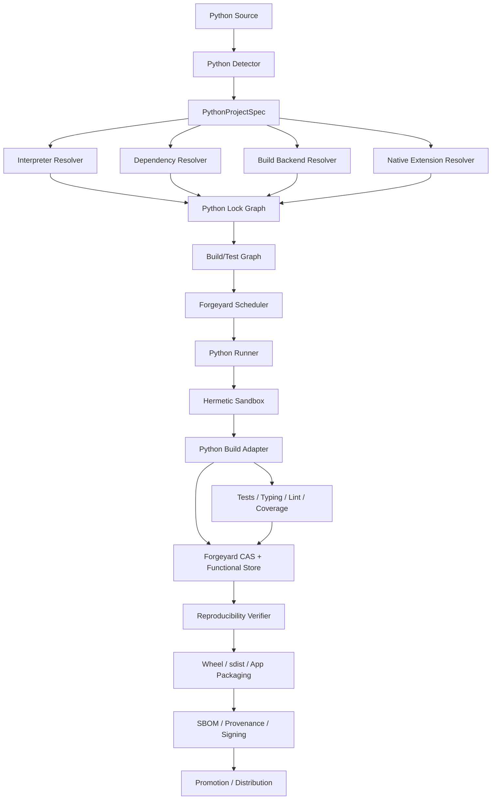

# Forgeyard Python CI/CD System & Architecture

**Document type:** Dedicated language ecosystem System & Architecture  
**Project:** Forgeyard CI/CD  
**Subsystem:** First-class Python build, test, packaging, reproducibility, dependency resolution, native-extension integration, distribution, and release architecture  
**Implementation direction:** Rust-first Forgeyard core with native integration to the Python ecosystem  
**Status:** Target production architecture  
**Relationship to Forgeyard:** This document defines the dedicated Python subsystem that integrates with Forgeyard's pipeline IR, hermetic build system, scheduler, runners, CAS, functional store, provenance, packaging, distribution, and deployment architecture.

---

# 1. Purpose

Python looks simple at source level but production CI/CD can become highly mutable because Python projects often depend on:

- interpreter version;
- interpreter implementation;
- ABI;
- platform tag;
- wheel compatibility;
- sdist build behavior;
- `pyproject.toml`;
- PEP 517 build backends;
- build-system requirements;
- dependency resolver behavior;
- index state;
- private package indexes;
- wheel availability;
- native C/C++/Rust extensions;
- system libraries;
- virtual environment state;
- global site-packages;
- editable installs;
- environment variables;
- package-manager caches;
- generated code;
- platform-specific dependencies;
- lockfile semantics;
- dynamic project metadata;
- build-time network access;
- setuptools/distutils legacy behavior;
- manylinux/musllinux compatibility;
- macOS deployment targets;
- Windows CRT/toolchain behavior.

Forgeyard therefore needs a dedicated Python subsystem whose central rule is:

> **A Python build is defined by source + interpreter + ABI/platform contract + dependency lock graph + build backend + packaging configuration + native-extension closure + controlled environment.**

---

# 2. Architectural Objectives

Forgeyard Python MUST:

1. support CPython as the primary interpreter;
2. permit PyPy or additional implementations through adapters;
3. support `pyproject.toml`;
4. support PEP 517 build isolation;
5. support wheels and sdists;
6. support uv as a preferred first-class modern resolver/installer;
7. support pip;
8. support Poetry;
9. support `requirements*.txt`;
10. support lockfile-oriented workflows;
11. support virtual environments;
12. support workspaces/monorepos where tooling permits;
13. support private indexes;
14. support fully offline builds after input fetching;
15. support native C/C++ extensions;
16. support Rust/PyO3/maturin extensions;
17. support Linux manylinux/musllinux packaging;
18. support Windows wheels;
19. support macOS wheels;
20. support cross-platform test matrices;
21. support pytest;
22. support unittest;
23. support typing with mypy/pyright adapters;
24. support linting/formatting with Ruff and other tools;
25. support coverage;
26. support property testing;
27. support reproducible wheels and source distributions;
28. support SBOM/provenance;
29. support deterministic package promotion;
30. support local-first and distributed Forgeyard modes.

---

# 3. Non-Goals

Forgeyard does not replace:

- CPython;
- uv;
- pip;
- Poetry;
- setuptools;
- Hatchling;
- Flit;
- PDM;
- maturin;
- pytest;
- Ruff;
- mypy;
- Pyright.

Forgeyard resolves, locks, isolates, verifies, caches, packages, and orchestrates these tools.

---

# 4. High-Level Architecture



---

# 5. Suggested Forgeyard Workspace

```text
crates/
├── forgeyard-python/
├── forgeyard-python-model/
├── forgeyard-python-detect/
├── forgeyard-python-interpreter/
├── forgeyard-python-lock/
├── forgeyard-python-resolver/
├── forgeyard-python-uv/
├── forgeyard-python-pip/
├── forgeyard-python-poetry/
├── forgeyard-python-build/
├── forgeyard-python-pep517/
├── forgeyard-python-wheel/
├── forgeyard-python-sdist/
├── forgeyard-python-native/
├── forgeyard-python-maturin/
├── forgeyard-python-test/
├── forgeyard-python-analysis/
├── forgeyard-python-coverage/
├── forgeyard-python-package/
└── forgeyard-python-provenance/
```

---

# 6. Core Domain Model

```rust
pub struct PythonProjectSpec {
    pub source: SourceRef,

    pub interpreter: PythonInterpreterRequest,
    pub project_metadata: PythonProjectMetadata,
    pub dependencies: PythonDependencyPolicy,
    pub build_backend: PythonBuildBackendSpec,

    pub build_platform: BuildPlatform,
    pub target_platform: TargetPlatform,

    pub native_extensions: NativeExtensionPolicy,
    pub testing: PythonTestPolicy,
    pub typing: TypingPolicy,
    pub analysis: PythonAnalysisPolicy,
    pub reproducibility: ReproducibilityPolicy,
}
```

---

# 7. Strong Types

```rust
pub enum PythonImplementation {
    CPython,
    PyPy,
    Other(String),
}

pub struct PythonVersion(String);
pub struct PythonAbiTag(String);
pub struct PythonPlatformTag(String);
pub struct PythonInterpreterId(Digest);
pub struct PythonLockGraphId(Digest);
```

---

# 8. Project Detection

Detect:

```text
pyproject.toml
setup.py
setup.cfg
requirements.txt
requirements-*.txt
uv.lock
poetry.lock
Pipfile.lock
tox.ini
pytest.ini
mypy.ini
ruff.toml
.pylintrc
```

Detection produces evidence; explicit Forgeyard configuration remains authoritative.

---

# 9. Detection Model

```rust
pub struct PythonDetection {
    pub pyproject: bool,
    pub build_backend: Option<DetectedBuildBackend>,
    pub lockfiles: Vec<DetectedPythonLockfile>,
    pub requirement_files: Vec<VirtualPath>,
    pub native_extension_risk: DetectionState,
    pub test_frameworks: Vec<DetectedTestFramework>,
}
```

---

# 10. Interpreter Identity

Interpreter version string alone is insufficient.

Identity should include:

```text
implementation
version
binary
stdlib
ABI
platform
build configuration
runtime shared library where relevant
```

Logical identity:

```text
PythonInterpreterId = H(interpreter closure)
```

---

# 11. CPython

First-class CPython support.

Record:

```text
major/minor/micro version
ABI flags/tag
platform
stdlib identity
libpython if present
build options where relevant
```

---

# 12. PyPy

Optional adapter.

Treat PyPy as separate implementation/ABI.

Never reuse CPython native wheels blindly.

---

# 13. Interpreter Modes

```rust
pub enum PythonInterpreterMode {
    LockedManaged,
    PlatformProvided,
    AuditedHost,
}
```

Preferred CI:

```text
LockedManaged
```

---

# 14. Interpreter Trust

```rust
pub enum PythonInterpreterTrust {
    Unverified,
    DigestVerified,
    VendorVerified,
    OrganizationApproved,
    Revoked,
}
```

---

# 15. `pyproject.toml`

This is the central project metadata/configuration source.

Forgeyard records relevant sections:

```text
[build-system]
[project]
[project.optional-dependencies]
[project.scripts]
[project.entry-points]
tool-specific sections
```

The exact file digest is also part of source identity.

---

# 16. PEP 517 Build Backend

Model:

```text
backend name
backend package/version
backend dependencies
backend config settings
```

Common adapters:

```text
setuptools.build_meta
hatchling
flit_core
pdm-backend
maturin
poetry-core
custom PEP 517 backend
```

---

# 17. Build Isolation

PEP 517 build environment is created hermetically.

Build requirements are resolved/fetched before build.

No global site-packages.

---

# 18. Build Backend Identity

```text
BuildBackendId =
H(
    backend package closure,
    config,
    Python interpreter,
    build-system requirements
)
```

---

# 19. Dependency Strategy

Supported modes:

```text
uv lock
Poetry lock
pip requirements with hashes/constraints
Forgeyard-generated immutable resolution
vendor/wheelhouse
```

Strict release prefers an immutable resolved dependency graph.

---

# 20. uv

Make uv a first-class preferred integration because it supports fast modern Python environment and package workflows.

Forgeyard should still remain independent from uv's implementation details.

---

# 21. uv Integration

Record:

```text
uv binary/version/digest
uv.lock digest
Python interpreter constraint
resolved packages
index/source metadata
```

Strict build uses frozen/locked behavior.

---

# 22. pip

Support pip as a first-class compatibility path.

Strict pip workflows should prefer:

```text
constraints
hashes
wheelhouse
offline install
```

rather than mutable resolution during build.

---

# 23. Poetry

Record:

```text
Poetry version
poetry.lock
pyproject.toml
groups/extras
source indexes
```

Poetry's environment/cache is not authoritative.

---

# 24. Requirements Files

Support:

```text
requirements.txt
requirements-dev.txt
constraints.txt
```

but production-grade reproducibility should require exact pins and preferably hashes.

---

# 25. Lock Graph

Outer Forgeyard lock:

```text
interpreter identity
dependency graph identity
build backend identity
source package/wheel identities
native toolchain identities
```

---

# 26. Forgeyard Python Lock Example

```ron
python: (
    interpreter: (
        implementation: CPython,
        version: "3.x.y",
        digest: "blake3:...",
    ),

    resolver: (
        kind: Uv,
        digest: "blake3:...",
    ),

    lock_graph: "blake3:...",
)
```

---

# 27. Package Sources

Support:

```text
PyPI-compatible index
private index
direct URL
Git/VCS
local path
workspace package
vendored wheel/sdist
```

All mutable inputs are resolved into immutable content.

---

# 28. Index Policy

Separate:

```text
public package index
private index
organization mirror
air-gap mirror
```

Enterprise can deny direct public fetch.

---

# 29. Private Index Credentials

Credentials are fetch-stage secrets.

They do not enter the build environment or artifact identity.

---

# 30. Direct URL Dependencies

Lock:

```text
URL
expected digest
package metadata
```

Remote byte changes cause verification failure.

---

# 31. Git Dependencies

Resolve:

```text
repository
requested revision
commit
tree/content digest
```

Production builds never follow moving branches.

---

# 32. Local Path Dependencies

Local package path resolves inside source snapshot.

Never depend on arbitrary external host directories.

---

# 33. Dependency Graph

```text
root project
   ↓
direct dependencies
   ↓
transitive packages
   ↓
platform/python-version markers
```

The resolved graph is target/interpreter-sensitive.

---

# 34. Environment Markers

Python dependency selection can depend on:

```text
python_version
platform_system
platform_machine
implementation_name
extra
```

These conditions are part of derivation identity.

---

# 35. Extras

Selected extras are explicit:

```rust
pub struct PythonExtras(BTreeSet<String>);
```

Changing extras changes dependency closure.

---

# 36. Dependency Groups

Development/test/docs groups are separate from runtime dependencies.

Do not ship dev tooling in runtime environments unless required.

---

# 37. Wheel vs sdist

Forgeyard prefers wheels for installation when trusted/compatible.

If only sdist exists:

```text
sdist
  ↓
PEP 517 build derivation
  ↓
wheel
  ↓
immutable wheel object
```

---

# 38. Wheel Identity

Wheel filename contains semantic tags, but Forgeyard identity is content digest.

Record:

```text
distribution
version
python tag
ABI tag
platform tag
content digest
```

---

# 39. Wheel Compatibility

Forgeyard validates wheel tags against target interpreter/platform.

Never install incompatible wheels because filenames superficially match.

---

# 40. Pure Python Wheels

Typically:

```text
py3-none-any
```

or related compatible tags.

Still lock wheel content.

---

# 41. Native Wheels

Platform-specific.

Examples:

```text
manylinux
musllinux
win_amd64
macosx_...
```

Native toolchain/platform identity matters.

---

# 42. Native Extensions

Python extensions may use:

```text
C
C++
Cython
Rust/PyO3
Fortran
other native toolchains
```

Forgeyard must model them explicitly.

---

# 43. C/C++ Extension Integration

Use Forgeyard C/C++ subsystem for:

```text
compiler
linker
sysroot
native libraries
runtime linkage
```

---

# 44. Rust Extension Integration

Use Forgeyard Rust subsystem for:

```text
rustc
cargo
Cargo.lock
target
PyO3/maturin build
```

---

# 45. maturin

First-class adapter for Rust-backed Python wheels.

Record:

```text
maturin binary
Rust toolchain
Cargo lock
Python interpreter/ABI
wheel target
```

---

# 46. Cython

Cython version and generated C/C++ source are build inputs.

Generated code may be:

```text
committed and verified
or
generated in a dedicated build stage
```

---

# 47. Native Runtime Closure

After building an extension:

```text
.so / .pyd / dylib-related object
```

validate dynamic dependencies using Forgeyard C/C++ linkage subsystem.

---

# 48. Hermetic Environment

Strict Python build sees:

```text
locked interpreter
dependency wheel/sdist closure
isolated virtual environment
build backend
native toolchains if needed
controlled cache
source snapshot
```

It does not see:

```text
system site-packages
user site-packages
developer virtualenv
global pip config
arbitrary compiler
random `/usr/local` libraries
```

---

# 49. Environment Synthesis

Forgeyard controls:

```text
PATH
HOME
VIRTUAL_ENV
PYTHONHOME where appropriate
PYTHONPATH
PYTHONNOUSERSITE
PIP_CONFIG_FILE
PIP_CACHE_DIR
UV_CACHE_DIR
POETRY_CACHE_DIR
TMPDIR
LANG
TZ
SOURCE_DATE_EPOCH
```

and native build variables as required.

---

# 50. `PYTHONPATH`

Strict mode does not inherit host `PYTHONPATH`.

Project source paths are explicitly configured.

---

# 51. User Site Packages

Set/ensure:

```text
PYTHONNOUSERSITE
```

or equivalent isolation policy.

User-installed packages must never affect CI.

---

# 52. Virtual Environments

Virtualenv is a materialized environment, not dependency truth.

Identity comes from:

```text
interpreter
locked dependency graph
installation policy
```

Virtualenv may be recreated at any time.

---

# 53. Virtualenv Cache

Can be cached as acceleration if keyed strongly.

Do not rely on arbitrary developer `.venv`.

---

# 54. Editable Installs

Editable installs are useful for development/testing.

Release packaging should validate normal built distributions too.

Editable behavior is never assumed equivalent to installed wheel behavior.

---

# 55. Package Build

Standard path:

```text
source
  ↓
PEP 517 isolated build
  ↓
wheel/sdist
  ↓
content hash
```

---

# 56. sdist

Source distribution should be deterministic.

Normalize:

```text
file ordering
timestamps
ownership/permissions where format supports it
generated metadata
```

---

# 57. Wheel Reproducibility

Potential nondeterminism:

```text
ZIP timestamps
file ordering
generated metadata
native linker output
build paths
generated C/Rust code
```

Forgeyard verifies actual wheel content independently.

---

# 58. RECORD

Wheel `RECORD` integrity data must correspond to final package contents.

Forgeyard validates wheel structure before publication.

---

# 59. Metadata Validation

Validate:

```text
METADATA
WHEEL
entry_points
top-level packages
RECORD
license files
```

---

# 60. Dynamic Metadata

If project metadata is computed dynamically, the tool/backend performing that computation is part of derivation identity.

Avoid environment-derived version surprises.

---

# 61. Versioning

Recommended deterministic source:

```text
explicit version
or
immutable VCS-derived version
```

Avoid wall-clock/random version generation for release packages.

---

# 62. setuptools_scm / VCS Versioning

If used, Forgeyard supplies immutable source revision metadata.

Do not depend on arbitrary Git state outside source snapshot.

---

# 63. Dirty Source

Release default:

```text
dirty source = denied
```

Local mode may allow dirty snapshot with content digest.

---

# 64. Build Network

Release build default:

```text
network = denied
```

after dependency/build requirements are fetched.

---

# 65. Build Requirements

`[build-system].requires` dependencies are fetched and locked before realization.

Build backend cannot silently fetch new packages.

---

# 66. Cache Layers

```text
resolver/download cache
wheel cache
virtualenv cache
test cache
Forgeyard action cache
Forgeyard CAS
```

All have different semantics.

---

# 67. pip Cache

Disposable acceleration.

Never a source of dependency identity.

---

# 68. uv Cache

Same principle.

Forgeyard may prewarm/manage it but correctness rests on locked artifacts.

---

# 69. Wheelhouse

High-assurance model:

```text
resolved wheel/sdist closure
  ↓
Forgeyard immutable wheelhouse
  ↓
offline install
```

---

# 70. Air-Gapped Build

Bundle:

```text
Python interpreter
resolver/installer
wheel/sdist closure
build backend packages
native toolchains
source
lock graph
```

Then build/test offline.

---

# 71. Testing

First-class:

```text
pytest
unittest
doctest adapters
tox/nox adapters
```

---

# 72. pytest

Track:

```text
pytest version
plugins
config
markers
selected extras
```

pytest plugins are dependencies and can execute arbitrary code.

---

# 73. Test Plan

```rust
pub struct PythonTestPlan {
    pub runner: PythonTestRunner,
    pub environments: Vec<PythonTestEnvironment>,
    pub shards: u32,
    pub coverage: CoveragePolicy,
    pub timeout: Duration,
}
```

---

# 74. Python Version Matrix

Common library CI:

```text
3.x
3.y
3.z
```

Each interpreter version is a distinct derivation/test environment.

---

# 75. Platform Matrix

For native packages:

```text
Linux
Windows
macOS
```

and architecture variants.

---

# 76. tox

Optional adapter.

Forgeyard may consume tox environment definitions.

But Forgeyard scheduler remains authoritative.

---

# 77. nox

Same principle.

Sessions become Forgeyard test/task plans where practical.

---

# 78. Test Sharding

Shard by:

```text
test files
packages
markers
historical duration
```

while preserving fixtures/ordering requirements.

---

# 79. Flaky Test Policy

Forgeyard should record retries separately.

A passing retry must not erase the initial failure.

---

# 80. Coverage

Support:

```text
coverage.py
pytest-cov
native-extension coverage adapters
```

Coverage data is evidence, not build identity.

---

# 81. Coverage Aggregation

Normalize paths across runners.

Merge shards only if source/interpreter/test configuration matches.

---

# 82. Type Checking

First-class adapters:

```text
mypy
Pyright
basedpyright
```

Tool version/config participates in analysis action identity.

---

# 83. mypy

Track:

```text
mypy version
config
plugins
Python target version
typeshed/dependency stubs
```

---

# 84. Pyright

Track:

```text
Pyright binary/package identity
config
Python target
type stubs
```

---

# 85. Linting

Preferred first-class:

```text
Ruff
```

plus adapters for:

```text
Pylint
Flake8
custom tools
```

---

# 86. Ruff

Track:

```text
Ruff binary/version
config
target Python version
selected rules
```

---

# 87. Formatting

Support verification:

```text
ruff format
Black
```

CI reports a diff rather than mutating source.

---

# 88. Import Sorting

Ruff/isort adapters.

Again, verification stage should not silently rewrite release source.

---

# 89. Property Testing

Hypothesis-based tests are ordinary test evidence.

Seeds/examples are recorded when failures occur.

---

# 90. Fuzzing

Python fuzz adapters can exist, especially for parsers/native extensions.

Fuzzing is separate evidence, not package identity.

---

# 91. Security Analysis

Potential integrations:

```text
dependency vulnerability scanner
Bandit adapter
Semgrep adapter
native-extension security analysis
```

Tools are locked.

---

# 92. Dependency Trust

Each package source has trust state:

```text
Unverified
HashVerified
IndexVerified
OrganizationApproved
Revoked
```

---

# 93. Dependency Confusion

Forgeyard should flag:

```text
private/public namespace collisions
new package source
unexpected index
direct URL additions
VCS dependency changes
```

---

# 94. Lock Diff

Example:

```text
requests 2.x -> 3.x
4 transitive packages changed
1 sdist introduced
1 native wheel introduced
index changed
license changed
```

---

# 95. sdist Risk

sdist requires executing a build backend.

Policy can prefer wheels and flag new sdist builds for review.

---

# 96. Native Wheel Provenance

Record:

```text
compiler
linker
sysroot
native dependencies
Python ABI
platform tag
```

---

# 97. manylinux

Linux wheel builds must explicitly model compatibility policy.

Forgeyard should use controlled manylinux-compatible build environments where required.

---

# 98. musllinux

Treat musllinux separately from manylinux/glibc.

Do not label both generically as Linux.

---

# 99. Linux Wheel Target

Model:

```text
architecture
libc family
compatibility baseline
Python ABI
```

---

# 100. Windows Wheel

Model:

```text
Windows architecture
Python ABI
MSVC/native runtime requirements
```

Native extension build integrates with Forgeyard C/C++ Windows toolchain.

---

# 101. macOS Wheel

Model:

```text
architecture
deployment target
Python ABI
universal2 policy where used
```

Native build requires macOS runner/toolchain as appropriate.

---

# 102. universal2

If producing universal2 wheel, both architecture slices/toolchain behavior are explicit.

---

# 103. Wheel Repair Tools

Adapters may use ecosystem-standard repair tools.

The tool binary/version is locked.

Repair is a separate deterministic packaging derivation.

---

# 104. Runtime Linkage Repair/Validation

Any rewritten/bundled native libraries must be validated after repair.

---

# 105. Pure Python Application Packaging

Potential:

```text
wheel
zipapp
PEX adapter
shiv adapter
container image
Forgeyard native app bundle
```

These are separate package adapters.

---

# 106. Server Deployment

Recommended:

```text
immutable wheel/application artifact
+
runtime dependency closure
+
runtime config
+
secrets
```

Do not install unpinned packages at deployment time.

---

# 107. Container Deployment

Use immutable base image digest.

Prefer installing from Forgeyard wheelhouse rather than live PyPI.

---

# 108. Build Once, Promote Many

```text
source
  ↓
wheel/app artifact X
  ↓
test X
  ↓
reproduce X
  ↓
stage X
  ↓
production X
```

---

# 109. Package Publishing

Publishing to PyPI/private index is separate from build.

```text
verified immutable wheel/sdist
  ↓
approval
  ↓
publish exact files
```

Never rebuild during publish.

---

# 110. Release Manifest

```rust
pub struct PythonReleaseManifest {
    pub version: Version,
    pub distributions: Vec<PythonDistributionRef>,
    pub sbom: Digest,
    pub provenance: Digest,
}
```

---

# 111. Reproducibility

Same derivation:

```text
Runner A -> wheel X
Runner B -> wheel Y
```

Compare actual package content.

For pure Python wheels, bit-for-bit should often be achievable.

Native wheels depend on native toolchain reproducibility.

---

# 112. Reproducer Diversity

Potential:

```text
different physical runner
different pool
same interpreter/toolchain/target identity
```

---

# 113. Reproduction Mismatch

Quarantine package.

Inspect:

```text
wheel ZIP metadata
METADATA/WHEEL
native libraries
build paths
generated source
timestamps
VCS metadata
```

---

# 114. Source Distribution Reproduction

sdist can also be independently reproduced and compared.

---

# 115. Environment Isolation

Synthetic HOME prevents:

```text
pip.conf
.pypirc
Poetry user config
global credentials
user site-packages
```

from silently affecting build.

---

# 116. Package Manager Config

Project-local config is source input.

User-global config is ignored in strict mode.

Secrets are supplied through fetch policy only.

---

# 117. Environment Variables

Build-time variables affecting output are explicit.

Runtime secrets/config must not become wheel identity unless intentionally baked.

---

# 118. `PYTHONHASHSEED`

For tests/tools where deterministic hash iteration matters, Forgeyard may set a deterministic value.

Do not claim this alone makes application behavior deterministic.

---

# 119. Locale/Timezone

Strict defaults:

```text
LANG=C.UTF-8
LC_ALL=C.UTF-8
TZ=UTC
```

unless explicitly configured.

---

# 120. Build Paths

Use stable virtual source/build roots.

Native compilers receive prefix-map rules through C/C++ integration where supported.

---

# 121. Generated Files

Examples:

```text
protobuf stubs
OpenAPI clients
Cython output
ORM generated files
version files
```

Generator identity is explicit.

---

# 122. Generated-Code Verification

If generated files are committed:

```text
regenerate
  ↓
diff
  ↓
fail if stale
```

---

# 123. Python Bytecode

`.pyc` is generally deployment/runtime cache, not source identity.

Forgeyard package policy should avoid treating arbitrary host-generated bytecode as authoritative unless deliberately produced.

---

# 124. Entry Points

Validate:

```text
console_scripts
gui_scripts
plugin entry points
```

against installed package content.

---

# 125. Package Import Smoke Test

After building/installing wheel in clean environment:

```text
import package
run CLI --help/version
```

as configured.

---

# 126. Clean Install Verification

```text
fresh virtualenv
  ↓
install wheel from Forgeyard wheelhouse
  ↓
no network
  ↓
import/smoke test
```

This directly tests package completeness.

---

# 127. Dependency Groups for CI

Separate:

```text
runtime
test
typecheck
lint
docs
build
```

to avoid giant universal environments.

---

# 128. Environment Reuse

Forgeyard may cache environments by immutable environment identity.

```text
InterpreterId
+
DependencyGraphId
+
selected groups/extras
```

---

# 129. Remote Execution

Good candidates:

```text
test shards
typecheck
lint
wheel builds
platform wheel matrix
```

---

# 130. Scheduler Capabilities

```rust
pub struct PythonRunnerCapabilities {
    pub interpreters: Vec<PythonInterpreterId>,
    pub platforms: Vec<PythonPlatform>,
    pub native_toolchains: Vec<CppToolchainId>,
    pub rust_toolchains: Vec<RustToolchainId>,
    pub sandbox: SandboxCapabilities,
}
```

---

# 131. Scheduler Hard Constraints

Filter by:

```text
interpreter/ABI
target platform
native compiler requirement
Rust extension requirement
macOS/Windows native wheel requirement
trust tier
memory
```

---

# 132. Scheduler Scoring

Score:

```text
wheelhouse locality
interpreter locality
native toolchain locality
cache warmth
queue delay
resource headroom
```

---

# 133. Runner Prewarming

Prefetch:

```text
Python interpreters
common wheels
build backends
native toolchains
```

---

# 134. Test Matrix Optimization

For pure-Python library:

```text
full Python-version matrix
+
one or two primary OSes
```

For native extension:

```text
Python version x OS x architecture
```

matrix is materially larger.

---

# 135. Change Impact

Use package/module/test mapping where reliable.

Python import dynamics limit certainty.

If uncertain:

```text
run broader safe set
```

---

# 136. Monorepos

Support multiple Python packages/projects within one repository.

Each package gets:

```text
source root
pyproject
dependency graph
build/test targets
```

---

# 137. Workspace Relationships

Local package dependencies resolve to immutable repository paths/content.

---

# 138. Test Sharding

Can use historical duration to balance shards.

Preserve fixtures/session dependencies.

---

# 139. Flaky Test Recording

Record:

```text
initial failure
retry count
final state
```

Never erase flakiness evidence.

---

# 140. Benchmarking

Support:

```text
pytest-benchmark adapter
pyperf adapter
custom benchmarks
```

Use dedicated stable runner class.

---

# 141. Performance Baselines

Record:

```text
CPU
Python interpreter
OS
native dependencies
runner class
```

---

# 142. Dioxus UI

Dedicated Python panels:

```text
Interpreter
ABI/platform
Dependency graph
Build backend
Wheel matrix
Native extensions
Tests
Typing
Lint
Coverage
Reproducibility
Package contents
```

---

# 143. Interpreter UI

Show:

```text
implementation
version
ABI
platform
digest
trust
```

---

# 144. Dependency UI

Show:

```text
package
version
source
wheel/sdist
hash
direct/transitive
runtime/dev group
native-extension marker
```

---

# 145. Wheel Matrix UI

Show wheel targets:

```text
Python tag
ABI tag
platform tag
build status
reproducibility status
```

---

# 146. Native Extension UI

Display:

```text
extension
language
compiler/toolchain
runtime linkage
wheel targets
```

---

# 147. CLI

Recommended:

```text
forgeyard python detect
forgeyard python lock
forgeyard python fetch
forgeyard python env
forgeyard python build
forgeyard python wheel
forgeyard python sdist
forgeyard python test
forgeyard python typecheck
forgeyard python lint
forgeyard python format-check
forgeyard python coverage
forgeyard python analyze
forgeyard python reproduce
forgeyard python package
forgeyard python explain
forgeyard python explain-rebuild
forgeyard python deps
forgeyard python interpreter
```

---

# 148. `forgeyard python explain`

Shows:

```text
interpreter
ABI
resolver
lock graph
build backend
selected extras/groups
native extensions
wheel target
sandbox
cache
```

---

# 149. Explain Rebuild

Examples:

```text
Python interpreter changed
uv.lock changed
build backend changed
extra selected
platform tag changed
native compiler changed
Cython changed
```

---

# 150. Failure Classification

```rust
pub enum PythonFailure {
    DetectionFailure,
    InterpreterFailure,
    LockFailure,
    DependencyResolutionFailure,
    FetchFailure,
    BuildBackendFailure,
    WheelBuildFailure,
    SdistBuildFailure,
    NativeExtensionFailure,
    TestFailure,
    TypingFailure,
    AnalysisFailure,
    PackagingFailure,
    ReproducibilityFailure,
}
```

---

# 151. Diagnostics

```rust
pub struct PythonDiagnostic {
    pub severity: Severity,
    pub tool: ToolIdentity,
    pub package: Option<String>,
    pub file: Option<VirtualPath>,
    pub line: Option<u32>,
    pub message: String,
}
```

---

# 152. Dependency Failure Example

```text
Python dependency unavailable offline

package:
  example-lib==1.2.3

required artifact:
  source distribution

suggestion:
  forgeyard python fetch
```

---

# 153. Native Extension Violation

```text
Native extension hermeticity violation

attempted library:
  /usr/local/lib/libfoo.so

reason:
  outside declared native closure
```

---

# 154. Development Environment

```text
forgeyard python dev
```

provides:

```text
interpreter
locked dependency groups
test tools
type checker
linter
build backend
```

matching CI identity.

---

# 155. IDE Integration

Export:

```text
interpreter path
virtual environment
typing config
project roots
```

for editors/IDEs.

---

# 156. Local Mode

Standalone Forgeyard supports:

```text
interpreter resolution
dependency fetch
environment materialization
build
test
wheel/sdist
package
```

without remote services.

---

# 157. Distributed Mode

```text
daemon
  ↓
Python task
  ↓
remote runner
  ↓
interpreter + wheelhouse
  ↓
build/test
  ↓
CAS
```

---

# 158. Enterprise Mode

Adds:

```text
private package mirror
approved interpreter mirror
signed lock approval
OIDC/RBAC
wheel build farm
independent reproducers
multi-region CAS
air-gap support
```

---

# 159. Supply-Chain Policy

Potential gates:

```text
hash required
untrusted index denied
new sdist flagged
native extension flagged
private/public collision denied
revoked dependency denied
```

---

# 160. SBOM

Combine:

```text
locked Python dependency graph
built distributions
native runtime closure
interpreter identity
```

---

# 161. Provenance

Record:

```text
source digest
pyproject digest
lock graph
interpreter ID
build backend ID
resolver ID
selected extras/groups
wheel target
native toolchain if used
output digest
runner
sandbox policy
```

---

# 162. Packaging Targets

```text
wheel
sdist
zipapp
PEX adapter
container
native application bundle adapter
Forgeyard package
```

---

# 163. Library Release

For libraries:

```text
wheel set
sdist
SBOM
provenance
signatures
```

---

# 164. Application Release

For apps:

```text
application artifact
runtime dependency closure
interpreter/runtime requirement
config schema
SBOM/provenance
```

---

# 165. OCI

Use immutable base images.

Install from Forgeyard wheelhouse offline.

Avoid live package resolution inside Dockerfile during release assembly.

---

# 166. Build Once, Promote Many

```text
source
  ↓
wheel/app artifact X
  ↓
test X
  ↓
reproduce X
  ↓
stage X
  ↓
production X
```

---

# 167. Production Defaults

Recommended:

```text
locked interpreter
locked resolver
locked dependency graph
PEP 517 isolation
offline build
synthetic HOME
no user site-packages
no ambient PYTHONPATH
private credentials fetch-only
native toolchains locked
clean install verification
independent reproduction
```

---

# 168. Development Defaults

May allow:

```text
warm caches
editable install
dirty source
reduced matrix
```

with visible reproducibility status.

---

# 169. Error-Prone Behaviors to Prevent

Forgeyard should detect/reject:

```text
global site-packages leakage
ambient PYTHONPATH
ambient pip/Poetry config
unlocked index resolution
live network during release build
local path dependency outside source snapshot
unhashed direct URL
unexpected sdist execution
native extension using host compiler/library
incompatible wheel tag
stale lockfile
dynamic wall-clock version
rebuilding artifact during publish
```

---

# 170. Reference PR Pipeline

```text
detect
  ↓
lock verification
  ↓
format check
  ↓
lint
  ↓
typecheck
  ↓
unit tests
  ↓
wheel build
  ↓
clean install smoke test
```

---

# 171. Reference Library Matrix

```text
Python version matrix
  x
primary OS matrix
```

Native projects expand OS/architecture coverage.

---

# 172. Reference Nightly

```text
full interpreter matrix
full platform tests
coverage
security analysis
native wheel matrix
dependency vulnerability refresh
reproducibility sampling
```

---

# 173. Reference Release

```text
clean source
  ↓
locked interpreter/resolver
  ↓
offline dependency closure
  ↓
PEP 517 wheel/sdist build
  ↓
test built wheel in clean env
  ↓
typing/lint/security evidence
  ↓
native linkage validation if needed
  ↓
independent reproduction
  ↓
SBOM/provenance
  ↓
sign
  ↓
publish/promote exact package bytes
```

---

# 174. Implementation Phase 1 — Domain and Detection

Implement:

```text
PythonProjectSpec
pyproject detection
build backend detection
lockfile detection
native extension detection
```

Exit:

Forgeyard accurately describes common Python repositories.

---

# 175. Phase 2 — Interpreter Locking

Implement:

```text
CPython import/store
InterpreterId
ABI/platform model
toolchain trust
```

---

# 176. Phase 3 — uv + pip Resolution

Implement:

```text
uv adapter
pip compatibility
private index fetch
wheel/sdist store
offline installation
```

---

# 177. Phase 4 — PEP 517 Build

Implement:

```text
build-system requirements
isolated build environment
wheel
sdist
metadata validation
```

---

# 178. Phase 5 — Testing/Analysis

Implement:

```text
pytest
unittest
Ruff
mypy
Pyright adapter
coverage
```

---

# 179. Phase 6 — Native Extensions

Integrate:

```text
C/C++ extensions
Cython
maturin/PyO3
native linkage validation
```

---

# 180. Phase 7 — Platform Wheel Matrix

Implement:

```text
manylinux
musllinux
Windows
macOS
wheel repair/validation
```

---

# 181. Phase 8 — Reproducibility

Implement:

```text
deterministic wheel/sdist policies
content comparison
independent rebuild
quarantine
```

---

# 182. Phase 9 — Packaging/Publishing

Implement:

```text
release manifest
PyPI/private-index publisher
OCI
application bundles
promotion
```

---

# 183. Phase 10 — Distributed Optimization

Implement:

```text
wheelhouse locality
test sharding
wheel build farms
interpreter prewarming
multi-platform scheduling
```

---

# 184. Acceptance Tests

1. Remove host Python: locked interpreter build succeeds.
2. Change global site-packages: strict build unchanged.
3. Change ambient `PYTHONPATH`: strict build unchanged.
4. Change pip/Poetry user config: strict build unchanged.
5. Disable network after fetch: install/build succeeds.
6. Change interpreter micro version: derivation changes.
7. Change lockfile: dependency graph changes.
8. Direct URL content changes: digest verification fails.
9. Local path outside source snapshot: strict build rejects.
10. New sdist requires undeclared build dependency: build fails before hidden fetch.
11. Native extension uses `/usr/local/lib`: strict build rejects.
12. Wheel platform tag incompatible: install validation fails.
13. Clean virtualenv installs built wheel without network.
14. Independent runner reproduces pure-Python wheel.
15. Reproducer mismatch quarantines wheel.
16. Publishing uses exact verified wheel digest.
17. Native wheel compiler change changes derivation.
18. `pyproject.toml` build backend change changes derivation.

---

# 185. Production Readiness Gates

Do not call Python support production-ready until:

```text
interpreter identity is stable
uv/pip lock workflows are correct
private indexes work securely
offline installation works
PEP 517 isolation is correct
user/global Python state cannot leak
wheel compatibility validation works
native extensions integrate with C/C++/Rust
manylinux/musllinux distinctions are correct
Windows/macOS wheel builds are tested
clean-install verification works
reproducibility verifier detects wheel differences
publish pipeline never rebuilds artifacts
```

---

# 186. Architectural Invariants

1. Python version string alone is not interpreter identity.
2. Strict release does not resolve dependency versions from live indexes.
3. `pyproject.toml` and lock state are explicit build inputs.
4. Build-system requirements are locked before PEP 517 build.
5. Global/user site-packages are never trusted CI inputs.
6. Ambient `PYTHONPATH` is denied in strict mode.
7. Virtual environments are materializations, not dependency truth.
8. Wheel/sdist content is cryptographically identified.
9. sdist builds are isolated and explicit.
10. Native extensions introduce native toolchain identity.
11. Rust extensions introduce Rust toolchain identity.
12. Wheel compatibility tags are validated.
13. Private-index credentials are fetch-only secrets.
14. Generated code is explicit.
15. Release versions must be deterministic.
16. Built wheel is tested in a clean install environment.
17. Reproducibility compares actual distribution bytes/content.
18. Publishing promotes exact verified files.
19. Cache layers are disposable acceleration.
20. Correctness takes precedence over minimizing test/build work.

---

# 187. Final Target Architecture

```text
                         Python Project
                              │
                              ▼
                    Forgeyard Python Detector
                              │
                              ▼
                       PythonProjectSpec
                              │
       ┌──────────────────────┼──────────────────────┐
       ▼                      ▼                      ▼
 Interpreter Resolver   Dependency Resolver   Build Backend Resolver
       │                      │                      │
       └──────────────────────┼──────────────────────┘
                              ▼
                    Immutable Python Lock
                              │
                              ▼
                    Build / Test / Wheel Graph
                              │
                              ▼
                     Forgeyard Scheduler
                              │
                              ▼
                    Hermetic Python Runner
                              │
                 ┌────────────┼────────────┐
                 ▼            ▼            ▼
             PEP 517       Tests       Type/Lint
                 │            │            │
                 └────────────┼────────────┘
                              ▼
                   Native Extension Validation
                        when applicable
                              │
                              ▼
                      Wheel / sdist Output
                              │
                              ▼
                    Independent Reproducer
                              │
                              ▼
                   Clean Install Verification
                              │
                              ▼
                    SBOM / Provenance / Sign
                              │
                              ▼
                    Forgeyard Distribution
```

---

# 188. Final Architectural Position

For a pure Python project:

```text
Source snapshot
+
Python interpreter
+
ABI/platform contract
+
pyproject.toml
+
dependency lock graph
+
resolver/installer
+
PEP 517 build backend
+
selected extras/groups
+
controlled environment
+
hermetic sandbox
=
Python derivation
```

For native extensions:

```text
Python derivation
+
C/C++ or Rust toolchain
+
native sysroot
+
native dependency closure
+
Python ABI
=
native Python derivation
```

A trustworthy release requires:

```text
Derivation
  ↓
offline hermetic dependency installation
  ↓
isolated PEP 517 build
  ↓
actual wheel/sdist digest
  ↓
clean-install tests
  ↓
typing / lint / tests / coverage/security evidence
  ↓
native linkage validation when required
  ↓
independent reproduction
  ↓
SBOM + provenance
  ↓
signature
  ↓
publication/promotion of identical files
```

This gives Forgeyard a Python subsystem that is fast and developer-friendly while preventing global site-packages, mutable indexes, ambient virtualenv state, hidden native libraries, uncontrolled build backends, and other common "works on my machine" failure modes.

---

# Appendix A — Recommended Python Release Policy

```ron
(
    python_release_policy: (
        source: (
            dirty_tree: Denied,
        ),

        interpreter: (
            locked: Required,
        ),

        dependencies: (
            locked: Required,
            hashes: RequiredWhereSupported,
            build_network: Denied,
        ),

        environment: (
            user_site_packages: Denied,
            ambient_pythonpath: Denied,
            user_package_manager_config: Denied,
        ),

        pep517: (
            isolation: Required,
            build_requirements_locked: Required,
        ),

        native_extensions: (
            toolchain_locked: RequiredWhenPresent,
            runtime_linkage_validation: RequiredWhenPresent,
        ),

        verification: (
            clean_install_test: Required,
        ),

        reproducibility: (
            independent_rebuilds: 1,
            distinct_host: true,
            comparison: BitForBitOrNormalizedDistribution,
        ),

        release: (
            sbom: Required,
            provenance: Required,
            signing: Required,
            rebuild_on_publish: Denied,
        ),
    ),
)
```

---

# Appendix B — Example uv-Based Configuration

```ron
python: (
    interpreter: Locked("cpython"),

    dependencies: Uv(
        lockfile: "uv.lock",
        frozen: true,
    ),

    build_backend: FromPyProject,

    testing: (
        runner: Pytest,
    ),

    analysis: (
        lint: Ruff,
        typing: Mypy,
    ),

    reproducibility: (
        network: Denied,
        independent_rebuilds: 1,
    ),
)
```

---

# Appendix C — Example Native Extension Configuration

```ron
python: (
    interpreter: Locked("cpython"),

    native_extension: (
        kind: Cpp,
        toolchain: Locked("clang-linux-x86_64"),
        sysroot: Locked("manylinux-sysroot"),
    ),

    wheel_target: (
        python_tag: "cp3xx",
        abi_tag: "cp3xx",
        platform: "manylinux_x86_64",
    ),
)
```

---

# Appendix D — First-Class Python Tooling Matrix

| Area | First-class |
|---|---|
| Interpreter | CPython |
| Additional interpreter | PyPy adapter |
| Resolver/install | uv, pip |
| Project manager | Poetry adapter |
| Metadata/build | `pyproject.toml`, PEP 517 |
| Build backends | setuptools, Hatchling, Flit, maturin, custom PEP 517 |
| Packaging | wheel, sdist |
| Testing | pytest, unittest |
| Typing | mypy, Pyright adapter |
| Lint/format | Ruff, Black adapter |
| Coverage | coverage.py / pytest-cov |
| Native C/C++ | Forgeyard C/C++ subsystem |
| Native Rust | Forgeyard Rust/maturin integration |
| Linux wheels | manylinux, musllinux |
| Windows wheels | CPython ABI + MSVC/native closure |
| macOS wheels | deployment target + architecture |
| Reproducibility | offline hermetic build + independent distribution rebuild |
