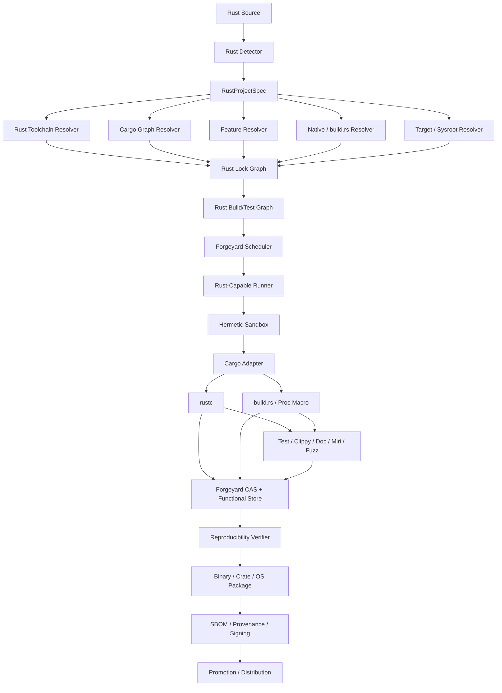

# Forgeyard Rust CI/CD System & Architecture

**Document type:** Dedicated language ecosystem System & Architecture  
**Project:** Forgeyard CI/CD  
**Subsystem:** First-class Rust build, test, analysis, packaging, reproducibility, dependency resolution, cross-compilation, supply-chain verification, self-hosting, and release integration  
**Implementation direction:** Rust-first Forgeyard core with native integration to Cargo, rustup-compatible toolchain manifests, rustc, rustdoc, Clippy, rustfmt, Miri, fuzzing/sanitizers, coverage, native toolchains, and platform SDKs  
**Status:** Target production architecture  
**Special role:** This subsystem is both Forgeyard's Rust integration for users and the reference/dogfooding subsystem used to build Forgeyard itself.

---

# 1. Purpose

Rust is Forgeyard's own implementation language and therefore deserves the strongest first-class integration.

A Rust build can depend on:

- Rust toolchain version;
- `rustc`;
- Cargo version;
- toolchain channel;
- toolchain components;
- target standard libraries;
- `Cargo.toml`;
- `Cargo.lock`;
- workspace topology;
- dependency source;
- registry state;
- Git dependencies;
- path dependencies;
- feature resolution;
- resolver version;
- target-specific dependencies;
- build profiles;
- `RUSTFLAGS`;
- `CARGO_ENCODED_RUSTFLAGS`;
- Cargo configuration;
- environment variables;
- proc macros;
- `build.rs`;
- native system libraries;
- C/C++ compilers;
- linkers;
- bindgen/libclang;
- pkg-config;
- CMake/Meson/Make;
- generated code;
- architecture features;
- libc/sysroot;
- platform SDKs;
- incremental compilation cache;
- sccache;
- build-script outputs;
- timestamps/build paths;
- linker metadata;
- packaging/signing.

Forgeyard must therefore define Rust builds as immutable derivations, not simply as:

```text
cargo build --release
```

The central rule is:

> **A Forgeyard Rust build is defined by source + complete Rust toolchain + Cargo dependency/source graph + feature graph + target + profile/codegen configuration + build-script/proc-macro/native closure + controlled environment.**

---

# 2. Architectural Objectives

Forgeyard Rust MUST:

1. support Cargo packages;
2. support Cargo workspaces;
3. support virtual workspaces;
4. support `Cargo.toml`;
5. support `Cargo.lock`;
6. support applications and libraries;
7. support binaries;
8. support static/dynamic libraries;
9. support proc-macro crates;
10. support build scripts;
11. support crates.io-compatible registries;
12. support private registries;
13. support sparse registries;
14. support Git dependencies;
15. support path/workspace dependencies;
16. support Cargo feature resolution;
17. support target-specific dependencies;
18. support `rust-toolchain.toml`;
19. support managed Rust toolchains;
20. support stable/beta/nightly where project policy permits;
21. support toolchain components;
22. support rustfmt;
23. support Clippy;
24. support rustdoc;
25. support tests;
26. support doctests;
27. support benchmarks;
28. support fuzzing;
29. support Miri;
30. support sanitizers where toolchain/target permits;
31. support code coverage;
32. support cross compilation;
33. support glibc/musl distinctions;
34. support Windows MSVC/GNU targets;
35. support macOS;
36. support Android NDK;
37. support WASM/WASI;
38. support embedded/no_std;
39. support native C/C++ dependencies;
40. support bindgen;
41. support reproducible release binaries;
42. support remote cache and execution;
43. support SBOM/provenance;
44. support crates/library publishing;
45. support deterministic binary packaging;
46. dogfood Forgeyard by building Forgeyard with Forgeyard;
47. remain local-first.

---

# 3. Non-Goals

Forgeyard does not replace:

- Cargo;
- rustc;
- rustup;
- rustfmt;
- Clippy;
- rustdoc;
- platform linkers;
- C/C++ toolchains;
- Android SDK/NDK;
- Apple SDK/Xcode.

Forgeyard locks, isolates, orchestrates, verifies, caches, packages, and distributes their results.

---

# 4. Rust as Forgeyard's Reference Ecosystem

Rust should be the first ecosystem for which Forgeyard itself proves:

```text
Forgeyard source
    ↓
Forgeyard Rust subsystem
    ↓
Forgeyard builds Forgeyard
    ↓
Forgeyard tests Forgeyard
    ↓
Forgeyard independently reproduces Forgeyard
    ↓
Forgeyard packages Forgeyard
    ↓
Forgeyard signs Forgeyard
    ↓
Forgeyard publishes Forgeyard
```

This is not merely marketing/dogfooding.

It continuously validates:

- scheduler correctness;
- CAS correctness;
- hermeticity;
- lock behavior;
- runner correctness;
- packaging;
- provenance;
- release promotion;
- rollback;
- cross-platform execution.

---

# 5. High-Level Architecture



---

# 6. Suggested Forgeyard Workspace

```text
crates/
├── forgeyard-rust/
├── forgeyard-rust-model/
├── forgeyard-rust-detect/
├── forgeyard-rust-toolchain/
├── forgeyard-rust-cargo/
├── forgeyard-rust-lock/
├── forgeyard-rust-registry/
├── forgeyard-rust-features/
├── forgeyard-rust-build-script/
├── forgeyard-rust-proc-macro/
├── forgeyard-rust-native/
├── forgeyard-rust-bindgen/
├── forgeyard-rust-cross/
├── forgeyard-rust-analysis/
├── forgeyard-rust-test/
├── forgeyard-rust-doc/
├── forgeyard-rust-miri/
├── forgeyard-rust-fuzz/
├── forgeyard-rust-coverage/
├── forgeyard-rust-package/
├── forgeyard-rust-publish/
└── forgeyard-rust-selfhost/
```

Capability boundaries matter more than physical crate count.

---

# 7. Core Domain Model

```rust
pub struct RustProjectSpec {
    pub source: SourceRef,

    pub workspace: CargoWorkspaceSpec,
    pub toolchain: RustToolchainRequest,
    pub dependencies: CargoDependencyPolicy,

    pub features: CargoFeaturePolicy,
    pub target: RustTargetSpec,
    pub profile: CargoProfileSpec,

    pub build_scripts: BuildScriptPolicy,
    pub proc_macros: ProcMacroPolicy,
    pub native: NativeDependencyPolicy,

    pub testing: RustTestPolicy,
    pub analysis: RustAnalysisPolicy,
    pub reproducibility: ReproducibilityPolicy,
}
```

---

# 8. Strong Types

```rust
pub struct RustToolchainId(Digest);
pub struct CargoGraphId(Digest);
pub struct CargoFeatureGraphId(Digest);
pub struct RustTargetId(Digest);
pub struct RustBuildScriptId(Digest);
pub struct ProcMacroId(Digest);

pub enum RustChannel {
    Stable,
    Beta,
    Nightly,
    Version(RustVersion),
}
```

---

# 9. Project Detection

Detect:

```text
Cargo.toml
Cargo.lock
rust-toolchain
rust-toolchain.toml
.cargo/config.toml
.cargo/config
build.rs
benches/
examples/
tests/
src/
```

Also detect:

```text
workspace
virtual workspace
proc-macro packages
cdylib/staticlib packages
no_std
build scripts
native `links` declarations
```

---

# 10. Cargo Manifest

Each `Cargo.toml` is a semantic input.

Record:

```text
package metadata
workspace metadata
dependencies
dev-dependencies
build-dependencies
target dependencies
features
profiles
build script declaration
links
lib/bin/example/test/bench targets
resolver
edition
rust-version
```

---

# 11. Cargo.lock

Cargo.lock contains the exact dependency-resolution state Cargo uses for reproducible dependency selection. Forgeyard treats it as a primary application/workspace lock input, while adding stronger source/content/toolchain identity around it.

Strict CI uses Cargo's lock enforcement behavior.

---

# 12. Application vs Library Lock Policy

Recommended:

```text
application/workspace release:
  Cargo.lock required and committed

published library:
  Cargo.lock may be present for CI/testing evidence,
  but published dependency constraints remain Cargo.toml semantics
```

Forgeyard separates:

```text
release build lock
```

from:

```text
consumer dependency constraints
```

---

# 13. Outer Forgeyard Rust Lock

Forgeyard adds:

```text
Rust toolchain identity
Cargo identity
registry/source identity
crate content digests
Git commits/tree digests
target standard library identity
native toolchain identities
```

around Cargo.lock.

---

# 14. Example Rust Lock

```ron
rust: (
    toolchain: (
        channel: "resolved",
        rustc: "blake3:...",
        cargo: "blake3:...",
        std: "blake3:...",
    ),

    cargo_lock: "blake3:...",

    dependency_graph: "blake3:...",

    target: (
        triple: "x86_64-unknown-linux-gnu",
        std: "blake3:...",
    ),
)
```

---

# 15. Toolchain Identity

A Rust toolchain includes:

```text
rustc
Cargo
rust-std for relevant targets
rustfmt when used
Clippy when used
rustdoc
llvm-tools where used
rust-src when required
target libraries
```

Version strings alone are insufficient identity.

---

# 16. Toolchain Manifest

Support:

```text
rust-toolchain
rust-toolchain.toml
```

Project toolchain requests are resolved into immutable Forgeyard identities.

---

# 17. Channel Rule

Never use:

```text
stable
beta
nightly
```

as final release identity.

These are mutable selectors.

Resolver produces:

```text
exact toolchain release
components
target stdlibs
digests
```

---

# 18. Nightly

Nightly toolchains are explicitly pinned by immutable release/date/content identity.

No floating `nightly` in strict release CI.

---

# 19. Toolchain Components

Possible:

```text
rustfmt
clippy
rust-src
llvm-tools
rust-analyzer component where relevant
```

Only components used by a derivation need participate in that action's identity.

---

# 20. Rust Target Standard Library

Cross-target builds require target-specific `rust-std`.

Its identity is part of target toolchain closure.

---

# 21. Custom Targets

Support JSON target specifications as explicit immutable inputs.

Target JSON digest participates in derivation identity.

---

# 22. Cargo Semantic Authority

Important:

> Forgeyard must not reimplement Cargo dependency, feature, package, or target semantics in Rust.

Forgeyard invokes the locked Cargo version and consumes structured Cargo metadata.

---

# 23. `cargo metadata`

Primary source for:

```text
workspace members
packages
targets
dependency relationships
features
source identities
manifest paths
```

Normalize into Forgeyard's model.

---

# 24. Dependency Sources

Support:

```text
crates.io-compatible registry
private registry
Git
path
workspace
```

---

# 25. Registry Fetch Architecture

```text
resolve
  ↓
fetch index/metadata/crate archive
  ↓
verify
  ↓
store immutable crate object
  ↓
materialize Cargo home/cache
  ↓
build offline
```

---

# 26. crates.io / Registry Identity

Record:

```text
registry identity
crate name
version
checksum
content digest
```

---

# 27. Private Registries

Credentials are resolver/fetch secrets only.

They never enter normal build environment or release bytes.

---

# 28. Sparse Registries

Supported as fetch protocol detail.

Forgeyard stores resolved crate content and source identity independently.

---

# 29. Git Dependencies

Cargo.lock records selected Git revisions for Git dependencies. Forgeyard additionally stores/fingerprints fetched source tree content.

Release builds do not follow moving Git branches.

---

# 30. Path Dependencies

Path dependencies resolve within:

```text
source snapshot
or
explicit StoreRef
```

No arbitrary external developer path.

---

# 31. Workspace Dependencies

Workspace inheritance is resolved from the source snapshot.

---

# 32. Cargo Resolver

Cargo resolver version is explicit because it affects feature/dependency behavior.

Record:

```text
resolver = "1"/"2"/"3" as supported by project/toolchain
```

according to actual Cargo semantics.

---

# 33. Feature Graph

Cargo features are first-class build inputs.

```rust
pub struct CargoFeatureSet {
    pub package: PackageId,
    pub enabled: BTreeSet<FeatureName>,
    pub default_features: bool,
}
```

---

# 34. Feature Resolution

Cargo performs dependency resolution and feature activation according to its resolver semantics.

Forgeyard captures the effective feature graph rather than trying to infer it from strings alone.

---

# 35. Feature Matrix

Useful CI may test:

```text
default features
no-default-features
all-features
important supported feature combinations
```

Do not blindly test the combinatorial power set.

---

# 36. Feature Unification Risk

UI should show why a feature was enabled:

```text
package A
  ↓
dependency B
  ↓
feature "tls"
```

---

# 37. Target-Specific Dependencies

Dependencies under target cfg expressions are target-sensitive derivation inputs.

---

# 38. Cargo Configuration

Track project-controlled:

```text
.cargo/config.toml
```

including:

```text
target
linker
rustflags
runner
registries
source replacement
build settings
net settings
```

Security/policy-check it.

---

# 39. User Cargo Config

Strict CI ignores ambient:

```text
~/.cargo/config.toml
```

unless deliberately supplied.

---

# 40. CARGO_HOME

Forgeyard sets isolated:

```text
CARGO_HOME
```

with controlled registry/cache/git materialization.

---

# 41. RUSTUP_HOME

If rustup-style layout is used internally, use isolated controlled state.

But Forgeyard's toolchain store—not mutable rustup state—is authoritative.

---

# 42. `RUSTFLAGS`

Do not inherit host `RUSTFLAGS`.

Explicit project/pipeline policy only.

---

# 43. `CARGO_ENCODED_RUSTFLAGS`

Same rule.

---

# 44. Environment Synthesis

Forgeyard controls:

```text
PATH
HOME
CARGO_HOME
RUSTUP_HOME
RUSTFLAGS
CARGO_ENCODED_RUSTFLAGS
RUSTDOCFLAGS
CARGO_TARGET_DIR
TMPDIR
TZ
LANG
SOURCE_DATE_EPOCH
```

plus target/native variables.

---

# 45. Cargo Offline Build

After fetch, strict release uses Cargo's offline/locked behavior as appropriate.

Cargo documents `--locked` for refusing lockfile changes and `--offline` for preventing network access, making them natural enforcement mechanisms inside Forgeyard's stricter sandbox. 

---

# 46. Build Scripts

A `build.rs` is arbitrary executable Rust code that Cargo compiles and runs before package compilation.

Forgeyard treats it as a first-class build action and impurity boundary.

---

# 47. Build Script Identity

```text
build.rs source
+
build dependencies
+
host Rust toolchain
+
environment
+
declared rerun inputs
+
native tools
=
RustBuildScriptId
```

---

# 48. Build Script Sandbox

Build scripts run with:

```text
network denied
controlled filesystem
controlled environment
declared native tools
declared source inputs
```

---

# 49. Build Script Outputs

Capture:

```text
OUT_DIR files
Cargo directives
link search paths
linked libraries
cfg values
environment variables emitted for rustc
rerun-if-* directives
```

---

# 50. Build Script Impurity Audit

Detect attempted:

```text
network access
/usr/local access
developer HOME access
Git command dependence
clock dependence
hostname dependence
undeclared compiler/tool access
```

---

# 51. `rerun-if-changed`

Useful incremental hint, but not sufficient correctness identity.

Forgeyard content-addresses actual source/action inputs.

---

# 52. `rerun-if-env-changed`

Environment values affecting build scripts become explicit action inputs.

---

# 53. Proc Macros

Proc macros are compiler-loaded executable code.

Treat proc-macro crate binaries as host-toolchain build outputs and explicit compile inputs.

---

# 54. Proc Macro Identity

```text
proc-macro source/dependencies
host Rust toolchain
enabled features
compiler ABI/toolchain compatibility
```

---

# 55. Host vs Target

Build scripts and proc macros run on host/build platform even when target binary is cross-compiled.

This distinction is mandatory.

---

# 56. Build / Host / Target Model

```rust
pub struct RustPlatforms {
    pub build: BuildPlatform,
    pub host: HostPlatform,
    pub target: TargetPlatform,
}
```

---

# 57. Native Dependencies

Rust often escapes into native tooling through:

```text
cc crate
cmake crate
pkg-config crate
bindgen
openssl-sys
sqlite-sys
ring-like native assembly
vendor SDK crates
```

Forgeyard integrates these with the C/C++ subsystem.

---

# 58. Native Toolchain Closure

When a crate uses native build tools:

```text
Rust derivation
+
C/C++ toolchain
+
sysroot
+
native dependency closure
+
pkg-config environment
```

becomes the real derivation.

---

# 59. `cc` Crate

Do not treat `cc` as self-contained.

The actual external compiler/archiver selected by its build script is a locked native tool input.

---

# 60. `cmake` Crate

A build script invoking CMake introduces:

```text
CMake
Ninja/Make
C/C++ compiler
linker
sysroot
native source/config
```

all explicitly.

---

# 61. pkg-config

Synthesize:

```text
PKG_CONFIG_PATH
PKG_CONFIG_LIBDIR
PKG_CONFIG_SYSROOT_DIR
```

from Forgeyard native closure.

No host `/usr/local` leakage.

---

# 62. bindgen

bindgen identity includes:

```text
bindgen crate/tool
libclang
Clang version
headers
include paths
defines
target
```

Generated bindings are explicit outputs.

---

# 63. libclang

libclang is a native toolchain input, not an incidental host library.

---

# 64. Generated Bindings

Two modes:

```text
GenerateDuringBuild
CommittedAndVerify
```

---

# 65. Cross Compilation

Rust target identity includes:

```text
target triple/custom target
rust-std
linker
sysroot
target features
native target closure
```

---

# 66. Common Linux Targets

Distinguish:

```text
x86_64-unknown-linux-gnu
x86_64-unknown-linux-musl
aarch64-unknown-linux-gnu
aarch64-unknown-linux-musl
```

glibc/musl are materially different release targets.

---

# 67. Windows

Support:

```text
*-pc-windows-msvc
*-pc-windows-gnu
```

as distinct ABI/toolchain families.

Production MSVC artifacts should use appropriate Windows runner/toolchain where required.

---

# 68. macOS

Production macOS binaries/signing require controlled macOS infrastructure.

Rust target identity includes Apple SDK/linker/platform contract where native linking is involved.

---

# 69. Android

Rust Android build integrates with:

```text
Android NDK
Clang
API level
ABI
cargo target
JNI/FFI closure
```

---

# 70. WASM

Support targets such as project-approved:

```text
wasm32-unknown-unknown
wasm32-wasip1
```

with explicit runtime/package assumptions.

---

# 71. Embedded / no_std

Support:

```text
custom target
rust-src/build-std where required
linker script
memory layout
probe/flash test adapters
```

Unstable toolchain features must be explicitly pinned.

---

# 72. Target Features

Explicit:

```text
target-cpu
target-feature
codegen target settings
```

Avoid uncontrolled `target-cpu=native` in portable release builds.

---

# 73. Profiles

Cargo profile is explicit:

```text
dev
release
test
bench
custom package/profile overrides
```

---

# 74. Codegen Configuration

Track:

```text
opt-level
debug
strip
debug-assertions
overflow-checks
lto
panic
codegen-units
incremental
rpath
split-debuginfo
```

effective values matter.

---

# 75. LTO

Model:

```text
off
thin
fat
```

as applicable.

LLVM/toolchain/linker identity participates.

---

# 76. Panic Strategy

```text
unwind
abort
```

is explicit build identity.

---

# 77. Incremental Compilation

Cargo/rustc incremental state is mutable acceleration.

Release reproducibility should include a clean rebuild path.

---

# 78. CARGO_TARGET_DIR

Use isolated controlled target directories keyed by derivation/cache namespace.

Do not reuse arbitrary developer `target/`.

---

# 79. sccache

First-class optional cache adapter.

Use as acceleration only.

Cache key correctness depends on compiler/toolchain/action identity.

---

# 80. Forgeyard Native Rust Action Cache

Possible higher-level caching:

```text
package compile result
build-script result
proc-macro compile result
test result where safe
```

Do not interfere with Cargo/rustc semantic correctness.

---

# 81. `cargo check`

First-class fast PR stage.

It is verification evidence, not release artifact build.

---

# 82. `cargo build`

Build stage.

Use strict:

```text
--locked
--offline
```

policy when applicable after fetch.

---

# 83. `cargo test`

First-class.

Support:

```text
workspace
package
target
feature
test filter
```

---

# 84. Unit Tests

Native Rust unit tests compile into test binaries.

Test derivation includes:

```text
toolchain
features
target
test profile
environment
```

---

# 85. Integration Tests

`tests/` targets handled separately where useful.

---

# 86. Doctests

Rustdoc doctests are first-class test evidence.

Doctest support can differ by target/toolchain, so capability-detect.

---

# 87. Examples

Examples can be:

```text
build-only checks
smoke-run tests
packaged examples
```

depending on project policy.

---

# 88. Benchmarks

Support:

```text
Cargo benches
Criterion
iai-callgrind adapter
custom benchmark harness
```

Use stable benchmark runner class.

---

# 89. Benchmark Environment

Record:

```text
CPU
microarchitecture
RAM
OS/kernel
rustc
target features
governor
```

---

# 90. Clippy

First-class static analysis.

Toolchain Clippy component identity matches the selected Rust toolchain.

---

# 91. Clippy Policy

Support:

```text
workspace
all-targets
all-features
selected features
deny warning levels
baseline/new findings
```

---

# 92. rustfmt

Format verification only in CI.

Do not silently mutate source.

Toolchain rustfmt identity is explicit.

---

# 93. rustdoc

Documentation build is a first-class action.

Track:

```text
rustdoc version
features
cfg
doc flags
private/public policy
```

---

# 94. Documentation Tests

Keep distinct from documentation rendering.

---

# 95. rustdoc Warnings

Can be release gate for libraries.

---

# 96. Miri

Miri is a specialized interpreter/toolchain component, typically tied to nightly/toolchain compatibility.

Treat it as:

```text
optional high-assurance analysis job
```

not ordinary build requirement.

---

# 97. Miri Toolchain

Pin exact compatible toolchain/component.

Never float nightly.

---

# 98. Sanitizers

Where Rust/toolchain/target supports:

```text
AddressSanitizer
LeakSanitizer
MemorySanitizer
ThreadSanitizer
```

typically via explicit nightly/target/config requirements.

Capability-detect and pin.

---

# 99. Fuzzing

Support:

```text
cargo-fuzz/libFuzzer
AFL adapters
custom fuzz harnesses
```

---

# 100. Fuzz Corpus

Corpus/crashes are CAS objects.

Fuzz randomness does not enter release artifact identity.

---

# 101. Coverage

Support LLVM-based Rust coverage tooling/adapters.

Record:

```text
rustc
llvm-tools
instrumentation flags
test binaries
source mapping
```

---

# 102. Coverage Aggregation

Normalize virtual source paths across runners.

---

# 103. Security Analysis

Potential first-class/optional:

```text
cargo audit-style vulnerability adapter
cargo deny-style license/source policy adapter
unsafe-code policy analyzer
dependency trust checks
SBOM scanners
```

Forgeyard should not hard-code third-party semantics into core.

---

# 104. Dependency Trust

Each crate/source:

```text
Unverified
ChecksumVerified
RegistryVerified
OrganizationApproved
Revoked
```

---

# 105. Source Policy

Possible release rules:

```text
approved registries only
Git dependencies denied
unlocked Git refs denied
path outside workspace denied
revoked crates denied
```

---

# 106. Cargo.lock Diff

Forgeyard UI can show semantic diff:

```text
crate A 1.2 -> 1.3
5 transitive crates changed
1 new proc macro
1 new build script
2 new native `links` crates
1 source changed from registry to Git
```

This is far more useful than raw lockfile text alone.

---

# 107. Build Script Risk Labels

Dependency graph highlights crates that:

```text
have build.rs
are proc-macro
declare links
invoke native tools
use bindgen
```

---

# 108. Unsafe Code Evidence

Optional analysis can report:

```text
unsafe block counts
unsafe impls
unsafe dependency surface
```

without pretending unsafe means vulnerable.

---

# 109. SBOM

Combine:

```text
Cargo dependency graph
source identities
features
native dependencies
system/runtime libraries
toolchain
```

---

# 110. Provenance

Record:

```text
source digest
Cargo.toml/workspace digest
Cargo.lock digest
RustToolchainId
Cargo version
resolver
effective feature graph
target
profile/codegen options
build scripts
proc macros
native toolchain/sysroot
output digest
runner
sandbox policy
```

---

# 111. Reproducibility

Same derivation:

```text
Runner A -> Output X
Runner B -> Output Y
```

Compare actual artifacts.

Do not confuse deterministic dependency resolution with reproducible compiler/linker output.

---

# 112. Common Rust Nondeterminism Sources

```text
build.rs
environment variables
wall clock
absolute paths
Git commands
native linker metadata
native library builds
generated bindings
random code generation
archive/package timestamps
signing
```

---

# 113. Stable Virtual Paths

Use stable logical roots.

Native compiler prefix mapping comes from C/C++ integration.

Rust compiler remapping capabilities should be applied where supported and appropriate.

---

# 114. VCS Metadata

If version/commit information is embedded:

```text
Forgeyard supplies immutable source metadata
```

rather than build scripts running arbitrary Git commands.

---

# 115. Build Timestamp

Avoid embedding current wall clock in reproducible release binary.

Use release metadata outside binary or deterministic source/release value.

---

# 116. Reproduction Mismatch

Quarantine.

Diff:

```text
package/archive
binary
sections
symbols
embedded strings
native libraries
generated outputs
build-script outputs
```

---

# 117. Binary Runtime Closure

For dynamic/native Rust binaries validate:

Linux:

```text
ELF interpreter
DT_NEEDED
RPATH/RUNPATH
```

Windows:

```text
PE imports
```

macOS:

```text
Mach-O dylibs/rpaths
```

using Forgeyard native linkage subsystem.

---

# 118. Static vs Dynamic Runtime

Track:

```text
libstd linkage behavior
libc
native libraries
platform runtime assumptions
```

actual target/runtime closure matters.

---

# 119. Debug Symbols

Separate outputs where practical:

```text
ELF debug
PDB
dSYM
Rust symbol/map artifacts
```

---

# 120. Split Debug Info

Target/profile setting is explicit.

---

# 121. Stripping

`strip` policy is derivation identity.

Packaging may store full debug artifact separately.

---

# 122. Binary Packaging

Potential:

```text
raw binary
tar.zst
zip
deb
rpm
MSI/MSIX
DMG/PKG
APK/AAB handoff
OCI
WASM bundle
Forgeyard native bundle
```

---

# 123. Cargo Package

For publishable crates:

```text
cargo package
```

is a dedicated package derivation.

Validate exact package contents.

---

# 124. Crate Package Contents

Inspect:

```text
Cargo.toml normalized/published metadata
source files
license
readme
included/excluded files
Cargo.lock behavior
```

---

# 125. `cargo publish`

Publishing is separate effect.

```text
verified .crate package
  ↓
approval
  ↓
publish exact package
```

Never rebuild during publishing.

---

# 126. Registry Credentials

Late-bound publish/fetch secrets.

Not normal build inputs.

---

# 127. Library Compatibility

Optional:

```text
public API diff
semver compatibility adapter
feature change report
MSRV check
```

---

# 128. MSRV

`rust-version` can define declared minimum Rust version.

Forgeyard can test:

```text
minimum supported Rust
current stable
optional nightly
```

as separate test environments.

---

# 129. Toolchain Matrix

Potential:

```text
MSRV
stable
beta
nightly
```

for libraries.

Release artifact should still come from one explicitly selected toolchain.

---

# 130. Target Matrix

Example:

```text
linux-x86_64-gnu
linux-x86_64-musl
linux-aarch64-gnu
windows-x86_64-msvc
macos-aarch64
android-arm64
wasm-wasi
```

only relevant targets are built.

---

# 131. Cross Compilation Test Execution

Target binary tests run on:

```text
compatible runner
emulator
device
```

or are explicitly skipped.

Never accidentally run target binary on incompatible build host.

---

# 132. Android Rust

Integrates:

```text
Rust target std
Android NDK
Clang linker
API level
ABI
JNI bindings
```

---

# 133. Apple Rust

Integrates:

```text
Rust target
Apple SDK
Clang/linker
deployment target
codesigning handoff
```

---

# 134. Windows Rust

MSVC target integrates with:

```text
MSVC linker/runtime
Windows SDK
```

GNU target is separate toolchain/ABI.

---

# 135. musl

musl target/sysroot/runtime is explicit.

Do not treat `linux-x86_64` as sufficient artifact identity.

---

# 136. WASM

WASM package can include:

```text
.wasm
JS bindings if generated
WIT/component metadata where relevant
runtime contract
```

---

# 137. no_std

Detect:

```text
#![no_std]
```

as project/target signal.

Toolchain may require:

```text
core
alloc
compiler-builtins
custom panic/runtime
```

depending on target.

---

# 138. Embedded Runner/Device

Forgeyard device lab can support:

```text
flash
serial logs
hardware test
probe/debug adapters
```

as post-build verification.

---

# 139. Build Graph

Logical:

```text
Cargo workspace
   ↓
host build dependencies
   ↓
build scripts/proc macros
   ↓
target dependencies
   ↓
crate compilation
   ↓
link
   ↓
tests/docs/packages
```

---

# 140. Cargo Build Plan Boundary

Forgeyard should consume stable Cargo metadata/output formats and avoid depending on unstable Cargo internals unless feature-gated.

---

# 141. JSON Message Parsing

Use Cargo's structured message output for:

```text
compiler artifacts
diagnostics
build-script execution
test/build metadata
```

where stable.

---

# 142. Diagnostics

Normalize rustc/Clippy/Cargo messages while preserving raw JSON/text.

```rust
pub struct RustDiagnostic {
    pub severity: Severity,
    pub code: Option<String>,
    pub package: Option<PackageId>,
    pub target: Option<CargoTargetId>,
    pub file: Option<VirtualPath>,
    pub line: Option<u32>,
    pub column: Option<u32>,
    pub message: String,
}
```

---

# 143. Failure Classification

```rust
pub enum RustFailure {
    DetectionFailure,
    ToolchainFailure,
    CargoResolutionFailure,
    LockFailure,
    RegistryFailure,
    FeatureResolutionFailure,
    BuildScriptFailure,
    ProcMacroFailure,
    NativeDependencyFailure,
    CompileFailure,
    LinkFailure,
    TestFailure,
    ClippyFailure,
    RustdocFailure,
    MiriFailure,
    FuzzFailure,
    CoverageFailure,
    PackagingFailure,
    PublishingFailure,
    ReproducibilityFailure,
}
```

---

# 144. Build Script Violation Example

```text
Rust build script hermeticity violation

package:
  foo-sys 1.2.3

attempted access:
  /usr/local/include/foo.h

reason:
  outside declared native dependency closure
```

---

# 145. Ambient Cargo Config Violation

```text
Ambient Cargo configuration ignored

source:
  ~/.cargo/config.toml

strict policy:
  project/Forgeyard configuration only
```

---

# 146. Toolchain Drift Failure

```text
Rust toolchain mismatch

locked:
  RustToolchainId A

runner:
  RustToolchainId B

action:
  execution refused or toolchain fetched
```

---

# 147. Scheduler Capabilities

```rust
pub struct RustRunnerCapabilities {
    pub rust_toolchains: Vec<RustToolchainId>,
    pub targets: Vec<RustTargetId>,
    pub native_toolchains: Vec<CppToolchainId>,
    pub platform_sdks: Vec<PlatformSdkId>,
    pub devices: Vec<DeviceCapability>,
    pub sandbox: SandboxCapabilities,
}
```

---

# 148. Hard Placement Constraints

Filter:

```text
Rust toolchain
target
host toolchain for proc macros/build scripts
native linker/sysroot
Apple/Windows/Android SDK
device requirement
trust tier
memory
```

---

# 149. Scheduler Scoring

Score:

```text
Cargo registry/crate locality
toolchain locality
target std locality
native closure locality
sccache warmth
queue delay
resource headroom
```

---

# 150. Runner Prewarming

Prefetch:

```text
Rust toolchains
target stdlibs
common crates
native sysroots
linkers
```

---

# 151. Resource Scheduling

Rust monomorphization/linking can consume significant RAM.

Scheduler tracks:

```text
crate compile memory
link memory
LTO memory
test concurrency
```

---

# 152. Adaptive Parallelism

Do not blindly combine:

```text
many Forgeyard jobs
+
Cargo parallelism
+
LTO
+
test threads
```

Use resource governor.

---

# 153. Remote Execution

Good boundaries:

```text
whole Cargo job
workspace package group
test shards
Clippy
docs
target matrix
fuzz workers
```

Fine-grained rustc remote execution should only be added if a stable, correct action model exists.

---

# 154. Why Not Reimplement Cargo/rustc Build Engine?

Rust compiler/Cargo already understand:

```text
crate metadata
incremental compilation
proc macros
build scripts
feature resolution
crate fingerprints
```

Forgeyard should add:

```text
hermeticity
distributed scheduling
CAS
policy
provenance
reproducibility
```

around them.

---

# 155. Cargo Target Cache

`target/` is disposable/mutable acceleration.

Never a release source of truth.

---

# 156. Cache Namespace

At minimum:

```text
RustToolchainId
host
target
Cargo graph
features
profile
rustflags
native closure
```

---

# 157. Test Sharding

Possible by:

```text
workspace package
integration test target
test binary
target matrix
```

Rust unit tests inside one test binary can remain harness-managed.

---

# 158. Fuzz Worker Pool

Scale fuzz targets horizontally.

Corpus deduped via CAS.

---

# 159. Benchmark Pool

Dedicated stable hardware runner class.

---

# 160. Dioxus UI

Dedicated Rust views:

```text
Toolchain
Workspace
Cargo graph
Features
Build scripts
Proc macros
Native dependencies
Targets
Tests
Clippy
Docs
Miri
Fuzz
Coverage
Reproducibility
Packaging
Publishing
Self-hosting
```

---

# 161. Toolchain UI

Display:

```text
rustc
Cargo
channel/origin
exact release
target stdlibs
components
digest
trust
```

---

# 162. Cargo Graph UI

Show:

```text
crate
version
source
checksum
features
dependency kind
target cfg
build.rs
proc-macro
native links
```

---

# 163. Feature UI

Show:

```text
effective features
default features
why enabled
package-by-package
```

---

# 164. Native Dependency UI

Show:

```text
Rust crate
build script
C/C++ compiler
pkg-config package
native library
runtime linkage
```

---

# 165. Reproducibility UI

Show:

```text
primary digest
reproducer digest
Rust toolchain
target
features
native closure
build-script audit
```

---

# 166. Self-Hosting UI

Forgeyard itself should show:

```text
bootstrap build
self-hosted build
reproducer build
release digest
```

---

# 167. CLI

Recommended:

```text
forgeyard rust detect
forgeyard rust lock
forgeyard rust fetch
forgeyard rust metadata
forgeyard rust graph
forgeyard rust features
forgeyard rust build
forgeyard rust check
forgeyard rust test
forgeyard rust doctest
forgeyard rust clippy
forgeyard rust fmt-check
forgeyard rust doc
forgeyard rust miri
forgeyard rust fuzz
forgeyard rust coverage
forgeyard rust reproduce
forgeyard rust package
forgeyard rust publish
forgeyard rust explain
forgeyard rust explain-rebuild
forgeyard rust toolchain
forgeyard rust native
forgeyard rust selfhost
```

---

# 168. Explain Build

Show:

```text
toolchain
Cargo version
workspace
lock graph
features
resolver
target
profile
rustflags
build scripts
proc macros
native dependencies
linker/sysroot
cache state
```

---

# 169. Explain Rebuild

Examples:

```text
rustc changed
Cargo.lock changed
feature graph changed
build.rs changed
build-script env input changed
proc macro changed
target std changed
linker changed
native library changed
RUSTFLAGS changed
```

---

# 170. Local Development Environment

```text
forgeyard rust dev
```

provides:

```text
locked Rust toolchain
Cargo
target stdlibs
native tools
Cargo registry/cache materialization
Clippy/rustfmt
```

matching CI.

---

# 171. IDE Integration

Expose:

```text
toolchain path
Cargo metadata
target
features
rust-analyzer settings
native env
```

IDE state remains non-authoritative.

---

# 172. rust-analyzer

Optional development integration.

Its identity need not enter release derivation unless used as an analysis action.

---

# 173. Local Mode

Standalone Forgeyard can:

```text
resolve/fetch crates
materialize toolchain
build/test
Clippy/docs
package
reproduce locally on separate clean sandbox
```

with local CAS.

---

# 174. Distributed Mode

```text
daemon
  ↓
Rust job
  ↓
runner
  ↓
toolchain + crate closure + native closure
  ↓
Cargo/rustc
  ↓
CAS outputs
```

---

# 175. Enterprise Mode

Adds:

```text
private registry mirror
approved toolchain mirror
signed lock approvals
native SDK mirrors
OIDC/RBAC
independent reproducers
multi-region CAS
air-gap support
```

---

# 176. Air-Gapped Build

Bundle:

```text
source
Rust toolchain
target stdlibs
Cargo/crate closure
Git/path source closure
native toolchains
sysroots
lock graph
```

Then use locked/offline Cargo build.

---

# 177. Supply-Chain Gates

Possible:

```text
Cargo.lock required
crates checksums verified
Git dependencies restricted
build scripts reviewed/allowlisted
proc macros surfaced
native dependencies surfaced
licenses checked
vulnerabilities checked
revoked inputs denied
```

---

# 178. High-Risk Dependency Categories

UI/policy flags:

```text
build.rs
proc-macro
links
Git source
native FFI
bindgen
unmaintained/revoked trust state
```

No automatic claim that they are malicious.

---

# 179. Self-Hosting Bootstrap Model

Forgeyard cannot initially build itself before any Forgeyard binary exists.

Use:

```text
trusted bootstrap Forgeyard binary B0
  ↓
build source S
  ↓
Forgeyard B1
  ↓
B1 builds same source S
  ↓
Forgeyard B2
```

Compare appropriate outputs:

```text
B1 vs B2
```

after accounting for platform/signing policy.

---

# 180. Self-Hosting Trust Ladder

```text
Bootstrap binary
  ↓
source-verified build
  ↓
self-hosted rebuild
  ↓
independent runner rebuild
  ↓
release promotion
```

---

# 181. Forgeyard Release Pipeline

Recommended:

```text
clean Forgeyard source
  ↓
locked Rust toolchain
  ↓
locked Cargo graph
  ↓
fmt
  ↓
Clippy
  ↓
unit/integration tests
  ↓
distributed failure tests
  ↓
security/policy tests
  ↓
Linux/Windows builds
  ↓
macOS build on macOS
  ↓
reproducers
  ↓
package
  ↓
SBOM/provenance
  ↓
sign
  ↓
promote
```

---

# 182. Forgeyard Workspace CI

Because Forgeyard is a Rust workspace, first-class workspace support should optimize:

```text
changed crates
reverse dependency graph
affected tests
workspace-wide API contracts
```

while preserving safe full-build fallback.

---

# 183. Compiler Type-System Policy

Forgeyard's own codebase can enforce strong Rust conventions:

```text
typed IDs
enums over string states
newtypes for security boundaries
Result-based errors
no unchecked state transitions
minimal unsafe
unsafe encapsulation/audit
```

This is code-quality policy, separate from build reproducibility.

---

# 184. Unsafe Policy

Optional:

```text
deny unsafe in selected crates
audit unsafe blocks
allow unsafe only in boundary crates
```

Do not globally prohibit unsafe if low-level integrations legitimately require it.

---

# 185. FFI Boundary Policy

Crates with FFI/native code should have explicit trust/ownership boundaries.

---

# 186. Release Profiles

Forgeyard can define:

```text
developer
ci
release
reproducer
```

mapped to explicit Cargo profiles/flags.

---

# 187. Reproducer Profile

Must disable correctness-irrelevant mutable acceleration as needed:

```text
fresh target dir
no incremental
controlled sccache policy
stable paths
```

---

# 188. Production Defaults

Recommended:

```text
locked exact Rust toolchain
Cargo.lock enforced for applications
crate contents verified
offline build after fetch
isolated CARGO_HOME
ambient Cargo config denied
ambient RUSTFLAGS denied
explicit target
explicit feature set
explicit profile
build.rs sandboxed
proc macros surfaced
native toolchains locked
clean release build
independent reproduction
late signing
```

---

# 189. Development Defaults

May allow:

```text
incremental compilation
sccache
dirty source
local target dir
broader developer tool integrations
```

with visible non-release state.

---

# 190. Error-Prone Behaviors to Prevent

Forgeyard should detect/reject:

```text
floating stable/nightly identity
toolchain auto-drift
Cargo.lock modification during release build
ambient ~/.cargo config
ambient RUSTFLAGS
live network crate fetch during release build
path dep outside source
mutable Git dependency
build.rs host file access
build.rs network access
proc macro/toolchain mismatch
host pkg-config leakage
host C compiler leakage
bindgen host libclang leakage
target-cpu=native in portable release
linker/sysroot drift
publishing rebuild
```

---

# 191. Reference PR Pipeline

```text
detect
  ↓
lock check
  ↓
fmt
  ↓
cargo check
  ↓
Clippy
  ↓
tests
  ↓
doctests
```

---

# 192. Reference Native Rust PR Pipeline

```text
fetch
  ↓
native closure check
  ↓
cargo check
  ↓
build
  ↓
tests
  ↓
runtime linkage check
```

---

# 193. Reference Nightly

```text
all-features tests
no-default-features where supported
MSRV/stable matrix
Miri selected crates
sanitizers
fuzzing
coverage
dependency/security refresh
reproducibility sampling
```

---

# 194. Reference Release

```text
clean source
  ↓
toolchain lock verification
  ↓
Cargo.lock/source verification
  ↓
offline hermetic build
  ↓
tests / Clippy / docs
  ↓
native linkage validation
  ↓
independent reproduction
  ↓
deterministic package
  ↓
SBOM/provenance
  ↓
sign
  ↓
promote exact artifact
```

---

# 195. Implementation Phase 1 — Domain + Detection

Implement:

```text
RustProjectSpec
workspace/package detection
target detection
Cargo metadata
toolchain model
build.rs/proc-macro detection
```

Exit:

Forgeyard accurately describes Rust projects.

---

# 196. Phase 2 — Toolchain Locking

Implement:

```text
RustToolchainId
exact channel resolution
components
target stdlib
toolchain mirror/import
```

---

# 197. Phase 3 — Cargo Resolution/Fetch

Implement:

```text
Cargo.lock
registry
Git/path/workspace deps
crate store
private registries
offline materialization
```

Exit:

strict Cargo build succeeds without network.

---

# 198. Phase 4 — Hermetic Cargo Build

Implement:

```text
isolated CARGO_HOME
isolated target dir
ambient config/env denial
locked/offline execution
structured Cargo messages
```

---

# 199. Phase 5 — Build Scripts + Proc Macros

Implement:

```text
build.rs sandbox/audit
Cargo directives capture
proc-macro identity
host-vs-target modeling
```

---

# 200. Phase 6 — Native Integration

Integrate:

```text
cc
cmake
pkg-config
bindgen/libclang
C/C++ toolchains
runtime linkage
```

---

# 201. Phase 7 — Analysis/Test

Implement:

```text
check
test
doctest
Clippy
rustfmt
rustdoc
coverage
```

---

# 202. Phase 8 — Advanced Verification

Implement:

```text
Miri
sanitizers
fuzz
benchmarks
unsafe/supply-chain adapters
```

---

# 203. Phase 9 — Cross Platform

Implement:

```text
musl
Windows MSVC/GNU
macOS
Android
WASM
embedded/custom targets
```

---

# 204. Phase 10 — Reproducibility

Implement:

```text
stable paths
clean builds
native deterministic policy
binary diff
independent rebuild
quarantine
```

---

# 205. Phase 11 — Packaging/Publishing

Implement:

```text
cargo package
crate publishing
OS packages
OCI
WASM bundles
signing/promotion
```

---

# 206. Phase 12 — Self Hosting

Implement:

```text
bootstrap -> self-hosted -> reproducer
Forgeyard builds Forgeyard
release gate
```

---

# 207. Acceptance Tests

1. Remove host Rust installation: locked toolchain build succeeds.
2. Change ambient `~/.cargo/config.toml`: strict build unchanged.
3. Change ambient `RUSTFLAGS`: strict build unchanged.
4. Disable network after fetch: build succeeds.
5. Change Rust toolchain: derivation changes.
6. Change Cargo.lock: dependency graph changes.
7. Mutable Git ref moves: locked source remains fixed or verification fails.
8. Path dependency outside source snapshot: strict build rejects.
9. Change enabled feature: derivation changes.
10. Change resolver semantics/config: effective graph identity changes.
11. `build.rs` accesses network: sandbox rejects.
12. `build.rs` accesses `/usr/local`: sandbox rejects.
13. Native compiler changes: derivation changes.
14. libclang changes for bindgen: generated binding derivation changes.
15. Target stdlib changes: derivation changes.
16. Linker changes: derivation changes.
17. Independent clean runner reproduces release binary.
18. Reproducer mismatch quarantines release.
19. `cargo publish` uses exact prevalidated package.
20. Forgeyard self-hosted build reproduces expected Forgeyard artifact.

---

# 208. Production Readiness Gates

Do not call Rust support production-ready until:

```text
Rust toolchain identity is stable
Cargo.lock/source locking is stable
offline build works
private registries work
ambient Cargo/Rust flags cannot leak
feature graph capture is correct
build.rs sandboxing works
proc-macro host modeling works
native dependency integration works
bindgen/libclang is locked
cross-target sysroots/linkers are explicit
Clippy/test/doc pipelines work
reproducibility verifier catches differences
publishing never rebuilds
Forgeyard can build itself
```

---

# 209. Architectural Invariants

1. Rust channel/version string alone is not toolchain identity.
2. Floating `stable`/`nightly` is resolved before release build.
3. Cargo.lock is enforced for application/workspace release builds.
4. Registry/Git crate contents are immutable verified inputs.
5. Strict builds do not access network.
6. Ambient Cargo config is denied.
7. Ambient Rust flags are denied.
8. Cargo remains semantic authority for dependency/features.
9. Feature graph is explicit.
10. Resolver version is explicit.
11. Build scripts are arbitrary executable build actions.
12. Build scripts run hermetically.
13. Proc macros are executable host-toolchain dependencies.
14. Host and target are distinct.
15. Native C/C++ toolchains are explicit.
16. bindgen's libclang is explicit.
17. Target stdlib is explicit.
18. Linker/sysroot is explicit for targets that require it.
19. Incremental/sccache state is acceleration only.
20. Reproducibility compares actual output.
21. Publishing promotes exact package bytes.
22. Signing is separate from reproducible unsigned core where needed.
23. Self-hosting is a release confidence mechanism.
24. Forgeyard's own Rust integration must use the same public architecture offered to users.
25. Correctness takes precedence over fine-grained remote-execution complexity.

---

# 210. Final Target Architecture

```text
                         Rust Project
                             │
                             ▼
                    Forgeyard Rust Detector
                             │
                             ▼
                       RustProjectSpec
                             │
       ┌─────────────────────┼──────────────────────┐
       ▼                     ▼                      ▼
 Toolchain Resolver      Cargo Resolver       Target Resolver
       │                     │                      │
       ├──────────────┐      │      ┌───────────────┤
       ▼              ▼      ▼      ▼               ▼
   Features       Build Scripts   Proc Macros     Native Closure
       │              │              │               │
       └──────────────┴──────────────┼───────────────┘
                                     ▼
                           Immutable Rust Lock
                                     │
                                     ▼
                            Cargo Build/Test Graph
                                     │
                                     ▼
                            Forgeyard Scheduler
                                     │
                                     ▼
                             Hermetic Rust Runner
                                     │
                       ┌─────────────┼─────────────┐
                       ▼             ▼             ▼
                    Cargo/rustc   build.rs      Proc Macros
                       │             │             │
                       └─────────────┼─────────────┘
                                     ▼
                    Test / Clippy / Docs / Miri / Fuzz
                                     │
                                     ▼
                       Native Runtime Closure Check
                                     │
                                     ▼
                         Content-Addressed Artifact
                                     │
                                     ▼
                          Independent Reproducer
                                     │
                                     ▼
                          Deterministic Packaging
                                     │
                                     ▼
                         SBOM / Provenance / Sign
                                     │
                                     ▼
                           Forgeyard Distribution
                                     │
                                     ▼
                              Self-Hosting Loop
```

---

# 211. Final Architectural Position

For pure Rust:

```text
Source snapshot
+
Rust toolchain
+
Cargo
+
Cargo.toml/workspace
+
Cargo.lock
+
dependency/source graph
+
feature graph
+
resolver
+
target stdlib
+
target triple
+
profile/codegen configuration
+
proc macros
+
build scripts
+
controlled environment
+
hermetic sandbox
=
Rust derivation
```

For native Rust:

```text
Rust derivation
+
C/C++ toolchain
+
linker
+
sysroot
+
pkg-config/native dependency closure
+
bindgen/libclang where used
=
native Rust derivation
```

A trustworthy release requires:

```text
Derivation
  ↓
offline hermetic Cargo realization
  ↓
check / Clippy / tests / doctests / docs
  ↓
optional Miri / sanitizers / fuzz / coverage evidence
  ↓
native runtime closure validation
  ↓
actual output digest
  ↓
independent reproduction
  ↓
deterministic package
  ↓
SBOM + provenance
  ↓
signature
  ↓
promotion/publishing of identical bytes
```

For Forgeyard itself:

```text
Trusted bootstrap Forgeyard
  ↓
build Forgeyard source
  ↓
self-hosted Forgeyard rebuild
  ↓
independent reproducer
  ↓
verified release
```

This makes Rust not merely another Forgeyard language adapter, but the reference subsystem that continuously proves Forgeyard's own architectural promises.

---

# Appendix A — Recommended Rust Release Policy

```ron
(
    rust_release_policy: (
        source: (
            dirty_tree: Denied,
        ),

        toolchain: (
            locked_exact: Required,
            floating_channel: Denied,
            target_std_locked: Required,
        ),

        dependencies: (
            cargo_lock: RequiredForApplications,
            source_content_verified: Required,
            network_during_build: Denied,
            external_path_dependency: Denied,
        ),

        environment: (
            ambient_cargo_config: Denied,
            ambient_rustflags: Denied,
        ),

        build_scripts: (
            sandboxed: Required,
            network: Denied,
            host_fs_escape: Denied,
        ),

        proc_macros: (
            explicit_host_toolchain: Required,
        ),

        native: (
            native_toolchain_locked: RequiredWhenPresent,
            runtime_closure_validation: RequiredWhenPresent,
            bindgen_libclang_locked: RequiredWhenPresent,
        ),

        reproducibility: (
            clean_build: Required,
            independent_rebuilds: 1,
            distinct_host: true,
            comparison: BitForBit,
        ),

        release: (
            sbom: Required,
            provenance: Required,
            signing: Required,
            rebuild_on_promotion: Denied,
        ),
    ),
)
```

---

# Appendix B — Example Rust Configuration

```ron
rust: (
    toolchain: Locked("rust-stable-resolved"),

    workspace: Auto,

    dependencies: (
        cargo_lock: "Cargo.lock",
        locked: true,
        network_during_build: Denied,
    ),

    target: (
        triple: "x86_64-unknown-linux-gnu",
    ),

    features: (
        default_features: true,
        enabled: [],
    ),

    profile: Release,

    testing: (
        unit: Required,
        integration: Required,
        doctest: Required,
        clippy: Required,
    ),

    reproducibility: (
        independent_rebuilds: 1,
    ),
)
```

---

# Appendix C — Example Native Rust Configuration

```ron
rust: (
    toolchain: Locked("rust"),

    target: (
        triple: "x86_64-unknown-linux-gnu",
    ),

    native: (
        c_toolchain: Locked("clang-linux-x86_64"),
        sysroot: Locked("linux-glibc"),
        pkg_config: Controlled,
        bindgen: (
            libclang: Locked("libclang"),
        ),
    ),
)
```

---

# Appendix D — Example Forgeyard Self-Hosting Policy

```ron
self_host: (
    bootstrap: (
        binary: TrustedRelease("previous-stable"),
    ),

    stage1: (
        build_source: CurrentReleaseSource,
    ),

    stage2: (
        builder: Stage1Forgeyard,
        build_source: CurrentReleaseSource,
    ),

    verification: (
        compare_stage_outputs: true,
        independent_reproducer: Required,
    ),

    promotion: (
        require_reproduced: true,
    ),
)
```

---

# Appendix E — First-Class Rust Tooling Matrix

| Area | First-class |
|---|---|
| Build/dependency | Cargo |
| Toolchain | rustc + Cargo + target std |
| Toolchain manifest | `rust-toolchain.toml` / managed toolchain resolution |
| Dependency state | `Cargo.toml`, `Cargo.lock` |
| Registries | crates.io-compatible + private |
| Sources | registry, Git, path/workspace |
| Feature model | Cargo feature graph |
| Build-time code | `build.rs`, proc macros |
| Native | C/C++, CMake, pkg-config, bindgen/libclang |
| Analysis | Clippy, cargo check |
| Formatting | rustfmt verification |
| Docs | rustdoc + doctests |
| Testing | Cargo tests/integration/examples |
| Advanced | Miri, sanitizers, fuzzing, coverage |
| Cross | Linux GNU/musl, Windows, macOS, Android, WASM, embedded |
| Cache | Cargo incremental, sccache, Forgeyard action cache |
| Packaging | crate package, binaries, OS packages, OCI, WASM |
| Publishing | Cargo-compatible registries |
| Reproducibility | locked/offline hermetic build + independent rebuild |
| Dogfooding | Forgeyard builds and reproduces Forgeyard |

---

# Appendix F — Upstream Integration Principles

Forgeyard should preserve Rust/Cargo upstream semantics rather than reimplementing them:

- `Cargo.lock` carries exact dependency-resolution state and is intended to make builds use the same dependency versions when the lock is preserved.
- Cargo's `--locked` mode refuses operations that would change or require generating the lockfile, making it suitable for CI enforcement.
- Cargo's `--offline` mode prevents network access and therefore fits Forgeyard's resolve/fetch-then-realize architecture.
- Cargo build scripts are compiled and executed before building the package and can communicate linker/search/configuration information back to Cargo; Forgeyard therefore treats them as arbitrary executable build actions.
- Cargo feature resolution is resolver-driven and can differ by dependency kind, target, and resolver version; Forgeyard captures effective Cargo semantics rather than implementing feature resolution itself.
- Git dependencies are pinned to selected commits in Cargo.lock, while Forgeyard additionally content-addresses their fetched source trees.

