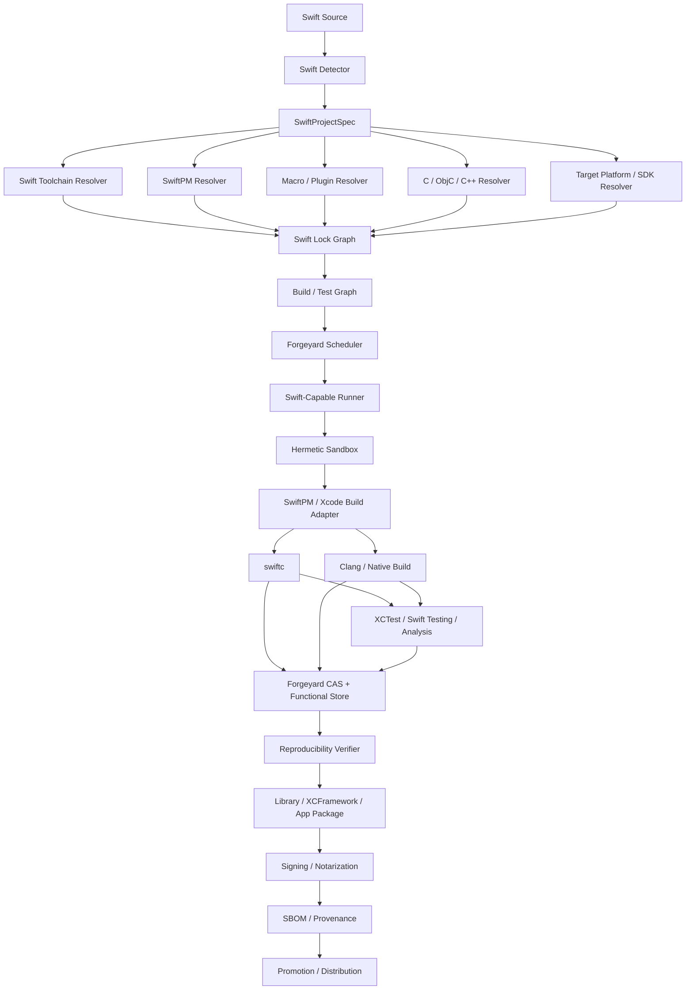

# Forgeyard Swift CI/CD System & Architecture

**Document type:** Dedicated language ecosystem System & Architecture  
**Project:** Forgeyard CI/CD  
**Subsystem:** First-class Swift build, test, package, Apple-platform, Linux, native interop, reproducibility, signing, distribution, and release integration  
**Implementation direction:** Rust-first Forgeyard core with native integration to Swift toolchains, Swift Package Manager, Xcode/Apple SDKs, Clang/LLVM, C/C++/Objective-C interop, Apple signing/notarization, and Forgeyard device/runner pools  
**Status:** Target production architecture  
**Relationship to Forgeyard:** This document defines the dedicated Swift subsystem that integrates with Forgeyard's pipeline IR, hermetic build system, scheduler, runners, CAS, functional store, provenance, packaging, distribution, and deployment architecture.

---

# 1. Purpose

Swift requires a dedicated Forgeyard architecture because Swift exists in two significantly different environments:

```text
Portable/server-side Swift
+
Apple-platform Swift
```

These share the Swift compiler and SwiftPM model but differ materially in:

- SDK availability;
- Objective-C runtime integration;
- platform frameworks;
- Xcode dependency;
- Apple SDKs;
- signing;
- entitlements;
- provisioning;
- simulator/device execution;
- notarization;
- application packaging;
- architecture matrices;
- SwiftUI/UIKit/AppKit/watchOS/tvOS/visionOS integration.

A Swift build can depend on:

- Swift compiler version;
- Swift standard library/runtime;
- Clang/LLVM toolchain;
- `Package.swift`;
- `Package.resolved`;
- SwiftPM plugin graph;
- macro implementation packages;
- binary targets;
- Git dependencies;
- path dependencies;
- target triples;
- SDK;
- deployment target;
- architecture;
- build configuration;
- compiler flags;
- linker flags;
- C/C++ headers;
- module maps;
- Objective-C headers/modules;
- system libraries;
- pkg-config;
- Xcode version;
- Apple SDK revision;
- signing identities;
- provisioning profiles;
- entitlements;
- environment variables;
- generated code;
- build-tool plugins;
- macro plugins;
- local SwiftPM caches;
- DerivedData;
- arbitrary host SDK state.

Forgeyard therefore needs a subsystem whose central rule is:

> **A Swift build is defined by source + complete Swift toolchain + SwiftPM dependency graph + target/platform contract + C/Objective-C/C++ interop closure + compiler/plugin/macro graph + controlled environment.**

For Apple releases, that expands to:

> **Apple Swift release identity additionally includes Xcode/Apple SDK/deployment target/platform configuration, while signing identities and provisioning remain late-bound release effects rather than source build identity.**

---

# 2. Architectural Objectives

Forgeyard Swift MUST:

1. support Swift packages;
2. support Swift libraries;
3. support Swift executables;
4. support SwiftPM workspaces/packages;
5. support `Package.swift`;
6. support `Package.resolved`;
7. support Git dependencies;
8. support local/path dependencies;
9. support binary targets;
10. support SwiftPM resources;
11. support SwiftPM build-tool plugins;
12. support Swift macros;
13. support C interop;
14. support Objective-C interop on Apple platforms;
15. support C++ interop where toolchain/project permits;
16. support system-library targets;
17. support Linux Swift;
18. support macOS Swift;
19. support iOS;
20. support iPadOS through iOS target semantics;
21. support watchOS;
22. support tvOS;
23. support visionOS;
24. support simulators;
25. support physical Apple devices;
26. support XCTest;
27. support Swift Testing;
28. support code coverage;
29. support linting/formatting adapters;
30. support API compatibility checks;
31. support documentation generation;
32. support XCFrameworks;
33. support static/dynamic libraries;
34. support application bundles;
35. support deterministic unsigned artifacts where practical;
36. support late codesigning;
37. support notarization;
38. support App Store packaging/publishing adapters;
39. support Swift package publishing/release workflows;
40. support remote scheduling;
41. support Forgeyard Apple runner pools;
42. support device-lab integration;
43. support reproducibility verification;
44. support SBOM/provenance;
45. remain local-first for non-Apple and local Apple development where toolchains are available.

---

# 3. Non-Goals

Forgeyard does not replace:

- Swift compiler;
- Swift Package Manager;
- Xcode;
- Apple SDKs;
- Clang;
- LLDB;
- XCTest;
- Swift Testing;
- codesign;
- notarization services;
- App Store distribution mechanisms.

Forgeyard locks, isolates, orchestrates, verifies, caches, packages, signs, and distributes their outputs.

---

# 4. High-Level Architecture



---

# 5. Suggested Forgeyard Workspace

```text
crates/
├── forgeyard-swift/
├── forgeyard-swift-model/
├── forgeyard-swift-detect/
├── forgeyard-swift-toolchain/
├── forgeyard-swift-swiftpm/
├── forgeyard-swift-lock/
├── forgeyard-swift-deps/
├── forgeyard-swift-macros/
├── forgeyard-swift-plugins/
├── forgeyard-swift-native/
├── forgeyard-swift-clang/
├── forgeyard-swift-objc/
├── forgeyard-swift-cxx/
├── forgeyard-swift-test/
├── forgeyard-swift-analysis/
├── forgeyard-swift-coverage/
├── forgeyard-swift-doc/
├── forgeyard-swift-linux/
├── forgeyard-swift-apple/
├── forgeyard-swift-xcode/
├── forgeyard-swift-xcframework/
├── forgeyard-swift-signing/
├── forgeyard-swift-package/
├── forgeyard-swift-publish/
└── forgeyard-swift-provenance/
```

The architecture is capability-based; physical crates may later be consolidated.

---

# 6. Core Domain Model

```rust
pub struct SwiftProjectSpec {
    pub source: SourceRef,

    pub package: SwiftPackageSpec,
    pub toolchain: SwiftToolchainRequest,
    pub dependencies: SwiftDependencyPolicy,

    pub target: SwiftTargetSpec,
    pub native: SwiftNativeInteropPolicy,

    pub plugins: SwiftPluginPolicy,
    pub macros: SwiftMacroPolicy,

    pub testing: SwiftTestPolicy,
    pub analysis: SwiftAnalysisPolicy,
    pub reproducibility: ReproducibilityPolicy,
}
```

---

# 7. Strong Types

```rust
pub struct SwiftToolchainId(Digest);
pub struct SwiftPackageGraphId(Digest);
pub struct SwiftPluginGraphId(Digest);
pub struct SwiftMacroGraphId(Digest);
pub struct AppleSdkId(Digest);
pub struct XcodeId(Digest);

pub enum SwiftPlatform {
    Linux,
    MacOS,
    IOS,
    WatchOS,
    TvOS,
    VisionOS,
}
```

---

# 8. Target Model

```rust
pub struct SwiftTargetSpec {
    pub platform: SwiftPlatform,
    pub architecture: Architecture,
    pub deployment_target: Option<AppleDeploymentTarget>,
    pub sdk: Option<AppleSdkId>,
    pub simulator: bool,
}
```

---

# 9. Project Detection

Detect:

```text
Package.swift
Package.resolved
Sources/
Tests/
Plugins/
.swiftpm/
*.xcodeproj
*.xcworkspace
*.entitlements
Info.plist
```

Also detect:

```text
SwiftPM package
Xcode application
framework
XCFramework producer
command-line executable
mixed Swift/C
mixed Swift/Objective-C
mixed Swift/C++
macro target
plugin target
binary target
system library target
```

---

# 10. Package.swift

`Package.swift` is executable Swift package description code interpreted by SwiftPM.

Forgeyard treats both:

```text
Package.swift content
+
SwiftPM/toolchain semantics
```

as build graph inputs.

---

# 11. Package Description Identity

Forgeyard records:

```text
tools version
package name
platform requirements
products
targets
dependencies
resources
plugins
Swift settings
C settings
C++ settings
linker settings
```

The exact manifest digest is part of source identity.

---

# 12. Package.resolved

For application/release-oriented package graphs, strict Forgeyard builds should preserve the resolved dependency state.

Forgeyard adds an outer immutable lock that includes:

```text
resolved revision/version
fetched source content digest
toolchain identity
binary target digests
plugin/macro graph
```

---

# 13. Outer Swift Lock

Example:

```ron
swift: (
    toolchain: (
        version: "locked",
        swiftc: "blake3:...",
        stdlib: "blake3:...",
        clang: "blake3:...",
    ),

    package_resolved: "blake3:...",

    dependency_graph: "blake3:...",

    target: (
        platform: MacOS,
        architecture: Arm64,
        sdk: "blake3:...",
    ),
)
```

---

# 14. Swift Toolchain Identity

A complete Swift toolchain can include:

```text
swift
swiftc
SwiftPM
Swift standard library
Swift runtime
Clang
LLVM tools
module support libraries
SDK overlays
platform runtime compatibility libraries
```

Version string alone is insufficient.

---

# 15. Toolchain Modes

```rust
pub enum SwiftToolchainMode {
    LockedManaged,
    PlatformProvided,
    AuditedHost,
}
```

Linux can use strongly managed toolchains.

Apple builds may need platform-provided Xcode toolchains, but Forgeyard fingerprints them explicitly.

---

# 16. Toolchain Trust

```rust
pub enum SwiftToolchainTrust {
    Unverified,
    DigestVerified,
    VendorVerified,
    OrganizationApproved,
    Revoked,
}
```

---

# 17. Swift Language Version

Explicit if project/toolchain config sets it.

The compiler/toolchain remains the primary semantic authority.

---

# 18. SwiftPM Semantic Authority

Forgeyard MUST NOT reimplement SwiftPM dependency or target semantics.

Use the locked SwiftPM/toolchain to compute:

```text
package graph
target graph
platform conditions
product graph
plugin graph
binary target relationships
```

Forgeyard then persists and verifies the result.

---

# 19. Dependency Sources

Support:

```text
Git repository
local path
binary target
system library target
workspace/local package
```

---

# 20. Git Dependencies

Resolve:

```text
repository
requested range/ref
exact revision
tree/content digest
```

Production builds never follow mutable branch state after lock.

---

# 21. Local Dependencies

Path dependencies must resolve inside:

```text
source snapshot
or
explicit StoreRef
```

Never arbitrary machine-local paths.

---

# 22. Binary Targets

Binary targets such as packaged frameworks/artifacts are immutable inputs.

Forgeyard records:

```text
URL/source
checksum
artifact digest
platform slices
architecture slices
```

---

# 23. Binary Target Validation

Validate:

```text
declared checksum
archive safety
target platform
architectures
library/module metadata
```

---

# 24. System Library Targets

SwiftPM system-library targets often rely on:

```text
pkg-config
module maps
system headers
system libraries
```

These must integrate with Forgeyard C/C++ native closure.

---

# 25. pkg-config

Forgeyard synthesizes:

```text
PKG_CONFIG_PATH
PKG_CONFIG_LIBDIR
PKG_CONFIG_SYSROOT_DIR
```

from declared native dependencies.

No random host library discovery in strict builds.

---

# 26. C Interop

Swift imports C modules through Clang module machinery.

Inputs:

```text
headers
module map
Clang
target
sysroot/SDK
defines
include paths
native libraries
```

---

# 27. Objective-C Interop

Apple-platform Swift can interoperate with Objective-C.

Identity includes:

```text
Objective-C headers/modules
Clang
Apple SDK
frameworks
bridging headers where used
module maps
deployment target
```

---

# 28. Bridging Headers

If used:

```text
bridging header content
transitive headers
compiler flags
```

are build inputs.

---

# 29. C++ Interop

Where Swift/C++ interop is enabled/configured:

```text
C++ standard
Clang/C++ ABI
headers/modules
stdlib
compiler flags
target ABI
```

becomes part of derivation.

Delegate native ABI/toolchain validation to Forgeyard C/C++ subsystem.

---

# 30. Clang Dependency

Swift's native interop is tightly connected to Clang.

Clang/toolchain identity is therefore part of Swift toolchain/platform closure when C-family interop is used.

---

# 31. Native Closure

```text
Swift derivation
+
C/C++/Objective-C toolchain
+
sysroot/SDK
+
native libraries
+
module maps
=
native Swift derivation
```

---

# 32. Swift Macros

Swift macros are compile-time executable dependencies.

Forgeyard treats macro implementations as host-toolchain build outputs and explicit compiler inputs.

---

# 33. Macro Identity

```text
macro package source
dependencies
Swift toolchain
enabled features/config
host platform
```

---

# 34. Macro Sandbox

Macro/plugin execution should occur under controlled build process boundaries.

Any external subprocess/network/filesystem behavior is subject to Forgeyard policy where technically observable/enforceable.

---

# 35. SwiftPM Plugins

Build-tool/command plugins are executable build-time code.

Treat similarly to build scripts in other ecosystems.

---

# 36. Plugin Identity

```text
plugin source
package dependency graph
Swift toolchain
plugin permissions/policy
declared/generated outputs
```

---

# 37. Plugin Network Policy

Strict realization:

```text
network denied
```

unless a plugin is explicitly classified as non-hermetic and run outside release derivation.

---

# 38. Generated Source

Generated Swift/C/ObjC/C++ source is an explicit output.

Two modes:

```text
GenerateDuringBuild
CommittedAndVerify
```

---

# 39. Resources

SwiftPM resources become explicit source inputs.

Validate:

```text
declared path
copy/process semantics
target association
case sensitivity
```

---

# 40. Build Configuration

Strong model:

```rust
pub enum SwiftBuildConfiguration {
    Debug,
    Release,
    Custom(ProfileName),
}
```

---

# 41. Compiler Options

Separate:

```text
project Swift settings
Forgeyard reproducibility settings
platform settings
analysis-only settings
```

Effective command/config must be inspectable.

---

# 42. Environment Synthesis

Forgeyard controls:

```text
PATH
HOME
TMPDIR
LANG
LC_ALL
TZ
SDKROOT where applicable
DEVELOPER_DIR for Apple
SWIFT_* variables that affect build
CC/CXX for interop
PKG_CONFIG_*
```

Do not inherit ambient host values blindly.

---

# 43. HOME Isolation

Synthetic HOME prevents hidden:

```text
SwiftPM caches
Xcode user settings
credentials
toolchain config
```

from affecting build.

---

# 44. SwiftPM Cache

Mutable acceleration only.

Forgeyard source of truth remains:

```text
locked source graph
toolchain identity
CAS/store objects
```

---

# 45. Build Directory

Use isolated:

```text
.build/
```

or controlled build location per derivation.

Do not reuse arbitrary developer output state for release correctness.

---

# 46. Offline Build

Architecture:

```text
resolve
  ↓
fetch packages/binaries
  ↓
verify
  ↓
materialize cache/store
  ↓
build with network denied
```

---

# 47. Linux Swift

Linux Swift support should be the strongest hermetic baseline because it can avoid Xcode-specific constraints.

Toolchain includes:

```text
Swift compiler
Swift runtime
Clang
libc
C++ stdlib where interop uses it
sysroot
pkg-config/native closure
```

---

# 48. Linux Runtime Closure

Validate:

```text
ELF interpreter
DT_NEEDED
RPATH/RUNPATH
Swift runtime libs
native libs
```

---

# 49. Linux Static/Dynamic Linking

Do not assume all Swift runtime components can/should be statically linked.

Model actual runtime closure.

---

# 50. Linux Packaging

Potential:

```text
tar.zst
deb
rpm
OCI
Forgeyard bundle
```

---

# 51. Apple Build Architecture

Apple target builds require an explicit platform contract:

```text
Xcode
Swift compiler
Clang
Apple SDK
deployment target
architecture
platform
simulator/device
framework availability
```

---

# 52. Xcode Identity

```rust
pub struct XcodeToolchainContract {
    pub xcode: XcodeId,
    pub swift: SwiftToolchainId,
    pub sdk: AppleSdkId,
    pub platform: SwiftPlatform,
}
```

---

# 53. Xcode Is Not Just a Version String

Fingerprint relevant:

```text
Xcode build
Swift compiler
Clang
SDK
tool locations
platform support
```

---

# 54. DEVELOPER_DIR

Forgeyard explicitly sets/controls Xcode selection.

Do not inherit arbitrary selected Xcode.

---

# 55. Apple SDK Identity

An Apple SDK contains:

```text
headers
framework stubs
module interfaces
platform metadata
toolchain compatibility information
```

Treat as explicit platform input.

---

# 56. Deployment Target

Examples:

```text
macOS minimum
iOS minimum
watchOS minimum
tvOS minimum
visionOS minimum
```

Deployment target affects:

```text
available APIs
linking
runtime compatibility
```

and belongs in derivation identity.

---

# 57. Architecture

Apple architectures:

```text
arm64
x86_64 for simulator/legacy contexts where applicable
```

are explicit.

---

# 58. Simulator vs Device

These are distinct targets.

Do not treat:

```text
arm64-ios-simulator
```

as equivalent to:

```text
arm64-ios-device
```

because platform ABI/runtime differs.

---

# 59. macOS

macOS Swift builds may produce:

```text
CLI executable
framework
dynamic library
application bundle
package
```

---

# 60. iOS

iOS builds may produce:

```text
app bundle
framework
XCFramework slice
test bundle
```

and require device/simulator distinctions.

---

# 61. watchOS

Same architectural model with watchOS-specific SDK/deployment/device constraints.

---

# 62. tvOS

Same with tvOS SDK/runtime constraints.

---

# 63. visionOS

Model as independent Apple platform contract.

Do not collapse into iOS.

---

# 64. Xcode Projects

Forgeyard should support both:

```text
pure SwiftPM
Xcode project/workspace
```

where needed.

---

# 65. Xcode Project Inputs

Track:

```text
project.pbxproj
workspace metadata
schemes
build settings
configuration
entitlements
Info.plist
asset catalogs
Swift package references
```

---

# 66. Xcode Scheme

Selected scheme/configuration is explicit.

---

# 67. Build Settings

Effective Xcode settings affecting output become derivation inputs.

Do not rely solely on project-file digest if environment overrides alter them.

---

# 68. DerivedData

Mutable acceleration.

Use isolated/controlled DerivedData location per cache namespace.

Never source of truth.

---

# 69. SwiftPM in Xcode

If Xcode resolves Swift packages, Forgeyard must still persist the exact package graph and fetched content identities.

---

# 70. XCTest

First-class test engine.

Supports:

```text
unit
integration
UI test adapter via Xcode/device infrastructure
```

---

# 71. Swift Testing

Support as first-class modern Swift testing framework where project/toolchain uses it.

The framework/toolchain version is tied to Swift toolchain/project dependencies.

---

# 72. Test Plan

```rust
pub struct SwiftTestPlan {
    pub suites: Vec<SwiftTestSuite>,
    pub target: SwiftTestTarget,
    pub shards: u32,
    pub coverage: CoveragePolicy,
    pub timeout: Duration,
}
```

---

# 73. Linux Tests

Run on Linux-compatible Swift runner.

---

# 74. macOS Tests

Use macOS runner.

---

# 75. Simulator Tests

Schedule onto:

```text
macOS runner
+
required simulator runtime/device profile
```

---

# 76. Physical Device Tests

Use Forgeyard device lab.

Runner/device capability includes:

```text
platform
OS version
architecture
device family
signing/development entitlement state
```

---

# 77. UI Tests

Store:

```text
screenshots
logs
video where available
test result bundles
crash logs
```

as CAS artifacts.

---

# 78. Test Sharding

Shard by:

```text
test bundle
test class/suite
device
simulator
historical duration
```

according to test framework capabilities.

---

# 79. Flaky Tests

Retries remain visible.

Passing retry does not erase original failure.

---

# 80. Code Coverage

Support compiler/Xcode/LLVM coverage paths.

Coverage data is verification evidence.

---

# 81. Coverage Identity

Include:

```text
Swift toolchain
test target
instrumentation settings
source mapping
```

---

# 82. Static Analysis

Potential:

```text
Swift compiler warnings
SwiftLint adapter
custom analyzers
Clang analysis for mixed code
```

---

# 83. Formatting

Adapters:

```text
swift-format
SwiftFormat
```

CI should verify, not rewrite source silently.

---

# 84. Documentation

Support:

```text
DocC
SwiftPM documentation workflows
```

as separate artifact generation.

---

# 85. DocC Identity

Track:

```text
toolchain
package/module
catalog/source
compiler/module graph
```

---

# 86. API Compatibility

Optional release gate for libraries:

```text
public API diff
ABI compatibility
module interface diff
```

where tooling allows.

---

# 87. Library Evolution

If a library uses stable ABI/library-evolution settings, those compiler options are explicit derivation inputs.

---

# 88. Module Interfaces

Generated `.swiftinterface` and related module artifacts are separate outputs where applicable.

---

# 89. Static Library

Output includes:

```text
archive
module artifacts
headers/module maps if exposing C/ObjC interface
```

---

# 90. Dynamic Library

Validate runtime closure.

---

# 91. Framework

Framework packaging may contain:

```text
binary
Swift modules
headers
resources
Info.plist
```

All content is hashed.

---

# 92. XCFramework

First-class packaging target for distributing multiple platform/architecture variants.

---

# 93. XCFramework Derivation

```text
verified platform slices
  ↓
slice metadata validation
  ↓
XCFramework assembly
  ↓
content digest
```

Do not rebuild slices during assembly.

---

# 94. XCFramework Slice Model

```rust
pub struct XcframeworkSlice {
    pub platform: SwiftPlatform,
    pub architecture: Architecture,
    pub simulator: bool,
    pub artifact: StoreObjectId,
}
```

---

# 95. XCFramework Validation

Verify:

```text
expected platforms
architectures
module interfaces
headers
binary identity
```

---

# 96. Swift Package Binary Distribution

If distributing binary targets:

```text
binary artifact
checksum
manifest metadata
```

are release outputs.

---

# 97. Application Bundle

Apple app bundle contains:

```text
executable
frameworks
resources
Info.plist
entitlements relationship
embedded Swift runtime/frameworks as applicable
```

---

# 98. Unsigned Build Core

Forgeyard should separate:

```text
unsigned/pre-signing application artifact
```

from:

```text
signed deliverable
```

whenever Apple tooling permits a meaningful separation.

---

# 99. Signing Identity

Signing material is late-bound:

```text
certificate
private key
team identity
provisioning profile
```

not source derivation identity.

---

# 100. Signing Model

```text
UnsignedArtifactDigest
  ↓
SigningOperation
  ↓
SignedArtifactDigest
```

Both are recorded.

---

# 101. Entitlements

Entitlements affect signed runtime behavior and often bundle/signature output.

Treat entitlements file/configuration as explicit release/signing input.

---

# 102. Provisioning Profiles

Provisioning profile is signing/deployment input.

Store metadata/digest under protected secret/artifact policy as appropriate.

---

# 103. Secret Storage

Signing keys/certificates use Forgeyard SecretProvider.

Never normal CAS/plain logs.

---

# 104. Notarization

macOS distribution may require notarization.

Model as post-build release effect:

```text
signed package
  ↓
notarization submission
  ↓
notarization result
  ↓
stapled/final artifact where applicable
```

---

# 105. Notarization Is Not Build Identity

It is provenance/release state.

The pre-notarized artifact remains independently identifiable.

---

# 106. App Store Packaging

Apple application publishing uses verified prebuilt artifacts.

Forgeyard never recompiles during App Store upload.

---

# 107. App Store Adapter

Flow:

```text
verified signed artifact
  ↓
approval
  ↓
upload
  ↓
store processing state
```

---

# 108. macOS Distribution

Potential:

```text
.app
.pkg
.dmg
zip
```

Signing/notarization policy depends on format.

---

# 109. Linux Swift Server Deployment

Potential:

```text
binary + runtime libs
tar.zst
deb/rpm
OCI
```

---

# 110. OCI

Use immutable base image digest.

Prefer:

```text
build verified Swift binary
  ↓
assemble image
```

rather than rebuilding inside Docker stage.

---

# 111. Swift Runtime Libraries

For Linux/deployment, runtime Swift libraries must be explicit runtime closure.

---

# 112. Reproducibility

Same derivation:

```text
Runner A -> Output X
Runner B -> Output Y
```

Compare actual content according to target policy.

---

# 113. Common Nondeterminism Sources

```text
absolute build paths
debug information
archive timestamps
generated metadata
Xcode build metadata
asset processing
plugin-generated files
macro behavior
native linker metadata
codesigning
notarization
```

---

# 114. Stable Build Paths

Use stable virtual roots where possible.

Native C/C++ prefix mapping comes from Forgeyard native subsystem.

---

# 115. Debug Info

May contain physical build paths.

Apply target/toolchain-specific remapping where supported.

---

# 116. Release vs Debug

Reproducibility policy focuses on release artifacts first.

Debug symbol artifacts can be compared separately.

---

# 117. Independent Reproducer

For Linux:

```text
separate Linux runner
```

For Apple:

```text
separate macOS runner with same Xcode/SDK contract
```

---

# 118. Apple Reproducer Constraint

"Different machine" does not mean different Xcode/SDK.

For bit comparison, toolchain/platform contract must match.

---

# 119. Reproduction Mismatch

Quarantine.

Diff:

```text
binary
Swift module artifacts
resources
framework contents
XCFramework slices
Info.plist
generated source
native libraries
debug sections
```

---

# 120. Signing/Reproduction Boundary

Recommended:

```text
reproduce unsigned/pre-signing artifact
then sign
```

when platform pipeline permits.

If signing determinism is required/possible, compare signed outputs separately.

---

# 121. Cache Layers

```text
SwiftPM cache
.build
Xcode DerivedData
module cache
Clang module cache
plugin cache
macro build cache
Forgeyard action cache
Forgeyard CAS
```

All ecosystem caches are acceleration only.

---

# 122. Module Cache

Swift/Clang module caches are highly toolchain/SDK-sensitive.

Namespace by:

```text
SwiftToolchainId
SDK
target
compiler flags
module graph
```

---

# 123. Incremental Compilation

Mutable acceleration.

Release reproduction uses clean build path.

---

# 124. Remote Execution

Useful boundaries:

```text
Linux Swift build
package target builds
tests
analysis/docs
Apple target build jobs
simulator test shards
XCFramework slice builds
```

Avoid reimplementing compiler internal incremental dependency engine.

---

# 125. Scheduler Capabilities

```rust
pub struct SwiftRunnerCapabilities {
    pub swift_toolchains: Vec<SwiftToolchainId>,
    pub xcodes: Vec<XcodeId>,
    pub apple_sdks: Vec<AppleSdkId>,
    pub native_toolchains: Vec<CppToolchainId>,
    pub targets: Vec<SwiftTargetCapability>,
    pub simulators: Vec<SimulatorCapability>,
    pub devices: Vec<DeviceCapability>,
    pub sandbox: SandboxCapabilities,
}
```

---

# 126. Hard Placement Constraints

Filter:

```text
Swift toolchain
target OS
architecture
Xcode requirement
Apple SDK
deployment target compatibility
simulator/device runtime
native C/C++ requirement
signing trust tier
memory
```

---

# 127. Scheduler Scoring

Score:

```text
SwiftPM dependency locality
toolchain locality
Xcode/SDK locality
native closure locality
DerivedData/cache warmth
device availability
queue delay
resource headroom
```

---

# 128. Apple Runner Pools

Recommended:

```text
macos-swift-build
ios-simulator
ios-device
watchos-simulator
tvos-simulator
visionos-simulator
macos-signing
```

---

# 129. Linux Runner Pools

```text
linux-swift-x86_64
linux-swift-arm64
```

with explicit libc/sysroot contracts.

---

# 130. macOS Capacity Optimization

Before consuming scarce macOS capacity, run:

```text
manifest validation
dependency resolution
format/static analysis where platform-neutral
Linux tests where applicable
```

when project semantics allow.

---

# 131. Test Device Scheduling

Device tests require leases.

```rust
pub struct DeviceLease {
    pub lease_id: LeaseId,
    pub device_id: DeviceId,
    pub job_id: JobId,
    pub expires_at: Timestamp,
}
```

---

# 132. Device Cleanup

After test:

```text
remove app
reset test data
collect logs
release device
```

according to pool policy.

---

# 133. SwiftPM Plugin Permissions

If a plugin requires additional permissions/effects, Forgeyard policy surfaces and audits them.

---

# 134. Macro/Plugin Risk Labels

Dependency graph flags:

```text
macro target
build-tool plugin
command plugin
binary target
system-library target
C/C++ interop
```

---

# 135. Supply-Chain Policy

Potential:

```text
Package.resolved required for applications
Git dependencies locked
binary target checksums required
plugins surfaced
macros surfaced
system libraries explicitly allowed
untrusted sources denied
revoked dependencies denied
```

---

# 136. Dependency Trust

```text
Unverified
RevisionVerified
ChecksumVerified
OrganizationApproved
Revoked
```

---

# 137. Lock Diff

Semantic example:

```text
swift-argument-parser 1.x -> 2.x
2 transitive packages changed
1 macro package added
1 binary target added
minimum macOS target changed
```

---

# 138. SBOM

Combine:

```text
SwiftPM dependency graph
binary targets
system/native libraries
Apple frameworks where policy wants platform dependency evidence
Swift runtime closure
```

---

# 139. Provenance

Record:

```text
source digest
Package.swift digest
Package.resolved digest
SwiftToolchainId
SwiftPM identity
plugin graph
macro graph
target
architecture
deployment target
XcodeId
AppleSdkId
native dependency closure
build configuration
output digest
runner
sandbox policy
signing/notarization relationship
```

---

# 140. Build Once, Promote Many

```text
source
  ↓
unsigned artifact X
  ↓
test/reproduce X
  ↓
sign X
  ↓
package/publish
```

No source recompilation during promotion.

---

# 141. Swift Package Publishing

For source packages:

```text
verified source tag/revision
Package.swift validation
tests
API checks
provenance
```

Publishing often means Git release/tag rather than central package upload; Forgeyard models it as release metadata/promotion.

---

# 142. Binary Swift Package Publishing

If package references XCFramework/binary artifact:

```text
build verified XCFramework
  ↓
compute checksum
  ↓
publish immutable artifact
  ↓
update package metadata in separate controlled release
```

---

# 143. CLI

Recommended:

```text
forgeyard swift detect
forgeyard swift lock
forgeyard swift fetch
forgeyard swift graph
forgeyard swift build
forgeyard swift test
forgeyard swift analyze
forgeyard swift format-check
forgeyard swift coverage
forgeyard swift docs
forgeyard swift reproduce
forgeyard swift package
forgeyard swift xcframework
forgeyard swift explain
forgeyard swift explain-rebuild
forgeyard swift toolchain
forgeyard swift plugins
forgeyard swift macros
forgeyard swift native

forgeyard apple xcode
forgeyard apple sdk
forgeyard apple simulator
forgeyard apple device
forgeyard apple sign
forgeyard apple notarize
forgeyard apple publish
```

---

# 144. Explain Build

Show:

```text
Swift toolchain
SwiftPM
Package.resolved
dependency graph
plugin graph
macro graph
target
architecture
deployment target
Xcode/SDK
native closure
compiler settings
cache state
```

---

# 145. Explain Rebuild

Examples:

```text
Swift toolchain changed
Package.resolved changed
macro implementation changed
plugin changed
binary target changed
Xcode changed
Apple SDK changed
deployment target changed
Clang/native library changed
```

---

# 146. Dioxus UI

Dedicated Swift panels:

```text
Swift toolchain
SwiftPM package graph
Plugins/macros
Native interop
Targets
Linux
Xcode/Apple SDK
Simulators/devices
Tests
Coverage
Docs
Reproducibility
XCFrameworks
Signing
Notarization
Publishing
```

---

# 147. Toolchain UI

Display:

```text
Swift version
Swift compiler digest
SwiftPM
Clang
platform
trust
```

---

# 148. Package Graph UI

Show:

```text
package
revision/version
source
digest
products
targets
plugins
macros
binary targets
system libraries
```

---

# 149. Apple Target UI

Show:

```text
platform
architecture
simulator/device
deployment target
Xcode
SDK
signing state
```

---

# 150. XCFramework UI

Display slices:

```text
platform
architecture
simulator/device
artifact digest
module compatibility
```

---

# 151. Signing UI

Display only non-secret metadata:

```text
team
certificate identifier/fingerprint
profile identifier
entitlements digest
signed artifact digest
```

Never private key material.

---

# 152. Failure Classification

```rust
pub enum SwiftFailure {
    DetectionFailure,
    ToolchainFailure,
    PackageResolutionFailure,
    LockFailure,
    BinaryTargetFailure,
    PluginFailure,
    MacroFailure,
    NativeInteropFailure,
    CompileFailure,
    LinkFailure,
    TestFailure,
    CoverageFailure,
    AnalysisFailure,
    DocumentationFailure,
    AppleSdkFailure,
    XcodeFailure,
    SimulatorFailure,
    DeviceFailure,
    SigningFailure,
    NotarizationFailure,
    PackagingFailure,
    PublishingFailure,
    ReproducibilityFailure,
}
```

---

# 153. Hermeticity Violation Example

```text
Swift native dependency violation

target:
  ServerCore

attempted library:
  /usr/local/lib/libfoo.so

reason:
  outside declared native closure
```

---

# 154. Xcode Drift Example

```text
Apple toolchain mismatch

locked:
  XcodeId A
  AppleSdkId X

runner:
  XcodeId B
  AppleSdkId Y

action:
  build refused
```

---

# 155. Plugin Violation Example

```text
SwiftPM plugin network access denied

plugin:
  CodeGeneratorPlugin

policy:
  hermetic release build
```

---

# 156. Development Environment

```text
forgeyard swift dev
```

provides:

```text
locked Swift toolchain
SwiftPM graph
native dependencies
analysis/docs tools
```

On macOS it can additionally expose controlled Xcode/SDK metadata.

---

# 157. IDE Integration

Expose:

```text
Swift toolchain
package graph
target
Xcode project/workspace metadata
compile commands/native metadata where useful
```

IDE state remains non-authoritative.

---

# 158. Local Mode

On Linux:

```text
SwiftPM resolve/fetch
build
test
docs
package
```

On macOS:

```text
same +
Apple targets available locally
```

according to installed/managed toolchain contracts.

---

# 159. Distributed Mode

```text
daemon
  ↓
Swift target job
  ↓
compatible runner
  ↓
toolchain + package closure + SDK/native closure
  ↓
build/test
  ↓
CAS
```

---

# 160. Enterprise Mode

Adds:

```text
approved Swift toolchain mirror
package source mirror/cache
macOS build farm
simulator/device farm
signing service
notarization automation
signed lock approvals
OIDC/RBAC
multi-region CAS
```

---

# 161. Air-Gapped Linux Build

Bundle:

```text
source
Swift toolchain
SwiftPM dependency closure
binary targets
native sysroot/libs
lock graph
```

---

# 162. Controlled Apple Build

Apple SDK/Xcode licensing/platform constraints mean an "air-gapped" Apple build still requires properly provisioned macOS/Xcode infrastructure.

Forgeyard can make dependency/network state offline while respecting platform/toolchain requirements.

---

# 163. Signing Service Boundary

Recommended trust separation:

```text
general build runners
    ↓
verified unsigned artifact
    ↓
restricted signing worker/service
```

Signing credentials never exposed to ordinary runners.

---

# 164. Notarization Worker

Separate capability:

```text
apple-notarization
```

with network access only for notarization service interaction.

---

# 165. Release Promotion States

```text
Built
Tested
Reproduced
UnsignedApproved
Signed
Notarized
Published
Promoted
```

Not all states apply to every target.

---

# 166. Reference Linux Swift PR Pipeline

```text
detect
  ↓
lock verification
  ↓
format check
  ↓
build
  ↓
tests
  ↓
analysis
  ↓
docs
```

---

# 167. Reference Apple PR Pipeline

```text
manifest/lock checks
  ↓
platform-neutral validation
  ↓
macOS build
  ↓
simulator tests
  ↓
native interop checks
```

---

# 168. Reference Library Release Pipeline

```text
clean source
  ↓
locked toolchain
  ↓
locked package graph
  ↓
offline hermetic build
  ↓
tests/API checks
  ↓
build platform slices
  ↓
independent reproduction
  ↓
assemble XCFramework/package
  ↓
SBOM/provenance
  ↓
publish immutable artifact
```

---

# 169. Reference macOS App Release Pipeline

```text
clean source
  ↓
locked Swift/Xcode/SDK
  ↓
locked dependencies
  ↓
offline/controlled build
  ↓
tests
  ↓
unsigned app artifact
  ↓
independent reproduction
  ↓
codesign
  ↓
package
  ↓
notarize
  ↓
SBOM/provenance
  ↓
publish/promote
```

---

# 170. Reference iOS Release Pipeline

```text
clean source
  ↓
locked Swift/Xcode/iOS SDK
  ↓
locked packages/plugins
  ↓
build
  ↓
simulator/device tests
  ↓
verified app/archive
  ↓
sign/export
  ↓
provenance
  ↓
App Store distribution
```

---

# 171. Production Defaults

Recommended:

```text
locked Swift toolchain
Package.resolved enforced for application releases
dependency revisions/content verified
offline build after fetch
isolated HOME/cache
plugins/macros surfaced
plugin network denied
native dependencies locked
explicit target
explicit architecture
explicit deployment target
explicit Xcode/SDK
clean release build
independent reproduction
late signing
```

---

# 172. Development Defaults

May allow:

```text
incremental build
warm SwiftPM cache
DerivedData reuse
local simulators/devices
dirty source
```

with visible non-release status.

---

# 173. Error-Prone Behaviors to Prevent

Forgeyard should detect/reject:

```text
floating Swift toolchain selector
Package.resolved mutation during release build
mutable Git dependency
path dependency outside source snapshot
ambient SwiftPM cache dependence
plugin network access
macro/plugin toolchain mismatch
host pkg-config leakage
host C/C++ library leakage
ambient DEVELOPER_DIR
Xcode drift
Apple SDK drift
deployment target drift
simulator/device confusion
unsigned/signed artifact identity confusion
signing key exposure
rebuild during publishing
```

---

# 174. Implementation Phase 1 — Domain + Detection

Implement:

```text
SwiftProjectSpec
Package.swift detection
Package.resolved detection
product/target model
Swift toolchain model
plugin/macro detection
native target detection
```

Exit:

Forgeyard accurately describes ordinary SwiftPM packages.

---

# 175. Phase 2 — Linux Toolchain Locking

Implement:

```text
SwiftToolchainId
SwiftPM identity
Clang identity
Swift runtime closure
```

---

# 176. Phase 3 — SwiftPM Resolution

Implement:

```text
Git/path dependencies
Package.resolved
binary targets
package graph
offline materialization
```

Exit:

Linux Swift package builds offline.

---

# 177. Phase 4 — Plugins + Macros

Implement:

```text
plugin graph
macro graph
sandbox policy
generated source/output capture
```

---

# 178. Phase 5 — Native Interop

Integrate:

```text
C
Objective-C where applicable
C++
pkg-config
module maps
C/C++ runtime linkage
```

---

# 179. Phase 6 — Tests/Analysis/Docs

Implement:

```text
XCTest
Swift Testing
coverage
format/lint adapters
DocC
```

---

# 180. Phase 7 — macOS/Xcode

Implement:

```text
XcodeId
AppleSdkId
DEVELOPER_DIR control
deployment targets
Xcode build adapter
```

---

# 181. Phase 8 — iOS/Other Apple Platforms

Implement:

```text
iOS
watchOS
tvOS
visionOS
simulator/device target contracts
```

---

# 182. Phase 9 — XCFramework

Implement:

```text
slice builds
slice validation
assembly
checksums
binary package publishing
```

---

# 183. Phase 10 — Signing/Notarization

Implement:

```text
restricted signing worker
profiles/certificates
entitlements
notarization
provenance linkage
```

---

# 184. Phase 11 — Reproducibility

Implement:

```text
clean builds
stable path policies
binary/framework diffs
independent Linux/macOS rebuilders
unsigned artifact comparison
```

---

# 185. Phase 12 — Device/Enterprise

Implement:

```text
simulator/device pools
signing service
Apple build farm
package mirrors
multi-region CAS
air-gap/dependency-offline workflows
```

---

# 186. Acceptance Tests

1. Remove host Swift install on Linux: locked toolchain build succeeds.
2. Change ambient HOME SwiftPM state: strict build unchanged.
3. Disable network after fetch: package builds.
4. Change Package.resolved: graph identity changes.
5. Git branch moves: locked revision remains fixed or verification fails.
6. Path dependency outside source snapshot: strict build rejects.
7. Macro implementation changes: derivation changes.
8. Plugin attempts network: sandbox rejects.
9. Native library resolves from `/usr/local`: strict build rejects.
10. Swift toolchain changes: derivation changes.
11. Clang changes for native interop: derivation changes.
12. Xcode changes: Apple derivation changes.
13. Apple SDK changes: derivation changes.
14. Deployment target changes: derivation changes.
15. Simulator/device target switch changes identity.
16. Independent Linux runner reproduces release artifact.
17. Independent macOS runner reproduces unsigned Apple artifact where supported.
18. Reproducer mismatch quarantines release.
19. Signing key never enters build runner/CAS.
20. Publishing promotes exact verified artifact.

---

# 187. Production Readiness Gates

Do not call Swift support production-ready until:

```text
Swift toolchain identity is stable
SwiftPM dependency locking works
offline builds work
binary targets are verified
plugins/macros are modeled
native C/C++ interop is hermetic
Linux runtime closure works
Xcode/Apple SDK identity is explicit
deployment targets are enforced
simulator/device targets are distinct
XCTest/Swift Testing work
XCFramework assembly is deterministic enough for release
signing is isolated
notarization is modeled
reproducibility detects mismatches
publishing never rebuilds
```

---

# 188. Architectural Invariants

1. Swift version string alone is not toolchain identity.
2. SwiftPM remains semantic authority.
3. Locked dependency revisions/content are explicit inputs.
4. Strict builds do not fetch dependencies from network.
5. Host SwiftPM cache is not source of truth.
6. Path dependencies never escape source/store boundaries.
7. Binary targets are checksum/content verified.
8. SwiftPM plugins are executable build dependencies.
9. Swift macros are executable compile-time dependencies.
10. Native C/ObjC/C++ interop introduces explicit Clang/native closure.
11. Host and target are distinguished where plugins/macros/native tools require it.
12. Xcode selection is explicit.
13. Apple SDK identity is explicit.
14. Deployment target is explicit.
15. Simulator and device are distinct targets.
16. Incremental/DerivedData/module caches are acceleration only.
17. Unsigned and signed artifact identities are distinct.
18. Signing secrets are isolated from build runners.
19. Notarization is a release effect, not source build identity.
20. XCFramework assembly uses already-verified slices.
21. Reproducibility compares actual artifacts.
22. Publishing/promoting never recompiles.
23. Apple builds run on appropriate Apple infrastructure.
24. Forgeyard never pretends Linux can substitute for final Apple SDK/signing work.
25. Correctness takes priority over aggressive remote-execution granularity.

---

# 189. Final Target Architecture

```text
                         Swift Project
                              │
                              ▼
                    Forgeyard Swift Detector
                              │
                              ▼
                       SwiftProjectSpec
                              │
         ┌────────────────────┼────────────────────┐
         ▼                    ▼                    ▼
 Toolchain Resolver      SwiftPM Resolver      Platform Resolver
         │                    │                    │
         ├──────────────┐     │      ┌─────────────┤
         ▼              ▼     ▼      ▼             ▼
      Plugins         Macros       Native      Xcode/SDK
         │              │            │             │
         └──────────────┴────────────┼─────────────┘
                                     ▼
                           Immutable Swift Lock
                                     │
                                     ▼
                              Build/Test Graph
                                     │
                                     ▼
                              Forgeyard Scheduler
                                     │
                                     ▼
                               Swift Runner
                                     │
                      ┌──────────────┼──────────────┐
                      ▼              ▼              ▼
                    swiftc       Plugins/Macros    Clang
                      │              │              │
                      └──────────────┼──────────────┘
                                     ▼
                         Tests / Coverage / Docs
                                     │
                                     ▼
                          Content-Addressed Artifact
                                     │
                                     ▼
                           Independent Reproducer
                                     │
                                     ▼
                      Package / Framework / XCFramework
                                     │
                                     ▼
                          Signing / Notarization
                                     │
                                     ▼
                         SBOM / Provenance / Publish
```

---

# 190. Final Architectural Position

For portable/Linux Swift:

```text
Source snapshot
+
Swift toolchain
+
SwiftPM
+
Package.swift
+
Package.resolved/resolved dependency graph
+
target
+
Swift plugins
+
Swift macros
+
resources
+
C/C++ native closure where used
+
controlled environment
+
hermetic sandbox
=
Swift derivation
```

For Apple Swift:

```text
Swift derivation
+
Xcode
+
Apple SDK
+
platform
+
architecture
+
simulator/device distinction
+
deployment target
+
Apple frameworks/native interop
=
Apple Swift derivation
```

Signing remains separate:

```text
Apple Swift derivation
  ↓
unsigned/pre-signing artifact
  ↓
signing identity + profile + entitlements
  ↓
signed artifact
  ↓
optional notarization
```

A trustworthy Swift release requires:

```text
Derivation
  ↓
offline hermetic SwiftPM realization
  ↓
plugins/macros/native build
  ↓
tests / analysis / coverage / docs
  ↓
actual artifact digest
  ↓
independent reproduction
  ↓
framework/app/XCFramework packaging
  ↓
late signing/notarization
  ↓
SBOM + provenance
  ↓
promotion/publishing of identical verified artifacts
```

This gives Forgeyard a Swift architecture that works for both server-side Swift and Apple's tightly coupled platform ecosystem, while preventing SwiftPM cache state, floating Git dependencies, plugins/macros, native interop, Xcode drift, Apple SDK drift, deployment-target differences, and signing credentials from becoming hidden CI inputs.

---

# Appendix A — Recommended Swift Release Policy

```ron
(
    swift_release_policy: (
        source: (
            dirty_tree: Denied,
        ),

        toolchain: (
            locked: Required,
        ),

        dependencies: (
            resolved_graph_locked: RequiredForApplications,
            source_content_verified: Required,
            network_during_build: Denied,
            external_path_dependency: Denied,
            binary_target_checksum: Required,
        ),

        build_time_code: (
            plugins_locked: Required,
            macros_locked: Required,
            network: Denied,
        ),

        native: (
            native_toolchain_locked: RequiredWhenPresent,
            runtime_closure_validation: RequiredWhenPresent,
        ),

        apple: (
            xcode_explicit: RequiredWhenAppleTarget,
            sdk_explicit: RequiredWhenAppleTarget,
            deployment_target_explicit: RequiredWhenAppleTarget,
            simulator_device_distinct: Required,
        ),

        signing: (
            late_bound: Required,
            build_runner_key_access: Denied,
        ),

        reproducibility: (
            independent_rebuilds: 1,
            compare_unsigned_core_where_possible: true,
        ),

        release: (
            sbom: Required,
            provenance: Required,
            rebuild_on_promotion: Denied,
        ),
    ),
)
```

---

# Appendix B — Example Linux Swift Configuration

```ron
swift: (
    toolchain: Locked("swift-linux"),

    package: (
        resolved: "Package.resolved",
        network_during_build: Denied,
    ),

    target: (
        platform: Linux,
        architecture: X86_64,
    ),

    testing: (
        unit: Required,
        coverage: Recommended,
    ),

    reproducibility: (
        independent_rebuilds: 1,
    ),
)
```

---

# Appendix C — Example macOS Swift Configuration

```ron
swift: (
    toolchain: Locked("swift-xcode"),

    target: (
        platform: MacOS,
        architecture: Arm64,
        deployment_target: "explicit",
        xcode: Locked("xcode"),
        sdk: Locked("macos-sdk"),
    ),

    dependencies: (
        network_during_build: Denied,
    ),

    reproducibility: (
        compare_unsigned_core_where_possible: true,
        independent_rebuilds: 1,
    ),
)
```

---

# Appendix D — Example XCFramework Configuration

```ron
swift: (
    product: Xcframework(
        slices: [
            (
                platform: IOS,
                architecture: Arm64,
                simulator: false,
            ),
            (
                platform: IOS,
                architecture: Arm64,
                simulator: true,
            ),
            (
                platform: MacOS,
                architecture: Arm64,
                simulator: false,
            ),
        ],
    ),
)
```

---

# Appendix E — First-Class Swift Tooling Matrix

| Area | First-class |
|---|---|
| Language | Swift |
| Build/dependency | Swift Package Manager |
| Dependency state | `Package.swift`, `Package.resolved` |
| Build-time code | SwiftPM plugins, Swift macros |
| Native interop | C, Objective-C, C++ via Clang/Forgeyard C++ |
| Linux | Swift toolchain + libc/native closure |
| macOS | Xcode/Apple SDK |
| iOS | Xcode/iOS SDK, simulator/device |
| watchOS | Xcode/watchOS SDK |
| tvOS | Xcode/tvOS SDK |
| visionOS | Xcode/visionOS SDK |
| Testing | XCTest, Swift Testing |
| Coverage | LLVM/Xcode coverage adapters |
| Formatting | swift-format / SwiftFormat adapters |
| Analysis | compiler warnings, SwiftLint adapter |
| Docs | DocC |
| Libraries | static/dynamic libraries, frameworks |
| Multi-platform distribution | XCFramework |
| Apps | Apple app bundles |
| Signing | codesign/provisioning via restricted worker |
| Notarization | macOS release effect |
| Distribution | App Store/enterprise/download adapters |
| Reproducibility | clean hermetic build + independent unsigned artifact reproduction |

---

# Appendix F — Upstream Integration Principles

Forgeyard should preserve Swift and Apple-platform semantics rather than inventing incompatible substitutes:

- Swift Package Manager remains the authority for package/target/dependency semantics.
- `Package.resolved` is treated as application/release dependency-resolution evidence, while Forgeyard adds immutable source-content and toolchain identity around it.
- SwiftPM plugins and Swift macros are executable build-time/compile-time dependencies and therefore must be surfaced, locked, and isolated.
- C/Objective-C/C++ interoperability depends on Clang, headers, module maps, native libraries, and target SDKs, so these are explicit native closure inputs.
- Apple builds depend on Xcode and Apple SDK contracts that cannot be treated as ordinary portable host tools.
- Simulator and physical-device targets have different platform/runtime identities.
- XCFramework packaging combines already-built platform/architecture slices and must never hide rebuilding.
- Codesigning, provisioning, and notarization are release effects layered on verified build outputs rather than excuses to make the core build mutable.

